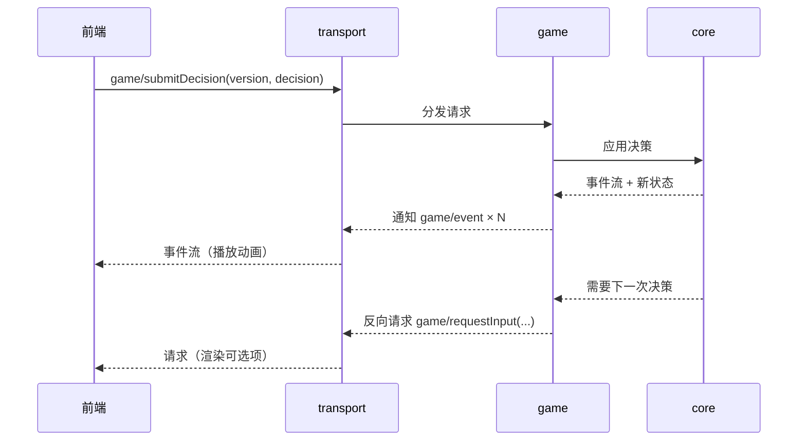

# 架构

## 1. 分层

```
前端（任意实现，默认浏览器 / TS）
    ↕ JSON-RPC（通用协议）
[transport]  帧编解码、连接生命周期、反向请求路由
[proto]      方法名 / 参数 / 返回结构的唯一定义（前后端共用事实来源）
[game]       规则集：开局装配、回合流程、牌的效果、技能（项目根 `game/`，按包组织）
[session]    会话外壳：会话容器 + 决策挂起/恢复通道 + 事件收集（`script/server/`）
[core]       内核：玩家 / 桌子 / 房间 / 牌区 / 属性 / 随机源（**与规则无关**，可直接单测）
[tools]      基础设施：event-loop / await / timer / log / json / inspect / uri …
```

依赖方向只能自上而下。**`core` 不得依赖规则集、会话、协议、网络与任何 IO**；这样内核可以脱离协议与网络被直接驱动。协议方法到规则操作的翻译层属会话/协议批次，目录名待定。

## 2. 启动与运行模型

- exe + `bin/main.lua` 引导（照搬 LuaLS 4.0.0）：引导脚本设好 `package.path`，再按参数决定进「服务模式」还是「测试模式」。
- 服务模式：建立 event-loop → 起 transport → 进入事件循环。
- 测试模式：**不建 transport**，直接 `dofile 'test.lua'` 加载测试。
- 空闲与等待：循环空闲时**阻塞等待到「下一个定时任务到期」**（没有定时任务则无限阻塞），等待 / 唤醒由 `bee.async` 承担（`script/async-io.lua`）；停止走自唤醒通道，不靠轮询也不靠分片。
- 挂起模型：遇到需要玩家决策的点，用协程 `await` 让出（照搬 LuaLS 4.0.0 的 `ls.await` 思路），而不是阻塞等待或轮询。

## 3. 协议设计原则（通用协议，一个后端对接多种前端）

1. **不出现任何前端概念**：协议只描述游戏语义与表现事件；贴图路径、动画时长、音效等由前端自行映射资源 id。
2. **方法命名**统一 `域.动作`（如 `session/create`、`game/submitDecision`），域与方法名集中在 `proto` 里定义，禁止散落在业务代码中拼字符串。
3. **后端权威、前端无状态**：目标合法性、距离、可用操作列表一律由后端计算下发；前端永不自行推导规则。
4. **两种下行数据各司其职**：
   - 事件流（notification）：一次操作产生的表现序列，供前端顺序播放动画。
   - 状态快照（request 的 result）：完整状态，用于开局、重连、纠错。前端不维护权威状态。
5. **需要玩家输入时由后端发起反向请求**（后端 → 前端的 request，前端回 result）。这天然表达「后端挂起等你」，也避免了前端轮询。
6. **每个决策带状态版本号**：后端在下发的请求里带 `version`（或 `seq`），前端提交决策时必须回带；后端据此拒绝过期输入。
7. **可重连**：重连由专门方法（如 `game/syncState`）返回全量状态 + 当前未完成的请求列表，**不依赖重放增量事件**。
8. **协议版本协商**：开局 `initialize` 交换协议版本与客户端能力（照搬 LSP 的做法），版本不匹配时明确报错而非静默降级。

## 4. 数据流（一次玩家操作）



## 5. 重要边界

- 规则集只进 `game/`（项目根）；内核只进 `script/core/`；协议路由与序列化只进 `transport` / `proto`（翻译层目录名待定）。
- 引擎的随机源必须可注入：固定 seed 能复现整局（便于回放、复现 bug、写测试）。
- 事件流是**表现层契约**：一旦下发就应稳定，不能因为前端改需求而让引擎改逻辑。
- 跨线程 / worker 边界只传可序列化 plain data。

## 6. 无头可测（硬性要求）

- 「无前端也能跑完整对局」是验收条件，因此：
  1. 引擎 API 必须是可直接调用的纯 Lua 接口，不经过 JSON-RPC。
  2. 决策点走同一套「请求输入 → 挂起 → 恢复」路径，测试用「脚本化玩家 / AI」自动应答，而不是给引擎开测试专用后门。
  3. 另设一层协议契约测试：对 `proto` 里每个方法做编解码往返与错误分支验证，不必真的开 socket。
- 回归口径：改引擎必须能只用测试二进制跑完整对局并复现。

## 7. 外壳接口约定（headless-server）

`script/server/` 是当前唯一的「服务」层，只做容器：它不认识牌、阶段、胜负。规则与协议两边各接一个形状，外壳自身不用改。

### 7.1 逻辑处理器（挂在会话上的规则入口）

- 形状：table + `run(self, session)`（写作 `handler:run(session)`），**入口必须是异步函数**（可被协程承载），否则表现为「会话卡住不动」。
- 约定：入口内用 `session:requestInput(...)` 索取输入、`session:emit(...)` 上报表现事件、`session:finish()` 结束；入口**正常返回也视为结束**。
- 入口抛错：会话转「已中止」，原因可用 `session:getAbortReason()` 取到。

### 7.2 驱动者（给输入的一方）

只需三个动作，测试里的「脚本化驱动者」与将来的协议层实现同一形状：

| 动作 | 说明 |
| ---- | ---- |
| `session:getPendingRequest()` | 读当前待处理事项（没有时返回 `nil`），形状 `{ kind, payload? }` |
| `session:submit(...)` | 提交结果，支持多个值；没有等待中的请求时报错 |
| `session:cancelRequest(reason?)` | 取消等待中的请求，挂起方收到取消错误 |

- 事件的形状同为 `{ kind, payload? }`，`session:getEvents()` 返回只读快照（后续发出的事件不会影响已取得的快照）。
- `requestInput` 的第三个参数是超时（秒），超时会以错误交回发起方，不静默卡住。

### 7.3 会话阶段

`pending → running → finished / aborted → destroyed`。`finished`、`aborted`、`destroyed` 都是**终态**，之后任何生命周期操作（启动 / 结束 / 中止 / 提交 / 取消 / 发事件）一律报错；阶段常量在 `moe.server.Phase`。

### 7.4 主循环归属

`server.start()` / `server.stop()` **不接管事件循环**，只做状态标记与日志；主循环仍由入口负责 —— 服务模式由 `main.lua` 常驻，测试模式由 `test.lua` 控制。这样外壳的启停是同步的、可直接被测试驱动，也不会在测试里嵌套启动事件循环。
