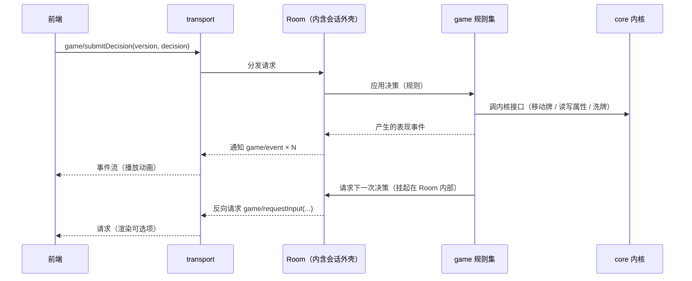

# 架构

## 1. 分层

```
前端（任意实现，默认浏览器 / TS）
    ↕ JSON-RPC（通用协议）
[transport]  帧编解码、连接生命周期、反向请求路由
[proto]      方法名 / 参数 / 返回结构的唯一定义（前后端共用事实来源）
[game]       规则集：开局装配、回合流程、牌的效果、技能（项目根 `game/`，按包组织）
[session]    会话外壳：会话容器 + 决策挂起/恢复通道 + 事件收集（`server/session/`）
[core]       内核：牌 / 牌区（移动、洗牌）/ 属性 / 随机源；玩家 / 桌子 / 房间 按业务需要再补（**与规则无关**，可直接单测）
[tools]      基础设施：event-loop / await / timer / log / json / inspect / uri / reload …
```

依赖方向只能自上而下。**`core` 不得依赖规则集、会话、协议、网络与任何 IO**；这样内核可以脱离协议与网络被直接驱动。协议方法到规则操作的翻译层属会话/协议批次，目录名待定。

## 2. 启动与运行模型

- exe + `bin/main.lua` 引导（照搬 LuaLS 4.0.0）：引导脚本设好 `package.path`，再按参数决定进「服务模式」还是「测试模式」。
- 服务模式：建立 event-loop → 起 transport → 进入事件循环。
- 测试模式：**不建 transport**，直接 `require 'test'`（即 `server/test.lua`）加载测试套件。
- 空闲与等待：循环空闲时**阻塞等待到「下一个定时任务到期」**（没有定时任务则无限阻塞），等待 / 唤醒由 `bee.async` 承担（`server/async-io.lua`）；停止走自唤醒通道，不靠轮询也不靠分片。
- 挂起模型：遇到需要玩家决策的点，用协程 `await` 让出（照搬 LuaLS 4.0.0 的 `ls.await` 思路），而不是阻塞等待或轮询。

## 3. 协议设计原则（通用协议，一个后端对接多种前端）

1. **不出现任何前端概念**：协议只描述游戏语义与表现事件；贴图路径、动画时长、音效等由前端自行映射资源 id。
2. **方法命名**统一 `域.动作`（如 `session/create`、`game/submitDecision`），域与方法名集中在 `proto` 里定义，禁止散落在业务代码中拼字符串。
3. **后端权威、前端无状态**：目标合法性、距离、可用操作列表一律由后端计算下发；前端永不自行推导规则。
4. **两种下行数据各司其职**：
   - 事件流（notification）：一次操作产生的表现序列，供前端顺序播放动画。
   - 状态快照（request 的 result）：完整状态，用于开局、重连、纠错。前端不维护权威状态。
5. **需要玩家输入时由后端发起反向请求**（后端 → 前端的 request，前端回 result）。这天然表达「后端挂起等你」，也避免了前端轮询。
6. **每个决策带状态版本号**：后端在下发的请求里带 `version`（或 `seq`），前端提交决策时必须回带；后端据此拒绝过期输入。
7. **可重连**：重连由专门方法（如 `game/syncState`）返回全量状态 + 当前未完成的请求列表，**不依赖重放增量事件**。
8. **协议版本协商**：开局 `initialize` 交换协议版本与客户端能力（照搬 LSP 的做法），版本不匹配时明确报错而非静默降级。

## 4. 数据流（一次玩家操作）



## 5. 重要边界

- 规则集只进 `game/`（项目根）；内核只进 `server/core/`；协议路由与序列化只进 `transport` / `proto`（翻译层目录名待定）。
- 引擎的随机源必须可注入：固定 seed 能复现整局（便于回放、复现 bug、写测试）。
- 事件流是**表现层契约**：一旦下发就应稳定，不能因为前端改需求而让引擎改逻辑。
- 跨线程 / worker 边界只传可序列化 plain data。

## 6. 无头可测（硬性要求）

- 「无前端也能跑完整对局」是验收条件，因此：
  1. 引擎 API 必须是可直接调用的纯 Lua 接口，不经过 JSON-RPC；内核（`server/core/`）的接口同样如此，**场景由调用方自己组合**（例如「发牌」= 抽牌堆取顶 + 放进手牌区，内核不提供「发牌」）。
  2. 决策点走同一套「请求输入 → 挂起 → 恢复」路径，测试用「脚本化玩家 / AI」自动应答，而不是给引擎开测试专用后门。
  3. 另设一层协议契约测试：对 `proto` 里每个方法做编解码往返与错误分支验证，不必真的开 socket。
- 回归口径：改引擎必须能只用测试二进制跑完整对局并复现。

## 7. 外壳接口约定（headless-server）

`server/session/` 是当前唯一的「服务」层，只做容器：它不认识牌、阶段、胜负。规则与协议两边各接一个形状，外壳自身不用改。

### 7.1 逻辑处理器（挂在会话上的规则入口）

- 形状：table + `run(self, session)`（写作 `handler:run(session)`），**入口必须是异步函数**（可被协程承载），否则表现为「会话卡住不动」。
- 约定：入口内用 `session:requestInput(...)` 索取输入、`session:emit(...)` 上报表现事件、`session:finish()` 结束；入口**正常返回也视为结束**。
- 入口抛错：会话转「已中止」，原因可用 `session:getAbortReason()` 取到。

### 7.2 驱动者（给输入的一方）

只需三个动作，测试里的「脚本化驱动者」与将来的协议层实现同一形状：

| 动作 | 说明 |
| ---- | ---- |
| `session:getPendingRequest()` | 读当前待处理事项（没有时返回 `nil`），形状 `{ kind, payload? }` |
| `session:submit(...)` | 提交结果，支持多个值；没有等待中的请求时报错 |
| `session:cancelRequest(reason?)` | 取消等待中的请求，挂起方收到取消错误 |

- 事件的形状同为 `{ kind, payload? }`，`session:getEvents()` 返回只读快照（后续发出的事件不会影响已取得的快照）。
- `requestInput` 的第三个参数是超时（秒），超时会以错误交回发起方，不静默卡住。

### 7.3 会话阶段

`pending → running → finished / aborted → destroyed`。`finished`、`aborted`、`destroyed` 都是**终态**，之后任何生命周期操作（启动 / 结束 / 中止 / 提交 / 取消 / 发事件）一律报错；阶段常量在 `moe.server.Phase`。

### 7.4 主循环归属

`server.start()` / `server.stop()` **不接管事件循环**，只做状态标记与日志；主循环仍由入口负责 —— 服务模式由 `main.lua` 常驻，测试模式由 `test.lua` 控制。这样外壳的启停是同步的、可直接被测试驱动，也不会在测试里嵌套启动事件循环。

## 8. 热重载（`moe.reload`）

> **先分清两件不同的事**（用户 2026-09-19 明确要求）：
> - **热重载**（本节）= **开发期**工具：改代码（修 bug）后不重启进程。触发者是开发者。
> - **规则集重载** = **游戏业务**功能：运行期重新装置/切换规则集（清空规则表、重新加载规则集）。触发者是业务侧。
>
> 两者**定位、触发者、生命周期、影响范围都不同**，**不要互相替代、也不要把后者当成前者的一种用法**。规则集加载见第 9 节。

### 8.1 加载方式即边界

- `include 'x'` = **可重载**入口：与 `require` 等价，但会把模块登记进重载集合（登记顺序即加载顺序）。
- `require 'x'` = 一次性加载：**永不参与重载**。因此**不需要**任何名单 / 过滤配置来划分范围。
- 目前只有内核（`core/`）用 `include`（`server/core/init.lua` 逐个登记）；`server/tools/`、`session/`、`async-io.lua` 以及热重载自身一律 `require`，从根上避免基础设施被换掉。
- **日志先就绪**：`log` 实例与 `moe.env` 在 `server/moe-kill.lua` 里创建，位置早于任何 `include`，所以可重载模块里可以直接用 `log.*`，加载器也能用 `log.error` 报错。
- 将来 `game/` 规则集**不**走 `include` 也不走 `require`，而由自建加载器读文件执行（第 9 节），因此它从根上不参与热重载 —— 这不是「暂且如此」，而是设计要求。

### 8.2 接口

| 接口 | 说明 |
| ---- | ---- |
| `moe.reload.reload()` | 重载全部已登记模块，返回被重载的模块名列表 |
| `moe.reload.onBeforeReload(cb)` / `onAfterReload(cb)` | 重载前后回调，**返回撤销函数**；回调自动记录注册它的模块，该模块被重载时回调自动注销（不会重复堆积） |
| `moe.reload.isReloading()` | 当前是否正在重载（重载期间回调与模块加载都对真） |
| `moe.reload.getIncludeName(fn)` / `getCurrentIncludeName()` | 反查函数 / 当前加载属于哪个可重载模块（将来按模块清理 timer 与订阅要用） |
| `moe.reload.recycle(cb)` | 立即执行并在每次重载后重跑，同时在重载前回收它登记过的对象 |
| `include 'x'` | 加载并登记；失败返回 `false, 错误信息`（不抛给调用方） |

触发端（开发期文件监视、前端协议方法）本批**未实现**，只提供接口。编辑器侧靠 `.luarc.json` 的 `runtime.special` 把 `include` 当作 `require` 解析。

### 8.3 语义与限制

- **同名类合并**：重载时 `Class 'X'` 复用**同一张类表**（`tools/class.lua` 的 `declare` → `config:reset()`），因此**已存在的实例立即用上新代码**，无需重建对象。
- 限制一：**删除不生效** —— 合并只覆盖字段，源码里删掉的方法仍留在类表上。所以不要给公共方法改名或删除。
- 限制二：**老实例不会重跑 `__init`** —— 新代码若要求实例多一个字段，老实例没有它，读字段要容忍 `nil`。
- 模块级 `local` 只允许放**不可变常量与纯函数**（如 `random.lua` 的常量、`zone.lua` 的 `resolvePosition`）。
- 现状核对（2026-09-19）：`random.lua` 只有常量与纯函数；`zone.lua` 只有 `resolvePosition` 纯函数；`ordered-zone.lua` 与 `attribute.lua` 只有类表与模块引用；`card.lua` 的标识计数器已挂到类表上（`M.__counter = M.__counter or moe.util.counter()`）—— 内核已无模块级可变状态。

### 8.4 跨重载存活的数据

必须存活的数据挂到「重载后仍是同一张表」的载体上（类表或门面表），并写成「有则复用」：

```lua
M.__counter = M.__counter or moe.util.counter()
```

- 门面写成 `moe.core = moe.core or {}`：重载复用同一张表，外部持有的引用不失效。
- 用 **`__` 前缀**命名：`Class` 的 `Extends` 会把父类**非 `__` 开头**的字段复制给子类（并记入 `extendsKeys`，`reset` 时清除），挂在那种名字上会串到子类、还会在重载时被清掉。

### 8.5 撤销与自动注销的分工

**自动注销是默认，disposer 是例外**（用户 2026-09-19 定）：

在**可重载**模块里注册、且跟着该模块走的东西，重载这个模块时会被自动注销，模块重跑时再自动注册 —— 这种**不要**写 disposer，否则每次重载都会多一层无谓的显式管理。

只有下面两类才需要显式处理：

| 场景 | 做法 |
| ---- | ---- |
| 注册发生在**不可重载**的模块里（回调的 `name` 为 `nil`，永远不会被自动注销，会一直留着） | 用 `onBeforeReload` / `onAfterReload` **返回的 disposer** 精确撤销 |
| 自动注销**盖不到、必须重建或显式释放**的资源（外部系统里的注册、timer、socket、缓存对象…） | 用 `onBeforeReload` **捕获**引用做清理，`onAfterReload` 重建；或直接用 `recycle(cb)`（立即执行 + 每次重载后重跑 + 重载前 `Delete` 登记过的垃圾） |

口诀：**能靠自动注销就不要写撤销；撤销只留给“注销不掉需重建”的资源。**

## 9. 规则集加载（`moe.rule`）

> 定位：**游戏业务**功能 —— 运行期装置 / 切换规则集。与第 8 节的**开发期热重载**是两条互不相干的通道：不共用登记、不共用回调、不互相替代。触发者、生命周期、影响范围都不同。

规则集（`game/`）是**内容/数据**：加载方式是**读文件并执行**，MUST NOT 走模块系统（`require` / `include`），因此它**不参与热重载**，也不出现在 `package.loaded` 里。规格见 `openspec/specs/rule-loading/spec.md`。

### 9.1 落点与外观

- 代码在 `server/rule/`，门面 `moe.rule`（`server/moe-kill.lua` 里用 `require 'rule'` 挂上，**不进重载集合**）。
- 测试套件：`server/test/rule/init.lua`，`--test rule` 单独跑。

### 9.2 加载清单

| 接口 | 说明 |
| ---- | ---- |
| `moe.rule.load(清单, 根?)` | 清空规则表 → 按清单依次加载；返回**实际执行的文件列表**（按执行完成顺序，便于核对与排查） |
| `moe.rule.setRoot(根)` | 设置清单项的解析根（默认 `<仓库根>/game`） |
| `moe.rule.depends { '杀', '闪', '基础规则' }` | **规则集侧**声明依赖，只能出现在加载过程中 |

- 清单项先按**文件**解释（相对根，`.lua` 可省），不存在再按**目录**解释（递归、只取 `.lua`、按路径排序保证确定性）；两者都不存在 ⇒ 报错。
- **清单是唯一入口**：加一个文件进清单即生效，从清单移除即失效。
- 清单的来源（谁提供、要不要支持多套规则集）**还没定**，测试里写死。

### 9.3 依赖 = 执行到那行时同步加载完

`rule.depends { ... }` 在执行到该行时立刻把依赖加载完，再继续本文件剩余的代码 —— 所以**依赖声明写在文件顶部**（不必预扫描源码文本，避开了字符串/注释里的假匹配）。
去重与防环靠「本轮已加载 / 正在加载」集合：同一文件在本轮只执行一次，互相依赖不会无限递归。

### 9.4 规则集侧的书写环境

- 加载时用 `load(chunk, '@' .. 路径, 't', env)` 把 `rule` **注入**执行环境，所以规则集文件**不需要 `require` 任何东西**；以 `@路径` 作 chunkname，报错与堆栈里显示真实文件路径（中文路径同样可用）。
- 注入面只有 `rule` + 一份**标准库白名单**（`string` / `table` / `math` / `utf8` / `pcall` 等基函数）；`require`、`io`、`os` 一律不给 —— 规则集是内容，不该具备开文件 / 起进程的能力。
- 规则集文件里**可以用中文标识符**（构建期补丁，见 `infrastructure.md`）。

### 9.5 定义入口与重载语义

```lua
local 杀 = rule.card '杀'
    :on('使用', function () end)
```

- `rule.card '名字'` = 取得或创建一条定义（同名得到同一条）；`Card:on(事件, 回调)` 链式登记（每次返回同一条定义）；`rule.getCard('名字')` 查询（未登记得到 `nil`）。
- **重载 = 清空规则表 + 重新加载**：不做增量、不做按名单卸载（用户 2026-09-19 定），重复加载同一份清单会**重新执行**所有文件。
- 规则表目前只有「牌」一类，结构按功能点增量长；卡牌的事件名与回调签名**做「杀」时再定**。
