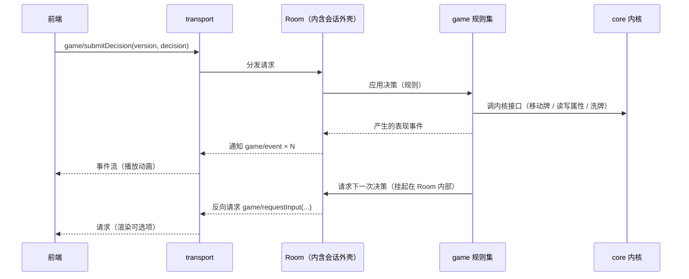

# 架构

## 1. 分层

```
前端（任意实现，默认浏览器 / TS）
    ↕ JSON-RPC（通用协议）
[transport]  帧编解码、连接生命周期、反向请求路由
[proto]      方法名 / 参数 / 返回结构的唯一定义（前后端共用事实来源）
[game]       规则集：项目根 `package/` 按包组织（现有 `基础` / `身份场` / `标准`），只拿注入的 `game`（**这一局的局对象**）与 `Card` / `Depends` 两个环境函数 —— 需要的内核对象全从 `game` 取（依赖方向 `package/ → moe`）
[session]    会话外壳：会话容器 + 决策挂起/恢复通道 + 事件收集（`server/session/`）
[core]       内核模块组（`server/core/`）：牌 / 牌区（移动、洗牌；**五个基础区由内核建** —— `抽牌` / `弃牌` / `手牌` / `装备` / `判定`）/ 属性 / 随机源 / 桌子（座位与行动顺序）/ 玩家（牌区、标签）/ **局**（一张桌子 + 一个随机源 + 内核建好的基础牌区 + **这一局的规则内容** + **使用牌与造成伤害的机制**，见第 12 节）/ **效果族**（`core/effect/`：`Effect` 与它的全部子类 —— `Effect` 基类在 `core/effect/effect.lua`）/ 规则装载器（`core/loader/`）（**与游戏流程规则无关**，可直接单测）
[tools]      基础设施：event-loop / await / timer / log / json / inspect / uri / reload …
```

依赖方向只能自上而下，且门面全部**直接挂在 `moe` 上**（`moe.desk` / `moe.game` / `moe.loader` …，没有 `moe.core` 中间层；类名与类型注解**直接用类名本身**，不带命名空间前缀）；**门面（API 表）里只放工厂**（`moe.player.create(game, { … })`），类的方法只能从实例上访问（API 表的类型写成「类名.API」；门面由**模块自己建**：`moe.player = {}`，不再 `local API = {}` + `return API`）。**`core` 不得依赖任何具体规则集内容、会话、协议、网络与任何 IO** —— 它只提供「装载规则」的机制（加载器本身在内核模块组里）；这样内核可以脱离协议与网络被直接驱动。协议方法到规则操作的翻译层属会话/协议批次，目录名待定。

### 1.1 内核知道「功能」，不知道「规则」

「内核与游戏流程规则无关」说的是**内核不做规则的取舍**，**不是**「内核什么都不知道」。内核必须**认识每一项功能的形状**并把它表达出来，只是由规则决定用不用、怎么用：

| 内核必须知道（机制本身） | 内核不需要知道（规则的取舍） |
| --- | --- |
| 牌区有「谁能看见」这件事，且读得出来 | 哪些区域可见、谁看得见谁 |
| 玩家有座位，桌子有行动顺序 | 几人局、首回合谁先、什么条件下跳过人 |
| 牌能移动 / 洗牌、属性有上限 | 「杀」怎么结算、用掉的牌去哪、身份的取值 |

判据：**换个规则集，这个概念还存不存在？**

- 存在性不变、只是取值变（可见性、座位数、体力上限、行动顺序）⇒ **内核功能**：做成**一等字段 / 方法**（`zone.visible` 这类），取值由规则声明。
- 换个规则可能压根没有（「身份」、「弃牌堆」、「杀」这些名字与取值）⇒ **规则内容**：内核只搬运、不解释。

推论：**「内核不认识它」不能当借口把功能塞进不透明袋子**。不透明标签（`Player:setTag`）只用来装**规则自己的**数据（身份的取值）；功能性信息（可见性）若做成任意键值袋，表现层与协议要读它时没有任何人能知道该读哪个键 —— 内核要给出名字。反过来，内核给了字段也不等于在做规则判断，它只是**承载**这个功能。

据此，`Zone` 的通用 `params` 袋（2026-09-23 删）方向是错的：它把「功能性信息」降级成不透明数据。**实际照这个口径落地的是可见性**（2026-09-23）：`Zone.visible`（一等字段，默认 `true`）+ `Zone.owner`（玩家建区时自动记）+ `zone:setVisible(值)` / `zone:isVisibleTo(视角)` —— 内核给字段、内容侧给取值（哪个区是暗的、谁看得见）。**`Zone.game` 也是同一形状的字段**（2026-09-24 用户让补上）：区自己记着局（公共区由 `game:createZone` 传 `self`，玩家建区时 `bindOwner` 顺归属者拿），`'进入区域'` 靠它查内容定义。

## 2. 启动与运行模型

- exe + `bin/main.lua` 引导（照搬 LuaLS 4.0.0）：引导脚本设好 `package.path`，再按参数决定进「服务模式」还是「测试模式」。
- 服务模式：建立 event-loop → 起 transport → 进入事件循环。
- 测试模式：**不建 transport**，直接 `require 'test'`（即 `server/test.lua`）加载测试套件。
- 空闲与等待：循环空闲时**阻塞等待到「下一个定时任务到期」**（没有定时任务则无限阻塞），等待 / 唤醒由 `bee.async` 承担（`server/async-io.lua`）；停止走自唤醒通道，不靠轮询也不靠分片。
- **效果与等待**：一次结算 = 一个**任务**（`server/tools/task.lua`），效果体跑在它自己的协程里 —— 所以**结算体与时机回调里可以直接 `await`**（`moe.await.sleep` / `moe.await.yield`，恢复绑在**调用它的那个协程**上；应答方就是这么让出的），要等另一次结算结完用 `效果:await()`。**没有**「让出理由分派」与「让出逐层原样转发」这层机制（`Effect:suspend` 整层已于 2026-09-20 删除，理由：顺序请求、不会有外部打断）。

## 3. 协议设计原则（通用协议，一个后端对接多种前端）

1. **不出现任何前端概念**：协议只描述游戏语义与表现事件；贴图路径、动画时长、音效等由前端自行映射资源 id。
2. **方法命名**统一 `域.动作`（如 `session/create`、`game/submitDecision`），域与方法名集中在 `proto` 里定义，禁止散落在业务代码中拼字符串。
3. **后端权威、前端无状态**：目标合法性、距离、可用操作列表一律由后端计算下发；前端永不自行推导规则。
4. **两种下行数据各司其职**：
   - 事件流（notification）：一次操作产生的表现序列，供前端顺序播放动画。
   - 状态快照（request 的 result）：完整状态，用于开局、重连、纠错。前端不维护权威状态。
5. **需要玩家输入时由后端发起反向请求**（后端 → 前端的 request，前端回 result）。这天然表达「后端挂起等你」，也避免了前端轮询。
6. **每个决策带状态版本号**：后端在下发的请求里带 `version`（或 `seq`），前端提交决策时必须回带；后端据此拒绝过期输入。
7. **可重连**：重连由专门方法（如 `game/syncState`）返回全量状态 + 当前未完成的请求列表，**不依赖重放增量事件**。
8. **协议版本协商**：开局 `initialize` 交换协议版本与客户端能力（照搬 LSP 的做法），版本不匹配时明确报错而非静默降级。

## 4. 数据流（一次玩家操作）



## 5. 重要边界

- 规则集只进 `package/`（项目根）；内核只进 `server/core/`；协议路由与序列化只进 `transport` / `proto`（翻译层目录名待定）。
- 引擎的随机源必须可注入：固定 seed 能复现整局（便于回放、复现 bug、写测试）。
- 事件流是**表现层契约**：一旦下发就应稳定，不能因为前端改需求而让引擎改逻辑。
- 跨线程 / worker 边界只传可序列化 plain data。

## 6. 无头可测（硬性要求）

- 「无前端也能跑完整对局」是验收条件，因此：
  1. 引擎 API 必须是可直接调用的纯 Lua 接口，不经过 JSON-RPC；内核（`server/core/`）的接口同样如此，**场景由调用方自己组合**（例如「发牌」= 抽牌取顶 + 放进手牌，内核不提供「发牌」）。
  2. 决策点走同一套「请求输入 → 挂起 → 恢复」路径，测试用「脚本化玩家 / AI」自动应答，而不是给引擎开测试专用后门。
  3. 另设一层协议契约测试：对 `proto` 里每个方法做编解码往返与错误分支验证，不必真的开 socket。
- 回归口径：改引擎必须能只用测试二进制跑完整对局并复现。

## 7. 外壳接口约定（headless-server）

`server/session/` 是当前唯一的「服务」层，只做容器：它不认识牌、阶段、胜负。规则与协议两边各接一个形状，外壳自身不用改。

### 7.1 逻辑处理器（挂在会话上的规则入口）

- 形状：table + `run(self, session)`（写作 `handler:run(session)`），**入口必须是异步函数**（可被协程承载），否则表现为「会话卡住不动」。
- 约定：入口内用 `session:requestInput(...)` 索取输入、`session:emit(...)` 上报表现事件、`session:finish()` 结束；入口**正常返回也视为结束**。
- 入口抛错：会话转「已中止」，原因可用 `session:getAbortReason()` 取到。

### 7.2 驱动者（给输入的一方）

只需三个动作，测试里的「脚本化驱动者」与将来的协议层实现同一形状：

| 动作 | 说明 |
| ---- | ---- |
| `session:getPendingRequest()` | 读当前待处理事项（没有时返回 `nil`），形状 `{ kind, payload? }` |
| `session:submit(...)` | 提交结果，支持多个值；没有等待中的请求时报错 |
| `session:cancelRequest(reason?)` | 取消等待中的请求，挂起方收到取消错误 |

- 事件的形状同为 `{ kind, payload? }`，`session:getEvents()` 返回只读快照（后续发出的事件不会影响已取得的快照）。
- `requestInput` 的第三个参数是超时（秒），超时会以错误交回发起方，不静默卡住。

### 7.3 会话阶段

`pending → running → finished / aborted → destroyed`。`finished`、`aborted`、`destroyed` 都是**终态**，之后任何生命周期操作（启动 / 结束 / 中止 / 提交 / 取消 / 发事件）一律报错；阶段常量在 `moe.server.Phase`。

### 7.4 主循环归属

`server.start()` / `server.stop()` **不接管事件循环**，只做状态标记与日志；主循环仍由入口负责 —— 服务模式由 `main.lua` 常驻，测试模式由 `test.lua` 控制。这样外壳的启停是同步的、可直接被测试驱动，也不会在测试里嵌套启动事件循环。

## 8. 热重载（`moe.reload`）

> **先分清两件不同的事**（用户 2026-09-19 明确要求）：
> - **热重载**（本节）= **开发期**工具：改代码（修 bug）后不重启进程。触发者是开发者。
> - **规则集重载** = **游戏业务**功能：运行期重新装置/切换规则集（清空规则表、重新加载规则集）。触发者是业务侧。
>
> 两者**定位、触发者、生命周期、影响范围都不同**，**不要互相替代、也不要把后者当成前者的一种用法**。规则集加载见第 9 节。

### 8.1 加载方式即边界

- `include 'x'` = **可重载**入口：与 `require` 等价，但会把模块登记进重载集合（登记顺序即加载顺序）。
- `require 'x'` = 一次性加载：**永不参与重载**。因此**不需要**任何名单 / 过滤配置来划分范围。
- 目前只有内核（`core/`）用 `include`（`server/core/init.lua` 逐个登记）；`server/tools/`、`session/`、`async-io.lua` 以及热重载自身一律 `require`，从根上避免基础设施被换掉。
- **日志先就绪**：`log` 实例与 `moe.env` 在 `server/moe-kill.lua` 里创建，位置早于任何 `include`，所以可重载模块里可以直接用 `log.*`，加载器也能用 `log.error` 报错。
- `package/` 规则集**不**走 `include` 也不走 `require`，而由自建加载器读文件执行（第 9 节），因此它从根上不参与热重载 —— 这不是「暂且如此」，而是设计要求。

### 8.2 接口

| 接口 | 说明 |
| ---- | ---- |
| `moe.reload.reload()` | 重载全部已登记模块，返回被重载的模块名列表 |
| `moe.reload.onBeforeReload(cb)` / `onAfterReload(cb)` | 重载前后回调，**返回撤销函数**；回调自动记录注册它的模块，该模块被重载时回调自动注销（不会重复堆积） |
| `moe.reload.isReloading()` | 当前是否正在重载（重载期间回调与模块加载都对真） |
| `moe.reload.getIncludeName(fn)` / `getCurrentIncludeName()` | 反查函数 / 当前加载属于哪个可重载模块（将来按模块清理 timer 与订阅要用） |
| `moe.reload.recycle(cb)` | 立即执行并在每次重载后重跑，同时在重载前回收它登记过的对象 |
| `include 'x'` | 加载并登记；失败**记日志（带堆栈）并抛出错误**（不再返回 `false`）；重载过程中的失败由 `fire()` 用 `pcall` 隔离，不会中断整轮重载 |

触发端（开发期文件监视、前端协议方法）本批**未实现**，只提供接口。编辑器侧靠 `.luarc.json` 的 `runtime.special` 把 `include` 当作 `require` 解析。

### 8.3 语义与限制

- **同名类合并**：重载时 `Class 'X'` 复用**同一张类表**（`tools/class.lua` 的 `declare` → `config:reset()`），因此**已存在的实例立即用上新代码**，无需重建对象。
- 限制一：**删除不生效** —— 合并只覆盖字段，源码里删掉的方法仍留在类表上。所以不要给公共方法改名或删除。
- 限制二：**老实例不会重跑 `__init`** —— 新代码若要求实例多一个字段，老实例没有它，读字段要容忍 `nil`。
- 模块级 `local` 只允许放**不可变常量与纯函数**（如 `random.lua` 的常量、`zone.lua` 的 `resolvePosition`）。
- 现状核对（2026-09-22）：`random.lua` 只有常量与纯函数；`zone.lua` 只有 `resolvePosition` 纯函数；`ordered-zone.lua` 与 `attribute.lua` 只有类表与模块引用 —— 内核已无模块级可变状态（原先唯一的例外「牌 ID 计数器」已改成**局实例上的字段**，见 8.4）。

### 8.4 跨重载存活的数据

必须存活的数据挂到「重载后仍是同一份」的载体上，写成「有则复用」：

```lua
moe._x = moe._x or <初值>   -- 挂在门面表上：写法必须是「有则复用」
```

- **载体一：局实例**（`game` 上的字段）—— 已建好的局跳重载照常可用、`__init` 也不会重跑，所以挂在局上的东西既不会丢也不会被换成新的。**发号器与阶段栈就是这么放的**：`game:nextId()`（局内递增、牌与将来的技能共用）、`game.phase` / `game.phaseStack`（当前阶段与嵌套栈）—— 两者都在 `__init` 里给初值、**不放进 `resetContent`**（重装规则集不应清它们）。属于某一局的数据一律用这个载体，不要往内核级状态上挂。
- **载体二：门面表 `moe`**：它是**内核级、跨局**的数据才开始考虑的地方；这张表在 `server/moe-kill.lua`（入口文件）里建立，而入口只执行一次、dev 重载只重跑 `include` 登记过的模块，所以它**永不重建**。**现在还没有这类数据**（上一条唯一的实例「牌 ID 计数器」已改成局上的字段）—— 要用时按上面的形状写「有则复用」，否则重载会把状态清掉。
- **命名用 `_` 前缀 + 赋值处标 `---@package`**：`_` 只表示「内核内部状态，不是对外接口」（`moe` 是普通表，框架不会碰它，`_` 本身没有语言含义）；真正能拦住跨文件用的是 **`---@package`** —— LuaLS 会把它当「只有这个文件可见」（实测：别的文件访问报「字段 `X` 只能在相同的文件 … 中才能访问」）。本工程没定义过「包」的边界，`package` 退化成按文件判定，与 `---@private` 同效。
- **不要挂类表**：`Class` 的 `Extends` 会把父类**非 `__` 开头**的字段复制给子类（并记入 `extendsKeys`），重载时 `Config:reset` 又把这份拷贝清掉 —— 挂在那种名字上会串到子类、还会在重载时被清掉。`__` 开头能躲开这两件事（框架自己就是这么用的：`__config` / `__getter` / `__keyMap`…），但那是**借框架的私有前缀**，不如压根不挂。
- **也不要挂模块门面**（`moe.card` 这类表）：门面由模块自己建（`core/card.lua` 里 `moe.card = {}`），而 `include` 就是 `require` + 登记、重载时会重新执行模块文件 ⇒ 门面每次都是**新表**，状态挂上去每次都被换掉。实例之所以跨重载照常可用，是因为它们持有的是**类表**（`M._classes` 复用同一张），与 API 表无关。
- `server/core/init.lua` 只写一串 `include 'core.card'`：登记 + 执行模块文件（门面由模块自己建）；`include` 失败会**抛错**（同时已记日志），所以这里不需要再包一层失败处理。

### 8.5 撤销与自动注销的分工

**自动注销是默认，disposer 是例外**（用户 2026-09-19 定）：

在**可重载**模块里注册、且跟着该模块走的东西，重载这个模块时会被自动注销，模块重跑时再自动注册 —— 这种**不要**写 disposer，否则每次重载都会多一层无谓的显式管理。

只有下面两类才需要显式处理：

| 场景 | 做法 |
| ---- | ---- |
| 注册发生在**不可重载**的模块里（回调的 `name` 为 `nil`，永远不会被自动注销，会一直留着） | 用 `onBeforeReload` / `onAfterReload` **返回的 disposer** 精确撤销 |
| 自动注销**盖不到、必须重建或显式释放**的资源（外部系统里的注册、timer、socket、缓存对象…） | 用 `onBeforeReload` **捕获**引用做清理，`onAfterReload` 重建；或直接用 `recycle(cb)`（立即执行 + 每次重载后重跑 + 重载前 `Delete` 登记过的垃圾） |

口诀：**能靠自动注销就不要写撤销；撤销只留给“注销不掉需重建”的资源。**

## 9. 规则集加载（`moe.loader` + `moe.game`）

> 定位：**游戏业务**功能 —— **一局游戏装哪套规则**。装载器（`moe.loader`）是**无状态**的机制：它把一套规则装进**某个局**；内容状态全在**局**（`moe.game`）上，所以改规则（含清空重载）只影响这一局。与第 8 节的**开发期热重载**仍是两条互不相干的通道：不共用登记、不共用回调、不互相替代 —— 区别只在于**装载器与局这两份代码本身**与其它内核模块一样可热重载。

规则集（`package/`）是**内容/数据**：加载方式是**读文件并执行**，MUST NOT 走模块系统（`require` / `include`），因此**被加载的规则集文件**不参与热重载，也不出现在 `package.loaded` 里。契约见 `server/test/rule/init.lua` 与 `server/test/rule/vfs.lua`（规格快照已冻结，见根目录 `AGENTS.md` 的「工作流」）。

### 9.1 落点与外观

- 装载器在 `server/core/loader/`：`init.lua`（`Loader` 模块：`install` / `declareDepends` / 名字路由 / 按预解析结果的执行）、`vfs.lua`（包来源合并成的虚拟文件系统）、`preparse.lua`（试跑）、`env-meta.lua`（纯类型文件：注入的 `game` / `Card` / `Depends` 与各时机上下文）。**局**在 `server/core/game.lua`（`Game` 类）。
- `server/core/init.lua` 里与其它内核模块一样 `include 'core.game'` / `include 'core.loader'`（门面 `moe.game` / `moe.loader` 由模块自己建；两份都可热重载）。
- `moe.game.create { seats, random, sources?, packages? }` 建**一局**并**立刻装好规则**：**桌子由局自己建**（`seats` = 座位数，建完就是 `game.desk`），除座位数与随机源外，规则表、包顺序、包元信息、规则数值、时机注册、属性系统、来源全挂在局上，**局之间互不影响**；`packages` 省略视同空清单 ⇒ 只装默认加载的包（见 9.3）—— 即 `create { seats, random }` 与 `create { seats, random, packages = {} }` 行为一致。要换规则走 `moe.loader.install(game, { packages = 清单 })`（省略参数就复用局上记的来源与清单）。
- **包手里的 `game` 就是那一局**：规则包要这一局的牌区 / 桌子 / 随机源就直接用注入的 `game`（`game:createZone` / `game.desk` / `game.random`）—— 不再有「规则实例」这一层，也不存在「实例与场地互指」（见 9.6）。
- 测试套件：`server/test/rule/init.lua`（加载/依赖/重装，`--test rule`）与 `server/test/rule/vfs.lua`（来源与合并，`--test rule.vfs`）；局本身在 `server/test/core/game.lua`（`--test core.game`）。

### 9.2 包来源与虚拟文件系统（`server/core/loader/vfs.lua`）

多个**来源**合并成一棵**逻辑目录树**，加载器只认逻辑路径。来源写法只有两种（`*` 是**特殊语法**，不是通配匹配，只允许出现在结尾）：

| 写法 | 含义 |
| ---- | ---- |
| `X` | X **本身**是一个来源，逻辑第一层 = X 的目录名 |
| `X/*` | X 是**包容器**，其下每个子目录各是一个来源，**容器名不进逻辑路径** |

两种写法归一成「逻辑路径第一层 = 来源目录名」，于是同名逻辑包天然对齐。

来源目录名以 `@` 开头时表示**默认加载**（`package/@基础` ⇒ 逻辑包名 `基础`，且默认加载）：`@` 只从**逻辑第一层**去掉，不进任何逻辑路径（也不会出现在清单 / 依赖 / 限定名 / 元信息里）；`@` 只允许出现在这一层 —— 包内的子目录名或文件名带 `@` 前缀会在**加载时报错**；目录名只有一个 `@`（后面没名字）也报错。

| 接口 | 说明 |
| ---- | ---- |
| `moe.loader.install(game, { sources?, packages? })` | 装一套规则进这个局：先清空局上的内容 → 按清单依次加载；返回**实际执行的文件（逻辑路径）**，按执行完成顺序 |
| `game.sources` / `game.list` | 这个局的来源（**顺序即优先级**，默认 `{ './package/*' }`）与上一次用的清单（`install` 写入，供省略时复用） |
| `game.loadedFiles` | 上一次装的时候实际执行过的文件（同上，随时可读） |
| `Depends { '基础规则/回合流程' }` | **规则集侧**声明依赖，只能出现在加载过程中 |

- **合并规则**：同一逻辑路径在多个来源里都有时，**只取最后一个来源的那个文件**（文件级覆盖）；不同路径取**并集**，同名目录的内容**跨来源合并**（不是整目录替换）。
- **不缓存**：每次 `install` 当场重新枚举并合并，运行期换包 / 加包立刻生效。
- 来源路径在磁盘上**不存在 ⇒ 报错**；`X/*` 匹配到 0 个包 ⇒ 允许；逻辑路径**归一化**（`.` / `..` 会折叠）在逻辑层面做，越出规则集根报错。

**三套机制的方向各不相同，别记反：**

| 机制 | 解决什么 | 排序方向 |
| ---- | ---- | ---- |
| 来源合并 | 用户**替换同一个逻辑文件** | 来源列表里**后者覆盖前者** |
| 规则数值（见 9.7） | 后续包**覆盖同一个配置项** | 加载顺序里**后者覆盖前者** |
| 包路由（见 9.4） | 不同包**同名并存** | 清单里**先加载的包优先**（包内裸名则先取本包） |

### 9.3 清单与依赖项都是逻辑路径

- 清单项解析顺序：**文件 → 补 `.lua` 的文件 → 目录**（目录递归、只取 `.lua`、按路径排序保证确定性）；都不存在 ⇒ 报错。
- `Depends` 的项也是逻辑路径，且**支持相对路径**：以 `.` / `..` 开头的按**声明它的文件所在目录**解析，其余按逻辑根；归一化后去重（同一文件的不同写法只执行一次）。
- **清单是唯一入口**：加一个文件进清单即生效，从清单移除即失效。清单由**调用方**给：装配方用 `moe.game.create { seats, random, packages = ... }` 定下这一局要装的包，重装与临时脚本直接用 `moe.loader.install(game, { packages = ... })`。
- **互斥声明**：项以 `!` 开头（`Depends { '!国战' }`）表示「本轮不能有这一项」—— 它与依赖项走**同一套解析**（含相对路径）；判定「已加载」是本轮文件里有落在该项（包目录 / 文件）之下的（前缀匹配带分隔符，所以 `国战` 不会误判 `国战外传`）；**没被加载就不报错**；冲突时错误指出**声明者**与被排斥的项。校验做了两次：**执行前一次 + 结束前兜底一次**（任何清单顺序都拦得住）。
- **默认加载的包**：来源里带 `@` 标记的包（见 9.2）由加载器自动加入，且**排在清单项之前**（彼此按逻辑名升序，顺序确定）；清单里不必写它们，写了也不会执行两遍（「同一文件只执行一次」）。**内容包也不必为它们写 `Depends`**（自动装且排在最前 —— `package/身份场/胜负.lua` 就是直接 `game:on(...)` 开头）。要排斥它就用互斥声明（`Depends { '!基础' }`），没有「按名字关掉默认包」的开关。

### 9.4 包与名字路由

包 = **逻辑路径的第一层目录**（目录名即包名），包内子目录只作组织、不参与命名；规则集文件必须位于包目录里（**根下散落文件报错**）；包名与条目名都**不许含 `.`**（完整名由加载器拼）。

```lua
-- package/标准/卡牌/杀.lua
local slash = Card '杀'          -- 登记为 标准.杀
    : on('使用', function () end)
```

| 接口 | 说明 |
| ---- | ---- |
| `Card '名字'` | **只在加载过程中可用**（环境函数）：声明本包的一条定义；同包重复声明报错（报错指出两处来源） |
| `game:getCard('名字')` | 查询：裸名带**包内作用域**，限定名（`军争.杀`）精确取到指定包 |
| `Card:on(事件, 回调)` | 链式登记回调，返回同一条定义；**跨文件追加回调用 `game:getCard` + `Depends` 定顺序**。事件名是**固定集合**（`'进入区域'` / `'获取目标'` / `'结算前'` / `'生效'` / `'结算后'`），清单在 `env-meta.lua` |
| 条目字段 | 定义对象是 `CardDef`，字段有 `name`（裸名）/ `package`（包名）/ `fullName`（`标准.杀`）/ `source`（声明它的文件）——字段叫 `package`，注解必须写成 `---@field public package string` |

**裸名的解析顺序：**

1. 查询发生在**包内**（加载过程中、当前上下文有所属包）→ **先取本包**；
2. 本包没有 → 按**包的加载顺序**（清单顺序）取**第一个**定义该名字的包；
3. **包外**（游戏运行期、内核、测试，没有「当前包」）→ 直接从第 2 步开始。

所以：包内写裸名 = 本包版本；**引用他包的同名条目必须写限定名**（军争里想用标准版的「杀」要写 `标准.杀`）。裸名与限定名拿到的是**同一个对象**，不是副本。

### 9.5 依赖 = 执行到那行时同步加载完

`Depends { ... }` 在执行到该行时立刻把依赖加载完，再继续本文件剩余的代码 —— 所以**依赖声明写在文件顶部**（不必预扫描源码文本，避开了字符串/注释里的假匹配）。
去重与防环靠「本轮已加载 / 正在加载」集合：同一文件在本轮只执行一次，互相依赖不会无限递归。

### 9.6 规则集侧的书写环境

- 加载时用 `load(chunk, '@' .. 路径, 't', env)` 把 `game` / `Card` / `Depends` **注入**执行环境，所以规则集文件**不需要 `require` 任何东西**；以 `@路径` 作 chunkname，报错与堆栈里显示真实文件路径（中文路径同样可用）。
- **内核注入的只有三项 + 一份白名单**：`game`（**这一局**，小写对象）+ `Card(name)` / `Depends(items)`（**大写环境函数**，只在本轮加载期可用；大写是为了和包里的局部变量区分开）+ 一份**标准库白名单**（`string` / `table` / `math` / `utf8` / `pcall` 等基函数）；`moe`（含 `moe.core` 这类写法）、`require`、`io`、`os` 一律不给 —— 规则集是内容，不该具备开文件 / 起进程的能力。
  - **白名单里表值的那几项是「内容侧的副本」**（用户 2026-09-21 定）：`table` / `string` / `math` / `utf8` 在每轮装载时各**浅拷贝**一份（只拷一层，够用 —— 扩充都是往表上挂新函数），所以内容侧改它们**只影响内容侧**，内核的标准库一点不动；**重装换新副本**（上一轮加的函数自然消失）。机制就 `makeEnv` 里那三行 `if type(value) == 'table' then`（拷贝而不是元表代理）。
  - **工具集是对（内容侧）标准库的扩充**（用户 2026-09-21 定，**不是内核注入的** —— 工具集与游戏规则无关）：默认包 `@tools` 往**内容侧那份 `table`** 上加四个纯函数 —— `table.filter(列表, 判定)` / `table.map(列表, 变换)`（回调收 `(值, 下标)`）/ `table.contains(列表, 值)` / `table.without(列表, 值)`（去掉这个值的所有出现、**返回新列表**），**清单与签名以 `package/@tools/table.lua` 为准**。好处：名字自明（不用再纠结工具集该叫什么），也不用为它另开一个全局。代价：**没装 `@tools` 的局仍然有 `table`，只是没有这三个函数**（用 `Depends { '!tools' }` 排斥它、或来源里没有这个包时）；靠默认包顺序（`tools` 按逻辑名排在默认包最前）保证规则包加载时它已经就位。**它和别的内容全局一样不在「每文件刷回」的保护名单里**（只有内核注入的 `game` / `Card` / `Depends` 受保护）⇒ 哪个包把它覆盖 / 改写了，由那个包**负全责**（用户 2026-09-21 定，不额外加保护）。要加新函数先过一遍「它用得着沙箱外的东西吗」；将来要加 `string` / `math` 的助手按同一套路再开一个文件（`@tools/string.lua`…）。**旧的「工具集里只有纯函数」那道纪律自然消解了** —— 助手就写在沙箱环境里（`io` / `os` / `moe` 都够不着），想写带副作用的助手也写不出来。
- **整轮装载共用一份环境**（用户 2026-09-21 定）：文件之间**不是**各自一份 env —— `ctx.env` 一次装载只建一份，于是**包 A 里写的全局函数包 B 直接就能用**（这就是「内容侧共享函数」的通道；顺序 = 加载顺序，要定序就用 `Depends`）。三件配套的事：① **注入的 `game` / `Card` / `Depends` 在每个文件加载之前都会刷回** ⇒ 某个包把它们改坏了也不影响后面的文件（别拿它们当全局变量用）；② **重装换新环境** ⇒ 上一轮写的全局自然消失（与规则表 / 规则数值同一生命周期）；③ **试跑那一趟也共用一份**（语义与真跑一致，否则「文件 B 调文件 A 的函数」会在试跑里假报错）。
- **沙箱口径不变**：共享的只是「内容自己的全局命名空间」——白名单仍是 `ALLOWED_GLOBALS` 那份清单（除 `_VERSION` 外就是基函数；其中四个表值是**副本**，见上），**没有** `__index = _G`（`moe` 是全局变量，一挂 `_G` 沙箱当场漏），所以 `moe` / `require` / `io` / `os` 仍拿不到。
- **工具集住在内容侧的 `table` 上，不在内核的工具库里**：里面的四个函数是内容侧写法的**扩充**，不是替代；内核 `moe.util`（含 `saveFile` / `defer` 这类副作用能力）内容侧本来就拿不到。
  - **泛型要标在实体函数上**（2026-09-21 实测）：LuaLS **不支持** `---@field f fun<T>(…)` 这种写法（泛型参数会被丢掉），**给标准库补字段也一样** ⇒ 工具集写成 `---@generic T` + `function table.filter(…)`（**实体函数**），于是调用点带 `<T>`，**跳文件也认**（`杀.lua` 里 hover 得到 `fun(list: <T>[], predicate: fun(value: <T>):boolean) -> <T>[]`）。推论：`meta.lua` 只用来放**赋值处表达不出来**的类型（`---@alias`、按名收窄的 `---@field`）；能标在实体函数上就别进 meta，否则反而把泛型压平。
- **规则包需要的内核能力由 `game` 收口**（用户 2026-09-19 定）：`game:getAttributeSystem()` —— 属性系统由**那一局**持有（一局一份；清空重装时置空 ⇒ **重装后是一个全新的系统**：属性定义是规则集内容，属性库也不允许编译后再 `define`）；包在**加载期**往它上面 `define`，装配方再用 `createInstance()` 给玩家建属性实例。
- **一局的资源直接用注入的 `game`**：牌与牌区是运行期的东西，按名字建在局上（`game:createZone(名字, 有序?)` / `game:createCard(名字)`），桌子与随机源是局上的公开字段（`game.desk` / `game.random`）—— **只认字段，没有 getter**（一个概念不要两套 API）。**环境对象就是 `game` 本身，不进时机上下文**（见第 10 节）。
  - 分工：**五个基础牌区由内核建好**（局上 `抽牌` / `弃牌`，玩家身上 `手牌` / `装备` / `判定` —— 建玩家时就有；见 12 节的「基础牌区」）—— 包**不要重建同名区**（撞名当场报错）；要加**自己**的区才用 `game:createZone(名字, 有序?)` / `player:addZone(名字)`。
- **装配方不受限**：测试与将来的房间 / 流程直接用 `moe.*` 组合开局（它们不是包）。
- 规则集文件里**可以用中文标识符**（构建期补丁，见 `infrastructure.md`），但**中文只用于难翻译的内容名**：技能名 / 卡牌名 / 身份名，以及作为数据取值与配置键的名字（`'杀'`、`'体力上限'`、`'游戏-开始'`）；**字段名 / 局部变量 / 函数名一律英文**（详见 `code-style.md` 第 8 节）。
- 规则集里**不要为空值防御**：注入的 `game` 按约定一定拿得到（它就是这一局），直接用；只有**运行期真的会缺**的才 `error`（如没牌表、人数不在配置表里）。见 `code-style.md` 第 9 节。
- 这两个环境函数与各时机的上下文类型写在一份**纯类型文件** `server/core/loader/env-meta.lua`（顶部 `---@meta`，不参与运行）：见 9.7 与第 10 节。
- **包自带 `meta.lua`**（用户 2026-09-21 定）：包目录下可以放一份**纯 LuaDoc** 文件（固定叫 `meta`，不跟内容命名走 —— 它是**纯代码功能**、不是规则内容），用来声明**这个包自己的概念**：`---@alias`（如 `身份场.身份`）、以及给内核类**追加按名收窄的签名**（`player:getTag('身份')` → `'主公'|'忠臣'|'反贼'|'内奸'`、`game:getValue('默认体力')` → `integer`、`player:getAttr('体力')` → `number`）。**装载器不特殊对待它**（就一个普通文件，里面只有注释 ⇒ 执行是空操作）【约束：它里只放类型声明】。
  - **配方（两处坑）**：① 收窄那几条后面**必须再写一条兜底签名**（`key: string` / `name: string`）—— 跨文件重声明同名 `---@field` 会**接管这个名字的签名表**，不写兜底就把内核那份（来自方法定义）报错掉（实测：漏写时全仓 27 处 `getTag('顺序')` 报「不能将 `string` 赋给参数 `'身份'`」）；② 重声明类时**基类要写全**（`---@class Player: Class.Base`）。
  - 实测的良性质：**多个包各自的候选共存**（`@基础` 的 `'默认体力'` 与 `身份场` 的 `'身份配置'`同时对 `getValue` 生效）、**跨包读也收窄**（`身份场` 读 `@基础` 的值拿到了 `integer`）、重声明**不会弄丢**内核那份类声明里的其他字段。
  - 所以**包作者可见的类型面变成两处**：内核的通用面（注入的 `game` / `Card` / `Depends`、各时机上下文）在 `env-meta.lua`；**各包自己的概念**在它自己的 `meta.lua` —— 或者直接标在实体函数 / 赋值处（泛型只能这么标；`@tools` 的 `table` 助手就是直接标在 `package/@tools/table.lua` 上，没进 `meta.lua`）。

### 9.7 规则数值（可覆盖的配置）

规则包里定的默认值（体力上限、身份人数表、牌表…）放**规则数值**：一张全局表，键是字符串，**与包无关**地共享。

| 接口 | 说明 |
| ---- | ---- |
| `game:setValue(名字, 值)` | 设一条 |
| `game:setValues { 名字 = 值 }` | 批量设 |
| `game:getValue(名字)` | 读一条：**没设置过得到 `nil`**（不报错） |
| `game:getValues()` | 读全部，返回**快照**（改它不影响规则数值） |

```lua
-- package/基础/配置.lua
game:setValues {
    默认体力 = 5,
}
```

- **按加载顺序后者覆盖前者**：这是有意提供的**覆盖通道**（例：军争要改血量上限就再写一份配置），与包路由的「同名并存」是两套语义。
- 与规则表**同生命周期**：清空重装时一并清空（挂在局上）；读不到的默认值写在规则包里，读时 `or 默认`。
- **函数不进规则数值**：行为（如「游戏开始时分身份」）走**时机注册**，不要存回调。
- 类型声明：注入的 `game` 的类型写在 `server/core/loader/env-meta.lua`（`---@type Game` + 各时机的 `---@field` 重载）；数据字段写在类定义处（`server/core/game.lua`）；**某个包自己定的规则数值，收窄就写在那个包的 `meta.lua` 里**（见 9.6 的「包自带 `meta.lua`」）。

### 9.8 定义入口与重装语义

```lua
local slash = Card '杀'
    : on('使用', function () end)
```

- `Card '名字'` = 声明（名字不含 `.`、完整名由装载器拼）；`Card:on(事件, 回调)` 链式登记；查询用 `game:getCard`（未登记得到 `nil`）。
- **环境函数 与 局上的方法**：`Card '杀'` / `Depends { ... }` 是注入环境的**大写函数**，只在**本轮加载期**可用，作用在正在装的那个局上；内容入口（`game:getCard` / `game:getValue` / `game:on` / `game:fire` / `game:getAttributeSystem` / `game:getPackageMeta` …）在加载期与运行期都能用，重装走 `moe.loader.install`。
- **重装 = 清空局上的内容 + 重新加载**：不做增量、不做按名单卸载（用户 2026-09-19 定），重复加载同一份清单会**重新执行**所有文件；包顺序也随清单重新算。桌子 / 随机源 / 牌区**不参与清空** —— 重装只动规则内容。
- 规则表结构是「包名 → 裸名 → 定义」+ 一份包顺序表；**同一轮加载里还能注册时机回调**（见第 10 节），它们与规则表一样随清空重装清空。
- 目前只有「牌」一类，结构按功能点增量长；卡牌的事件名与回调签名**做「杀」时再定**。

## 10. 时机与事件（`moe.event` + `game:on`）

规则集要能**挂到时机上**（`'游戏-开始'` 时分身份、改体力上限，回合各阶段触发技能…）。机制在内核模块组、实例由**局**持有：

| 接口 | 说明 |
| ---- | ---- |
| `Event:on(名字, 回调)` | 按时机名注册，返回 disposer；**注册顺序即执行顺序** |
| `Event:fire(名字, ...)` | 按名触发；未注册 = 空操作；单个回调报错不打断其余（`xpcall(回调, log.error, ...)`） |
| `Event:has` / `getNames` / `clear` | 查询与清空 |
| `game:on(名字, 回调)` | 注册时机（**唯一入口**：内容包 / 内核 / 用例都用它），返回 disposer |
| `game:fire(名字, 上下文)` | 触发：给**装配 / 流程代码**与无头测试用；内容包不主动触发 |

- 实现是「时机名 → `moe.sevent`」的薄封装（`server/core/event.lua`），顺序与错误隔离都沿用 `simple-event`。
- **实例由局持有**（`game.events`）并在**每次装载时重置** —— 于是注册的生命周期天然等于一轮装载，清空重装不会残留旧回调，也不会串到别的局。
- **时机名不预设**：内核与加载器不认识任何具体时机名，`'游戏-开始'` / `'回合-开始'` 都是规则集自己约定的字符串。**项目约定用 `分类-动作` 命名**（前一段是分类、后一段是动作，便于按分类聚合事件列表），这只是写法规约，没有任何强校验。
- **上下文只装事件参数**：回调拿到的载荷 = 这个时机对外声明的参数（`'游戏-开始'` 没有参数 ⇒ 传空表）；环境对象就是注入的 `game`，不进上下文。
- **事件参数写进 meta**：`server/core/loader/env-meta.lua`（纯类型文件，不参与运行）为每个时机声明一个上下文类型与 `on` / `fire` 的重载，于是规则集里 `game:on('游戏-开始', function (event) ... end)` 的 `event` 能**按事件名收窄**出字段类型（**参数名按载荷的具体类型起、别叫 `ctx`** —— 见 `code-style.md` 第 8 节）：

```lua
--- 目前没有事件参数：触发时给空表
---@class Game.Event.游戏开始

---@class Game
---@field on fun(self: Game, name: '游戏-开始', callback: fun(event: Game.Event.游戏开始): any): function
---@field fire fun(self: Game, name: '游戏-开始', event: Game.Event.游戏开始): any
---@field on fun(self: Game, name: string, callback: fun(payload: any): any): function
---@field fire fun(self: Game, name: string, ...: any): any
```

  类型名的**最后一段** = 事件名**去掉连字符**（连字符不是合法的 LuaDoc 类型名字符），前面挂在自己类的命名空间下（`Game.Event.游戏开始`）；上下文的类型也可以直接就是内核的某个类（如「伤害-前」与「伤害-后」的上下文就是 `Damage` 实例）。同名多行 `---@field` 会被当成多个签名候选（实测不报 `duplicate-doc-field`）：**字面量事件名走专用那条，动态名字落到 `string` 兜底那条**。
- **两类事件名，兜底策略不同**（用户 2026-09-19 定）：
  - **局的时机**（`game:on` / `game:fire`）是**开放集合**（时机名不预设、不校验）⇒ 专用候选之后**必须补 `string` 兜底**，否则动态时机名会被误报类型不匹配；新增时机时**顺手补一条**，不补也能跑（运行时与注入面都不校验时机名），只是调用点拿不到载荷的字段类型。
  - **牌的钩子**（`CardDef:on`）是**固定集合**：名字由内核约定、与启用的包无关（也没有扩展需求），清单以 `server/core/loader/env-meta.lua` 为准 ⇒ **不留兜底**，拼错在编辑期直接报（实测：写 `: on('获取目标吗', …)` 会报「不能将 `string` 赋给参数 `'使用'|'获取目标'`」）。新加钩子**必须同步补进 `env-meta`**，钩子清单只有它一个事实来源。
- **这份 meta 就是包作者（含第三方）可见的类型契约，不额外做“可单独分发的 meta 包”**（用户 2026-09-19 定）：内核的类型（`Game` / `Player` 等）与 `moe` / `bee` 的引用链横跨整个工程，单独导出难以完整 —— 第三方开发者**直接打开本工程**开发自己的包（包放自己目录、再写进来源清单，见 9.2）。因此**改时机名 / 改签名要顺手改这里**，它是对外接口面的一部分。
  - 注意：`.luarc.json` 是**单根工作区**设置 —— 包目录在本工程之外时分析器不会跟着分析（多根工作区也拿不到该配置）；开发外部包时把目录放进工程里，或用单根工作区指向包含它的目录。
- **覆盖靠顺序，不靠改载荷**：上下文约定为**只读**，要覆盖就改**状态**（写标签、改属性、加标记）—— 后注册的回调后执行，它写的状态自然生效（例：身份场写身份，后来者也注册同一时机，则后写者胜）。
- **快速返回（返回值即结论，2026-09-22 定）**：任意触发里，回调**明确返回了返回值（非 nil）就立刻停下、跳过之后的事件，并以它作为 `game:fire` 的结果**。判据只看**没报错**的那一次返回 —— `log.error` 会把错误消息作为返回值交出去，`xpcall(callback, onError, ...)` 下"回调报错"也会产生一个非 nil 值，所以实现必须连 `ok` 标志一起看（落在 `tools/simple-event.lua` 的 `fire`：本项目对上游照搬件的改动点，记在 `infrastructure.md`）。**注册顺序即优先级** ⇒ 谁先说话谁算数；**嵌套触发不串**（返回值靠 `return` 带出、不共享状态）。
- **命名约定：疑问式名字（能否 / 可否…）= 期望返回值的事件**（2026-09-22 定）：如 `'卡牌-能否使用'`（内容侧返回非 nil 值即否决，返回值就是原因）；通知型时机（`'卡牌-结算前'` / `'阶段-开始'`…）照旧不看返回值。名字上就能区分两类，比在参数里约定一个"要不要返回值"的标记清楚。
- **回调报错被隔离**：单个回调抛错只记录（`log.error`），**触发本身不会失败**；所以“规则包里出错”的可见信号是**状态没写**（不写牌堆、不写身份），装配方要在 `fire` 之后断言必需状态（见第 6 节的无头测试写法）。
- **效果族的收尾时机 `'效果-收尾'`**（2026-09-23 落地，内核自己 `fire`；2026-09-24 收紧触发条件）：**只发给「区的归属者」** —— 这次效果结完（正常结完 / `reject` 不成立 / 取消 / 超时都算，挂在任务的完成点上）**且结完时自己建过临时处理区**才发**一次**；继承来的那块由归属者收尾时清。上下文 = **效果自己**，时点在**所有子效果结完之后**、且**先于**叫醒 `await` 的人。用途是「结算期间暂存的牌该走了」：内容侧可以在这里先把要留走的牌搬去别处（将来的装备牌进装备区、延时锦囊进判定区），**之后内核把剩下的一批同步送进 `弃牌` 区**（默认收尾，2026-09-24 起 —— 内核只认「结算完的牌回弃牌堆」这一条，其余仍由内容侧定；见第 12 节的 `Effect` 行）。
- **依赖方向**：机制在内核模块组、实例由局持有；内核侧消费者（将来的回合流程、会话）要订阅游戏时机，就用自己那一局（`game:on` / `game:fire`），**不要**自己再造一份。
- **订阅入口只有 `game:on`**（用户 2026-09-21 定，统一了原来的 `game:on` / `game.events:on` 两个写法）：`game.events` 退成**内部字段**（内核自己 `fire` / `clear` 用），外面一律 `game:on` / `game:fire`。早先 `game:on` 限制「只在加载规则集时可用」、把内核 / 用例逼去直接碰 `game.events` —— 2026-09-21 实测**内核侧一个订阅者都没有**（`server/core/` 只有 `event.lua` 的实现与 `game.lua` 的转发；`server/session/` 也不订阅游戏时机），那道限制于是被删掉（`game:on` 现在任何时刻都能注册，不再报「时机注册只能在加载规则集时声明」）。
- **但时机表仍然是「内容」**：每次 `resetContent()`（每次装载）都会 `events:clear()` —— **连同运行期注册的那些一起清** ⇒ 内核 / 装配的**长期簿记**（缓存失效…）千万不要挂在它上面，否则重装一次就静默失效（实测：桌子想靠订阅 `'玩家-死亡'` 清 `alivePlayers` 缓存，加载后订阅就没了 ⇒ 改成「不缓存、每次现算」）。内容包与用例无所谓 —— 它们的订阅本来就随这一轮装载 / 这一个用例生灭。

## 11. 预解析与包元信息

加载一份规则集是「**先试跑、再执行**」：枚举到文件后先用「stub 环境 + `tools/without-check-nil`」跑一遍，只提取它声明的**依赖项 / 互斥项 / 条目清单**（不写规则表、不改状态），汇总成**包元信息**；据此在**执行任何文件之前**校验互斥冲突与同包重复条目，最后才清空规则表并按清单执行。

- 试跑机制在 `server/core/loader/preparse.lua`。`without-check-nil` 给 **`nil` 本身**装元表（nil 上的算术 / 拼接 / 索引 / 调用都不崩），所以文件里 `Card('杀'):on(...)` 这类链式调用落到 `nil` 也不会炸；**它是进程全局改动，必须成对 `enable()` / `disable()`**（用 `<close>` 保证一定恢复）。
- 试跑失败（文件自身报错）**只记警告**并继续：真正的语义仍以执行为准（执行到那一行时的早失败 + 结束前兜底共同保证）。
- 查询：`game:getPackageMeta(包名)` / `game:getMetas()`，返回**只读快照**（包名 / 依赖 / 互斥 / 条目 / 文件与来源 / 试跑是否成功）。

## 12. 使用牌与伤害（内核机制）

规则侧第一个功能点：让一张牌能「用出去并产生后果」。机制在内核、规则全在内容包 —— 契约见 `server/test/core/effect/init.lua`、`server/test/core/effect/play.lua` 与 `server/test/core/effect/damage.lua`。

**效果族的落点**（用户 2026-09-21 定）：`Effect` 与它的**全部子类**都住 `server/core/effect/`（**基类 = `effect.lua`**、模块名 `core.effect.effect`；`effect/init.lua` 只做装载（先基类、再各子文件），`server/core/init.lua` 里只留一行 `include 'core.effect'`；子类顺理成章是 `core.effect.damage` / `core.effect.use-card` …）。**判断标准只有一条 —— 是不是效果**：要进记牌器 / 要 `parent` / 要 `settle()` 的就放这儿，纯机制（`zone` / `desk` / `attribute` / `game`…）留在 `server/core/` 平级。用例对称（`server/test/core/effect/`），套件名跟着模块名走 ⇒ `--test core.effect` 一把跑完整个效果族。

| 接口 | 说明 |
| ---- | ---- |
| `Effect`（类，门面无工厂） | **效果基类**：持局 + 种类标识 `kind` + 外层效果 `parent` + 嵌套深度 `deep`；`apply()` = **驱动**这次结算（在**自己的任务**里「记父（当前正在结算的那个）→ 触发 `'即将生效'` → `settle()`（子类实现）」）；`await()` = 等它结完；结果读 `.result`、失败读 `.err`；`remove()` = 取消这一次生效（幂等）；**标签袋**（`setTag` / `getTag` / `removeTag`，与 `Phase` / `Player` 同形）—— 内容侧拿它挂这次结算的临时数据（内核不解释）；**临时处理区**（`getTempZone()` —— 懒建、**没有区名、不进公共区表**；**沿 `parent` 继承**（2026-09-24）：自己没有就向父层要，一路要到「自己就是一次结算」的那次 —— `UseCard`（一次用牌）/ `CardEffect`（对某个目标的一次生效）/ `Judge`（一次判定）**重写为自建、不向父层取**，一路都没有（如装配侧在顶层直接发起询问）由**最外层**那次结算建（就地建自己那块用 `createTempZone()`）；字段 `tempZone` 是**自己建的那块**、可直接读（没建过为空，**不建也不向上取** —— 判归属用它））—— 结算期间暂存一批牌用它（【五谷丰登】亮出的牌）；**收尾时机 `'效果-收尾'`**（**只发给区的归属者**：结完时自己建过区才发一次：正常 / `reject` / 取消 / 超时都算，载荷 = 效果自己，在所有子效果结完之后、先于叫醒 `await` 的人）；**结完时内核自己收尾**（2026-09-24 起）：`fire('效果-收尾')` 返回后把临时区里**剩下**的牌同步送进 `弃牌` 区 —— 内容侧要在收尾前留走牌就在这个时机里先搬 |
| `game:canUse(使用者, 牌, 目标?)` | **这张牌此刻能不能这样用**（普通方法，**不是效果**：不结算、不进记牌器）：**两件事分开判，原因也分开** —— ① _牌本身能不能用_（有牌名 / 有同名内容定义 / **牌在使用者手上（声明了 `zone` 时还要在声明的那个牌区里）** / **次数没用满** / 内容侧 `'卡牌-能否使用'` 没异议）；② _给的目标配不配_（**只在给了目标时才判**：有目标牌要求 `'获取目标'` 给出**非空**合法目标，且调用方给的**非空**且是它的子集；**声明了 `noTarget()` 的牌**则反过来 —— **给了非空目标就是不成立**）。两条都过才返回 `true`。**次数的内建条目**（2026-09-22 落地）：**阶段存在且阶段角色就是使用者**时，`阶段:getUseCount(名字) < `内容定义的限额 + 阶段上的上限增减`` 不成立就**直接返回原因、不但不触发 `'卡牌-能否使用'`**（“不通过就不用问规则”）；阶段属于别人或不在任何阶段里 ⇒ 不判（阶段外不受限）。`目标` 省略 = 只判"此刻能不能用"。筛选一遍手牌就要调它十几次 ⇒ **它同步且只读**（内建条目与内容侧条目都不要 `await`、不要改状态；**按名字记账 / 改上限用阶段实例的两个接口**，别在这里改 —— 内核在真正用出去时自己记一次）。**`askUseCard` 的候选全靠它**（用不了的牌不进选项，业务层不自己拼候选） |
| `game:useCard(使用者, 牌, 目标)` | **使用一张牌**（`UseCard`，`kind` = `useCard`）：**先 `game:canUse` 校验** —— 不过就 `self:reject(原因)` ⇒ 这次生效以「不成立」收尾（`.err` = 原因、**不走错误处理器、不算故障**、**不取牌、不记账、不触发 `'卡牌-结算前'`**，牌留在原处）；过了就**由内核记一次**（`阶段:addUseCount(名字, 1)`，只在自己的阶段里记）→ 取牌 → 触发 **`'卡牌-结算前'`**（内容侧据此安置它，基础规则放进**这次用牌的临时区**）→ **牌自己的 `'结算前'` 钩子各跑一次**（使用结算开始时）→ **按行动顺序对每个目标各结算一次生效**（`desk:actionOrder(目标)`，起点是**顺序锚点** —— 官方 4.1 多角色结算顺序那一条写的就是「从当前回合角色开始按逆时针方向依次进行响应」）→ **牌自己的 `'结算后'` 钩子各跑一次** → 触发 **`'卡牌-结算后'`**；等价于「造 `UseCard` + `:apply()`」。**目标接受单个或列表**（入口归一，与 `moveCard` 同一写法） |
| `game:enterPhase(玩家, 阶段名)` | **进入一个回合阶段**（阶段是内核概念，2026-09-22 落地；参数玩家在前）：建 `Phase` 实例 → 压栈 → `game.phase` 指向它 → 触发 **`'阶段-开始'`**（上下文 = 这个实例）→ 返回它。**返回的实例当 `<close>` 用**：作用域结束（`__close` → `Delete`）就触发 `'阶段-结束'`、出栈、`game.phase` 回到上一层；**阶段可嵌套**（栈，留给将来的「额外的一个出牌阶段」），离开必须按嵌套顺序（不是栈顶就报错）。内核只认「名字 + 属于谁」，不认识任何阶段名 |
| `Phase`（类，门面无工厂） | 阶段实例：公开字段 `name` / `player`；**标签袋**（`setTag` / `getTag` / `removeTag`，与 `Player` 同形状）；**两本账**（名字是内容侧的名字，内核不解释）：`addUseCount(名字, 次数变化)` / `getUseCount(名字)`（默认 0）与 `addLimit(名字, 次数变化)` / `getLimitDelta(名字)`（默认 0） |
| `CardDef:limit(阶段名, 次数)` / `getLimit(阶段名)` | 内容定义自己的**阶段限额**：`: limit('出牌', 1)`（链式，可多次调；同一个阶段重复写以后写的为准；阶段名对内核不透明）；`getLimit` **没为这个阶段声明过就返回 1000**（事实上不限次数）。别的包要改就 `game:getCard('杀'):limit('出牌', 2)`（与 `:on` 追加回调同一套顺序语义） |
| `CardDef:kind(名字)` / `addKind(名字)` / `isKind(名字)` / `getKinds()` | **分类**（内核只记录、不解释）：`: kind '基本'` 或 `: kind { '锦囊', '延时锦囊' }`（入参 `string|string[]`）—— **一次调用就把分类定下来**，**重复调以后写的为准**（不再累加）；同一张列表里重名去重、顺序按列表。**`addKind` 只往里加**（2026-09-24 落地）：已有分类与重复项不动、新分类接在后面 —— 给「类别基类已带分类、具体牌再补一个」用（模板代 `: extends '装备牌'` 之**后**写 `: addKind '武器'`，不能写 `kind`，那会把基类的分类覆盖掉）。`isKind` 问“是不是这一类”，`getKinds()` 给按声明顺序的快照 |
| `CardDef:zone(区名)` / `getZone()` | **必须从哪个牌区用**：声明后 `canUse` 的内建条目要求这张牌就在使用者的**那个名字的牌区**里（没这个区 / 牌不在里面 ⇒ 用不了，原因里点名区名）；**不声明 = 使用者的任一牌区都行**。区名解析走 `Player:getZone`（内核只认五个基础区名，见 12 节） |
| `CardDef:noTarget()` / `isNoTarget()` | **这张牌不指定目标**（装备牌这类）：声明后 `canUse` 不再要目标、`useCard` 允许零目标（牌自己的 `'结算前'` / `'结算后'` 照旧各跑一次，逐目标循环空转）；**调用方给了目标就是不成立**（那是「目标配不配」那一半的问题，原因也写成目标层面的）；`AskUseCard` 对这种牌给的选项**不带 `targets`** |
| `CardDef:value(名字, 值)` / `getValue(名字)` | **这张牌自带的一条数据**（内核只存不解释，与 `kind` 同一条口径）：武器的攻击范围、坐骑的距离修正就写在自己牌定义里；`extends` 把它**抄一份**给子类（抄完与基类脱钩） |
| `CardDef:extends(名字)` | **把基类的定义抄过来**（加载期快照）：经 `game:getCard` 解析基类（支持限定名）⇒ 基类的钩子插在本定义钩子**前面**、字段（分类 / 牌区 / 限额表 / 数据袋 / `noTarget`）深拷贝；**抄完就与基类脱钩**；多次调依次合并（**分类覆盖**（基类没分类就不动）、牌区与限额后者覆盖）；找不到基类报错 |
| `SlotZone`（类，`moe.slotZone.create(局?)`） | **按槽位寻址的牌区**（与 `OrderedZone` 同一个道理：**结构性能力用区子类表达**，`kind` = `slotZone`）：`slots`（这个区有哪些槽位，公开字段，按设置顺序）/ `setSlots(槽位名表)`（**设这个区有哪些槽位**，重复设以后写的为准、原来槽里的牌跟着清掉）；`getSlot(槽位名) -> Card?`（**懒校验**：槽位记的那张牌已经不在本区就就地失效、返回「不存在」⇒ **拆牌 / 抢牌路径一行结构代码都不用改**）；`putInto(槽位名, 牌)`（把牌放进那个槽位 —— **牌不必先在本区**，内部「在别的区就 `move`、没有归属就 `put`」；**先把槽位记上、再挪牌**，于是挪完发的那次 `'进入区域'` 就读得到槽位名；**同槽已有牌 ⇒ 内核把它同步送进那个局的 `弃牌`**，走 `self.game:getZone('弃牌')`、**不经 `MoveCard` 效果**（官方「同一槽位的旧装备置入弃牌堆」固定、没有变体，也没有可取消性）；旧牌离开区 ⇒ 它挂的修正由 `Card:withZone` 自动撤（见 `Card:withZone` 行））；`slotOf(牌)`（**这个牌在哪个槽位里**；基类给空、这里扫 `slotMap`，`@protected` —— 只有内核发钩子时用）；**槽位名没设过 / 建区时没给局（要替换时）都明确报错**。**内核不认识「武器 / 防具 / 进攻马 / 防御马」这四个词** —— 槽位名由内容设（`@基础/装备.lua` 在 `'游戏-开始'` 里遍历每个玩家的装备区 `setSlots`）、分类匹配也由内容侧做（`@基础/卡牌/装备牌.lua` 拿分类去 `zone.slots` 里找自己那条）。`装备` 区由 `Player:__init` 建成它（**建出来是空的**；`player:getZone('装备')` 的重载收窄成 `SlotZone`）；判定区将来用 `OrderedZone`（它要的是顺序，不是槽位） |
| `Attributes:addModifier(名字, 增量)` | **加一条修正，返回撤销函数**（2026-09-24 落地；`Attributes` 实例从 `player:getAttributes()` 拿）：`add` 是单向变化（扣体力那种），而「加一条加成」按项目约定必须给出 disposer —— 返回的闭包**精确减掉这次加的量**（幂等、与别的加成可叠加、不互相覆盖）。**撤销挂在谁身上由调用方决定**：装备把它 `card:withZone(...)` 挂在牌上（见 `@基础/卡牌/武器牌.lua` 的 `'进入区域'` 钩子） |
| `game:getUsePhase(使用者)` | 这次使用该记在哪个阶段上（**只在自己的阶段里记**：别人的阶段里既不计数也不受限）；用牌路径用它记账，内容侧一般用不着 |
| `Card`（类，门面无工厂） | **一张牌**：字段 `id`（号由局发）/ `label`（牌名）/ **`suit`（花色）/ `point`（点数）** / 私有 `zone` / `game`（属于哪一局，建牌时给）；**牌名与牌面都是内容侧给的值，内核只存不解释**（不校验、不换算、不认识「红桃」也不认识 13 种点数）；牌面**直接读字段**（`card.suit` / `card.point`，没有 getter，见 `code-style.md` 第 11 节）；不在任何牌区时 `zone` 为空。**牌自己会读自己的内容定义**（2026-09-24 落地）：`getDef()` 给定义实例（不在局里 / 没定义 ⇒ 空）、`isKind(分类)` / `getValue(数据名)` 是它的转发、`fullName` 是只读派生属性（包名.名字）—— 于是**内容侧的钩子拿到的 `card` 就能直接问自己的分类与数据**（`card:isKind('武器')` / `card:getValue('攻击范围')`），不必再手工 `game:getCard(card:getLabel())`；测试里自己造的牌没有局 ⇒ 这些都是空 |
| `Card:withZone(撤销函数)` | **把一件事挂在「这张牌在牌区里」这段上**（2026-09-24 落地，名字由用户定）：牌上带一个**懒建的私有容器** `zoneGCHost`（第一次 `withZone` 才 `moe.gc.host()` 现建，没挂过的牌零成本），`Card:bindZone` 发现**区真的变了**（`self.zone ~= zone`）就 `Delete` 掉容器、置空 —— 容器里的东西（`GCNode`）随之执行撤销函数。`bindZone` 是 `Zone` 的 `put` / `take` / `move` / `clear` 的**唯一收口点** ⇒ **不管谁在什么时候挪牌，牌一离开那个区就自动撤销**（同槽替换、被拆、死亡弃牌、将来任何路径），一条都不用靠调用约定，也不需要给「牌离开区」加时机。**同区内部调序（`move` 到自己）不算离开**。**它不返回撤销函数** —— 这里的「撤销」就是「牌离开那个区」，没有「提前撤销」的用法（要提前撤就把牌挪走）。装备的「攻击范围 / 距离修正」修正就是这么挂的（见 `@基础/卡牌/武器牌.lua` 的 `'进入区域'` 钩子） |
| `game:createCard(名字, 花色?, 点数?)` | 按牌名建一张牌（号由这一局发）；牌面可选（不传就是空）—— 内容侧建牌时就给了，内核不解释 |
| `CardEffect`（类，门面无工厂） | **对某个目标的一次生效**（`kind` = `cardEffect`）：字段 `def` / `useCard`（哪一次用牌）/ `user` / `card` / `target`，父效果 = 这次用牌；跑这张牌的 `'生效'` 回调（**回调拿 `(cardEffect, useCard)` 两个参数** —— 要临时区**两处都能拿、且不是同一块**（2026-09-24）：整次用牌那块是 `useCard:getTempZone()`、这个目标那次生效那块是 `cardEffect:getTempZone()` —— 打出的牌落在后者） |
| `game:askCard(被问者, 缘由, 条件?)` | **要一张牌**（`moe.askCard` 造 `AskCard : Effect`，`kind` = `askCard`）：返回**询问实例**（同样「驱动 + 等」），询问通过局上的 **`'卡牌-询问'`** 时机交给应答方，应答方调 `ask:answer{ card = 那张牌 }`；**答复读 `.card`**，没人答上或被取消 ⇒ 「不存在」；**答复里多给目标会被拒收**（要目标的是 `askUseCard`）。**缘由**是不透明字符串（内核不解释、只原样带给规则层）。**条件**是第三参数（`AskCard.Condition`）—— **每个字段都是一条筛选条件**：`name?` 牌名 / `zone?` 牌在哪个区里 / `card?` 牌必须在这批里；**数组 = 满足其一，单值 = 当成只有一个的数组（归一化走 `moe.util.toList`），不填 = 无要求**。**候选从哪来**：给了 `zone` / `card` 就取那里（并集；`zone` 的**名字按「被问者 → 局上」解析**，别人的区要传区对象），都没给才遍历被问者名下的牌区。**答复必须落在选项里**（不在 ⇒ 拒收：`.err` = 原因、`.card` 为「不存在」，对调用方与"没答上"同一个分支）；**不给条件 = 不做限制**。**应答方给出了答复**时才触发 **`'卡牌-答复'`** 与紧接着的 **`'卡牌-答复后'`**（上下文 = 这次询问；没人应答不触发），规则层据此决定"这次答复意味着什么"（`AskPlayCard` 自己会在 `onAnswered` 里把那张牌放进发起那次结算的临时区；`askCard` / `askUseCard` 不动牌，去向由内容侧自己写） |
| `game:askUseCard(被问者, 缘由, 条件?)` | **要一次「使用」**（`moe.askUseCard` 造 `AskUseCard : AskCard`，`kind` = `askUseCard`）：与 `askCard` **同一套机制**（时机 / 答复 / 校验 / 取消 / 让出都一模一样），两处不同 —— ① 条件多一条 `target?`（可用目标要与它至少有一个重合，选项的 `targets` = **合法目标 ∩ 名单**）；② 候选**逐张跑 `game:canUse`**：用不了的牌（没合法目标 / 次数用满 / 不在声明的牌区 / 内容侧 `'卡牌-能否使用'` 否决）不进选项，选项带 `targets` = 它的可用目标。**答复必须给目标且落在选项目标里**（`ask.targets` 恒为一张列表）。**无目标牌的选项不带 `targets`**（`AskUseCard.Option.targets` 可空）：答复也不用给目标，`ask.targets` 是「不存在」，多给目标会被拒收。出牌阶段与濒死求桃用它 —— 「使用」的语义体现在**类型**上，不再靠缘由字符串；子类只覆写两个钩子（`makeOption` 把牌装成带目标的选项、`checkOption` 校验目标） |
| `game:askPlayCard(被问者, 缘由, 条件?)` | **要一张打出的牌**（`moe.askPlayCard` 造 `AskPlayCard : AskCard`，`kind` = `askPlayCard`）：形状与 `askCard` 一样（条件筛候选、答复只有牌），只多一件事 —— **答复的牌当场交出来**：`onAnswered()` 把它 `moveCard` 进**发起这次结算的临时处理区**（2026-09-24 起用 `self:getTempZone()`，即最近的归属者那块，收尾时由内容侧统一送 `弃牌`）；**没有外层结算（`parent` 为空）就不动**，交给内容侧。四张牌用它：【杀】（要【闪】）、【万箭齐发】（要【闪】）、【南蛮入侵】（要【杀】）、【决斗】（要【杀】） |
| `game:moveCard(牌, 区)` | **把牌挪到某个牌区**（`moe.moveCard` 造 `MoveCard : Effect`，`kind` = `moveCard`）：`card` 可以是单张或一批；`zone` 是一个**区名**或**牌区对象**（**2026-09-23 起不再接受一串区名** —— 路径能力已删）；**区名先在当前回合角色（`game.turnPlayer`）身上找、再找局上的牌区**（传对象则直接用，不做解析）；**一次结算把整批牌挪完**、返回效果实例（失败读 `.err`）；**`zone` 可以不给**（可选参数，内容侧不必自己 `assert` 那个牌区在不在）：不给 / 解析不出来 ⇒ 这次挪牌失败且什么都不改；**没有归属的牌也能挪**（直接放进去） |
| `game:ask(被问者, 缘由, 问什么)` | **要一个决策**（`moe.ask` 造 `Ask : Effect`，`kind` = `ask`）：**不绑定卡牌** —— 问什么（`question`）、答什么（`reply`）都由发起方解释，内核零语义；询问通过 **`'决策-询问'`** 时机交给应答方，应答方调 `ask:answer(答复)`（**`reply` 是读任务结果的 getter**：答复会当场唤醒发起方，写在 `settle` 里的字段根本来不及被读到）；**有答复才触发 `'决策-答复'`**（只这一个时机 —— 通用询问不处置任何东西），没答上 / 被取消 ⇒ 没有答复，不算失败。**回合流程的弃牌阶段（"弃 N 张"）还用它** —— 出牌阶段已改成 `askCard`（用户 2026-09-21 定），且用户已表态 `Ask` 本身"意义不明"，等 `askSkill` / `timeout` / race 到位时再谈去留 |
| `game:addEffect(效果)` | 记牌器：发起一个**根效果**就记一条（只增） |
| `game:registerFlow(handler)` | **登记这一局的流程**（只在加载期、每局一个）：内容包把本局的流程（如回合循环）登记进来；内核**不认识**流程内容 |
| `game:runFlow()` | **启动这一局的流程**（装配侧：无头测试 / 房间 / 会话）：返回一个**任务**（`moe.task`）—— 可 `await`（等这局跑完）、`.result` / `.err` 读结果与失败、`cancel()` 停掉这局；**流程不是结算，不进记牌器** |
| `game:getEffect()` / `game:getEffects()` | 最近发起的那一个 / 快照（按发起顺序） |
| `moe.damage.create { game, from, to, amount }` | **造一次伤害**（`Damage : Effect`，`kind` = `damage`）：字段 `game` / `from` / `to` / `amount` 可读；**自己不碰任何属性**，只依次触发 `'伤害-前'` / `'伤害-生效'` / `'伤害-后'` |
| `game:damage(来源, 目标, 点数)` | 造成伤害的**便利入口**：等价于「建实例 + `:apply()`」，规则包与测试用这个 |
| `moe.heal.create { game, to, amount }` / `game:heal(目标, 点数)` | **回复体力**（`Heal : Effect`，`kind` = `heal`）：与伤害对称，只触发 `'回复-前'` / `'回复-生效'` / `'回复-后'` |
| `moe.draw.create { game, player, count }` / `game:draw(玩家, 张数)` | **摸牌**（`Draw : Effect`，`kind` = `draw`）：只触发 **`'摸牌'`** 时机（**干预点**：注册更早的技能可以先改数量 / 换去向）；**取牌写在 `@基础/抽牌.lua`**（一行 `game:drawCards`）；**目标已阵亡 ⇒ 直接完成**（不触发时机、不取牌、不算失败）—— 这才是“奖励照发、死者那份被拦掉”的落点 |
| `game:drawCards(玩家, 张数, 去向?)` | **抽牌工具**（普通方法，**不是效果**、不进记牌器）：从 `抽牌` 区顶抽 `张数` 张 —— **`去向` 省略 = 该玩家的 `手牌` 区**，给了就用它（`effect:getTempZone()` = 抽到处理区）；返回**实际抽到的牌**（牌堆不够时可能少于 `张数`，不报错、不自己兜）；内部走 `OrderedZone:draw` + `game:moveCard` ⇒ 抽到的牌照旧触发 `'即将生效'`、可被拦。摸牌 / 判定翻牌 / 【五谷丰登】都用它（2026-09-24 落地）|
| `moe.dying.create { game, player, damage? }` | **濒死结算**（`Dying : Effect`，`kind` = `dying`）：`settle()` = 触发 **`'濒死-进入'`**（规则侧在这里求桃）→ **没人喊 `leave()` 就 `player:setAlive(false)`**（内核判死、不再看 `isAlive()`）；`leave()`（**幂等**）= 记「已脱离」→ **当场**触发 **`'濒死-离开'`**；持 `damage`（把它打到濒死的**最后一次**伤害，内核只搬运不解释） |
| `game:enterDying(player, damage?)` | **让某人进入濒死**：**当场结算**（建 `Dying` → 驱动 + 等 → 返回结完的 `Dying`）—— 调用点就决定了“濒死插在哪”，现在是 `@基础/伤害.lua` 扣完血判 ≤0 那一下（早于 `'伤害-后'`）；**一个玩家同时只有一个濒死状态**：他已在濒死中 ⇒ **返回现有实例**并把它的 `damage` 换成这一次（致死伤害 = 最后一次），不重开结算；已经 `leave()` 的旧实例不算 |
| `game:getDying(player)` | **查某人正在进行的濒死**（`Dying?`）：`'濒死-进入'` 到收尾之间查得到，结完（或 `leave()`）就清；**凶手的真相源** —— `'玩家-死亡'` 里 `game:getDying(死者).damage.from`（`'凶手'` 标签已退役） |
| `game:judge(player, reason?)` | **让某个人判定**：**当场结算**（建 `Judge` → 驱动 + 等 → 返回结完的实例，结果读 `.card`）—— 三个时机依次是 `'判定-亮牌'`（内容侧从抽牌堆翻一张放进 `judge.card`）、`'判定-前'`（**改判窗口**：`judge:replace(新牌)`，被换下的记进 `judge.replaced`；**窗口外调直接报错**）、`'判定-后'`（结果已定；判定牌在这次判定自己的临时区里，收尾时由基础规则统一送 `弃牌`）；`reason` 内核不解释 |
| `OrderedZone:draw(count)` | **从区顶取 n 张**（不够就少给，不报错；`@async`）—— 取空了会调一次 `setShortageHandler` 挂的回调补牌；摸牌 / 判定 / 将来别的取顶动作共用这一个入口 |
| `OrderedZone:setShortageHandler(handler)` | **取空了怎么补**（内容侧挂：`@基础/牌堆.lua` 挂「弃牌全部洗回抽牌 + `shuffle()`」）；没挂 = 少给。**洗不回来（牌堆与弃牌堆都空）时基础规则就地判平局**（`game:endGame { side = '平局', … }`）—— 一处覆盖所有取顶动作 |
| `game:endGame(结果)` | **结束这一局**（幂等，只认第一次）：记下结果 → 触发 **`'游戏-结束'`**（上下文 = 结果）→ **把这一局的流程任务就地收掉**（`Task:cancel()`：挂起中的流程协程会被关掉） |
| `game:getResult()` | 这一局的结果（`Game.Result` = `{ side, reason }`）；**没有值 = 还没结束** —— 装配侧 / 会话据此判断是不是终局 |

- **效果链与记牌器**：`apply()` 里先取 `parent`（外层效果 —— 从**当前任务的上下文**取，必须在 `Task:execute` **之前**取：一进执行体当前任务就变成自己了）、再按父链累 `deep`、挂进父的 `childs`；根效果记进局上的**只增记牌器**（`game:addEffect`）。
- **嵌套上限是安全阀，不是规则**（用户 2026-09-22 定）：`Effect.MAX_DEPTH = 150`，超了那一层**以「取消」收尾**（`.err` = `canceled`、没有结果、**不算失败、不进错误日志**）+ 记一条 `warn`（"效果嵌套超过 150 层，这次生效没有结算"）—— **不再 `error`**（`error` 只该管程序错误；"太深"是引擎撑不住，而规则上确实有能无限用牌的打法，例：技能允许无限使用【无懈可击】）。
  - **阈值只能在这个量级**（2026-09-22 实测）：嵌套到 **225～250 层进程会直接没掉**（日志空白、退出码 1 —— **不是可捕获的错误**）。于是"早先估的 ≈1600 层"是错的：按 `LUAI_MAXCCALLS=5000` 反推，**每层效果约吃 20+ 次 C 调用**（层与层之间是"resume 套 resume"）。⇒ 保险丝必须远低于这个数；"无限"的正解在**规则侧**（回合时限 / 玩家停手 / 出牌次数），引擎这里只负责"别把进程搞死"。**`deep` 数的是效果层数**（与形状无关，所以这个阈值不随牌 / 技能变）。
  - **将来若真的要更深**（用户 2026-09-22 备忘，**暂不实施**）：把"resume 套 resume"改成**扁平调度** —— 最外层一个**调度器循环**每次取"下一个协程"来 resume；协程里 `await` 一个 Task 时，Task **不内联唤醒**，而是把自己要恢复的那个协程**登记进队列**、再 `yield` 回调度器 ⇒ **C 栈深度与逻辑深度脱钩**。
    - 参考 `sumneko/utility` 的 `recursive.lua`：那是把**普通递归**机械转成协程（所以要有 256 层的 `SliceSize` —— 先尽量消耗堆栈、少开协程）；**我们全部嵌套已经是 Task**，不需要机械变换、也不需要切片，比它简单很多。
    - **对外无感**（用户 2026-09-22 指出，我先前把这条写错过）：`await` 的语义就是"**返回时任务已经结完**"，换谁来做那次 resume 不影响这条 ⇒ `game:damage(...)` 之后立刻断言体力、`ask.result` 立刻可读、`useCard():await()` 立刻返回，**全都照旧**（这些入口本来就是 `apply():await()`）。变的只在**实现层**：动 `server/tools/{task,await}.lua`（照搬件，改动要记账）+ `Effect` 的驱动方式 + 调度器接线（最自然是让**事件循环**兼任"下一个协程"的调度器）；代价是**每次唤醒多过一遍调度循环**（换来 C 栈恒定）。
    - 动手时要定的边界（**实现细节，不是对外代价**）：`Effect:apply()` 在新模型里是"登记 + yield 回调度器"（那它顺带就有了"等它结完"的效果），还是保留"只驱动"的旧形状 —— 这决定"起了不等"的调用点怎么写，例如 `UseCard:settle()` 里那个 `for … do effect:apply() end`（它今天依赖"`apply()` 会把内层同步跑到第一个挂起点"，值得单独看一眼）。
    - 何时值得做：当有比 ~225 层更深的**合法**玩法真需要支持时（现在 150 的保险丝已经挡住崩溃风险；而"无限"的正解本来在规则侧）。
- **父效果**：`Effect` 带 `parent` 字段（外层效果），由 `apply()` 在**本次结算开始之前**从「当前正在结算的那个」取出（必须在 `Task:execute` **之前**取 —— 一进执行体当前任务就变成自己了）⇒ 所有效果子类自动具备，子类不用管；没有外层时（根效果）父为空，同时会被记进局上的**只增记牌器**。沿 `parent` 往上走就是整条结算链（用牌 → 它造成的伤害…）。**父是结算嵌套关系，不是归因** —— “这一下算谁的”看伤害自己的 `from`，两者可以不同（如延时类）。
- **基础牌区：内核认五个名字，其余仍归内容侧**（2026-09-24 落地，取代原来的「内核零区域名」口径）：`抽牌`（局上、有序）/ `弃牌`（局上）由 `Game:__init` 建，`手牌` / `装备` / `判定`（玩家身上）由 `Player:__init` 建 —— **包不得重建**（`createZone` / `addZone` 撞名报错），取用照旧 `game:getZone('弃牌')` / `player:getZone('手牌')`（`getZone` 上有重载，这五个名字取出来是非空类型；`装备` 还收窄成 `SlotZone`，但**建出来是空的槽位区，槽位名由内容侧在 `'游戏-开始'` 里遍历设置**）；**可见性不由内核定**（建的区默认 `visible = true`，`手牌` 标暗仍写在 `@基础/牌堆.lua`）；**结算的默认收尾也收在内核**（效果结完把临时区剩下的牌送 `弃牌`）。切分轴是「**固定 / 可配置**」：这五个区与「处理区的牌最后回弃牌堆」没有任何变体 ⇒ 内核；其余一切（可见性、牌表、洗回策略、数值、洗牌、摸牌时机）⇒ 内容侧。
- **`UseCard` 自己仍不预设牌区**：它在使用者名下牌区里找这张牌；**牌的安置与去向仍由内容侧决定** —— 触发 `'卡牌-结算前'`（`@基础` 的 `使用.lua` 把它放进**这次用牌的临时区**，于是它在结算期间有落脚处），收尾时内核统一送 `弃牌`；打出的牌由 `AskPlayCard` 在答复定下时放进**发起那次结算的临时区**（见 `askPlayCard` 行）。
- **牌记自己的归属**（用户 2026-09-20 定）：`Card` 带 `zone` 字段（读 `card:getZone()`，不在任何牌区时为「不存在」），由牌区在 `put` / `take` / `move` / `clear` 时维护（写入走内核内部的 `card:bindZone`）。于是「**一张牌同时在两个区里**」不再成立：`put` 只接受不在任何牌区的牌（已经在某个区里 ⇒ 明确失败，换区用 `Zone:move`）。**只记「哪个牌区」、不记下标** —— 下标会被任何一次插入改掉（要下标自己 `zone:list()` 里找）。`game:moveCard` 就是靠它找到源区（不必遍历所有牌区）；`MoveCard` 效果再把整批牌一次挪完。
- **有序能力只在 `OrderedZone` 上**（2026-09-24 收紧）：`Zone` 不再带 `takeTop` / `draw` / `shuffle` 三个「不具备有序能力」的**报错桩**（原先是 `getZone` 只能返回 `Zone` 时的妥协）—— 无序区上写这三个方法现在是**编辑期**报错，不再是运行期报错。哪些区有序由**内核**知道（`抽牌` 是有序区），所以 `getZone` / `createZone` 用**枚举字面量**的 `@overload` 把类型收窄（`getZone('抽牌')` 直接就是 `OrderedZone`，`createZone(名字, true)` 同理）；连 `local NAME = '抽牌'` 这种没被重赋值的局部常量也能命重载 —— **只有真动态名字**（从配置 / 表里取的字符串）落到兜底签名 `OrderedZone|Zone?`，那里要 `---@cast zone OrderedZone`。实践上更好的写法是**拿对象而不是名字**（`local deck = game:getZone('抽牌')` / `moe.orderedZone.create()`），类型从一开始就带着。
- **牌区知道「谁能看见」**（2026-09-23 落地；2026-09-23 改定位）：`Zone` 带 `visible`（默认 `true` = 对所有人可见）与 `owner`（**玩家建区时由 `player:addZone` 自动记**，公共区没有）⇒ `zone:setVisible(false)` = 「只有持有者看得见」，`zone:isVisibleTo(视角)` 给出结论。**它不参与候选筛选**（用户 2026-09-23 定：服务器侧本来就看得见，**隐瞑是协议层的事** —— 将来客户端把该区域的牌换成「未知卡牌」，客户端选完服务器映射回来或丢弃重抽）—— 它是**协议层遮蔽要读的声明**（`@基础/牌堆.lua` 里 `手牌` 仍标暗）。
- **内容侧的挂法**：牌的定义上按内容侧事件名登记 —— `Card '杀' :on('获取目标', fn) :on('生效', fn)`；`'获取目标'` 返回**合法目标列表**（`Player[]`），机制拿它同时做两件事：校验调用方给的目标是它的**非空子集**、并将来的「可用目标列表」直接复用。**fail-closed**：没声明钩子 / 钩子没返回列表 / 列表为空 ⇒ 这张牌**现在不能用**（明确失败、牌留在原处）；同一张牌声明多个钩子时取**交集**（每个声明只能收窄）。`'生效'` 的钩子拿**两个参数** `(cardEffect, useCard)`：前者是对该目标的那一次生效（`CardEffect`，字段 `user` / `card` / `target`），后者是**这次用牌**，于是要临时区直接 `useCard:getTempZone()`；**每个目标各调一次**（没有「一次拿到全部目标」的钩子）；另有**各只跑一次**的 `'结算前'` / `'结算后'`（载荷 = 这次用牌的效果实例，分别在使用结算开始时 / 全部生效之后）。钩子名固定（清单以 `env-meta.lua` 为准，拼错编辑期报错），**内核不为钩子名加专门方法**。
- **`'进入区域'`：牌区自己发的钩子**（2026-09-24 落地，形状由用户定；当天补上 **`Zone.game`** 让公共区也发）：牌**落进某个牌区之后**，由那个区按牌的内容定义各跑一次，载荷 `(card, zone, slot?)` —— 牌区在 `Zone:put` / `Zone:move` 的最后一步调 `self:notifyEnter(card)`（**唯一的发放点**，所以从手牌用出去、被拆、被抢、死亡弃牌、进弃牌堆、直接 `put` 都算）。三件事让它天然带条件：① **区自己记着局**（`Zone.game`，用户 2026-09-24 让补上的字段 —— 之前是 `zone.owner.game`，于是**公共区（抽牌 / 弃牌 / 临时区）现在也发**；三条来路：局建公共区时传 `self`、玩家建区时 `bindOwner` 顺归属者拿、测试自己 `moe.zone.create()` 造的区没有局 ⇒ 不发）；② 牌名去 `game:getCard` 查定义，**没有定义（或牌名不是非空字符串）⇒ 跳过**；③ **槽位名只有能报出来的区才给** —— `Zone:slotOf(card)` 默认给空，`SlotZone` 覆写它去 `slotMap` 里找 ⇒ `putInto` 必须**先把槽位记上、再挪牌**（于是「刚占上槽」也算一次进入）。**同区内部调序 / 只占槽位都照发**（它是「到达」不是「跨区」）。**离开时没有任何钩子**：撤销靠 `Card:withZone`（`bindZone` 在区真的变了时执行）—— 这就是它对称的另一半：**进来时加、离开时自动撤**，装备的「攻击范围 / 距离修正」两个类别基类（`@基础/卡牌/武器牌.lua` / `坐骑牌.lua`）就是这么写的，原来那个 `equip` 函数因此删掉。
- **「即将生效」与取消**（`Effect:remove()`）：每个效果在执行自己的结算**之前**触发一次 `'即将生效'`（上下文 = 这个效果实例），订阅者可以调用 `效果:remove()` **取消这一次生效** —— 它自己的结算不再执行，且**作用域只到这一个效果**（不影响外层、不影响同一张牌对其余目标的生效）。取消**只能由正在运行的那个效果自己发起**（取消者在它的调用链里：`remove()` → `task:reject(CANCELED)` + 让出，由 `Task` 收尾）；在别处拿到实例再取消是**空操作**、也不算失败。**答复的牌先被处置、再取消这次生效**，就是为了这个形状。
- **询问与应答方**：内容侧要一张牌就 `game:askCard(...)`（**要一次「使用」换 `game:askUseCard(...)`**、**要一张「打出」的牌换 `game:askPlayCard(...)`**）—— 它是一次效果（有父效果、可被取消、`kind` = `askCard` / `askUseCard` / `askPlayCard`），**答复就是这次询问的结果**（读 `.card`；`AskUseCard` 还读 `.targets`；**应答一给出就定下** —— 答复时机里就读得到）。**缘由**是不透明字符串（照惯例写**发起这次询问的牌名 / 阶段名**：`'杀'` / `'出牌'` / `'濒死'` 之类，内核只原样带给规则层）；**要的是「使用」还是「打出」还是「随便一张牌」由类表达**（2026-09-23 拆分，不再用缘由传语义）。**条件**（第三个）描述"要什么样的牌"：`name?` / `zone?` / `card?` 三条筛选条件（数组 = 其一，不填 = 无要求），`AskUseCard` 再加 `target?`；候选来源与使用语义见 `AskCard` / `AskUseCard` 行；**业务层不自己拼候选**（"哪些牌可以给、答复在不在里面"得由内核统一做 —— 协议 / AI 给的答复是**外部输入**）。这里**没有"区域候选"这种东西**（2026-09-23 撤）：服务器侧看得见所有牌，暗区的遮蔽归协议层。内核**不写死「谁来答」**：询问通过局上的 **`'卡牌-询问'`** 时机送出去，应答方拿到询问实例后调 **`ask:answer{ card = … }`**（要一次使用时还要 `targets = …`，给单个或一张列表都行 —— 入库前统一成列表，所以 `.targets` 恒为 `Player[]`；答不上就 `answer(nil)` 或干脆不调）；应答方可以**让出**（当场拿不到就等会儿再答，业务侧照旧像写同步代码一样写）；**没答上不是失败**（`ask.card` 为「不存在」），只有**重复应答**才记一条 `info`（先答的算数）。这一套只服务「要一张牌 / 要一次使用」两种问法 —— 要技能 / 数字的问法将来另开一个类（`askSkill`…）。
- **答复之后**：**有答复才触发**（没人应答不触发 —— "问了没人答"是另一个事件，将来另开）：交互次序是「答复定下 → `self:onAnswered()`（子类处置那张牌）→ **`'卡牌-答复'`** → **`'卡牌-答复后'`**」，后两个时机的上下文都是这次询问实例，把"这次答复意味着什么"交给**规则层**决定。**结果在应答的那一刻就已定下**（询问在 `answer` 里 `self.task:resolve(答复)`），所以这两个时机里 `askCard.card` / `askCard.targets` 就能读到答复里给的东西（【杀】就靠 `askCard.card` 判断"打出了闪"）。**答复的牌去哪**：`AskPlayCard` 在 `onAnswered` 里已经把它放进发起那次结算的临时区（收尾时 `@基础/收尾.lua` 统一送 `弃牌`）；`askCard` / `askUseCard` 不动那张牌，去向由内容侧自己写。
- **效果即可等待的任务**：效果有完成信号 —— `settle()` 跑完 = 完成（**它的返回值就是这次结算的结果**，读 `.result`；子类也可以**在自己的文件里重声明 `task` 字段**、在结算中途 `self.task:resolve(结果)` 把结果定下 —— `AskCard` 就是这么做的，`Effect` **不提供** `:resolve` 封装（用户 2026-09-20 定））、被取消 = 没有结果、出错 = 失败（读 `.err`）。`:apply()` **驱动**这次结算、`:await()` **等它结完**（都返回效果自己；已驱动 / 已结完就立刻返回，幂等）、`:remove()` 取消这一次生效。**入口（`game:useCard` / `game:damage` / `game:ask`）自动「驱动 + 等」并返回效果实例** —— 调用方必须等：效果是一条一条跑的链，同一时刻只有一条在跑。取消以「没有结果」完成、**不抛**；真故障记进 `.err`（`error` 只表示报错，不给「正常结束」当跳出用，见 `code-style.md` 第 10 节）。
- **「打出」是询问的一个类别，不是内核的一个动作**（2026-09-20 定、2026-09-23 改成类型）：没有 `game:respond`、也没有 `'卡牌-打出后'` 时机 —— 一张牌"为响应而用掉"就是**一次 `askPlayCard` 被答复**：候选按条件筛（不跑 `canUse`、不要目标）、答复只有牌，**牌当场交出去**（进发起那次结算的临时区）。它**不产生"使用时"那套**（不记次数、不跑 `'卡牌-能否使用'`）—— 「打出 vs 使用」的区别就体现在**用哪个类**上。
- **这一局的流程怎么被启动**：内容包拿不到 `moe`、自己起不了协程，所以「谁启动」只能由装配侧来 —— 内容在加载期 `game:registerFlow(function () ... end)` 登记流程（`package/@基础/回合.lua` 就是回合循环：六阶段 + 摸牌 + 出牌驱动 + 弃牌），装配侧用 `game:runFlow()` 跑起来（返回的是**任务**：流程跑在自己的协程里、能正常 `await` 询问与用牌、用 `:cancel()` 停掉）。**流程不是效果**（用户 2026-09-21 定）：它没有「即将生效」、不该被取消/替换，进记牌器只会把真结算全挤成它的子效果（记牌器就废了）—— 于是它只当一条长任务跑。内核不认识任何游戏流程，只管这对通用入口。
- **前提：整个游戏都在协程里跑**（用户 2026-09-21 确认）：装配方在协程里开局、触发 `'游戏-开始'`、`game:runFlow()`，所以**内容侧的时机钩子可以放心 `await`**（放置走 `game:moveCard`、`game:ask` / `askCard`、`useCard`、`damage` 都是 await 点）；内核不为「在同步上下文里触发时机」兜底（那会表现为「当前协程无法让出」）。
- **游戏结束（2026-09-21 落地）**：**信号在内核、判据在内容** —— 内核只给 `game:endGame(result)` / `game:getResult()` 与 **`'游戏-结束'`** 时机（结果类型 `Game.Result` = `{ side, reason }`：`side` 用官方术语「主公方 / 反贼 / 内奸」，`reason` 是给人看的中文短句），判据写在 `package/身份场/胜负.lua`（订阅 `'玩家-死亡'`）。**结束后内核不再起新的结算**：`Effect:apply()` 开头查一次结果，已结束 ⇒ 这次生效以「取消」收尾（多目标【杀】打死主公后不会再打下一个目标，游戏结束后也不会再起新的濒死）；**已经跑着的结算不打断**（记牌器是**只增的历史**、不是结算栈，没法猜「谁还在跑」）。
- **流程任务（`Game.flowTask`）**：`runFlow()` 把它记下来，`endGame` 靠它把流程就地收掉。流程以「取消」收尾（`err` = `canceled`）**不算失败** —— 是不是正常终局看 `game:getResult()`（装配侧要区分就认 `err == 'canceled' and getResult() ~= nil`）。
- **再开一局 = 重新建一个 `Game` 实例**（用户 2026-09-21 定，还没做）：`resetContent()` **不清结果**（重装规则 ≠ 重开一局），旧实例连同它的流程任务、记牌器、属身一起丢弃；所以内核**不需要**「重置一局」那套入口。  - **实测成本（2026-09-21）**：整局重建（建局 + 4 个玩家 + 触发 `'游戏-开始'`）≈ **3.3 ms CPU**，活着的局约 **86 KB**；内容包一共 18 个文件 12 KB，其中**纯文件 IO 只占 0.8 ms（约 1/4）**，其余是「编译 + 执行」—— 而且每份文件执行**两遍**（预解析试跑 + 真跑）⇒ 真要优化，杠杆在**预解析缓存**（现在的明确不做项）而不是 IO；重复建局**不累积内存**（丢干净后 GC 回到基线）。参照：进程启动 + 载内核 ≈ 45 ms。
  - 量法（脚本在 gitignored 的 `server/tmp/`，可重跑）：`server/bin/moe-kill.exe -e "require 'moe-kill' dofile('server/tmp/bench-rebuild.lua')" --root <server 目录>`- **决策询问与「要一张牌」是两个原语**：`AskCard` 绑着"给一张牌"与"答复后那张牌的去向"，`AskUseCard` 是它上面加了一层「使用」的语义（能用的牌 + 目标）；`AskPlayCard` 把「打出的牌当场交出去」也看成它的天职（`onAnswered`）；`Ask` 什么都不碰（问什么、答什么由发起方解释）。**出牌阶段用 `askUseCard`**（答一张牌 + 目标）、**响应类用 `askPlayCard`**；`Ask` 现在只剩弃牌阶段在用 —— 用户已表态它"意义不明"，等 `askSkill` / `timeout` / race 到位时再谈去留。
- **挪到玩家侧牌区**（2026-09-21）：内容侧**放置 / 挪牌一律走 `game:moveCard`**（`Zone:put` 只在内核与测试里用）—— 这样每次放置都是一次结算（可取消、失败读 `.err`）；摸牌与建牌堆就是这么写的。`game:moveCard` 的目标区可以是**牌区对象**（要挪进某个玩家的牌区就传那个玩家身上的牌区对象，最不容易出错），也可以是**名字** —— 名字的解析顺序是「**当前回合角色**（`game.turnPlayer`，由流程维护、`resetContent` 清空）→ 局上的牌区」，于是自己的回合里写 `game:moveCard(牌, '手牌')` 也能落进自己手上（将来“让别人摸牌”这类要传对象，别依赖同名解析）。
- **出错怎么报**：**内核契约违反**（校验不通过 / 子类没实现 `settle`）**记进效果自己的 `.err`**（由驱动它的任务交给错误处理器：生产 = `log.error`、测试 = `lt.errors` 计数），**不向调用方抛异常**（用户 2026-09-20 定）—— 调用方读 `.err` 判断成败、**不要写 `pcall`**（见 `code-style.md` 第 10 节）；**内容包代码**（时机订阅者 / `'生效'` 回调）出错由 `fire()` 的 `xpcall` 隔离 + 记 `log.error`，同样不让一局崩掉。

```lua
-- package/标准/卡牌/杀.lua：这一局的资源用字段取（game.desk），筛列表用工具包（@tools）给 table 加上的 filter
Card '杀'
    : on('获取目标', function (target)
        local desk  = game.desk
        local range = target.user:getAttr('攻击范围')
        return table.filter(desk.alivePlayers, function (player)
            return player ~= target.user
               and desk:getDistance(target.user, player) <= range
        end)
    end)
    : on('生效', function (cardEffect)
        local target = cardEffect.target
        local card   = game:askPlayCard(target, '杀', { name = '闪' }).card   -- 要一张打出的牌：缘由 = 发起这次询问的牌
        if card then                                                    -- 基础规则已按缘由把这张牌送进弃牌
            return                                                      -- 有闪就不受伤
        end
        game:damage(cardEffect.user, target, 1)
    end)
```
- **伤害 / 回复只发事件，改体力在规则里**（2026-09-21 用户定）：`Damage:settle()` = `'伤害-前'` → `'伤害-生效'` → `'伤害-后'`（`Heal` 对称）—— **内核不认识任何属性名**；扣血写在 `package/@基础/伤害.lua`（`'伤害-生效'` 里 `to:addAttr('体力', -amount)`）、回血写在 `@基础/回复.lua`。将来护甲 / 改伤害值 / 回复加成挂在这两个文件里，内核一行不改。三个时机的上下文都是**这次伤害 / 回复的实例**（前后收到同一个对象），体力变化发生在 `'生效'` 里（「前」时未变、「后」时已变）。
- **常用动作的形状**（2026-09-21 定，用户问「抽 X 牌这种常用功能该怎么给大家用」）：凡会被**多处复用**的动作（抽牌 / 弃置 / 获得 / 判定…）——
  1. 内核给**一个效果 + 一个便利入口**（`game:draw` / `game:heal` / `game:damage`）：可 await、有父效果与深度、失败读 `.err`；
  2. 语义（洗回规则、阈值、顺序）写在 `@基础` 的**同名文件**里，通常就是订阅该动作的那个时机（`@基础/抽牌.lua` / `伤害.lua` / `回复.lua` / `濒死.lua` / `判定.lua`）—— 包之间共享函数靠**直接写全局函数**（整轮装载共用一份环境），共享数据靠规则数值；**「从牌堆顶抽 N 张」这类跨动作复用的写法已收成内核的 `game:drawCards`**（去向省略 = 手牌、给了就是「抽到处理区」），内容侧不必再造共享函数；
  3. **不为「替换整个动作」预先造注册表** —— 现在的覆盖手段是「改状态 + 注册顺序」（后者覆盖前者），真要换掉整个动作时再单独谈。
  4. **为什么连摸牌都做成效果**（用户 2026-09-21 追问「摸牌有必要做成 Effect 吗」，结论：保留）：它与 `MoveCard` / `Heal` 同族 —— 入口统一返回实例、失败读 `.err`、父效果可查（`MoveCard.parent = Draw.parent` ⇒ “谁引起的摸牌”查得到），调用方不用记两套形状；**记牌器不受影响**（只记根效果 —— 摸牌在结算里被调用时是子效果，只有装配侧在顶层直接调才是根效果）。真正“必须有”的只是「一个 `game` 上的入口」。**「动作（不可取消、不被替换）vs 结算（可插入 / 可取消 / 可被防止改写）」这层切分不在本阶段做** —— 真要分，落点是 `Draw` / `MoveCard` / `Heal` 一起重排。
- **濒死**（2026-09-21 落地，2026-09-22 改成当场结，2026-09-22 再改：**判死归内核**）：**检查点在规则侧** —— `@基础/伤害.lua` 在 `'伤害-生效'` 里扣完血，`体力 ≤ 0` 就 `game:enterDying(受害者, 这次伤害)`（内核不认属性名，所以“血量 ≤0”由扣血的那个地方判）；`@基础/濒死.lua` 订阅 **`'濒死-进入'`**：**从顺序锚点开始按行动顺序**（`desk:getNext` 绕一圈回到起点为止，官方口径、2026-09-23 改正）求桃（`askUseCard(被问者, '濒死', { name = '桃', target = 濒死者 })` 拿到牌再 `game:useCard`，于是【桃】的效果只写在 `桃.lua` 一处），体力 ≥1 就停 —— **不判死**：`'濒死-进入'` 结完内核看 `left` 标记，没脱离就 `setAlive(false)`（触发 `'玩家-死亡'`）。**「脱离」由回血方喊**：`@基础/回复.lua` 加完血看到 `game:getDying(受益者)` 且 `体力 > 0` ⇒ `dying:leave()`（当场发 `'濒死-离开'`）；**一个角色同时只有一个濒死状态**（再受伤只把致死伤害换成后一次、返回同一实例）；凶手读 `'玩家-死亡'` 时的 `game:getDying(死者).damage.from`（`'凶手'` 标签已退役）。**时序：濒死早于 `'伤害-后'`**（扣血 → 濒死（含判死 / 奖惩 / 胜负）→ 才轮到 `'伤害-后'`）—— 旧的「记账 + 结算收尾 flush + 撤销」写法已删（`game.dyingPending` / `game:flushDying()` 都没了）。
- **判定**（2026-09-23 落地）：**内核只发三个时机、不搬牌、不认识牌面** —— `'判定-亮牌'`（内容侧 `@基础/判定.lua` 用 `game:drawCards` 从抽牌堆抽一张到**这次判定的临时区**，并把牌记进 `judge.card`）、`'判定-前'`（改判窗口，`judge:replace` 只在窗口里有效）、`'判定-后'`（结果已定，内容侧把 `judge.replaced` + 判定牌一起送进弃牌堆）。**结果就是那张判定牌**（**牌面已落地**：读 `judge.card.suit` / `judge.card.point`，判定本身一行不用改 —— 见 §12 的 `Card` 行）。**取顶与洗回提炼成牌区接口**：`OrderedZone:draw(n)`（不够就少给）+ `setShortageHandler`（`@基础/牌堆.lua` 挂「弃牌全部洗回」；**洗不回来 ⇒ 就地判平局**），摸牌与判定共用；于是 `@基础/抽牌.lua` 里原来那套 `recycleDiscard` 只剩回调一处。**不改判定阶段**：回合流程里的判定阶段仍然只进 / 出，延时锦囊与判定区另开变更。
- **攻击范围与距离**（2026-09-24 接上修正）：属性 `攻击范围`（默认 1）与两条修正属性（`进攻修正` / `防御修正`，默认 0）都由**基础规则给每个玩家写入**；「够不够得着」由内容包拿**距离**与攻击范围组合得出 —— 内核不作任何具体判定（见 `package/标准/卡牌/杀.lua`：「除使用者以外、且在攻击范围内」，因此**打不到自己**）。
  - **修正值走属性、求值在内容侧**：武器的加成 / 坐骑的 ±1 由**类别基类自己的 `'进入区域'` 钩子**用 `addModifier` 写进属性（`@基础/卡牌/武器牌.lua` / `坐骑牌.lua`；原来那个全局 `equip` 函数已删）—— 钩子两边都发（公共区也发），所以先按 `slot` 认槽（公共区的 `slot` 恒为空，直接就返回），进到装备区才 `card:withZone(zone.owner:getAttributes():addModifier(…))`，**撤销挂在牌上**（`card:withZone` ⇒ 牌一离开装备区就自动撤，拆牌 / 换装 / 死亡弃牌一条调用约定都不用加）；`desk:getDistance` 仍**只按座位算**（内核不认识「马」与「武器」），`@基础/距离.lua` 的 `distance(from, to)` 把它加上**自己的 `进攻修正`**（进攻马 -1）与**对方的 `防御修正`**（防御马 +1），结算后**最小 1** —— `杀.lua` / `顺手牵羊.lua` / `借刀杀人.lua` 都用它。
  - **装备牌的数据写在牌定义上**（`CardDef:value`，内核只存不解释）：武器写 `攻击范围` 的**增量**（麒麟弓 ⇒ `4`，因为默认 1）、坐骑写 `距离修正`（进攻马 `-1` / 防御马 `1`）；**槽位名不另写一份数据** —— 分类里带着它，类别基类把大类（`武器` / `坐骑`）连同装备区的槽位名（`进攻马` / `防御马` —— **同名**）都写在基类上（具体牌 `: extends '武器牌'` 后只需 `: addKind '进攻马'` 补差），具体牌只写数据；`装备牌.lua` 拿分类去 `装备区.slots` 里找自己那条。
- **桌子与玩家的属性式读取**（用户 2026-09-19 定）：座位列表与“还活着的”列表直接读字段 —— `desk.players` / `desk.alivePlayers`（`Class` 的 `__getter` 实现，**每次现算不缓存**），不再有 `desk:getPlayers()` 这种 getter 方法。存活的判断是 `player:isAlive()`（默认活着）；**`player:setAlive(false)` 从活变死时触发 `'玩家-死亡'`**（上下文 = 这个玩家），重复置死不再触发、复活后可再触发。**「参与行动」也是派生属性**（`player.acting`，当前只检查 `alive` —— 活着就参与行动，阵亡即退出行动顺序；没有 `setActing`）。桌子与玩家在**构造时就拿到自己的局**（用户 2026-09-23 定，取代原来的 `bindGame`）：**桌子由局自己建**（`seats`），玩家写 `moe.player.create(game, { attributes = … })` —— 于是**不存在“还没绑局”的中间状态**，内核里也不再对 `self.game` 判空（`player:setAlive(false)` 直接发时机）。测试里需要桌子/玩家时，先建一个局（`moe.game.create { seats = n, random = … }`）再从 `game.desk` 取桌子。
  - **为什么不缓存**：一开始写的是“getter 缓存 + 订阅 `'玩家-死亡'` 清缓存”，但**局的事件表是内容、每次加载都会 `events:clear()`** ⇒ 挂在它上面的**内核**订阅会被清掉（`game:on` 自 2026-09-21 起不再限制加载期，但订阅照样会被重装清掉）。缓存要维护“入座 / 死亡 / 将来移出座位”多处失效，而 4~10 人重建一张小表的代价可忽略 ⇒ **不缓存**（总是现算、永远不过期）。
  - **顺序迭代器**（2026-09-23）：`desk:actionOrder(允许列表?, 起点?)` —— **每步现推下一个角色**（不预排一份名单，于是座次中途变化不影响后续），按**角色**去重（座位上一人一位时本来不会重复），轮回到起点就结束；允许列表省略 = 都允许，起点省略 = **顺序锚点**（`game.turnPlayer or game.lastTurnPlayer`，两者都没有 —— 还没人开过回合 —— 则报错）。起点算在允许列表里时它就是第一个（所以「对自己用牌」这类目标就只是自己时会先进自己）。`use-card` 与 `@基础/濒死.lua` 都用它（不传起点 ⇒ 顺序锚点）。
- **本批边界**（历史决策见 `openspec/changes/archive/2026-09-19-add-jink-response/` 等归档变更）：**回合与阶段、「打出」与闪的响应都已落地**；还没做的看 `sanguosha-rules` §7 的「还没做」（濒死与死亡、装备与判定、无懈可击、改伤害值 / 防止伤害 / 属性伤害…）。
- **【2026-09-20 已落地】**：① `MoveCard` 效果（一次结算挪一批牌、有父效果、可取消、失败记 `.err`）；② `game:askCard(被问者, 缘由, 条件)` 的**缘由**（内核不解释）+ 答复后的 **`'卡牌-答复'`** 时机 ⇒ **业务层不再写 `moveCard`**（当时靠基础规则据 `reason == '打出'` 接管，**2026-09-23 已改成 `AskPlayCard:onAnswered`**）；③ 时机名统一成「卡牌-」（`'卡牌-询问'` / `'卡牌-答复'`）。
- **【2026-09-20 再定：没有「打出」入口】；2026-09-23 改成 `AskPlayCard`**：删 `game:respond`、`'卡牌-打出后'` 时机与 `AskCard:respond()`；`AskCard:answer` 直接 `self.task:resolve(答复)`（**重复应答只记一条 `info`、不当失败** —— 手快连点两下不是异常），**答复时机只在有答复时触发**（没人应答走另一个事件，将来加）。**用过的牌**仍由 `package/@基础/使用.lua` 放进这次用牌的临时区（`'卡牌-结算前'`），**打出的牌**改由 `AskPlayCard:onAnswered()` 放进发起那次结算的临时区 —— 两者都靠**内核的默认收尾**送 `弃牌`（见「基础牌区」那条）。`package/@基础/打出.lua` 已删（它就是当年按 `reason == '打出'` 接管的那一处）。**没有归属的牌也能挪**（直接放进去）。
- 测试：`--test core.effect.play`（校验 / 取牌 / **结算前时机** / 逐目标生效与行动顺序 / 单个生效可被取消 / 收尾时机 / 失败读 `.err` / 合法目标列表 / **无目标使用（声明了就无需目标、给了目标不成立、零目标也跑完两个时机与收尾）** / **数据袋（读回 / 覆盖 / 基类抄过来且脱钩）**）、`--test core.effect`（整套效果族：基类 + 子类 —— 效果链：父子 / 嵌套 / 结果与失败 / 取消 / 递归上限 / **临时处理区与收尾时机**）、`--test core.effect.ask-card`（询问往返 / **条件的三条筛选（区、牌名数组、一批牌）** / 多给目标会被拒收 / 被问者与答复与父效果 / 多问互不串 / 没人应答 / **重复应答不报错（先答的算数）** / **应答方让出后再答** / 被取消的询问；答复与答复后时机、按缘由的去向）、`--test core.effect.ask-use-card`（要一次使用：只收能用的牌且选项带可用目标 / **无目标牌的选项不带 `targets`、答复也不用给目标、多给会被拒收** / `target` 交集 / 答复必须给目标且落在可用目标里 / 答复目标给单个或列表都行 / 没人应答）、`--test core.effect.ask-play-card`（打出：答复的牌进发起那次结算的临时区、收尾后进弃牌 / 没有父结算就不动 / 候选按条件筛且拒收目标 / 答复不在候选里就拒收且牌不动）、`--test core.effect.damage`（伤害：三个时机 / 点数 / 便利入口 / 上下文同一实例）、`--test core.effect.heal`（回复：三个时机 / 不超上限）、`--test core.effect.dying`（濒死：当场结 / 没人喊脱离就判死 / `leave()` 当场发离开且幂等 / 濒死中再进返回同一实例并换致死伤害）、`--test core.effect.judge`（判定：当场结 / 三个时机次序与同一个实例 / 窗口内换牌与记账 / 窗口外换牌报错）、`--test core.zone`（牌区：放入取出 / 副本 / 越界与空区失败 / 禁用 / **可见性（默认可见、暗区只有持有者看得见、无归属的暗区谁都不见）**；有序区：洗牌可复现、**`draw` 取顶不够就少给、取空了调不足回调**；**槽位区：放进空槽 / 同槽替换时旧牌进那个局的弃牌堆 / 牌被别的路径取走后槽位就地失效 / 未设过的槽位名与没给局的替换都明确失败**）、`--test core.card-def`（定义：分类取快照 / **`addKind` 只往里加（extends 基类分类不丢）** / 牌区声明 / `extends` 与脱钩 / 数据袋 / **`'进入区域'` 钩子：进玩家的区就发且从归属者读得到属性、公共区（区自己记着局）也发、进槽位时给得出槽位名、没局的区与没定义的牌不发**）、`--test rule.judge`（判定端到端：从抽牌堆顶翻牌 / 结完进弃牌堆 / 抽牌堆空了洗回 / 改判后新旧牌都进弃牌堆）、`--test rule.dying`（濒死端到端：按行动顺序求桃 / 连给多张 / 没人给就死与 `'玩家-死亡'`；【桃】的两种用法）、`--test core.move` / `--test core.game`（牌的归属：放进 / 取出 / 换区 / 清空，`put` 拒收已在区里的牌；**随区容器：牌离开牌区时撤销、同区内部调序不算离开、没挂过的牌不建容器**；`game:moveCard` 的单张 / 一批与几种明确失败，**没有归属的牌也能挪**；**随区容器：牌离开牌区时撤销、同区内部调序不算离开、没挂过的牌不建容器**）、`--test core.player`（玩家：三个基础区 / **装备区是空槽位区（槽位等内容侧在游戏开始时设）** / 牌区可增删 / 属性代理 / 标签 / 存活）、`--test core.attribute`（按名读写 / 不预设属性名 / 上下限 / 实例隔离 / 通知分发 / **`addModifier` 的撤销函数只减掉自己那条**）、`--test rule.equip`（装备端到端：**游戏开始时给每个玩家的装备区设好四条槽位**、无目标也能用出去、进对槽、同槽替换旧牌进弃牌、攻击范围随武器变、±1 马各改一边距离且最小 1、被拆走后修正回落且槽位读不到、**牌表里 14 张逐张断言分类与数据**）、`--test rule.slash`（「杀」端到端：攻击范围 / 造成伤害 / 进弃牌 / 不能对自己用 / 打出闪就不受伤 / 多目标依次）、`--test rule.trick`（锦囊端到端：摸牌 / 多目标响应 / 回复 / 交替打出 / 亮牌选牌 / **从别人的区域里逐张挑牌（条件按区筛）** / **借刀杀人的四种结局（用出【杀】/ 没【杀】/ 这阶段【杀】已用满 / 没指定角色 ⇒ 交武器）与目标筛选**，8 张普通锦囊的分类）。
- **加载失败时的表状态**：配置类错误（来源不存在 / 互斥冲突 / 同包重名）发生在**清空与执行之前**，所以**上一轮成功的规则集不会被破坏**（本轮一个文件都没执行）；执行期失败仍会留下半成品（下一次加载清空）。
- 明确**不做**：依赖优先排序、预解析结果缓存、元信息含运行时状态（时机注册与规则数值都不在里面）。
