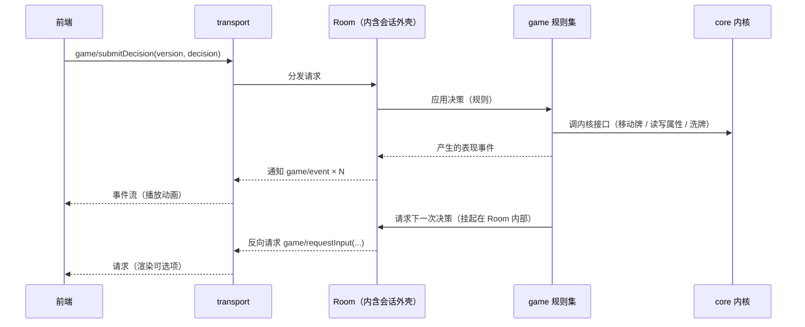

# 架构

## 1. 分层

```
前端（任意实现，默认浏览器 / TS）
    ↕ JSON-RPC（通用协议）
[transport]  帧编解码、连接生命周期、反向请求路由
[proto]      方法名 / 参数 / 返回结构的唯一定义（前后端共用事实来源）
[game]       规则集：项目根 `package/` 按包组织（现有 `基础` / `身份场` / `标准`），只拿注入的 `game`（**这一局的局对象**）与 `Card` / `Depends` 两个环境函数 —— 需要的内核对象全从 `game` 取（依赖方向 `package/ → moe`）
[session]    会话外壳：会话容器 + 决策挂起/恢复通道 + 事件收集（`server/session/`）
[core]       内核模块组（`server/core/`）：牌 / 牌区（移动、洗牌）/ 属性 / 随机源 / 桌子（座位与行动顺序）/ 玩家（牌区、标签）/ **局**（一张桌子 + 一个随机源 + 按名字登记的公共牌区 + **这一局的规则内容** + **使用牌与造成伤害的机制**，见第 12 节）/ **效果族**（`core/effect/`：`Effect` 与它的全部子类 —— `Effect` 基类在 `core/effect/init.lua`）/ 规则装载器（`core/loader/`）（**与游戏流程规则无关**，可直接单测）
[tools]      基础设施：event-loop / await / timer / log / json / inspect / uri / reload …
```

依赖方向只能自上而下，且门面全部**直接挂在 `moe` 上**（`moe.desk` / `moe.game` / `moe.loader` …，没有 `moe.core` 中间层；类名与类型注解**直接用类名本身**，不带命名空间前缀）；**门面（API 表）里只放工厂**（`moe.player.create { … }`），类的方法只能从实例上访问（API 表的类型写成「类名.API」；门面由**模块自己建**：`moe.player = {}`，不再 `local API = {}` + `return API`）。**`core` 不得依赖任何具体规则集内容、会话、协议、网络与任何 IO** —— 它只提供「装载规则」的机制（加载器本身在内核模块组里）；这样内核可以脱离协议与网络被直接驱动。协议方法到规则操作的翻译层属会话/协议批次，目录名待定。

## 2. 启动与运行模型

- exe + `bin/main.lua` 引导（照搬 LuaLS 4.0.0）：引导脚本设好 `package.path`，再按参数决定进「服务模式」还是「测试模式」。
- 服务模式：建立 event-loop → 起 transport → 进入事件循环。
- 测试模式：**不建 transport**，直接 `require 'test'`（即 `server/test.lua`）加载测试套件。
- 空闲与等待：循环空闲时**阻塞等待到「下一个定时任务到期」**（没有定时任务则无限阻塞），等待 / 唤醒由 `bee.async` 承担（`server/async-io.lua`）；停止走自唤醒通道，不靠轮询也不靠分片。
- **效果与等待**：一次结算 = 一个**任务**（`server/tools/task.lua`），效果体跑在它自己的协程里 —— 所以**结算体与时机回调里可以直接 `await`**（`moe.await.sleep` / `moe.await.yield`，恢复绑在**调用它的那个协程**上；应答方就是这么让出的），要等另一次结算结完用 `效果:await()`。**没有**「让出理由分派」与「让出逐层原样转发」这层机制（`Effect:suspend` 整层已于 2026-09-20 删除，理由：顺序请求、不会有外部打断）。

## 3. 协议设计原则（通用协议，一个后端对接多种前端）

1. **不出现任何前端概念**：协议只描述游戏语义与表现事件；贴图路径、动画时长、音效等由前端自行映射资源 id。
2. **方法命名**统一 `域.动作`（如 `session/create`、`game/submitDecision`），域与方法名集中在 `proto` 里定义，禁止散落在业务代码中拼字符串。
3. **后端权威、前端无状态**：目标合法性、距离、可用操作列表一律由后端计算下发；前端永不自行推导规则。
4. **两种下行数据各司其职**：
   - 事件流（notification）：一次操作产生的表现序列，供前端顺序播放动画。
   - 状态快照（request 的 result）：完整状态，用于开局、重连、纠错。前端不维护权威状态。
5. **需要玩家输入时由后端发起反向请求**（后端 → 前端的 request，前端回 result）。这天然表达「后端挂起等你」，也避免了前端轮询。
6. **每个决策带状态版本号**：后端在下发的请求里带 `version`（或 `seq`），前端提交决策时必须回带；后端据此拒绝过期输入。
7. **可重连**：重连由专门方法（如 `game/syncState`）返回全量状态 + 当前未完成的请求列表，**不依赖重放增量事件**。
8. **协议版本协商**：开局 `initialize` 交换协议版本与客户端能力（照搬 LSP 的做法），版本不匹配时明确报错而非静默降级。

## 4. 数据流（一次玩家操作）



## 5. 重要边界

- 规则集只进 `package/`（项目根）；内核只进 `server/core/`；协议路由与序列化只进 `transport` / `proto`（翻译层目录名待定）。
- 引擎的随机源必须可注入：固定 seed 能复现整局（便于回放、复现 bug、写测试）。
- 事件流是**表现层契约**：一旦下发就应稳定，不能因为前端改需求而让引擎改逻辑。
- 跨线程 / worker 边界只传可序列化 plain data。

## 6. 无头可测（硬性要求）

- 「无前端也能跑完整对局」是验收条件，因此：
  1. 引擎 API 必须是可直接调用的纯 Lua 接口，不经过 JSON-RPC；内核（`server/core/`）的接口同样如此，**场景由调用方自己组合**（例如「发牌」= 抽牌取顶 + 放进手牌，内核不提供「发牌」）。
  2. 决策点走同一套「请求输入 → 挂起 → 恢复」路径，测试用「脚本化玩家 / AI」自动应答，而不是给引擎开测试专用后门。
  3. 另设一层协议契约测试：对 `proto` 里每个方法做编解码往返与错误分支验证，不必真的开 socket。
- 回归口径：改引擎必须能只用测试二进制跑完整对局并复现。

## 7. 外壳接口约定（headless-server）

`server/session/` 是当前唯一的「服务」层，只做容器：它不认识牌、阶段、胜负。规则与协议两边各接一个形状，外壳自身不用改。

### 7.1 逻辑处理器（挂在会话上的规则入口）

- 形状：table + `run(self, session)`（写作 `handler:run(session)`），**入口必须是异步函数**（可被协程承载），否则表现为「会话卡住不动」。
- 约定：入口内用 `session:requestInput(...)` 索取输入、`session:emit(...)` 上报表现事件、`session:finish()` 结束；入口**正常返回也视为结束**。
- 入口抛错：会话转「已中止」，原因可用 `session:getAbortReason()` 取到。

### 7.2 驱动者（给输入的一方）

只需三个动作，测试里的「脚本化驱动者」与将来的协议层实现同一形状：

| 动作 | 说明 |
| ---- | ---- |
| `session:getPendingRequest()` | 读当前待处理事项（没有时返回 `nil`），形状 `{ kind, payload? }` |
| `session:submit(...)` | 提交结果，支持多个值；没有等待中的请求时报错 |
| `session:cancelRequest(reason?)` | 取消等待中的请求，挂起方收到取消错误 |

- 事件的形状同为 `{ kind, payload? }`，`session:getEvents()` 返回只读快照（后续发出的事件不会影响已取得的快照）。
- `requestInput` 的第三个参数是超时（秒），超时会以错误交回发起方，不静默卡住。

### 7.3 会话阶段

`pending → running → finished / aborted → destroyed`。`finished`、`aborted`、`destroyed` 都是**终态**，之后任何生命周期操作（启动 / 结束 / 中止 / 提交 / 取消 / 发事件）一律报错；阶段常量在 `moe.server.Phase`。

### 7.4 主循环归属

`server.start()` / `server.stop()` **不接管事件循环**，只做状态标记与日志；主循环仍由入口负责 —— 服务模式由 `main.lua` 常驻，测试模式由 `test.lua` 控制。这样外壳的启停是同步的、可直接被测试驱动，也不会在测试里嵌套启动事件循环。

## 8. 热重载（`moe.reload`）

> **先分清两件不同的事**（用户 2026-09-19 明确要求）：
> - **热重载**（本节）= **开发期**工具：改代码（修 bug）后不重启进程。触发者是开发者。
> - **规则集重载** = **游戏业务**功能：运行期重新装置/切换规则集（清空规则表、重新加载规则集）。触发者是业务侧。
>
> 两者**定位、触发者、生命周期、影响范围都不同**，**不要互相替代、也不要把后者当成前者的一种用法**。规则集加载见第 9 节。

### 8.1 加载方式即边界

- `include 'x'` = **可重载**入口：与 `require` 等价，但会把模块登记进重载集合（登记顺序即加载顺序）。
- `require 'x'` = 一次性加载：**永不参与重载**。因此**不需要**任何名单 / 过滤配置来划分范围。
- 目前只有内核（`core/`）用 `include`（`server/core/init.lua` 逐个登记）；`server/tools/`、`session/`、`async-io.lua` 以及热重载自身一律 `require`，从根上避免基础设施被换掉。
- **日志先就绪**：`log` 实例与 `moe.env` 在 `server/moe-kill.lua` 里创建，位置早于任何 `include`，所以可重载模块里可以直接用 `log.*`，加载器也能用 `log.error` 报错。
- `package/` 规则集**不**走 `include` 也不走 `require`，而由自建加载器读文件执行（第 9 节），因此它从根上不参与热重载 —— 这不是「暂且如此」，而是设计要求。

### 8.2 接口

| 接口 | 说明 |
| ---- | ---- |
| `moe.reload.reload()` | 重载全部已登记模块，返回被重载的模块名列表 |
| `moe.reload.onBeforeReload(cb)` / `onAfterReload(cb)` | 重载前后回调，**返回撤销函数**；回调自动记录注册它的模块，该模块被重载时回调自动注销（不会重复堆积） |
| `moe.reload.isReloading()` | 当前是否正在重载（重载期间回调与模块加载都对真） |
| `moe.reload.getIncludeName(fn)` / `getCurrentIncludeName()` | 反查函数 / 当前加载属于哪个可重载模块（将来按模块清理 timer 与订阅要用） |
| `moe.reload.recycle(cb)` | 立即执行并在每次重载后重跑，同时在重载前回收它登记过的对象 |
| `include 'x'` | 加载并登记；失败**记日志（带堆栈）并抛出错误**（不再返回 `false`）；重载过程中的失败由 `fire()` 用 `pcall` 隔离，不会中断整轮重载 |

触发端（开发期文件监视、前端协议方法）本批**未实现**，只提供接口。编辑器侧靠 `.luarc.json` 的 `runtime.special` 把 `include` 当作 `require` 解析。

### 8.3 语义与限制

- **同名类合并**：重载时 `Class 'X'` 复用**同一张类表**（`tools/class.lua` 的 `declare` → `config:reset()`），因此**已存在的实例立即用上新代码**，无需重建对象。
- 限制一：**删除不生效** —— 合并只覆盖字段，源码里删掉的方法仍留在类表上。所以不要给公共方法改名或删除。
- 限制二：**老实例不会重跑 `__init`** —— 新代码若要求实例多一个字段，老实例没有它，读字段要容忍 `nil`。
- 模块级 `local` 只允许放**不可变常量与纯函数**（如 `random.lua` 的常量、`zone.lua` 的 `resolvePosition`）。
- 现状核对（2026-09-19）：`random.lua` 只有常量与纯函数；`zone.lua` 只有 `resolvePosition` 纯函数；`ordered-zone.lua` 与 `attribute.lua` 只有类表与模块引用；`card.lua` 的标识计数器挂在门面表上（`moe._nextCardId = moe._nextCardId or moe.util.counter()`）—— 内核已无模块级可变状态。

### 8.4 跨重载存活的数据

必须存活的数据挂到「重载后仍是同一张表」的载体上，写成「有则复用」：

```lua
moe._nextCardId = moe._nextCardId or moe.util.counter()
```

- **载体选门面表 `moe`**：它在 `server/moe-kill.lua`（入口文件）里建立，而入口只执行一次、dev 重载只重跑 `include` 登记过的模块，所以这张表**永不重建**。
- **命名用 `_` 前缀 + 赋值处标 `---@package`**：`_` 只表示「内核内部状态，不是对外接口」（`moe` 是普通表，框架不会碰它，`_` 本身没有语言含义）；真正能拦住跨文件用的是 **`---@package`** —— LuaLS 会把它当「只有这个文件可见」（实测：别的文件访问报「字段 `X` 只能在相同的文件 … 中才能访问」）。本工程没定义过「包」的边界，`package` 退化成按文件判定，与 `---@private` 同效。
- **不要挂类表**：`Class` 的 `Extends` 会把父类**非 `__` 开头**的字段复制给子类（并记入 `extendsKeys`），重载时 `Config:reset` 又把这份拷贝清掉 —— 挂在那种名字上会串到子类、还会在重载时被清掉。`__` 开头能躲开这两件事（框架自己就是这么用的：`__config` / `__getter` / `__keyMap`…），但那是**借框架的私有前缀**，不如压根不挂。
- **也不要挂模块门面**（`moe.card` 这类表）：门面由模块自己建（`core/card.lua` 里 `moe.card = {}`），而 `include` 就是 `require` + 登记、重载时会重新执行模块文件 ⇒ 门面每次都是**新表**，状态挂上去每次都被换掉。实例之所以跨重载照常可用，是因为它们持有的是**类表**（`M._classes` 复用同一张），与 API 表无关。
- `server/core/init.lua` 只写一串 `include 'core.card'`：登记 + 执行模块文件（门面由模块自己建）；`include` 失败会**抛错**（同时已记日志），所以这里不需要再包一层失败处理。

### 8.5 撤销与自动注销的分工

**自动注销是默认，disposer 是例外**（用户 2026-09-19 定）：

在**可重载**模块里注册、且跟着该模块走的东西，重载这个模块时会被自动注销，模块重跑时再自动注册 —— 这种**不要**写 disposer，否则每次重载都会多一层无谓的显式管理。

只有下面两类才需要显式处理：

| 场景 | 做法 |
| ---- | ---- |
| 注册发生在**不可重载**的模块里（回调的 `name` 为 `nil`，永远不会被自动注销，会一直留着） | 用 `onBeforeReload` / `onAfterReload` **返回的 disposer** 精确撤销 |
| 自动注销**盖不到、必须重建或显式释放**的资源（外部系统里的注册、timer、socket、缓存对象…） | 用 `onBeforeReload` **捕获**引用做清理，`onAfterReload` 重建；或直接用 `recycle(cb)`（立即执行 + 每次重载后重跑 + 重载前 `Delete` 登记过的垃圾） |

口诀：**能靠自动注销就不要写撤销；撤销只留给“注销不掉需重建”的资源。**

## 9. 规则集加载（`moe.loader` + `moe.game`）

> 定位：**游戏业务**功能 —— **一局游戏装哪套规则**。装载器（`moe.loader`）是**无状态**的机制：它把一套规则装进**某个局**；内容状态全在**局**（`moe.game`）上，所以改规则（含清空重载）只影响这一局。与第 8 节的**开发期热重载**仍是两条互不相干的通道：不共用登记、不共用回调、不互相替代 —— 区别只在于**装载器与局这两份代码本身**与其它内核模块一样可热重载。

规则集（`package/`）是**内容/数据**：加载方式是**读文件并执行**，MUST NOT 走模块系统（`require` / `include`），因此**被加载的规则集文件**不参与热重载，也不出现在 `package.loaded` 里。契约见 `server/test/rule/init.lua` 与 `server/test/rule/vfs.lua`（规格快照已冻结，见根目录 `AGENTS.md` 的「工作流」）。

### 9.1 落点与外观

- 装载器在 `server/core/loader/`：`init.lua`（`Loader` 模块：`install` / `declareDepends` / 名字路由 / 按预解析结果的执行）、`vfs.lua`（包来源合并成的虚拟文件系统）、`preparse.lua`（试跑）、`env-meta.lua`（纯类型文件：注入的 `game` / `Card` / `Depends` 与各时机上下文）。**局**在 `server/core/game.lua`（`Game` 类）。
- `server/core/init.lua` 里与其它内核模块一样 `include 'core.game'` / `include 'core.loader'`（门面 `moe.game` / `moe.loader` 由模块自己建；两份都可热重载）。
- `moe.game.create { desk, random, sources?, packages? }` 建**一局**并**立刻装好规则**：除桌子与随机源外，规则表、包顺序、包元信息、规则数值、时机注册、属性系统、来源全挂在局上，**局之间互不影响**；`packages` 省略视同空清单 ⇒ 只装默认加载的包（见 9.3）—— 即 `create { desk, random }` 与 `create { desk, random, packages = {} }` 行为一致。要换规则走 `moe.loader.install(game, { packages = 清单 })`（省略参数就复用局上记的来源与清单）。
- **包手里的 `game` 就是那一局**：规则包要这一局的牌区 / 桌子 / 随机源就直接用注入的 `game`（`game:createZone` / `game.desk` / `game.random`）—— 不再有「规则实例」这一层，也不存在「实例与场地互指」（见 9.6）。
- 测试套件：`server/test/rule/init.lua`（加载/依赖/重装，`--test rule`）与 `server/test/rule/vfs.lua`（来源与合并，`--test rule.vfs`）；局本身在 `server/test/core/game.lua`（`--test core.game`）。

### 9.2 包来源与虚拟文件系统（`server/core/loader/vfs.lua`）

多个**来源**合并成一棵**逻辑目录树**，加载器只认逻辑路径。来源写法只有两种（`*` 是**特殊语法**，不是通配匹配，只允许出现在结尾）：

| 写法 | 含义 |
| ---- | ---- |
| `X` | X **本身**是一个来源，逻辑第一层 = X 的目录名 |
| `X/*` | X 是**包容器**，其下每个子目录各是一个来源，**容器名不进逻辑路径** |

两种写法归一成「逻辑路径第一层 = 来源目录名」，于是同名逻辑包天然对齐。

来源目录名以 `@` 开头时表示**默认加载**（`package/@基础` ⇒ 逻辑包名 `基础`，且默认加载）：`@` 只从**逻辑第一层**去掉，不进任何逻辑路径（也不会出现在清单 / 依赖 / 限定名 / 元信息里）；`@` 只允许出现在这一层 —— 包内的子目录名或文件名带 `@` 前缀会在**加载时报错**；目录名只有一个 `@`（后面没名字）也报错。

| 接口 | 说明 |
| ---- | ---- |
| `moe.loader.install(game, { sources?, packages? })` | 装一套规则进这个局：先清空局上的内容 → 按清单依次加载；返回**实际执行的文件（逻辑路径）**，按执行完成顺序 |
| `game.sources` / `game.list` | 这个局的来源（**顺序即优先级**，默认 `{ './package/*' }`）与上一次用的清单（`install` 写入，供省略时复用） |
| `game.loadedFiles` | 上一次装的时候实际执行过的文件（同上，随时可读） |
| `Depends { '基础规则/回合流程' }` | **规则集侧**声明依赖，只能出现在加载过程中 |

- **合并规则**：同一逻辑路径在多个来源里都有时，**只取最后一个来源的那个文件**（文件级覆盖）；不同路径取**并集**，同名目录的内容**跨来源合并**（不是整目录替换）。
- **不缓存**：每次 `install` 当场重新枚举并合并，运行期换包 / 加包立刻生效。
- 来源路径在磁盘上**不存在 ⇒ 报错**；`X/*` 匹配到 0 个包 ⇒ 允许；逻辑路径**归一化**（`.` / `..` 会折叠）在逻辑层面做，越出规则集根报错。

**三套机制的方向各不相同，别记反：**

| 机制 | 解决什么 | 排序方向 |
| ---- | ---- | ---- |
| 来源合并 | 用户**替换同一个逻辑文件** | 来源列表里**后者覆盖前者** |
| 规则数值（见 9.7） | 后续包**覆盖同一个配置项** | 加载顺序里**后者覆盖前者** |
| 包路由（见 9.4） | 不同包**同名并存** | 清单里**先加载的包优先**（包内裸名则先取本包） |

### 9.3 清单与依赖项都是逻辑路径

- 清单项解析顺序：**文件 → 补 `.lua` 的文件 → 目录**（目录递归、只取 `.lua`、按路径排序保证确定性）；都不存在 ⇒ 报错。
- `Depends` 的项也是逻辑路径，且**支持相对路径**：以 `.` / `..` 开头的按**声明它的文件所在目录**解析，其余按逻辑根；归一化后去重（同一文件的不同写法只执行一次）。
- **清单是唯一入口**：加一个文件进清单即生效，从清单移除即失效。清单由**调用方**给：装配方用 `moe.game.create { packages = ... }` 定下这一局要装的包，重装与临时脚本直接用 `moe.loader.install(game, { packages = ... })`。
- **互斥声明**：项以 `!` 开头（`Depends { '!国战' }`）表示「本轮不能有这一项」—— 它与依赖项走**同一套解析**（含相对路径）；判定「已加载」是本轮文件里有落在该项（包目录 / 文件）之下的（前缀匹配带分隔符，所以 `国战` 不会误判 `国战外传`）；**没被加载就不报错**；冲突时错误指出**声明者**与被排斥的项。校验做了两次：**执行前一次 + 结束前兜底一次**（任何清单顺序都拦得住）。
- **默认加载的包**：来源里带 `@` 标记的包（见 9.2）由加载器自动加入，且**排在清单项之前**（彼此按逻辑名升序，顺序确定）；清单里不必写它们，写了也不会执行两遍（「同一文件只执行一次」）。**内容包也不必为它们写 `Depends`**（自动装且排在最前 —— `package/身份场/胜负.lua` 就是直接 `game:on(...)` 开头）。要排斥它就用互斥声明（`Depends { '!基础' }`），没有「按名字关掉默认包」的开关。

### 9.4 包与名字路由

包 = **逻辑路径的第一层目录**（目录名即包名），包内子目录只作组织、不参与命名；规则集文件必须位于包目录里（**根下散落文件报错**）；包名与条目名都**不许含 `.`**（完整名由加载器拼）。

```lua
-- package/标准/卡牌/杀.lua
local slash = Card '杀'          -- 登记为 标准.杀
    : on('使用', function () end)
```

| 接口 | 说明 |
| ---- | ---- |
| `Card '名字'` | **只在加载过程中可用**（环境函数）：声明本包的一条定义；同包重复声明报错（报错指出两处来源） |
| `game:getCard('名字')` | 查询：裸名带**包内作用域**，限定名（`军争.杀`）精确取到指定包 |
| `Card:on(事件, 回调)` | 链式登记回调，返回同一条定义；**跨文件追加回调用 `game:getCard` + `Depends` 定顺序**。事件名是**固定集合**（`'获取目标'` / `'使用'`），清单在 `env-meta.lua` |
| 条目字段 | 定义对象是 `CardDef`，字段有 `name`（裸名）/ `package`（包名）/ `fullName`（`标准.杀`）/ `source`（声明它的文件）——字段叫 `package`，注解必须写成 `---@field public package string` |

**裸名的解析顺序：**

1. 查询发生在**包内**（加载过程中、当前上下文有所属包）→ **先取本包**；
2. 本包没有 → 按**包的加载顺序**（清单顺序）取**第一个**定义该名字的包；
3. **包外**（游戏运行期、内核、测试，没有「当前包」）→ 直接从第 2 步开始。

所以：包内写裸名 = 本包版本；**引用他包的同名条目必须写限定名**（军争里想用标准版的「杀」要写 `标准.杀`）。裸名与限定名拿到的是**同一个对象**，不是副本。

### 9.5 依赖 = 执行到那行时同步加载完

`Depends { ... }` 在执行到该行时立刻把依赖加载完，再继续本文件剩余的代码 —— 所以**依赖声明写在文件顶部**（不必预扫描源码文本，避开了字符串/注释里的假匹配）。
去重与防环靠「本轮已加载 / 正在加载」集合：同一文件在本轮只执行一次，互相依赖不会无限递归。

### 9.6 规则集侧的书写环境

- 加载时用 `load(chunk, '@' .. 路径, 't', env)` 把 `game` / `Card` / `Depends` / `util` **注入**执行环境，所以规则集文件**不需要 `require` 任何东西**；以 `@路径` 作 chunkname，报错与堆栈里显示真实文件路径（中文路径同样可用）。
- 注入面只有 `game`（**这一局**，小写对象）+ `Card(name)` / `Depends(items)`（**大写环境函数**，只在本轮加载期可用；大写是为了和包里的局部变量区分开）+ `util`（**收窄的纯函数工具集**，小写对象）+ 一份**标准库白名单**（`string` / `table` / `math` / `utf8` / `pcall` 等基函数）；`moe`（含 `moe.core` 这类写法）、`require`、`io`、`os` 一律不给 —— 规则集是内容，不该具备开文件 / 起进程的能力。
- **`util` 是收窄的工具集，不是内核工具库本体**（`moe.util` 里有 `saveFile` / `defer` 这类副作用能力）：现在只有三个纯函数 —— `util.filter(列表, 判定)` / `util.map(列表, 变换)`（回调收 `(值, 下标)`）/ `util.contains(列表, 值)`，清单与签名以 `server/core/loader/env-util.lua` 为准（改它就要顺手改 `env-meta.lua` 的声明）。要加新函数先过一遍「纯函数」这条线。
- **规则包需要的内核能力由 `game` 收口**（用户 2026-09-19 定）：`game:getAttributeSystem()` —— 属性系统由**那一局**持有（一局一份；清空重装时置空 ⇒ **重装后是一个全新的系统**：属性定义是规则集内容，属性库也不允许编译后再 `define`）；包在**加载期**往它上面 `define`，装配方再用 `createInstance()` 给玩家建属性实例。
- **一局的资源直接用注入的 `game`**：牌与牌区是运行期的东西，按名字建在局上（`game:createZone(名字, 有序?)` / `game:createCard(名字)`），桌子与随机源是局上的公开字段（`game.desk` / `game.random`）—— **只认字段，没有 getter**（一个概念不要两套 API）。**环境对象就是 `game` 本身，不进时机上下文**（见第 10 节）。
  - 分工：**公共牌区**（抽牌 / 弃牌 / 处理）挂局上；**玩家侧牌区**（手牌 / 装备 / 判定）用 `player:addZone(名字)`。
- **装配方不受限**：测试与将来的房间 / 流程直接用 `moe.*` 组合开局（它们不是包）。
- 规则集文件里**可以用中文标识符**（构建期补丁，见 `infrastructure.md`），但**中文只用于难翻译的内容名**：技能名 / 卡牌名 / 身份名，以及作为数据取值与配置键的名字（`'杀'`、`'体力上限'`、`'游戏-开始'`）；**字段名 / 局部变量 / 函数名一律英文**（详见 `code-style.md` 第 8 节）。
- 规则集里**不要为空值防御**：注入的 `game` 按约定一定拿得到（它就是这一局），直接用；只有**运行期真的会缺**的才 `error`（如没牌表、人数不在配置表里）。见 `code-style.md` 第 9 节。
- 这两个环境函数与各时机的上下文类型写在一份**纯类型文件** `server/core/loader/env-meta.lua`（顶部 `---@meta`，不参与运行）：见 9.7 与第 10 节。
- **包自带 `meta.lua`**（用户 2026-09-21 定）：包目录下可以放一份**纯 LuaDoc** 文件（固定叫 `meta`，不跟内容命名走 —— 它是**纯代码功能**、不是规则内容），用来声明**这个包自己的概念**：`---@alias`（如 `身份场.身份`）、以及给内核类**追加按名收窄的签名**（`player:getTag('身份')` → `'主公'|'忠臣'|'反贼'|'内奸'`、`game:getValue('默认体力')` → `integer`、`player:getAttr('体力')` → `number`）。**装载器不特殊对待它**（就一个普通文件，里面只有注释 ⇒ 执行是空操作）【约束：它里只放类型声明】。
  - **配方（两处坑）**：① 收窄那几条后面**必须再写一条兜底签名**（`key: string` / `name: string`）—— 跨文件重声明同名 `---@field` 会**接管这个名字的签名表**，不写兜底就把内核那份（来自方法定义）报错掉（实测：漏写时全仓 27 处 `getTag('顺序')` 报「不能将 `string` 赋给参数 `'身份'`」）；② 重声明类时**基类要写全**（`---@class Player: Class.Base`）。
  - 实测的良性质：**多个包各自的候选共存**（`@基础` 的 `'默认体力'` 与 `身份场` 的 `'身份配置'`同时对 `getValue` 生效）、**跨包读也收窄**（`身份场` 读 `@基础` 的值拿到了 `integer`）、重声明**不会弄丢**内核那份类声明里的其他字段。
  - 所以**包作者可见的类型面变成两处**：内核的通用面（注入的 `game` / `Card` / `Depends` / `util`、各时机上下文）在 `env-meta.lua`；**各包自己的概念**在它自己的 `meta.lua`（第三方包同样允许自带）。

### 9.7 规则数值（可覆盖的配置）

规则包里定的默认值（体力上限、身份人数表、牌表…）放**规则数值**：一张全局表，键是字符串，**与包无关**地共享。

| 接口 | 说明 |
| ---- | ---- |
| `game:setValue(名字, 值)` | 设一条 |
| `game:setValues { 名字 = 值 }` | 批量设 |
| `game:getValue(名字)` | 读一条：**没设置过得到 `nil`**（不报错） |
| `game:getValues()` | 读全部，返回**快照**（改它不影响规则数值） |

```lua
-- package/基础/配置.lua
game:setValues {
    默认体力 = 5,
}
```

- **按加载顺序后者覆盖前者**：这是有意提供的**覆盖通道**（例：军争要改血量上限就再写一份配置），与包路由的「同名并存」是两套语义。
- 与规则表**同生命周期**：清空重装时一并清空（挂在局上）；读不到的默认值写在规则包里，读时 `or 默认`。
- **函数不进规则数值**：行为（如「游戏开始时分身份」）走**时机注册**，不要存回调。
- 类型声明：注入的 `game` 的类型写在 `server/core/loader/env-meta.lua`（`---@type Game` + 各时机的 `---@field` 重载）；数据字段写在类定义处（`server/core/game.lua`）；**某个包自己定的规则数值，收窄就写在那个包的 `meta.lua` 里**（见 9.6 的「包自带 `meta.lua`」）。

### 9.8 定义入口与重装语义

```lua
local slash = Card '杀'
    : on('使用', function () end)
```

- `Card '名字'` = 声明（名字不含 `.`、完整名由装载器拼）；`Card:on(事件, 回调)` 链式登记；查询用 `game:getCard`（未登记得到 `nil`）。
- **环境函数 与 局上的方法**：`Card '杀'` / `Depends { ... }` 是注入环境的**大写函数**，只在**本轮加载期**可用，作用在正在装的那个局上；内容入口（`game:getCard` / `game:getValue` / `game:on` / `game:fire` / `game:getAttributeSystem` / `game:getPackageMeta` …）在加载期与运行期都能用，重装走 `moe.loader.install`。
- **重装 = 清空局上的内容 + 重新加载**：不做增量、不做按名单卸载（用户 2026-09-19 定），重复加载同一份清单会**重新执行**所有文件；包顺序也随清单重新算。桌子 / 随机源 / 牌区**不参与清空** —— 重装只动规则内容。
- 规则表结构是「包名 → 裸名 → 定义」+ 一份包顺序表；**同一轮加载里还能注册时机回调**（见第 10 节），它们与规则表一样随清空重装清空。
- 目前只有「牌」一类，结构按功能点增量长；卡牌的事件名与回调签名**做「杀」时再定**。

## 10. 时机与事件（`moe.event` + `game:on`）

规则集要能**挂到时机上**（`'游戏-开始'` 时分身份、改体力上限，回合各阶段触发技能…）。机制在内核模块组、实例由**局**持有：

| 接口 | 说明 |
| ---- | ---- |
| `Event:on(名字, 回调)` | 按时机名注册，返回 disposer；**注册顺序即执行顺序** |
| `Event:fire(名字, ...)` | 按名触发；未注册 = 空操作；单个回调报错不打断其余（`xpcall(回调, log.error, ...)`） |
| `Event:has` / `getNames` / `clear` | 查询与清空 |
| `game:on(名字, 回调)` | 注册时机（**唯一入口**：内容包 / 内核 / 用例都用它），返回 disposer |
| `game:fire(名字, 上下文)` | 触发：给**装配 / 流程代码**与无头测试用；内容包不主动触发 |

- 实现是「时机名 → `moe.sevent`」的薄封装（`server/core/event.lua`），顺序与错误隔离都沿用 `simple-event`。
- **实例由局持有**（`game.events`）并在**每次装载时重置** —— 于是注册的生命周期天然等于一轮装载，清空重装不会残留旧回调，也不会串到别的局。
- **时机名不预设**：内核与加载器不认识任何具体时机名，`'游戏-开始'` / `'回合-开始'` 都是规则集自己约定的字符串。**项目约定用 `分类-动作` 命名**（前一段是分类、后一段是动作，便于按分类聚合事件列表），这只是写法规约，没有任何强校验。
- **上下文只装事件参数**：`ctx` = 这个时机对外声明的参数（`'游戏-开始'` 没有参数 ⇒ 传空表）；环境对象就是注入的 `game`，不进上下文。
- **事件参数写进 meta**：`server/core/loader/env-meta.lua`（纯类型文件，不参与运行）为每个时机声明一个上下文类型与 `on` / `fire` 的重载，于是规则集里 `game:on('游戏-开始', function (ctx) ... end)` 的 `ctx` 能**按事件名收窄**出字段类型：

```lua
---@class Game.EventCtx.游戏开始 # 目前没有事件参数：触发时给空表

---@class Game
---@field on fun(self: Game, name: '游戏-开始', callback: fun(ctx: Game.EventCtx.游戏开始)): function
---@field fire fun(self: Game, name: '游戏-开始', ctx: Game.EventCtx.游戏开始)
---@field on fun(self: Game, name: string, callback: fun(ctx: any)): function
---@field fire fun(self: Game, name: string, ...: any)
```

  类型名的**最后一段** = 事件名**去掉连字符**（连字符不是合法的 LuaDoc 类型名字符），前面挂在自己类的命名空间下（`Game.EventCtx.游戏开始`）；上下文的类型也可以直接就是内核的某个类（如「伤害-前」与「伤害-后」的上下文就是 `Damage` 实例）。同名多行 `---@field` 会被当成多个签名候选（实测不报 `duplicate-doc-field`）：**字面量事件名走专用那条，动态名字落到 `string` 兜底那条**。
- **两类事件名，兜底策略不同**（用户 2026-09-19 定）：
  - **局的时机**（`game:on` / `game:fire`）是**开放集合**（时机名不预设、不校验）⇒ 专用候选之后**必须补 `string` 兜底**，否则动态时机名会被误报类型不匹配；新增时机时**顺手补一条**，不补也能跑（运行时与注入面都不校验时机名），只是调用点拿不到 `ctx` 的字段类型。
  - **牌的钩子**（`CardDef:on`）是**固定集合**：名字由内核约定、与启用的包无关（也没有扩展需求），清单以 `server/core/loader/env-meta.lua` 为准 ⇒ **不留兜底**，拼错在编辑期直接报（实测：写 `: on('获取目标吗', …)` 会报「不能将 `string` 赋给参数 `'使用'|'获取目标'`」）。新加钩子**必须同步补进 `env-meta`**，钩子清单只有它一个事实来源。
- **这份 meta 就是包作者（含第三方）可见的类型契约，不额外做“可单独分发的 meta 包”**（用户 2026-09-19 定）：内核的类型（`Game` / `Player` 等）与 `moe` / `bee` 的引用链横跨整个工程，单独导出难以完整 —— 第三方开发者**直接打开本工程**开发自己的包（包放自己目录、再写进来源清单，见 9.2）。因此**改时机名 / 改签名要顺手改这里**，它是对外接口面的一部分。
  - 注意：`.luarc.json` 是**单根工作区**设置 —— 包目录在本工程之外时分析器不会跟着分析（多根工作区也拿不到该配置）；开发外部包时把目录放进工程里，或用单根工作区指向包含它的目录。
- **覆盖靠顺序，不靠改载荷**：上下文约定为**只读**，要覆盖就改**状态**（写标签、改属性、加标记）—— 后注册的回调后执行，它写的状态自然生效（例：身份场写身份，后来者也注册同一时机，则后写者胜）。
- **回调报错被隔离**：单个回调抛错只记录（`log.error`），**触发本身不会失败**；所以“规则包里出错”的可见信号是**状态没写**（不写牌堆、不写身份），装配方要在 `fire` 之后断言必需状态（见第 6 节的无头测试写法）。
- **依赖方向**：机制在内核模块组、实例由局持有；内核侧消费者（将来的回合流程、会话）要订阅游戏时机，就用自己那一局（`game:on` / `game:fire`），**不要**自己再造一份。
- **订阅入口只有 `game:on`**（用户 2026-09-21 定，统一了原来的 `game:on` / `game.events:on` 两个写法）：`game.events` 退成**内部字段**（内核自己 `fire` / `clear` 用），外面一律 `game:on` / `game:fire`。早先 `game:on` 限制「只在加载规则集时可用」、把内核 / 用例逼去直接碰 `game.events` —— 2026-09-21 实测**内核侧一个订阅者都没有**（`server/core/` 只有 `event.lua` 的实现与 `game.lua` 的转发；`server/session/` 也不订阅游戏时机），那道限制于是被删掉（`game:on` 现在任何时刻都能注册，不再报「时机注册只能在加载规则集时声明」）。
- **但时机表仍然是「内容」**：每次 `resetContent()`（每次装载）都会 `events:clear()` —— **连同运行期注册的那些一起清** ⇒ 内核 / 装配的**长期簿记**（缓存失效…）千万不要挂在它上面，否则重装一次就静默失效（实测：桌子想靠订阅 `'玩家-死亡'` 清 `alivePlayers` 缓存，加载后订阅就没了 ⇒ 改成「不缓存、每次现算」）。内容包与用例无所谓 —— 它们的订阅本来就随这一轮装载 / 这一个用例生灭。

## 11. 预解析与包元信息

加载一份规则集是「**先试跑、再执行**」：枚举到文件后先用「stub 环境 + `tools/without-check-nil`」跑一遍，只提取它声明的**依赖项 / 互斥项 / 条目清单**（不写规则表、不改状态），汇总成**包元信息**；据此在**执行任何文件之前**校验互斥冲突与同包重复条目，最后才清空规则表并按清单执行。

- 试跑机制在 `server/core/loader/preparse.lua`。`without-check-nil` 给 **`nil` 本身**装元表（nil 上的算术 / 拼接 / 索引 / 调用都不崩），所以文件里 `Card('杀'):on(...)` 这类链式调用落到 `nil` 也不会炸；**它是进程全局改动，必须成对 `enable()` / `disable()`**（用 `<close>` 保证一定恢复）。
- 试跑失败（文件自身报错）**只记警告**并继续：真正的语义仍以执行为准（执行到那一行时的早失败 + 结束前兜底共同保证）。
- 查询：`game:getPackageMeta(包名)` / `game:getMetas()`，返回**只读快照**（包名 / 依赖 / 互斥 / 条目 / 文件与来源 / 试跑是否成功）。

## 12. 使用牌与伤害（内核机制）

规则侧第一个功能点：让一张牌能「用出去并产生后果」。机制在内核、规则全在内容包 —— 契约见 `server/test/core/effect/init.lua`、`server/test/core/effect/play.lua` 与 `server/test/core/effect/damage.lua`。

**效果族的落点**（用户 2026-09-21 定）：`Effect` 与它的**全部子类**都住 `server/core/effect/`（基类 = `init.lua`，于是模块名仍是 `core.effect`，子类顺理成章是 `core.effect.damage` / `core.effect.use-card` …；`include` 清单在 `server/core/init.lua`）。**判断标准只有一条 —— 是不是效果**：要进记牌器 / 要 `parent` / 要 `settle()` 的就放这儿，纯机制（`zone` / `desk` / `attribute` / `game`…）留在 `server/core/` 平级。用例对称（`server/test/core/effect/`），套件名跟着模块名走 ⇒ `--test core.effect` 一把跑完整个效果族。

| 接口 | 说明 |
| ---- | ---- |
| `Effect`（类，门面无工厂） | **效果基类**：持局 + 种类标识 `kind` + 外层效果 `parent` + 嵌套深度 `deep`；`apply()` = **驱动**这次结算（在**自己的任务**里「记父（当前正在结算的那个）→ 触发 `'即将生效'` → `settle()`（子类实现）」）；`await()` = 等它结完；结果读 `.result`、失败读 `.err`；`remove()` = 取消这一次生效（幂等） |
| `game:useCard(使用者, 牌, 目标们)` | **使用一张牌**（`UseCard`，`kind` = `useCard`）：校验（牌在手 / 目标是合法目标的非空子集）→ 取出牌 → 触发 **`'卡牌-结算前'`**（内容侧据此安置它，基础规则放进 `处理`）→ **按行动顺序对每个目标各结算一次生效** → 触发 **`'卡牌-结算后'`**（基础规则据此送进 `弃牌`）；等价于「造 `UseCard` + `:apply()`」 |
| `CardEffect`（类，门面无工厂） | **对某个目标的一次生效**（`kind` = `cardEffect`）：字段 `def` / `user` / `card` / `target`，父效果 = 这次用牌；跑这张牌的 `'生效'` 回调 |
| `game:askCard(被问者, 缘由, 要什么牌)` | **要一张牌**（`moe.askCard` 造 `AskCard : Effect`，`kind` = `askCard`）：返回**询问实例**（同样「驱动 + 等」），询问通过局上的 **`'卡牌-询问'`** 时机交给应答方，应答方调 `ask:answer(那张牌)`；给出的牌读 `.result`（**应答一给出结果就已定下** —— 答复时机里 `ctx.result` / `ctx.card` 就读得到），没人答上或被取消 ⇒ 「不存在」。**缘由**是不透明字符串（内核不解释、只原样带给规则层）；**应答方给出了牌**时才触发 **`'卡牌-答复'`** 与紧接着的 **`'卡牌-答复后'`**（上下文 = 这次询问；没人应答不触发），规则层据此决定"这次答复意味着什么、那张牌怎么处置"（基础规则：缘由是「打出」⇒ 先进 `处理`、再进 `弃牌`） |
| `game:moveCard(牌, 区)` | **把牌挪到某个牌区**（`moe.moveCard` 造 `MoveCard : Effect`，`kind` = `moveCard`）：`card` 可以是单张或一批；`zone` 可以是**单个或一串**（一串 = 依次经过，停在最后一站），每一项可以是**区名**或**牌区对象**；**区名先在当前回合角色（`game.turnPlayer`）身上找、再找局上的牌区**（传对象则直接用，不做解析）；**一次结算把整批牌挪完**、返回效果实例（失败读 `.err`）；解析不出来 ⇒ 失败且不改状态；**没有归属的牌也能挪**（路径的第一站当作把它放进去） |
| `game:ask(被问者, 缘由, 问什么)` | **要一个决策**（`moe.ask` 造 `Ask : Effect`，`kind` = `ask`）：**不绑定卡牌** —— 问什么（`question`）、答什么（`reply`）都由发起方解释，内核零语义；询问通过 **`'决策-询问'`** 时机交给应答方，应答方调 `ask:answer(答复)`（**`reply` 是读任务结果的 getter**：答复会当场唤醒发起方，写在 `settle` 里的字段根本来不及被读到）；**有答复才触发 `'决策-答复'`**（只这一个时机 —— 通用询问不处置任何东西），没答上 / 被取消 ⇒ 没有答复，不算失败。回合流程的「出牌」「弃牌」用它 |
| `game:addEffect(效果)` | 记牌器：发起一个**根效果**就记一条（只增） |
| `game:registerFlow(handler)` | **登记这一局的流程**（只在加载期、每局一个）：内容包把本局的流程（如回合循环）登记进来；内核**不认识**流程内容 |
| `game:runFlow()` | **启动这一局的流程**（装配侧：无头测试 / 房间 / 会话）：返回一个**任务**（`moe.task`）—— 可 `await`（等这局跑完）、`.result` / `.err` 读结果与失败、`cancel()` 停掉这局；**流程不是结算，不进记牌器** |
| `game:getEffect()` / `game:getEffects()` | 最近发起的那一个 / 快照（按发起顺序） |
| `moe.damage.create { game, from, to, amount }` | **造一次伤害**（`Damage : Effect`，`kind` = `damage`）：字段 `game` / `from` / `to` / `amount` 可读；**自己不碰任何属性**，只依次触发 `'伤害-前'` / `'伤害-生效'` / `'伤害-后'` |
| `game:damage(来源, 目标, 点数)` | 造成伤害的**便利入口**：等价于「建实例 + `:apply()`」，规则包与测试用这个 |
| `moe.heal.create { game, to, amount }` / `game:heal(目标, 点数)` | **回复体力**（`Heal : Effect`，`kind` = `heal`）：与伤害对称，只触发 `'回复-前'` / `'回复-生效'` / `'回复-后'` |
| `moe.draw.create { game, player, count }` / `game:draw(玩家, 张数)` | **摸牌**（`Draw : Effect`，`kind` = `draw`）：只触发 **`'摸牌'`** 时机；**取牌与洗回写在 `@基础/抽牌.lua`**（内核不预设区名 —— 哪个区是抽牌堆是内容侧的事） |
| `moe.dying.create { game, player }` | **濒死结算**（`Dying : Effect`，`kind` = `dying`）：`settle()` 只触发 `'濒死'` 时机；**判死归规则**（内核不认识生命值属性） |
| `game:enterDying(player)` | **让某人进入濒死**：只**记账**，真正的结算等当前这次效果结算收尾时才起（于是「受到伤害后」类技能先跑、濒死紧随其后）；返回撤销函数；不在任何结算里时当场起 |
| `game:flushDying()` | 把记下的濒死结掉（结算收尾时由内核调，规则侧不用管） |
| `game:endGame(结果)` | **结束这一局**（幂等，只认第一次）：记下结果 → 触发 **`'游戏-结束'`**（上下文 = 结果）→ **把这一局的流程任务就地收掉**（`Task:cancel()`：挂起中的流程协程会被关掉） |
| `game:getResult()` | 这一局的结果（`Game.Result` = `{ side, reason }`）；**没有值 = 还没结束** —— 装配侧 / 会话据此判断是不是终局 |

- **效果链与记牌器**：`apply()` 里先取 `parent`（外层效果 —— 从**当前任务的上下文**取，必须在 `Task:execute` **之前**取：一进执行体当前任务就变成自己了）、再按父链累 `deep`、挂进父的 `childs`；根效果记进局上的**只增记牌器**（`game:addEffect`）。`deep` 上限 100，挡住写错的重递归。
- **父效果**：`Effect` 带 `parent` 字段（外层效果），由 `apply()` 在**本次结算开始之前**从「当前正在结算的那个」取出（必须在 `Task:execute` **之前**取 —— 一进执行体当前任务就变成自己了）⇒ 所有效果子类自动具备，子类不用管；没有外层时（根效果）父为空，同时会被记进局上的**只增记牌器**。沿 `parent` 往上走就是整条结算链（用牌 → 它造成的伤害…）。**父是结算嵌套关系，不是归因** —— “这一下算谁的”看伤害自己的 `from`，两者可以不同（如延时类）。
- **内核零区域名**：`UseCard` 不预设「手牌 / 弃牌」，它自己在使用者名下牌区里找这张牌；**牌的安置与去向都由内容侧决定** —— 触发 `'卡牌-结算前'`（`@基础` 的 `使用.lua` 把它放进 `处理`，于是它在结算期间有落脚处）与 `'卡牌-结算后'`（送进 `弃牌`）；打出的牌同理，走 `'卡牌-答复'` / `'卡牌-答复后'`（`打出.lua`）。
- **牌记自己的归属**（用户 2026-09-20 定）：`Card` 带 `zone` 字段（读 `card:getZone()`，不在任何牌区时为「不存在」），由牌区在 `put` / `take` / `move` / `clear` 时维护（写入走内核内部的 `card:bindZone`）。于是「**一张牌同时在两个区里**」不再成立：`put` 只接受不在任何牌区的牌（已经在某个区里 ⇒ 明确失败，换区用 `Zone:move`）。**只记「哪个牌区」、不记下标** —— 下标会被任何一次插入改掉（要下标自己 `zone:list()` 里找）。`game:moveCard` 就是靠它找到源区（不必遍历所有牌区）；`MoveCard` 效果再把整批牌一次挪完。
- **内容侧的挂法**：牌的定义上按内容侧事件名登记 —— `Card '杀' :on('获取目标', fn) :on('生效', fn)`；`'获取目标'` 返回**合法目标列表**（`Player[]`），机制拿它同时做两件事：校验调用方给的目标是它的**非空子集**、并将来的「可用目标列表」直接复用。**fail-closed**：没声明钩子 / 钩子没返回列表 / 列表为空 ⇒ 这张牌**现在不能用**（明确失败、牌留在原处）；同一张牌声明多个钩子时取**交集**（每个声明只能收窄）。`'生效'` 的上下文是**对该目标的那一次生效**（`CardEffect`，字段 `user` / `card` / `target`），**每个目标各调一次**（没有「一次拿到全部目标」的钩子）。钩子名固定（清单以 `env-meta.lua` 为准，拼错编辑期报错），**内核不为钩子名加专门方法**。
- **「即将生效」与取消**（`Effect:remove()`）：每个效果在执行自己的结算**之前**触发一次 `'即将生效'`（上下文 = 这个效果实例），订阅者可以调用 `效果:remove()` **取消这一次生效** —— 它自己的结算不再执行，且**作用域只到这一个效果**（不影响外层、不影响同一张牌对其余目标的生效）。取消**只能由正在运行的那个效果自己发起**（取消者在它的调用链里：`remove()` → `task:reject(CANCELED)` + 让出，由 `Task` 收尾）；在别处拿到实例再取消是**空操作**、也不算失败。**答复的牌先被处置、再取消这次生效**，就是为了这个形状。
- **询问与应答方**：内容侧要一张牌就 `game:askCard(被问者, 缘由, 要什么牌)` —— 它是一次效果（有父效果、可被取消、`kind` = `askCard`），**给出的那张牌就是这次询问的结果**（`ask.result`），读法与 `game:damage` / `game:useCard` 一致。**缘由**（第二个参数）是不透明字符串（如 `'打出'`）：内核**不解释**，只原样带给规则层。内核**不写死「谁来答」**：询问通过局上的 **`'卡牌-询问'`** 时机送出去，应答方拿到询问实例后调 **`ask:answer(那张牌)`**；应答方可以**让出**（当场拿不到就等会儿再答，业务侧照旧像写同步代码一样写）；**没答上不是失败**（`ask.result` 为「不存在」），只有**重复应答**才报错。「要什么牌」由内容侧定（内核不解释载荷）；这一套只服务「要一张牌」的问法 —— 要数字 / 选项之类的问法将来另开一个类。
- **答复之后**：**有答复才触发**（没人应答不触发 —— "问了没人答"是另一个事件，将来另开）：先 **`'卡牌-答复'`**、紧接着 **`'卡牌-答复后'`**，两次的上下文都是这次询问实例，把"这次答复意味着什么、那张牌怎么处置"交给**规则层**决定 —— 内核零语义（**不自己挪牌**，也没有「打出」动作）。**结果在应答的那一刻就已定下**（询问在 `answer` 里 `self.task:resolve(那张牌)`），所以这两个时机里 `ctx.result` / `ctx.card` 就能读到给出的牌。基础规则在 `'卡牌-答复'` 里把它放进 `处理`、在 `'卡牌-答复后'` 里送进 `弃牌`（`package/@基础/打出.lua`）。
- **效果即可等待的任务**：效果有完成信号 —— `settle()` 跑完 = 完成（**它的返回值就是这次结算的结果**，读 `.result`；子类也可以**在自己的文件里重声明 `task` 字段**、在结算中途 `self.task:resolve(结果)` 把结果定下 —— `AskCard` 就是这么做的，`Effect` **不提供** `:resolve` 封装（用户 2026-09-20 定））、被取消 = 没有结果、出错 = 失败（读 `.err`）。`:apply()` **驱动**这次结算、`:await()` **等它结完**（都返回效果自己；已驱动 / 已结完就立刻返回，幂等）、`:remove()` 取消这一次生效。**入口（`game:useCard` / `game:damage` / `game:ask`）自动「驱动 + 等」并返回效果实例** —— 调用方必须等：效果是一条一条跑的链，同一时刻只有一条在跑。取消以「没有结果」完成、**不抛**；真故障记进 `.err`（`error` 只表示报错，不给「正常结束」当跳出用，见 `code-style.md` 第 10 节）。
- **内核里没有「打出」动作**（用户 2026-09-20 定）：没有 `game:respond`、也没有 `'卡牌-打出后'` 时机 —— 一张牌"为响应而用掉"就是**一次以 `'打出'` 为缘由的询问被答复**，去向由基础规则在 `'卡牌-答复'` 里处置（`game:moveCard(ctx.card, { '处理', '弃牌' })` —— **处理区保留**）。规则资料里「打出 vs 使用」仍是内容侧要区分的口径（连带着"使用不产生自身效果"那套），但它现在是**规则层语义**，内核不认。
- **这一局的流程怎么被启动**：内容包拿不到 `moe`、自己起不了协程，所以「谁启动」只能由装配侧来 —— 内容在加载期 `game:registerFlow(function () ... end)` 登记流程（`package/@基础/回合.lua` 就是回合循环：六阶段 + 摸牌 + 出牌驱动 + 弃牌），装配侧用 `game:runFlow()` 跑起来（返回的是**任务**：流程跑在自己的协程里、能正常 `await` 询问与用牌、用 `:cancel()` 停掉）。**流程不是效果**（用户 2026-09-21 定）：它没有「即将生效」、不该被取消/替换，进记牌器只会把真结算全挤成它的子效果（记牌器就废了）—— 于是它只当一条长任务跑。内核不认识任何游戏流程，只管这对通用入口。
- **前提：整个游戏都在协程里跑**（用户 2026-09-21 确认）：装配方在协程里开局、触发 `'游戏-开始'`、`game:runFlow()`，所以**内容侧的时机钩子可以放心 `await`**（放置走 `game:moveCard`、`game:ask` / `askCard`、`useCard`、`damage` 都是 await 点）；内核不为「在同步上下文里触发时机」兜底（那会表现为「当前协程无法让出」）。
- **游戏结束（2026-09-21 落地）**：**信号在内核、判据在内容** —— 内核只给 `game:endGame(result)` / `game:getResult()` 与 **`'游戏-结束'`** 时机（结果类型 `Game.Result` = `{ side, reason }`：`side` 用官方术语「主公方 / 反贼 / 内奸」，`reason` 是给人看的中文短句），判据写在 `package/身份场/胜负.lua`（订阅 `'玩家-死亡'`）。**结束后内核不再起新的结算**：`Effect:apply()` 开头查一次结果，已结束 ⇒ 这次生效以「取消」收尾（多目标【杀】打死主公后不会再打下一个目标，已记账的濒死也不会再起）；**已经跑着的结算不打断**（记牌器是**只增的历史**、不是结算栈，没法猜「谁还在跑」）。
- **流程任务（`Game.flowTask`）**：`runFlow()` 把它记下来，`endGame` 靠它把流程就地收掉。流程以「取消」收尾（`err` = `canceled`）**不算失败** —— 是不是正常终局看 `game:getResult()`（装配侧要区分就认 `err == 'canceled' and getResult() ~= nil`）。
- **再开一局 = 重新建一个 `Game` 实例**（用户 2026-09-21 定，还没做）：`resetContent()` **不清结果**（重装规则 ≠ 重开一局），旧实例连同它的流程任务、记牌器、属身一起丢弃；所以内核**不需要**「重置一局」那套入口。  - **实测成本（2026-09-21）**：整局重建（建局 + 4 个玩家 + 触发 `'游戏-开始'`）≈ **3.3 ms CPU**，活着的局约 **86 KB**；内容包一共 18 个文件 12 KB，其中**纯文件 IO 只占 0.8 ms（约 1/4）**，其余是「编译 + 执行」—— 而且每份文件执行**两遍**（预解析试跑 + 真跑）⇒ 真要优化，杠杆在**预解析缓存**（现在的明确不做项）而不是 IO；重复建局**不累积内存**（丢干净后 GC 回到基线）。参照：进程启动 + 载内核 ≈ 45 ms。
  - 量法（脚本在 gitignored 的 `server/tmp/`，可重跑）：`server/bin/moe-kill.exe -e "require 'moe-kill' dofile('server/tmp/bench-rebuild.lua')" --root <server 目录>`- **决策询问与「要一张牌」是两个原语**：`AskCard` 绑着"给一张牌"与"答复后那张牌的去向"；`Ask` 什么都不碰（问什么、答什么由发起方解释）。挑选 / 出牌 / 弃牌这类「不是要牌」的决策用 `Ask`。
- **挪到玩家侧牌区**（2026-09-21）：内容侧**放置 / 挪牌一律走 `game:moveCard`**（`Zone:put` 只在内核与测试里用）—— 这样每次放置都是一次结算（可取消、失败读 `.err`）；摸牌与建牌堆就是这么写的。`game:moveCard` 的每一站可以是**牌区对象**（要挪进某个玩家的牌区就传那个玩家身上的牌区对象，最不容易出错），也可以是**名字** —— 名字的解析顺序是「**当前回合角色**（`game.turnPlayer`，由流程维护、`resetContent` 清空）→ 局上的牌区」，于是自己的回合里写 `game:moveCard(牌, '手牌')` 也能落进自己手上（将来“让别人摸牌”这类要传对象，别依赖同名解析）。
- **出错怎么报**：**内核契约违反**（校验不通过 / 子类没实现 `settle`）**记进效果自己的 `.err`**（由驱动它的任务交给错误处理器：生产 = `log.error`、测试 = `lt.errors` 计数），**不向调用方抛异常**（用户 2026-09-20 定）—— 调用方读 `.err` 判断成败、**不要写 `pcall`**（见 `code-style.md` 第 10 节）；**内容包代码**（时机订阅者 / `'生效'` 回调）出错由 `fire()` 的 `xpcall` 隔离 + 记 `log.error`，同样不让一局崩掉。

```lua
-- package/标准/卡牌/杀.lua：这一局的资源用字段取（game.desk），筛列表用注入的 util
Card '杀'
    : on('获取目标', function (ctx)
        local desk  = game.desk
        local range = ctx.user:getAttr('攻击范围')
        return util.filter(desk.alivePlayers, function (player)
            return player ~= ctx.user
               and desk:getDistance(ctx.user, player) <= range
        end)
    end)
    : on('生效', function (ctx)
        local target = ctx.target
        local card   = game:askCard(target, '打出', { name = '闪' }).result   -- 要一张牌：缘由「打出」，给出的牌读 .result
        if card then                                                    -- 基础规则已按缘由让这张牌经处理进弃牌
            return                                                      -- 有闪就不受伤
        end
        game:damage(ctx.user, target, 1)
    end)
```
- **伤害 / 回复只发事件，改体力在规则里**（2026-09-21 用户定）：`Damage:settle()` = `'伤害-前'` → `'伤害-生效'` → `'伤害-后'`（`Heal` 对称）—— **内核不认识任何属性名**；扣血写在 `package/@基础/伤害.lua`（`'伤害-生效'` 里 `to:addAttr('体力', -amount)`）、回血写在 `@基础/回复.lua`。将来护甲 / 改伤害值 / 回复加成挂在这两个文件里，内核一行不改。三个时机的上下文都是**这次伤害 / 回复的实例**（前后收到同一个对象），体力变化发生在 `'生效'` 里（「前」时未变、「后」时已变）。
- **常用动作的形状**（2026-09-21 定，用户问「抽 X 牌这种常用功能该怎么给大家用」）：凡会被**多处复用**的动作（抽牌 / 弃置 / 获得 / 判定…）——
  1. 内核给**一个效果 + 一个便利入口**（`game:draw` / `game:heal` / `game:damage`）：可 await、有父效果与深度、失败读 `.err`；
  2. 语义（**区名**、洗回规则、阈值、顺序）写在 `@基础` 的**同名文件**里，通常就是订阅该动作的那个时机（`@基础/抽牌.lua` / `伤害.lua` / `回复.lua` / `濒死.lua`）—— 内容包之间**没有共享函数的通道**（注入面只有 `game` / `Card` / `Depends` / `util`，规则数值不许存函数），所以共享只能靠「内核入口 + 默认包提供语义」；
  3. **不为「替换整个动作」预先造注册表** —— 现在的覆盖手段是「改状态 + 注册顺序」（后者覆盖前者），真要换掉整个动作时再单独谈。
  4. **为什么连摸牌都做成效果**（用户 2026-09-21 追问「摸牌有必要做成 Effect 吗」，结论：保留）：它与 `MoveCard` / `Heal` 同族 —— 入口统一返回实例、失败读 `.err`、父效果可查（`MoveCard.parent = Draw.parent` ⇒ “谁引起的摸牌”查得到），调用方不用记两套形状；**记牌器不受影响**（只记根效果 —— 摸牌在结算里被调用时是子效果，只有装配侧在顶层直接调才是根效果）。真正“必须有”的只是「一个 `game` 上的入口」。**「动作（不可取消、不被替换）vs 结算（可插入 / 可取消 / 可被防止改写）」这层切分不在本阶段做** —— 真要分，落点是 `Draw` / `MoveCard` / `Heal` 一起重排。
- **濒死**（2026-09-21 落地）：`@基础/濒死.lua` 订阅每个玩家的体力（`attrs:onChange`，回调签名是 `(instance, newValue, oldValue)`）—— 从 >0 跨到 ≤0 就 `game:enterDying(player)`（**记账**，保持撤销函数；体力又回正就撤销），跨到 >0 时一起撤；订阅 `'濒死'` 时机时**从濒死者开始按行动顺序**（`desk:getNext` 绕一圈）求桃：`askCard(被问者, '使用', { name = '桃' })` 拿到牌再 `game:useCard(被问者, 桃, { 濒死者 })`（于是【桃】的效果只写在 `桃.lua` 一处），体力 ≥1 就停、一圈没人给就 `setAlive(false)`（触发 `'玩家-死亡'`）。**濒死插在当前这次效果结算收尾**（`Effect:apply()` 里结算体跑完 → `game:flushDying()`）⇒「受到伤害后」类技能先于濒死、逐目标结算时逐目标处理。
- **攻击范围**：基础规则给每个玩家写入属性 `攻击范围`（默认 1）；「够不够得着」由内容包把**距离**（`desk:getDistance`）与它组合得出 —— 内核不作任何具体判定（见 `package/标准/卡牌/杀.lua`：「除使用者以外、且在攻击范围内」，因此**打不到自己**）。
- **桌子与玩家的属性式读取**（用户 2026-09-19 定）：座位列表与“还活着的”列表直接读字段 —— `desk.players` / `desk.alivePlayers`（`Class` 的 `__getter` 实现，**每次现算不缓存**），不再有 `desk:getPlayers()` 这种 getter 方法。存活的判断是 `player:isAlive()`（默认活着）；**`player:setAlive(false)` 从活变死时触发 `'玩家-死亡'`**（上下文 = 这个玩家），重复置死不再触发、复活后可再触发。**「参与行动」也是派生属性**（`player.acting`，当前只检查 `alive` —— 活着就参与行动，阵亡即退出行动顺序；没有 `setActing`）。桌子与玩家在**局建立**（`desk:bindGame`）/ **入座**时获得 `game` 引用，因此玩家在没上桌时置存活状态也不报错（只是没局就不发时机）。
  - **为什么不缓存**：一开始写的是“getter 缓存 + 订阅 `'玩家-死亡'` 清缓存”，但**局的事件表是内容、每次加载都会 `events:clear()`** ⇒ 挂在它上面的**内核**订阅会被清掉（`game:on` 自 2026-09-21 起不再限制加载期，但订阅照样会被重装清掉）。缓存要维护“入座 / 死亡 / 将来移出座位”多处失效，而 4~10 人重建一张小表的代价可忽略 ⇒ **不缓存**（总是现算、永远不过期）。
- **本批边界**（历史决策见 `openspec/changes/archive/2026-09-19-add-jink-response/` 等归档变更）：**回合与阶段、「打出」与闪的响应都已落地**；还没做的看 `sanguosha-rules` §7 的「还没做」（濒死与死亡、装备与判定、无懈可击、改伤害值 / 防止伤害 / 属性伤害…）。
- **【2026-09-20 已落地】**：① `MoveCard` 效果（一次结算挪一批牌、有父效果、可取消、失败记 `.err`）；② `game:askCard(被问者, 缘由, 要什么牌)` 的**缘由**（内核不解释）+ 答复后的 **`'卡牌-答复'`** 时机 —— 基础规则据 `reason == '打出'` 把答复的牌挪进 `弃牌` ⇒ **业务层不再写 `moveCard`**；③ 时机名统一成「卡牌-」（`'卡牌-询问'` / `'卡牌-答复'`）。
- **【2026-09-20 再定：打出没有内核动作，牌的去向全在内容包】**（用户定）：删 `game:respond`、`'卡牌-打出后'` 时机与 `AskCard:respond()`；`AskCard:answer` 直接 `self.task:resolve(那张牌)`（**重复应答只记一条 `info`、不当失败** —— 手快连点两下不是异常），**答复时机只在有答复时触发**（没人应答走另一个事件，将来加）。基础规则拆成两个文件：`package/@基础/使用.lua`（`'卡牌-结算前'` → `处理`、`'卡牌-结算后'` → `弃牌`）、`package/@基础/打出.lua`（`'卡牌-答复'` → `处理`、`'卡牌-答复后'` → `弃牌`）。**没有归属的牌也能挪**（第一站当作放进去），所以两处统一写 `game:moveCard(牌, 区名)`。
- 测试：`--test core.effect.play`（校验 / 取牌 / **结算前时机** / 逐目标生效与行动顺序 / 单个生效可被取消 / 收尾时机 / 失败读 `.err` / 合法目标列表）、`--test core.effect`（整套效果族：基类 + 子类 —— 效果链：父子 / 嵌套 / 结果与失败 / 取消 / 递归上限）、`--test core.effect.ask-card`（询问往返 / 被问者与答复与父效果 / 多问互不串 / 没人应答 / **重复应答不报错（先答的算数）** / **应答方让出后再答** / 被取消的询问；答复与答复后时机、按缘由的去向）、`--test core.effect.damage`（伤害：三个时机 / 点数 / 便利入口 / 上下文同一实例）、`--test core.effect.heal`（回复：三个时机 / 不超上限）、`--test core.effect.dying`（濒死：当场起 / 结算收尾才起 / 撤销 / 阵亡的不再起 / 自然嵌套 / 内核不判死）、`--test rule.dying`（濒死端到端：按行动顺序求桃 / 连给多张 / 没人给就死与 `'玩家-死亡'`；【桃】的两种用法）、`--test core.move` / `--test core.game`（牌的归属：放进 / 取出 / 换区 / 清空，`put` 拒收已在区里的牌；`game:moveCard` 的单张 / 一批 × 单个 / 一串区名与几种明确失败，**没有归属的牌也能挪**）、`--test rule.slash`（「杀」端到端：攻击范围 / 造成伤害 / 进弃牌 / 不能对自己用 / 打出闪就不受伤 / 多目标依次）。
- **加载失败时的表状态**：配置类错误（来源不存在 / 互斥冲突 / 同包重名）发生在**清空与执行之前**，所以**上一轮成功的规则集不会被破坏**（本轮一个文件都没执行）；执行期失败仍会留下半成品（下一次加载清空）。
- 明确**不做**：依赖优先排序、预解析结果缓存、元信息含运行时状态（时机注册与规则数值都不在里面）。
