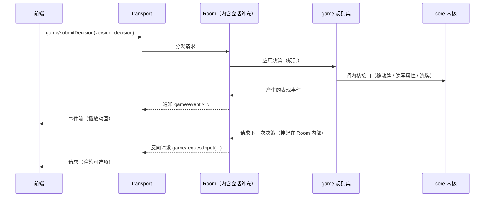

# 架构

## 1. 分层

```
前端（任意实现，默认浏览器 / TS）
    ↕ JSON-RPC（通用协议）
[transport]  帧编解码、连接生命周期、反向请求路由
[proto]      方法名 / 参数 / 返回结构的唯一定义（前后端共用事实来源）
[game]       规则集：项目根 `package/` 按包组织（现有 `基础` / `身份场` / `标准`），只拿注入的 `game`（**这一局的局对象**）与 `Card` / `Depends` / `Class` / `New` / `Extends` / `Delete` 环境函数、加一张共享袋 `rule`（**规则数值与内容数据都挂它**，见 9.7；工具集由默认包 `@tools` 提供）—— 需要的内核对象全从 `game` 取（依赖方向 `package/ → moe`）
[session]    会话外壳：会话容器 + 决策挂起/恢复通道 + 事件收集（`server/session/`）
[core]       内核模块组（`server/core/`）：牌 / 牌区（移动、洗牌；**五个基础区由内核建** —— `抽牌` / `弃牌` / `手牌` / `装备` / `判定`）/ 属性 / 随机源 / 桌子（座位与行动顺序）/ 玩家（牌区、标签）/ **局**（一张桌子 + 一个随机源 + 内核建好的基础牌区 + **这一局的规则内容** + **使用牌的机制**，见第 12 节）/ **效果族**（`core/effect/`：`Effect` 与它的全部子类 —— `Effect` 基类在 `core/effect/effect.lua`）/ 规则装载器（`core/loader/`）（**与游戏流程规则无关**，可直接单测）
[tools]      基础设施：event-loop / await / timer / log / json / inspect / uri / reload …
```

依赖方向只能自上而下，且门面全部**直接挂在 `moe` 上**（`moe.desk` / `moe.game` / `moe.loader` …，没有 `moe.core` 中间层；类名与类型注解**直接用类名本身**，不带命名空间前缀）；**门面（API 表）里只放工厂**（`moe.player.create(game, { … })`），类的方法只能从实例上访问（API 表的类型写成「类名.API」；门面由**模块自己建**：`moe.player = {}`，不再 `local API = {}` + `return API`）。**`core` 不得依赖任何具体规则集内容、会话、协议、网络与任何 IO** —— 它只提供「装载规则」的机制（加载器本身在内核模块组里）；这样内核可以脱离协议与网络被直接驱动。协议方法到规则操作的翻译层属会话/协议批次，目录名待定。

### 1.1 内核知道「功能」，不知道「规则」

「内核与游戏流程规则无关」说的是**内核不做规则的取舍**，**不是**「内核什么都不知道」。内核必须**认识每一项功能的形状**并把它表达出来，只是由规则决定用不用、怎么用：

| 内核必须知道（机制本身） | 内核不需要知道（规则的取舍） |
| --- | --- |
| 牌区有「谁能看见」这件事，且读得出来 | 哪些区域可见、谁看得见谁 |
| 玩家有座位，桌子有行动顺序 | 几人局、首回合谁先、什么条件下跳过人 |
| 牌能移动 / 洗牌、属性有上限 | 「杀」怎么结算、用掉的牌去哪、身份的取值 |

判据：**换个规则集，这个概念还存不存在？**

- 存在性不变、只是取值变（可见性、座位数、体力上限、行动顺序）⇒ **内核功能**：做成**一等字段 / 方法**（`zone.visible` 这类），取值由规则声明。
- 换个规则可能压根没有（「身份」、「弃牌堆」、「杀」这些名字与取值）⇒ **规则内容**：内核只搬运、不解释。

**落点是三层，不是「内核字段 or 标签袋」二选一**（用户 2026-09-30 提醒：规范早改了 —— 大量内核代码已挪进内容包，内容包也能给内核类注入方法与字段，见 9.6）：

| 落点 | 什么时候用 | 例 |
| --- | --- | --- |
| **内核字段 / 方法** | **内核自己**要读它才放这儿（读它才能干活） | `Zone.visible`（发 `'卡牌-进入区域'` 时要判可见性）、`Zone.game`（按定义查内容）、`Desk.players`、`Player.tags` |
| **内容包注入的字段 / 方法**（`Class 'Player'` / `Class('Judge', 'Effect')`，2026-09-28 起可用；用户口径：**少用 `setTag`、直接注入字段**） | 概念**内核不需要读**、但内容侧与协议要读 —— 「换个规则集就不存在」的东西住这一层 | `player.identity`（`身份场/身份.lua`）/ `player.dying`（`@基础/濒死.lua`）/ `player.hero` / `player.sex` / `player.kingdom` 与 `Player:setHero`、`Player:distance`、`Player:enterDying`；`Judge` 这类内容自定义的 `Effect` 子类 |
| **标签袋**（`Player:setTag` / `Effect` / `Phase`） | 只装**临时数据**：一次结算里挂的中间值 | 测试里的记数、结算过程里临时传递的值 |

判据不是「谁写进去的」，而是**有没有名字**：正式字段有类型、拼错编辑期可见、协议层知道该读哪个键；标签袋是任意键值袋，这三样都没有。于是两头都要说清：

- **「内核不认识它」不能当借口把功能塞进不透明袋子**（可见性若做成任意键值袋，表现层与协议没有任何人能知道该读哪个键）；
- **但「内核不认识它」也不等于要往内核加字段** —— 内容包自己注入即可，这正是「把内核代码挪进内容包」的做法（`Dying` 的判定、`HeroDef` 的牌面数据、`distance` 都这么挪的）。

反过来，内核给了字段也不等于在做规则判断，它只是**承载**这个功能。

据此，`Zone` 的通用 `params` 袋（2026-09-23 删）方向是错的：它把「功能性信息」降级成不透明数据。**实际照这个口径落地的是可见性**（2026-09-23）：`Zone.visible`（一等字段，默认 `true`）+ `Zone.owner`（玩家建区时自动记）+ `zone:setVisible(值)` / `zone:isVisibleTo(视角)` —— 内核给字段、内容侧给取值（哪个区是暗的、谁看得见）。**2026-10-09 把 `setVisible` 收成「名单」语义**（用户定：「完全按照参数语义」）：`true` = 所有人、`false` = 无人、给一名或一批角色 = **只有他们**；**`owner` 不再参与可见性**（原来的潜规则「暗区的持有者总能看见」去掉）⇒ 「手牌只对自己可见」现在显式写成 `setVisible(持有者)`，`isVisibleTo` 就是「名单里有没有他」。**`Zone.game` 也是同一形状的字段**（2026-09-24 用户让补上，**必填**）：`Zone:__init(game)` / `moe.zone.create(局)` / `moe.orderedZone.create(局, 随机源?)` 都要给局（与 `moe.desk.create(局, 座位数)` / `moe.player.create(局, …)` 同一口径；公共区由 `game:createZone` 传 `self`、玩家建区也是**建区时就传局**（`Player:addZone` 拿 `self.game`），`bindOwner` 只记归属者 —— 所以拿出来的 `zone.game` 不用判空），`'卡牌-进入区域'` 靠它查内容定义。

## 2. 启动与运行模型

- exe + `bin/main.lua` 引导（照搬 LuaLS 4.0.0）：引导脚本设好 `package.path`，再按参数决定进「服务模式」还是「测试模式」。
- 服务模式：建立 event-loop → 起 transport → 进入事件循环。
- 测试模式：**不建 transport**，直接 `require 'test'`（即 `server/test.lua`）加载测试套件。
- 空闲与等待：循环空闲时**阻塞等待到「下一个定时任务到期」**（没有定时任务则无限阻塞），等待 / 唤醒由 `bee.epoll` 承担（`server/loop-waiter.lua`）；停止走自唤醒通道，不靠轮询也不靠分片。
- **效果与等待**：一次结算 = 一个**任务**（`server/tools/task.lua`），效果体跑在它自己的协程里 —— 所以**结算体与时机回调里可以直接 `await`**（`moe.await.sleep` / `moe.await.yield`，恢复绑在**调用它的那个协程**上；应答方就是这么让出的），要等另一次结算结完用 `效果:await()`。**没有**「让出理由分派」与「让出逐层原样转发」这层机制（`Effect:suspend` 整层已于 2026-09-20 删除，理由：顺序请求、不会有外部打断）。

## 3. 协议设计原则（通用协议，一个后端对接多种前端）

1. **不出现任何前端概念**：协议只描述游戏语义与表现事件；贴图路径、动画时长、音效等由前端自行映射资源 id。
2. **方法命名**统一 `域.动作`（点号分层，如 `Player.Update` / `Player.UpdateCustom`）—— 落点是 `server/proto.d.lua` 的类型声明：**线上消息本身的形状**是 `JSONRPC.*`（通知 / 请求 / 结果 / 错误），**游戏消息**是 `Proto.Notify.<动作>`（`Proto.Update` = 一次玩家数据下发；可取消请求另有 `Proto.Cancelable` / `Proto.Notify.Cancel`），禁止散落在业务代码中拼字符串。
3. **后端权威、前端无状态**：目标合法性、距离、可用操作列表一律由后端计算下发；前端永不自行推导规则。
4. **两种下行数据各司其职**：
   - 事件流（notification）：一次操作产生的表现序列，供前端顺序播放动画。
   - 状态快照（request 的 result）：完整状态，用于开局、重连、纠错。前端不维护权威状态。
5. **需要玩家输入时由后端发起反向请求**（后端 → 前端的 request，前端回 result）。这天然表达「后端挂起等你」，也避免了前端轮询。
6. **每个决策带状态版本号**：后端在下发的请求里带 `version`（或 `seq`），前端提交决策时必须回带；后端据此拒绝过期输入。
7. **可重连**：重连由专门方法（如 `game/syncState`）返回全量状态 + 当前未完成的请求列表，**不依赖重放增量事件**。
8. **协议版本协商**：开局 `initialize` 交换协议版本与客户端能力（照搬 LSP 的做法），版本不匹配时明确报错而非静默降级。

## 4. 数据流（一次玩家操作）


```mermaid
sequenceDiagram
    participant FE as 前端
    participant TR as transport
    participant RM as Room（内含会话外壳）
    participant G as game 规则集
    participant C as core 内核

    FE->>TR: game/submitDecision(version, decision)
    TR->>RM: 分发请求
    RM->>G: 应用决策（规则）
    G->>C: 调内核接口（移动牌 / 读写属性 / 洗牌）
    G-->>RM: 产生的表现事件
    RM-->>TR: 通知 game/event × N
    TR-->>FE: 事件流（播放动画）
    G->>RM: 请求下一次决策（挂起在 Room 内部）
    RM-->>TR: 反向请求 game/requestInput(...)
    TR-->>FE: 请求（渲染可选项）
```

## 5. 重要边界

- 规则集只进 `package/`（项目根）；内核只进 `server/core/`；协议路由与序列化只进 `transport` / `proto`（翻译层目录名待定）。
- 引擎的随机源必须可注入：固定 seed 能复现整局（便于回放、复现 bug、写测试）。
- 事件流是**表现层契约**：一旦下发就应稳定，不能因为前端改需求而让引擎改逻辑。
- 跨线程 / worker 边界只传可序列化 plain data。

## 6. 无头可测（硬性要求）

- 「无前端也能跑完整对局」是验收条件，因此：
  1. 引擎 API 必须是可直接调用的纯 Lua 接口，不经过 JSON-RPC；内核（`server/core/`）的接口同样如此，**场景由调用方自己组合**（例如「发牌」= 抽牌取顶 + 放进手牌，内核不提供「发牌」）。
  2. 决策点走同一套「请求输入 → 挂起 → 恢复」路径，测试用「脚本化玩家 / AI」自动应答，而不是给引擎开测试专用后门。
  3. 另设一层协议契约测试：对 `proto` 里每个方法做编解码往返与错误分支验证，不必真的开 socket。
- 回归口径：改引擎必须能只用测试二进制跑完整对局并复现。

## 7. 外壳接口约定（headless-server）

`server/session/` 是当前唯一的「服务」层，只做容器：它不认识牌、阶段、胜负。规则与协议两边各接一个形状，外壳自身不用改。

### 7.1 逻辑处理器（挂在会话上的规则入口）

- 形状：table + `run(self, session)`（写作 `handler:run(session)`），**入口必须是异步函数**（可被协程承载），否则表现为「会话卡住不动」。
- 约定：入口内用 `session:requestInput(...)` 索取输入、`session:emit(...)` 上报表现事件、`session:finish()` 结束；入口**正常返回也视为结束**。
- 入口抛错：会话转「已中止」，原因可用 `session:getAbortReason()` 取到。

### 7.2 驱动者（给输入的一方）

只需三个动作，测试里的「脚本化驱动者」与将来的协议层实现同一形状：

| 动作 | 说明 |
| ---- | ---- |
| `session:getPendingRequests()` | 读当前**所有**在等的请求（快照，按登记顺序），形状 `{ kind, payload? }` |
| `session:submit(request, ...)` | 答复其中一条（把名单里拿到的那条给它），支持多个值；这条不在名单里时报错 |
| `session:cancelRequest(request, reason?)` | 取消其中一条，挂起方收到取消错误 |

- **可以有很多条请求同时在等**（互不干扰、各自带各自的超时）：`requestInput` 不再独占会话。会话结束 / 中止 / 销毁时，所有挂起方一起被叫醒。
- 事件的形状同为 `{ kind, payload? }`，`session:getEvents()` 返回只读快照（后续发出的事件不会影响已取得的快照）。
- `requestInput` 的第三个参数是超时（秒），超时会以错误交回发起方，不静默卡住。

### 7.3 会话阶段

`pending → running → finished / aborted → destroyed`。`finished`、`aborted`、`destroyed` 都是**终态**，之后任何生命周期操作（启动 / 结束 / 中止 / 提交 / 取消 / 发事件）一律报错；阶段常量在 `moe.server.Phase`。

### 7.4 主循环归属

`server.start()` / `server.stop()` **不接管事件循环**，只做状态标记与日志；主循环仍由入口负责 —— 服务模式由 `main.lua` 常驻，测试模式由 `test.lua` 控制。这样外壳的启停是同步的、可直接被测试驱动，也不会在测试里嵌套启动事件循环。

## 8. 热重载（`moe.reload`）

> **先分清两件不同的事**（用户 2026-09-19 明确要求）：
> - **热重载**（本节）= **开发期**工具：改代码（修 bug）后不重启进程。触发者是开发者。
> - **规则集重载** = **游戏业务**功能：运行期重新装置/切换规则集（清空规则表、重新加载规则集）。触发者是业务侧。
>
> 两者**定位、触发者、生命周期、影响范围都不同**，**不要互相替代、也不要把后者当成前者的一种用法**。规则集加载见第 9 节。

### 8.1 加载方式即边界

- `include 'x'` = **可重载**入口：与 `require` 等价，但会把模块登记进重载集合（登记顺序即加载顺序）。
- `require 'x'` = 一次性加载：**永不参与重载**。因此**不需要**任何名单 / 过滤配置来划分范围。
- **加载顺序由 `init.lua` 维护，模块内不要单独 `require` 自己的父模块**（用户 2026-09-28 定）：一组模块（`core/init.lua` → `core.effect` → `core.effect.*`）在 **`init.lua` 里按依赖顺序 `include`**（父模块写在子模块前面），顺序的真相源只有这一处；子类文件开头再 `require` 一次父模块是**多余的防御**（`include` 本身就是 `require` + 登记 ⇒ 那行只会命中缓存），而且会让人误以为「顺序是在文件里保证的」。内核里那 15 处（`core.effect.*` → `core.effect.effect` / `ask-card`、`ordered-zone` / `slot-zone` → `core.zone`）已于 2026-09-28 删掉。
- 目前只有内核（`core/`）用 `include`（`server/core/init.lua` 逐个登记）；`server/tools/`、`session/`、`loop-waiter.lua` 以及热重载自身一律 `require`，从根上避免基础设施被换掉。
- **日志先就绪**：`log` 实例与 `moe.env` 在 `server/moe-kill.lua` 里创建，位置早于任何 `include`，所以可重载模块里可以直接用 `log.*`，加载器也能用 `log.error` 报错。
- `package/` 规则集**不**走 `include` 也不走 `require`，而由自建加载器读文件执行（第 9 节），因此它从根上不参与热重载 —— 这不是「暂且如此」，而是设计要求。

### 8.2 接口

| 接口 | 说明 |
| ---- | ---- |
| `moe.reload.reload()` | 重载全部已登记模块，返回被重载的模块名列表 |
| `moe.reload.onBeforeReload(cb)` / `onAfterReload(cb)` | 重载前后回调，**返回撤销函数**；回调自动记录注册它的模块，该模块被重载时回调自动注销（不会重复堆积） |
| `moe.reload.isReloading()` | 当前是否正在重载（重载期间回调与模块加载都对真） |
| `moe.reload.getIncludeName(fn)` / `getCurrentIncludeName()` | 反查函数 / 当前加载属于哪个可重载模块（将来按模块清理 timer 与订阅要用） |
| `moe.reload.recycle(cb)` | 立即执行并在每次重载后重跑，同时在重载前回收它登记过的对象 |
| `include 'x'` | 加载并登记；失败**记日志（带堆栈）并抛出错误**（不再返回 `false`）；重载过程中的失败由 `fire()` 用 `pcall` 隔离，不会中断整轮重载 |

触发端（开发期文件监视、前端协议方法）本批**未实现**，只提供接口。编辑器侧靠 `.luarc.json` 的 `runtime.special` 把 `include` 当作 `require` 解析。

### 8.3 语义与限制

- **同名类合并**：重载时 `Class 'X'` 复用**同一张类表**（`tools/class.lua` 的 `declare` → `config:reset()`），因此**已存在的实例立即用上新代码**，无需重建对象。
- 限制一：**删除不生效** —— 合并只覆盖字段，源码里删掉的方法仍留在类表上。所以不要给公共方法改名或删除。
- 限制二：**老实例不会重跑 `__init`** —— 新代码若要求实例多一个字段，老实例没有它，读字段要容忍 `nil`。
- 模块级 `local` 只允许放**不可变常量与纯函数**（如 `random.lua` 的常量、`zone.lua` 的 `slotNameOf`）。
- 现状核对（2026-09-22）：`random.lua` 只有常量与纯函数；`zone.lua` 只有 `slotNameOf` 纯函数；`ordered-zone.lua` 与 `attribute.lua` 只有类表与模块引用 —— 内核已无模块级可变状态（原先唯一的例外「牌 ID 计数器」已改成**局实例上的字段**，见 8.4）。

### 8.4 跨重载存活的数据

必须存活的数据挂到「重载后仍是同一份」的载体上，写成「有则复用」：

```lua
moe._x = moe._x or <初值>   -- 挂在门面表上：写法必须是「有则复用」
```

- **载体一：局实例**（`game` 上的字段）—— 已建好的局跳重载照常可用、`__init` 也不会重跑，所以挂在局上的东西既不会丢也不会被换成新的。**发号器与阶段栈就是这么放的**：`game:nextId()`（局内递增、牌与将来的技能共用）、`game.phase` / `game.phaseStack`（当前阶段与嵌套栈）—— 两者都在 `__init` 里给初值、**不放进 `resetContent`**（重装规则集不应清它们）。属于某一局的数据一律用这个载体，不要往内核级状态上挂。
- **载体二：门面表 `moe`**：它是**内核级、跨局**的数据才开始考虑的地方；这张表在 `server/moe-kill.lua`（入口文件）里建立，而入口只执行一次、dev 重载只重跑 `include` 登记过的模块，所以它**永不重建**。**现在还没有这类数据**（上一条唯一的实例「牌 ID 计数器」已改成局上的字段）—— 要用时按上面的形状写「有则复用」，否则重载会把状态清掉。
- **命名用 `_` 前缀 + 赋值处标 `---@package`**：`_` 只表示「内核内部状态，不是对外接口」（`moe` 是普通表，框架不会碰它，`_` 本身没有语言含义）；真正能拦住跨文件用的是 **`---@package`** —— LuaLS 会把它当「只有这个文件可见」（实测：别的文件访问报「字段 `X` 只能在相同的文件 … 中才能访问」）。本工程没定义过「包」的边界，`package` 退化成按文件判定，与 `---@private` 同效。
- **不要挂类表**：`Class` 的 `Extends` 会把父类**非 `__` 开头**的字段复制给子类（并记入 `extendsKeys`），重载时 `Config:reset` 又把这份拷贝清掉 —— 挂在那种名字上会串到子类、还会在重载时被清掉。`__` 开头能躲开这两件事（框架自己就是这么用的：`__config` / `__getter` / `__keyMap`…），但那是**借框架的私有前缀**，不如压根不挂。
- **也不要挂模块门面**（`moe.card` 这类表）：门面由模块自己建（`core/card.lua` 里 `moe.card = {}`），而 `include` 就是 `require` + 登记、重载时会重新执行模块文件 ⇒ 门面每次都是**新表**，状态挂上去每次都被换掉。实例之所以跨重载照常可用，是因为它们持有的是**类表**（`M._classes` 复用同一张），与 API 表无关。
- `server/core/init.lua` 只写一串 `include 'core.card'`：登记 + 执行模块文件（门面由模块自己建）；`include` 失败会**抛错**（同时已记日志），所以这里不需要再包一层失败处理。

### 8.5 撤销与自动注销的分工

**自动注销是默认，disposer 是例外**（用户 2026-09-19 定）：

在**可重载**模块里注册、且跟着该模块走的东西，重载这个模块时会被自动注销，模块重跑时再自动注册 —— 这种**不要**写 disposer，否则每次重载都会多一层无谓的显式管理。

只有下面两类才需要显式处理：

| 场景 | 做法 |
| ---- | ---- |
| 注册发生在**不可重载**的模块里（回调的 `name` 为 `nil`，永远不会被自动注销，会一直留着） | 用 `onBeforeReload` / `onAfterReload` **返回的 disposer** 精确撤销 |
| 自动注销**盖不到、必须重建或显式释放**的资源（外部系统里的注册、timer、socket、缓存对象…） | 用 `onBeforeReload` **捕获**引用做清理，`onAfterReload` 重建；或直接用 `recycle(cb)`（立即执行 + 每次重载后重跑 + 重载前 `Delete` 登记过的垃圾） |

口诀：**能靠自动注销就不要写撤销；撤销只留给“注销不掉需重建”的资源。**

## 9. 规则集加载（`moe.loader` + `moe.game`）

> 定位：**游戏业务**功能 —— **一局游戏装哪套规则**。装载器（`moe.loader`）是**无状态**的机制：它把一套规则装进**某个局**；内容状态全在**局**（`moe.game`）上，所以改规则（含清空重载）只影响这一局。与第 8 节的**开发期热重载**仍是两条互不相干的通道：不共用登记、不共用回调、不互相替代 —— 区别只在于**装载器与局这两份代码本身**与其它内核模块一样可热重载。

规则集（`package/`）是**内容/数据**：加载方式是**读文件并执行**，MUST NOT 走模块系统（`require` / `include`），因此**被加载的规则集文件**不参与热重载，也不出现在 `package.loaded` 里。契约见 `server/test/rule/init.lua` 与 `server/test/rule/vfs.lua`（规格快照已冻结，见根目录 `AGENTS.md` 的「工作流」）。

### 9.1 落点与外观

- 装载器在 `server/core/loader/`：`init.lua`（`Loader` 模块：`install` / `declareDepends` / 名字路由 / 按预解析结果的执行）、`vfs.lua`（包来源合并成的虚拟文件系统）、`preparse.lua`（试跑）、`env-meta.lua`（纯类型文件：注入的 `game` / `Card` / `Depends` / `Class` / `New` / `Extends` / `Delete` / `rule` 与各时机上下文）。**局**在 `server/core/game.lua`（`Game` 类）。
- `server/core/init.lua` 里与其它内核模块一样 `include 'core.game'` / `include 'core.loader'`（门面 `moe.game` / `moe.loader` 由模块自己建；两份都可热重载）。
- `moe.game.create { seats, random, sources?, packages? }` 建**一局**并**立刻装好规则**：**桌子由局自己建**（`seats` = 座位数，建完就是 `game.desk`），除座位数与随机源外，规则表、包顺序、包元信息、**规则数据袋（`game.rule`）**、时机注册、属性系统、来源全挂在局上，**局之间互不影响**；`packages` 省略视同空清单 ⇒ 只装默认加载的包（见 9.3）—— 即 `create { seats, random }` 与 `create { seats, random, packages = {} }` 行为一致。要换规则走 `moe.loader.install(game, { packages = 清单 })`（省略参数就复用局上记的来源与清单）。
- **包手里的 `game` 就是那一局**：规则包要这一局的牌区 / 桌子 / 随机源就直接用注入的 `game`（`game:createZone` / `game.desk` / `game.random`）—— 不再有「规则实例」这一层，也不存在「实例与场地互指」（见 9.6）。
- 测试套件：`server/test/rule/init.lua`（加载/依赖/重装，`--test rule`）与 `server/test/rule/vfs.lua`（来源与合并，`--test rule.vfs`）；局本身在 `server/test/core/game.lua`（`--test core.game`）。

### 9.2 包来源与虚拟文件系统（`server/core/loader/vfs.lua`）

多个**来源**合并成一棵**逻辑目录树**，加载器只认逻辑路径。来源写法只有两种（`*` 是**特殊语法**，不是通配匹配，只允许出现在结尾）：

| 写法 | 含义 |
| ---- | ---- |
| `X` | X **本身**是一个来源，逻辑第一层 = X 的目录名 |
| `X/*` | X 是**包容器**，其下每个子目录各是一个来源，**容器名不进逻辑路径** |

两种写法归一成「逻辑路径第一层 = 来源目录名」，于是同名逻辑包天然对齐。

来源目录名以 `@` 开头时表示**默认加载**（`package/@基础` ⇒ 逻辑包名 `基础`，且默认加载）：`@` 只从**逻辑第一层**去掉，不进任何逻辑路径（也不会出现在清单 / 依赖 / 限定名 / 元信息里）；`@` 只允许出现在这一层 —— 包内的子目录名或文件名带 `@` 前缀会在**加载时报错**；目录名只有一个 `@`（后面没名字）也报错。

| 接口 | 说明 |
| ---- | ---- |
| `moe.loader.install(game, { sources?, packages? })` | 装一套规则进这个局：先清空局上的内容 → 按清单依次加载；返回**实际执行的文件（逻辑路径）**，按执行完成顺序 |
| `game.sources` / `game.list` | 这个局的来源（**顺序即优先级**，默认 `{ './package/*' }`）与上一次用的清单（`install` 写入，供省略时复用） |
| `game.loadedFiles` | 上一次装的时候实际执行过的文件（同上，随时可读） |
| `Depends { '基础规则/回合流程' }` | **规则集侧**声明依赖，只能出现在加载过程中 |

- **合并规则**：同一逻辑路径在多个来源里都有时，**只取最后一个来源的那个文件**（文件级覆盖）；不同路径取**并集**，同名目录的内容**跨来源合并**（不是整目录替换）。
- **不缓存**：每次 `install` 当场重新枚举并合并，运行期换包 / 加包立刻生效。
- 来源路径在磁盘上**不存在 ⇒ 报错**；`X/*` 匹配到 0 个包 ⇒ 允许；逻辑路径**归一化**（`.` / `..` 会折叠）在逻辑层面做，越出规则集根报错。

**三套机制的方向各不相同，别记反：**

| 机制 | 解决什么 | 排序方向 |
| ---- | ---- | ---- |
| 来源合并 | 用户**替换同一个逻辑文件** | 来源列表里**后者覆盖前者** |
| 规则数据（`rule` 袋，见 9.7） | 后续包**覆盖同一个字段** | 加载顺序里**后者覆盖前者** |
| 包路由（见 9.4） | 不同包**同名并存** | 清单里**先加载的包优先**（包内裸名则先取本包） |

### 9.3 清单与依赖项都是逻辑路径

- 清单项解析顺序：**文件 → 补 `.lua` 的文件 → 目录**（目录递归、只取 `.lua`、按路径排序保证确定性）；都不存在 ⇒ 报错。
- `Depends` 的项也是逻辑路径，且**支持相对路径**：以 `.` / `..` 开头的按**声明它的文件所在目录**解析，其余按逻辑根；归一化后去重（同一文件的不同写法只执行一次）。
- **清单是唯一入口**：加一个文件进清单即生效，从清单移除即失效。清单由**调用方**给：装配方用 `moe.game.create { seats, random, packages = ... }` 定下这一局要装的包，重装与临时脚本直接用 `moe.loader.install(game, { packages = ... })`。
- **互斥声明**：项以 `!` 开头（`Depends { '!国战' }`）表示「本轮不能有这一项」—— 它与依赖项走**同一套解析**（含相对路径）；判定「已加载」是本轮文件里有落在该项（包目录 / 文件）之下的（前缀匹配带分隔符，所以 `国战` 不会误判 `国战外传`）；**没被加载就不报错**；冲突时错误指出**声明者**与被排斥的项。校验做了两次：**执行前一次 + 结束前兜底一次**（任何清单顺序都拦得住）。
- **默认加载的包**：来源里带 `@` 标记的包（见 9.2）由加载器自动加入，且**排在清单项之前**（彼此按逻辑名升序，顺序确定）；清单里不必写它们，写了也不会执行两遍（「同一文件只执行一次」）。**内容包也不必为它们写 `Depends`**（自动装且排在最前 —— `package/身份场/胜负.lua` 就是直接 `game:on(...)` 开头）。要排斥它就用互斥声明（`Depends { '!基础' }`），没有「按名字关掉默认包」的开关。

### 9.4 包与名字路由

包 = **逻辑路径的第一层目录**（目录名即包名），包内子目录只作组织、不参与命名；规则集文件必须位于包目录里（**根下散落文件报错**）；包名与条目名都**不许含 `.`**（完整名由加载器拼）。

```lua
-- package/标准/卡牌/杀.lua
local slash = Card '杀'          -- 登记为 标准.杀
    : on('使用', function () end)
```

| 接口 | 说明 |
| ---- | ---- |
| `Card '名字'` | **只在加载过程中可用**（环境函数）：声明本包的一条定义；同包重复声明报错（报错指出两处来源） |
| `game:getCard('名字')` | 查询：裸名带**包内作用域**，限定名（`军争.杀`）精确取到指定包 |
| `Card:on(事件, 回调)` | 链式登记回调，返回同一条定义；**跨文件追加回调用 `game:getCard` + `Depends` 定顺序**。事件名是**固定集合**（`'卡牌-进入区域'` / `'卡牌-离开区域'` / `'使用'` / `'生效'` / `'被动'`），清单在 `env-meta.lua`；**: `event(名, 回调)` / `: globalEvent(名, 回调)`**（2026-10-09，`add-skill-event-decl` 的装备批；与 `SkillDef` 那对**逐字同形**）—— **声明式订阅时机**（可多次调）：`event` 订**这张牌的主人**头上那份（`owner:on`；**牌不在谁名下就不订**，也不报错——牌堆 / 弃牌堆里的牌照常启用被动）、`globalEvent` 订**局上**那份（`game:on`）；**只做订阅与生命周期**（启用时内核照声明挂上、停用 / 离场 / 换主人自动撤；与 `viewAs` 共用同一套生命周期，挂载顺序 = `'被动'` → viewAs → 「主人那份」→「局那份」），**载荷与返回值都原样转给回调**（第一参补上这张牌 ⇒ `(card, …载荷)`；`fire` 的返回值照旧拿得到，收集式时机也照常工作）。**「要不要发动」仍由回调自己写**（条件写在最前、`card:cast(…)` 起那次发动）⇒ 与手写 `on('被动')` + `host:bindGC(owner:on(…))` **逐字等价**，省的只是那两层壳。**回调里要主人就自己取**（`local zone = assert(card:getZone())` + `assert(zone.owner)` —— 订阅只挂在有主人的牌上，这两个断言都恒真，是**类型窄化**不是防御；取法照 `Card:cast` 内部）。**两条口径**：① 订主人与订局**不可互换**；② **`'被动'` 没有被取代** —— 它承载的是「**启用时做点什么**」（持续性修正：`武器牌` / `坐骑牌` 的 `addAttr`、【诸葛连弩】的 `addLimit`），不是时机订阅。类型面：内核时机的候选在 `env-meta.lua`、**内容侧（伤害 / 治疗 / 判定）时机的候选在 `package/@基础/meta.lua` 的 `CardDef` 块**（配方见 §9.6）。**2026-10-09 装备迁了 7 处订阅**（青釭剑 / 雌雄双股剑 / 方天画戟 / 贯石斧 / 麒麟弓 / 青龙偃月刀 / 仁王盾），保留 3 处持续性修正（`武器牌` / `坐骑牌` / 【诸葛连弩】） |
| 条目字段 | 定义对象是 `CardDef`，字段有 `name`（裸名）/ `package`（包名）/ `fullName`（`标准.杀`）/ `source`（声明它的文件）——字段叫 `package`，注解必须写成 `---@field public package string` |
| `Buff '名字'` | **只在加载过程中可用**（环境函数）：声明一只**状态**（挂在角色身上的东西，写法与 `Card` 同形）；同包重复声明报错。`game:declareBuff` / `game:getBuff` 与牌那套**同形**（按包存、`resetContent` 清、裸名解析同样三条） |
| `Buff:on('获得' / '失去', 回调)` | 链式登记回调（回调收到 `buff` 实例）；事件名固定，清单在 `env-meta.lua`。**资源与订阅一律优先用 `buff:bindGC(...)`**（`Zone:disable()` / `game:on(...)` / `Player:addLimit(...)` 这些撤销函数直接喂给它），**「失去」只留给「真的需要知道」的场合**（用户 2026-09-29 定） |
| `player:addBuff('名字', 载荷?)` | 把一只状态**挂到某人身上**（同名可并存）：挂上 → 发 `'获得'` → 返回 `Buff` 实例；`buff.owner` 读挂在谁身上，`buff.payload` 读**挂上时给的载荷**（内核只存不解释，给内容侧自己约定 —— 如【青釭剑】给「这次使用」，好让状态自己知道该在谁收尾时消掉），`buff:remove()` 失去（幂等，内部就是 `Delete(self)`）；`player:getBuffs()` 给快照、`player:hasBuff(名字)` 给真假。**生命周期归内容**（内核不预设时长）—— 常用两种：状态自己订阅时机删自己，或**让某次结算／某个对象持有它**（`useCard:bindGC(buff)` = 那次结算被删时连带删掉，作业兜底）；失去的顺序是「先发 `'失去'`（此时实例与字段都还在）→ 从宿主摘掉 → 再放掉 `bindGC` 的东西」**「延时类效果」就落在这条上**（2026-10-09，【许褚】裸衣）：效果主体写在一只状态里（`'获得'` 里 `bindGC` 订阅）、**寿命交给持有者**（`turn:bindGC(buff)` / `useCard:bindGC(buff)`）—— **载体不是技能 ⇒ 技能失去 / 无效也照旧执行**（规则集 Ch1/S2 的「触发类效果」） |
| `player:addSkill(名字)` | 让某个角色**拥有一个技能**（2026-09-30，`add-skill-effect`）：没有定义就报错；建 `Skill` 实例（`Skill : GCHost`，字段 `name` / `owner`）并登记进玩家，**挂上即启用**（跑一次 `'被动'` 钩子、给它一个容器 `host` —— 内容侧 `host:bindGC(…)` 订阅 / 建状态，**与装备技能那一套逐字同款**）；`skill:disablePassive()` / `enablePassive()` 停用与恢复（**技能被克制 / 封印**时用，对称、各返回 disposer、层数计数）；`skill:remove()` 摘掉（幂等，内部 `Delete(self)`）、容器跟着放掉；`player:getSkills()` 给快照、`player:hasSkill(名字)` 给真假。**装武将时自动挂技能**（2026-10-01，`mount-hero-skills`）：`Player:setHero` 与 `Player:setIdentity` 都调 **`Player:refreshSkills()`**（住 `@基础/武将.lua`）—— 按「当前武将 + 当前身份」重算（挂上缺的、摘掉不该有的），**主公技只在 `identity == '主公'` 时才挂**（官方口径是「不为主公，其**没有**此技能」） |
| `Hero '名字'` | **只在加载过程中可用**（环境函数）：声明一个**武将**（牌面数据：姓名 / 性别 / 势力 / 体力 / 技能名）；同包重复声明报错。`game:declareHero` / `game:getHero` 与牌那套**同形**（按包存、`resetContent` 清、裸名解析同样三条）。**武将名与牌名是两个命名空间**（同包同名不冲突；预解析的条目校验不管武将 —— 与 `Buff` 同，`Hero = function () end`） |
| `game:getHeroes()` | **这一局装了哪些武将**（2026-10-09，`add-hero-select`）：快照、**按完整名排序**（顺序稳定 ⇒ 同一个随机源可复现）；选将的池子就是它（**没有「公共模板 / 抽象武将」这类东西** ⇒ 列出来的全是能给玩家的真武将） |
| `HeroDef`（链式） | 武将牌面（内核只存不解释）：`: skills { '奸雄', '护驾' }` / `getSkills()`（**技能名列表** —— 技能定义与装配下一批）、`: value(名字, 值)` / `getValue(名字)`（自带数据）。**势力 / 性别 / 体力三样（链式写法与读法）全都住内容侧**（`@基础/武将.lua` 给 `HeroDef` 加字段与方法：`: kingdom '魏'` / `getKingdom()`、`: sex '男'` / `getSex()`、**: `hp(4)` 或 `hp(3, 1)` 写声明值**（底本 Chapter2/Section4：初始体力值可以不等于上限）/ `getHp()` —— 依次取 定义 → `rule.defaultHp` → 5；用户 2026-09-30 定）—— 内核只管「定义本身」、连字段也不占、不知道取值口径。**写**是链式方法、**读**是方法（定义字段私有，与 `CardDef` 同）；单参数的字面量不带括号（与 `: addKind '武器'` 一致） |
| `Player:setHero(hero)`（**内容侧**，`@基础/武将.lua`） | **把一张武将装到这名角色身上**（2026-09-30，`add-hero-setup`）：写 `player.hero` / `player.sex` / `player.kingdom`，并把武将的初始体力上限与初始体力值写进属性（`setAttr` **覆写**）；体力走内容侧的 `hero:getHp()`（依次取 定义 → `默认体力` → 5）。**落点在内容侧**的理由：要写「体力上限」这个属性名，而属性名是内容侧的（内核不预设属性名）—— 照 `Player:distance` / `Player:equipCard` 的先例用 `Class 'Player'`。**装配顺序的口径：先选将、后走开局**（主公 +1 那类加成是 `addAttr` 增量，排在后面才对；`setHero` 用 `setAttr` 覆写基础值）；`@基础/体力.lua` 的默认值已经只给「还没选武将」的角色 ⇒ **两种顺序结果一致**。**技能挂载不在本批**（技能系统落地后接进 `setHero`）。**牌面数据（势力 / 性别 / 体力）的声明与读法都在内容侧**（见上一行）；**体力在角色上的便捷读法**也在同文件：`player:getHp()`（当前）/ `getMaxHp()`（上限）/ `getLostHp()`（缺失 = 上限 − 当前，官方「已损失体力值」） |
| `Skill '名字'` | **只在加载过程中可用**（环境函数）：声明一个**技能**（名字 / 自动同意 / 标签）；同包重复声明报错。`game:declareSkill` / `game:getSkill` 与牌那套**同形**（按包存、`resetContent` 清、裸名解析同样三条）。**技能名与牌名、武将名是三个命名空间**（同包同名不冲突；预解析的条目校验不管技能 —— 与 `Buff` / `Hero` 同，`Skill = function () end`） |
| `SkillDef`（链式） | 技能定义（内核只存不解释）：`: auto(布尔)`（**「自动同意」的默认值** —— 被动触发时要不要问，**不写就是每次问**；`Skill` 实例上的 `auto` 可读可写）、`: tags { '锁定技', '主公技' }`（可多次调、取并集）/ `hasTag(名字)`（**「觉醒技」视为附带锁定技与限定技**，底本 Chapter2/Section5）/ `getTags()`（快照）。**「自动同意」与标签是两个正交维度**（它只是玩家的偏好默认值；「是否必须发动」由技能自己写 —— 强制发动的技能根本不调 `confirm`）。字段私有、写是链式方法、读走方法（与 `HeroDef` 同）；**: `on(钩子, 回调)` / `getHandlers(钩子)`** —— **钩子有两个**：`'被动'`（每次**启用**跑一次、回调收 `(skill, host)`）与 **`'使用'`**（主动发动时跑一次、回调收 `(skill, cast)` —— 2026-10-08，`ask-use-skill`），内容侧在那里 `host:bindGC(owner:on(…))` 订阅 / 建状态（与装备技能的 `'被动'` 同一套；2026-09-30，`add-skill-effect`）；**`Skill:confirm()`**（实例方法，2026-10-01）：自动同意开着直接放行、否则 `askChoice(owner, 技能名, { '发动' })` —— 技能自己决定在哪儿问（强制发动的技能不调它）；**`Skill:tryCast(函数)`**（2026-10-09）：`confirm()` + `cast()` 的**合并写法** —— 问一句、同意才起那次发动，不同意返回空（**用它可以彻底避乱嵌套顺序**：「先 confirm、再 cast」是惯例，写成嵌套就反了）；**`Skill:cast(函数)`**（2026-10-01，`add-cast`）：把那段包成一次「技能发动」⇒ **里面起的结算都挂在它下面**（归因 —— 「这次挪牌是哪个技能做的」沿 `parent` 链查得到），见第 12 节的 `Cast` 行；**: `event(名, 回调)` / `: globalEvent(名, 回调)`**（2026-10-09，`add-skill-event-decl`）—— **声明式订阅时机**（可多次调）：`event` 订**主人头上**那份（`owner:on`）、`globalEvent` 订**局上**那份（`game:on`）；**只做订阅与生命周期** —— 启用时内核照声明挂上、停用 / 离场 / 被克制自动撤（与 `viewAs` 共用同一套生命周期，挂载顺序 = `'被动'` → viewAs → 这两个），**载荷与返回值都原样转给回调**（第一参补上技能自己 ⇒ `(skill, …载荷)`；`fire` 的返回值照旧拿得到，收集式时机也照常工作）。**「要不要发动」仍由回调自己写**（条件写在最前、`skill:tryCast(…)` 起那次发动）⇒ 与手写 `on('被动')` + `host:bindGC(owner:on(…))` **逐字等价**，省的只是那两层壳（**「先 `confirm` 后 `cast`」仍靠 `tryCast`**）。**两条口径**：① 订自己与订局**不可互换**（【鬼才】那种「不分敌我」的必须 `globalEvent`）；② **`'被动'` 没有被取代** —— 它承载的是「**启用时做点什么**」（`addAttr` / `addLimit` 这类持续性修正：【马术】【咆哮】），不是时机订阅。类型面：内核时机的候选在 `env-meta.lua`、**本包（伤害 / 治疗 / 判定）时机的候选在 `package/@基础/meta.lua` 的 `SkillDef` 块**（配方见 §9.6）。**2026-10-09 同一批把武将技能全迁完**（11 处订阅）；装备侧 20 处（`CardDef`）另批 |

**「挂谁」= 「活多久」**（2026-10-09 收口，`add-lubu`；用户问「怎么降心智负担」时定的口径）：可叠加操作一律返回 disposer，而**它挂到哪个对象上就活到那个对象被收掉**（`GCHost` 的 `bindGC`）—— 本回合 `turn:bindGC(...)`（`@基础/回合.lua`）、本阶段 `phase:bindGC(...)`（【裸衣】【英姿】【突袭】）、**这次使用 `useCard:bindGC(...)`**（【青釭剑】的 `防具无效`；【无双】把「响应时多要一张」的订阅挂这儿）、这次发动 `cast:bindGC(...)`（**只到 body 跑完** —— `Cast:settle()` 就是 `return self.body(self)`，想活更久就得换宿主）、一段状态 `buff:bindGC(...)`、被动 / 装备 `host:bindGC(...)`。**两条判据**：① 写「这次使用怎么结算」就挂 `useCard`（与「本阶段怎么结算」挂 `phase` 同形）；② **「失去技能不中断」= 别挂 `host`** —— `skill:disablePassive()` / `remove()` 会把被动容器整个 `Delete`，挂在它上面的订阅随技能一起没（官方规则集 Ch1/S2：已发动的效果不因中途失去技能消失）。**内核不给这类规则开专属字段**（曾考虑 `useCard:setResponseCount` 之类，用户 2026-10-09 否：每条新规则都开一个口子不可持续，而且内核得替内容解释语义）—— 通用解法就是「**订阅挂到正确的宿主上**」。

**裸名的解析顺序：**

1. 查询发生在**包内**（加载过程中、当前上下文有所属包）→ **先取本包**；
2. 本包没有 → 按**包的加载顺序**（清单顺序）取**第一个**定义该名字的包；
3. **包外**（游戏运行期、内核、测试，没有「当前包」）→ 直接从第 2 步开始。
所以：包内写裸名 = 本包版本；**引用他包的同名条目必须写限定名**（军争里想用标准版的「杀」要写 `标准.杀`）。裸名与限定名拿到的是**同一个对象**，不是副本。

### 9.5 依赖 = 执行到那行时同步加载完

`Depends { ... }` 在执行到该行时立刻把依赖加载完，再继续本文件剩余的代码 —— 所以**依赖声明写在文件顶部**（不必预扫描源码文本，避开了字符串/注释里的假匹配）。
去重与防环靠「本轮已加载 / 正在加载」集合：同一文件在本轮只执行一次，互相依赖不会无限递归。

### 9.6 规则集侧的书写环境

- 加载时用 `load(chunk, '@' .. 路径, 't', env)` 把 `game` / `Card` / `Depends`（以及 `Class` / `New` 与共享袋 `rule`）**注入**执行环境，所以规则集文件**不需要 `require` 任何东西**；以 `@路径` 作 chunkname，报错与堆栈里显示真实文件路径（中文路径同样可用）。
- **内核注入的是这七项 + 一份白名单**：`game`（**这一局**，小写对象）+ `Card(name)` / `Depends(items)` / `Class(name)` / `New(name)` / `Extends(类, 基类)` / `Delete(对象)`（**大写环境函数**，只在本轮加载期可用；大写是为了和包里的局部变量区分开）+ 一份**标准库白名单**（`string` / `table` / `math` / `utf8` / `pcall` 等基函数；**`error` 不在里面**，2026-09-28 用户定 —— 内容侧要报告「该有却没有」用 `assert`，且**只在「触发 = 这局打不下去」时用**；写错调用就地退化、不抛）；`moe`（含 `moe.core` 这类写法）、`require`、`io`、`os` 一律不给 —— 规则集是内容，不该具备开文件 / 起进程的能力。
  - **工具集不在这里**：内容侧要什么工具，就在默认包 `@tools` 里**用内容侧写法按需实现**（写下的全局在共享环境里别的包直接就能用）—— 现在是 `table.lua`（`table.filter` / `map` / `contains` / `without` / `mergeArray` / `copy`）与 `util.lua`（`util.defer`）。**不把内核的 `moe.util` 整份注入**（用户 2026-09-28 提了又改口，与 2026-09-19 的结论一致）：它带 `loadFile` / `saveFile` / `expandPath` 这类副作用，等于给内容侧开文件 IO。
  - **包可以给内核类加方法、也可以自定义「一次结算」**（用户 2026-09-28 解锁）：注入的 `Class` / `New` **就是内核那两个全局**（`moe-kill.lua` 里 `Class = class.declare`、`New = class.new`），包照内核的写法用。两种用法：
    - **给已有类加方法**：`---@class Player` + `local M = Class 'Player'` + `function M:distance(to) … end`（首个应用 = `@基础/距离.lua`）。
    - **声明自己的 `Effect` 子类**：`Class('Judge', 'Effect')` —— 第二个参数就是 super，**不需要 `Extends`**；实例化用内核那套**两步**写法 **`New 'Judge' (参数…)`**（先取实例、再调用它跑构造链；`New` 的第二个参数是「实例存储表」，**别往里传东西**）。第一个用户是 `@基础/判定.lua`（判定整个搬出了内核）。
    - 三条口径：① **开 `Class` / `New` / `Extends` / `Delete` 四个口子**（2026-10-09 加后两个：【许褚】要把「本回合伤害 +1」这只延时状态挂到回合对象上，而 `Turn` 是内容侧声明的类 —— 得能 `Extends('Turn', 'GCHost')`（拿到 `bindGC`）、也得能 `Delete(turn)` 才放得掉）；`Type` / `Presize` 仍不注入（用例断言它们够不着）；② **没有护栏**（不走收口函数就没地方挡），靠三条提醒 —— 别用 `__` 开头的名字（框架私有）、别与 `__getter` / `__setter` 同名（会把派生属性读成函数）、别给「实例已有同名字段」的对象装同名方法（类方法会被实例字段遮蔽、永远读不到）；③ **生效范围是 VM 内全局** —— 类表与类注册表一个 VM 里只有一份 ⇒ 对**这个 VM 里的所有局**生效，等「一局一个 VM」落地（`add-worker-mode`）自然变成「这一局」。另有两件要知道的：`Extends` 会把它**复制给子类**（装到 `Zone` 上的会出现在 `OrderedZone` 上）；**类型面基本不用手写注解**（与内核同形即可推断），实测三条 —— `---@class Player` 就够、**不用**写 `: Class.Base`；**派生字段要用 `---@type` 声明**（如内核 `M.acting = nil`），否则读的地方报「未定义的属性/字段」；函数写了 LuaDoc 就要把**每个**返回值都标 `---@return`。
  - **白名单里表值的那几项是「内容侧的副本」**（用户 2026-09-21 定）：`table` / `string` / `math` / `utf8` 在每轮装载时各**浅拷贝**一份（只拷一层，够用 —— 扩充都是往表上挂新函数），所以内容侧改它们**只影响内容侧**，内核的标准库一点不动；**重装换新副本**（上一轮加的函数自然消失）。机制就 `makeEnv` 里那三行 `if type(value) == 'table' then`（拷贝而不是元表代理）。
  - **工具集是对（内容侧）标准库的扩充**（用户 2026-09-21 定，**不是内核注入的** —— 工具集与游戏规则无关）：默认包 `@tools` 往**内容侧那份 `table`** 上加四个纯函数 —— `table.filter(列表, 判定)` / `table.map(列表, 变换)`（回调收 `(值, 下标)`）/ `table.contains(列表, 值)` / `table.without(列表, 值)`（去掉这个值的所有出现、**返回新列表**），**清单与签名以 `package/@tools/table.lua` 为准**。好处：名字自明（不用再纠结工具集该叫什么），也不用为它另开一个全局。代价：**没装 `@tools` 的局仍然有 `table`，只是没有这三个函数**（用 `Depends { '!tools' }` 排斥它、或来源里没有这个包时）；靠默认包顺序（`tools` 按逻辑名排在默认包最前）保证规则包加载时它已经就位。**它和别的内容全局一样不在「每文件刷回」的保护名单里**（只有内核注入的 `game` / `Card` / `Depends` / `Class` / `New` / `rule` 受保护）⇒ 哪个包把它覆盖 / 改写了，由那个包**负全责**（用户 2026-09-21 定，不额外加保护）。要加新函数先过一遍「它用得着沙箱外的东西吗」；将来要加 `string` / `math` 的助手按同一套路再开一个文件（`@tools/string.lua`…）。**旧的「工具集里只有纯函数」那道纪律自然消解了** —— 助手就写在沙箱环境里（`io` / `os` / `moe` 都够不着），想写带副作用的助手也写不出来。
- **整轮装载共用一份环境**（用户 2026-09-21 定）：文件之间**不是**各自一份 env —— `ctx.env` 一次装载只建一份，于是**包 A 里写的全局函数包 B 直接就能用**（这就是「内容侧共享函数」的通道；顺序 = 加载顺序，要定序就用 `Depends`）。三件配套的事：① **注入的 `game` / `Card` / `Depends` 在每个文件加载之前都会刷回** ⇒ 某个包把它们改坏了也不影响后面的文件（别拿它们当全局变量用）；② **重装换新环境** ⇒ 上一轮写的全局自然消失（与规则表 / 规则数值同一生命周期）；③ **试跑那一趟也共用一份**（语义与真跑一致，否则「文件 B 调文件 A 的函数」会在试跑里假报错）；④ **跨包共享的规则数据（含规则数值）挂 `rule` 这个袋**（2026-09-29 起：**装载器每轮装载给一张新的空表**，与 `game` / `Card` / `Depends` / `Class` / `New` 同属注入项 —— 每个文件加载前一起刷回，所以某个包把 `rule` 整个换掉也不影响后面的文件；类型声明在 `env-meta.lua`，字段由内容侧自己加）—— 现在有 **`rule.equipZones`**（装备子区名单）与 **`rule.ownZones`**（「自己的区域」= 手牌 + 装备子区，2026-10-08 加 —— 凡「一张你的牌」都读它：素材 / 弃牌 / 桃，**判定区不在其中**；见第 12 节装备子区那一行；`@基础/装备.lua` 建它俩、别的包在加载期往后追加 `equipZones`）；比一堆裸全局好找、也能给类型（**大写开头还免掉 `lowercase-global`**）；**内核不认识里面的东西**，重装换新袋。
- **沙箱口径不变**：共享的只是「内容自己的全局命名空间」——白名单仍是 `ALLOWED_GLOBALS` 那份清单（除 `_VERSION` 外就是基函数；其中四个表值是**副本**，见上），**没有** `__index = _G`（`moe` 是全局变量，一挂 `_G` 沙箱当场漏），所以 `moe` / `require` / `io` / `os` 仍拿不到。
- **工具集住在内容侧**：`table.*` 那四个是内容侧写法的**扩充**、不是替代（清单以 `package/@tools/table.lua` 为准）；`util.defer` 是**没有标准库可挂**的助手（`package/@tools/util.lua`）；内核那份 `moe.util` 仍不给（见上一条）。
  - **泛型要标在实体函数上**（2026-09-21 实测）：LuaLS **不支持** `---@field f fun<T>(…)` 这种写法（泛型参数会被丢掉），**给标准库补字段也一样** ⇒ 工具集写成 `---@generic T` + `function table.filter(…)`（**实体函数**），于是调用点带 `<T>`，**跳文件也认**（`杀.lua` 里 hover 得到 `fun(list: <T>[], predicate: fun(value: <T>):boolean) -> <T>[]`）。推论：`meta.lua` 只用来放**赋值处表达不出来**的类型（`---@alias`、按名收窄的 `---@field`）；能标在实体函数上就别进 meta，否则反而把泛型压平。
- **规则包需要的内核能力由 `game` 收口**（用户 2026-09-19 定）：`game:getAttributeSystem()` —— 属性系统由**那一局**持有（一局一份；清空重装时置空 ⇒ **重装后是一个全新的系统**：属性定义是规则集内容，属性库也不允许编译后再 `define`）；包在**加载期**往它上面 `define`，装配方再用 `createInstance()` 给玩家建属性实例。
- **一局的资源直接用注入的 `game`**：牌与牌区是运行期的东西，按名字建在局上（`game:createZone(名字, 有序?)` / `game:createCard(名字)`），桌子与随机源是局上的公开字段（`game.desk` / `game.random`）—— **只认字段，没有 getter**（一个概念不要两套 API）。**环境对象就是 `game` 本身，不进时机上下文**（见第 10 节）。
  - 分工：**五个基础牌区由内核建好**（局上 `抽牌` / `弃牌`，玩家身上 `手牌` / `装备` / `判定` —— 建玩家时就有；见 12 节的「基础牌区」）—— 包**不要重建同名区**（撞名当场报错）；要加**自己**的区才用 `game:createZone(名字, 有序?)` / `player:addZone(名字)`。
- **装配方不受限**：测试与将来的房间 / 流程直接用 `moe.*` 组合开局（它们不是包）。
- 规则集文件里**可以用中文标识符**（构建期补丁，见 `infrastructure.md`），但**中文只用于难翻译的内容名**：技能名 / 卡牌名 / 身份名，以及作为数据取值与配置键的名字（`'杀'`、`'体力上限'`、`'游戏-开始'`）；**字段名 / 局部变量 / 函数名一律英文**（详见 `code-style.md` 第 8 节）。
- 规则集里**不要为空值防御**：注入的 `game` 按约定一定拿得到（它就是这一局），直接用；只有**运行期真的会缺**的才 `assert`（如没牌表、人数不在配置表里 —— 内容侧拿不到 `error`，见 9.6）。见 `code-style.md` 第 9 节。
- 这两个环境函数与各时机的上下文类型写在一份**纯类型文件** `server/core/loader/env-meta.lua`（顶部 `---@meta`，不参与运行）：见 9.7 与第 10 节。
- **包自带 `meta.lua`**（用户 2026-09-21 定）：包目录下可以放一份**纯 LuaDoc** 文件（固定叫 `meta`，不跟内容命名走 —— 它是**纯代码功能**、不是规则内容），用来声明**这个包自己的概念**：`---@alias`（如 `身份场.身份`）、以及给内核类**追加按名收窄的签名**（`game:getValue('身份配置')` → 配置表、`game:getValue('默认体力')` → `integer`、`player:getAttr('体力')` → `number`）。**装载器不特殊对待它**（就一个普通文件，里面只有注释 ⇒ 执行是空操作）【约束：它里只放类型声明】。
  - **配方（三处坑）**：① 给某个名字加候选时**必须自带兜底条**（`name: string` / `key: string`）—— **不带兜底时那条声明会把同名的其它候选（含内核那份、别的包那份）一起挤掉** ⇒ 表现是「新老候选都不解析」（实测 2026-09-21：漏写时全仓 27 处 `getTag('顺序')` 报「不能将 `string` 赋给参数 `'身份'`」；反例 2026-09-30：`@基础` 里给 `Player` 加 `'伤害-目标-结束'` 而没带兜底时，同表的 `'伤害-来源-开始'` 也推不出参数，补上就两条都好了）；② 重声明类时**基类要写全**（`---@class Player: Class.Base`）；③ **按名收窄的宿主有几个、回调形状是否相同**（2026-09-30 实测后收敛）：**形状相同**才值得抽一个公共类让各宿主继承（`self` 写 `any` 就能共用），省下同一批候选写两遍；**形状不同就各写一块** —— 形状不同注定要各写一条候选，而**兜底必须跟着候选一起写**（见 ①），合并只是多一层间接。实测：`Player:on` 的回调收纯载荷、`SkillDef:on` 的回调多收一个技能实例 ⇒ 两条候选写在各自的类块里（`---@class Player: Class.Base` / `---@class SkillDef`），参数都推得出来；且**内核那批收窄照常生效**（跨文件是**并存**，不互相挤掉）。
  - 实测的良性质：**多个包各自的候选共存**（`@基础` 的 `'默认体力'` 与 `身份场` 的 `'身份配置'`同时对 `getValue` 生效）、**跨包读也收窄**（`身份场` 读 `@基础` 的值拿到了 `integer`）、重声明**不会弄丢**内核那份类声明里的其他字段。
  - 所以**包作者可见的类型面变成两处**：内核的通用面（注入的 `game` / `Card` / `Depends` / `rule`、各时机上下文）在 `env-meta.lua`；**各包自己的概念**在它自己的 `meta.lua` —— 或者直接标在实体函数 / 赋值处（泛型只能这么标；`@tools` 的 `table` 助手就是直接标在 `package/@tools/table.lua` 上，没进 `meta.lua`）。

### 9.7 规则数值与内容数据（共享袋 `rule`）

规则包里定的默认值（体力上限、身份人数表、牌表…）放**共享袋 `rule`**：装载器**每轮装载建一张新表**、注入给所有内容文件（试跑那趟也给一张空的），**字段名扁平、用英文**（`rule.defaultHp` / `rule.cardTable` / `rule.identityConfig`…）—— 字段名即落点，**这就是后续包（mod）改规则的通道**。

```lua
-- package/@基础/配置.lua
-- 没写武将的角色默认的体力上限（也是初始体力）
rule.defaultHp = 5
```

- **按加载顺序后者覆盖前者**：这是有意提供的**覆盖通道**（例：军争要改血量上限就再写一份配置），与包路由的「同名并存」是两套语义。
- **读的时候才取**，不在文件顶层抄一份 ⇒ 改字段、就地改表内容、整张换掉，都当场生效（阶段清单 `rule.phases` 也是这么读的）。
- 与内容同生命周期：清空重装时换一张新的空袋（`game.rule` —— 与注入的全局 `rule` 是同一张表，局外也读得到）；读不到的默认值写在规则包里，读时 `or 默认`。
- **函数不进共享袋**：行为（如「游戏开始时分身份」）走**时机注册**，不要存回调。
- 类型声明：向 `Loader.Rule` 上补 `---@field`（**写在提供该字段的那个包的 `meta.lua` 里**，一行中文说明；字段一律可空 —— 袋建出来时是空的）。
- **`game:setValue` / `getValue` 保留，但只当临时数据**（2026-10-09 起）：测试探针、将来的房间数据这类「不是规则数值」的东西才用它；规则数值一律写进 `rule`。

### 9.8 定义入口与重装语义

```lua
local slash = Card '杀'
    : on('使用', function () end)
```

- `Card '名字'` = 声明（名字不含 `.`、完整名由装载器拼）；`Card:on(事件, 回调)` 链式登记；查询用 `game:getCard`（未登记得到 `nil`）。
- **环境函数 与 局上的方法**：`Card '杀'` / `Depends { ... }` 是注入环境的**大写函数**，只在**本轮加载期**可用，作用在正在装的那个局上；内容入口（`game:getCard` / `game:getValue` / `game:on` / `game:fire` / `game:getAttributeSystem` / `game:getPackageMeta` …）在加载期与运行期都能用，重装走 `moe.loader.install`。
- **重装 = 清空局上的内容 + 重新加载**：不做增量、不做按名单卸载（用户 2026-09-19 定），重复加载同一份清单会**重新执行**所有文件；包顺序也随清单重新算。桌子 / 随机源 / 牌区**不参与清空** —— 重装只动规则内容。
- 规则表结构是「包名 → 裸名 → 定义」+ 一份包顺序表；**同一轮加载里还能注册时机回调**（见第 10 节），它们与规则表一样随清空重装清空。
- 目前只有「牌」一类，结构按功能点增量长；卡牌的事件名与回调签名**做「杀」时再定**。

## 10. 时机与事件（`moe.event` + `game:on`）

规则集要能**挂到时机上**（`'游戏-开始'` 时分身份、改体力上限，回合各阶段触发技能…）。机制在内核模块组、实例由**局**持有：

| 接口 | 说明 |
| ---- | ---- |
| `Event:on(名字, 回调)` | 按时机名注册，返回 disposer；**注册顺序即执行顺序** |
| `Event:fire(名字, ...)` | 按名触发；未注册 = 空操作；单个回调报错不打断其余（`xpcall(回调, log.error, ...)`） |
| `Event:collect(名字, ...)` | 按名触发并**收齐所有非空返回值**（每个回调只收第一个返回值；没返回 / 报错的不收）；未注册 = 空列表。与 `fire` 的分工见下 |
| `Event:has` / `getNames` / `clear` | 查询与清空 |
| `game:on(名字, 回调)` | 注册时机（**唯一入口**：内容包 / 内核 / 用例都用它），返回 disposer |
| `game:fire(名字, 上下文)` | 触发：给**装配 / 流程代码**与无头测试用；内容包不主动触发 |
| `player:on / fire / collect` | **玩家自己的时机表**（2026-09-29 落地）：与局同形、同一个 `Event` 实现 —— 技能挂在它身上，**只在自己被问到那一方时才醒来**（「装备 / 技能归属」变成了订阅信息的一维）。**第一阶段事件已按当事人发**（2026-09-29）：`'阶段-开始'` / `'阶段-生效'` / `'阶段-结束'` **全局那份照旧**、再对 `phase.player` 发一份（**同名**、全局先）；其余事件（回合 / 摸牌…的定向）将来另做 |

- 实现是「时机名 → `moe.sevent`」的薄封装（`server/core/event.lua`），顺序与错误隔离都沿用 `simple-event`。
- **实例由局持有**（`game.events`）并在**每次装载时重置** —— 于是注册的生命周期天然等于一轮装载，清空重装不会残留旧回调，也不会串到别的局。**玩家还有自己的一张**（`player.events`，随玩家实例生灭）：「只与我有关」的时机挂这里（`player:on` 是技能的自然落点）；resetContent **不清玩家事件表** —— 重装整块即将随 `add-worker-mode` 退役（一局一 VM），不为它写一次性清理。
- **时机名不预设**：内核与加载器不认识任何具体时机名，`'游戏-开始'` / `'回合-开始'` 都是规则集自己约定的字符串。**项目约定用 `分类-动作` 命名**（前一段是分类、后一段是动作，便于按分类聚合事件列表）—— 这只是写法规约、没有任何强校验，但**内核自己发的每个事件都已经符合**（2026-09-24 整理：`'摸牌'` ⇒ `'摸牌-生效'`、`'即将生效'` ⇒ `'效果-能否生效'` —— 后者顺带改成了疑问式，因为阻止生效就是“问一句”）；**新加事件两段都要有**。分类取值跟「谁是主体」走：`游戏` / `回合` / `阶段` / `玩家` / `卡牌` / `效果` / `伤害` / `回复` / `判定` / `濒死` / `决策` / `摸牌`…；**注意与阶段名分属两个命名空间** —— 阶段名（`'准备'` / `'摸牌'` / `'出牌'`…）由内容侧自定、不带连字符，与事件名撞词不影响任何东西
- **对当事人再发一份时，玩家那份的时机名带「来源」/「目标」**（2026-09-30 用户定，记成规则）：全局那份不带方向；玩家对象那份按当事人角色插词 —— 来源侧插 `来源`（`'伤害-开始'` ↔ `'伤害-来源-开始'`、`'卡牌-指定目标后'` ↔ `'卡牌-来源-指定目标后'`、`'卡牌-使用选项'` ↔ `'卡牌-来源-使用选项'`）、承受侧插 `目标`（↔ `'卡牌-目标-指定目标后'`）；`'效果-被响应'` ↔ `'效果-来源-被响应'` 照此。**早期两个同名两份**（`'阶段-开始'` / `'阶段-结束'`、`'效果-收尾'`）是历史口径，未追改；**`'卡牌-结算前'` 原也是同名两份，2026-10-09 把使用者那份改成 `'卡牌-来源-结算前'`**（用户提），从此那个名字只剩全局那份；**`'判定-前'` / `'判定-后'` 是同一类的后来者**（2026-10-09，`add-judge-player-event`）—— 判定没有方向词可用（既不是来源也不是目标）⇒ **同名两份**（全局先、判定者后），「你的判定」类技能订自己那份、【鬼才】那种「一名角色的判定」订全局那份；**`'卡牌-进入区域'` / `'卡牌-离开区域'` 也是同名两份**（2026-10-09，`add-sunshangxiang`）—— 每个区先发**牌自己**那份、再发**区主人**那份（这里同样没有方向词可用）
- **「视为」声明与替代响应**（2026-09-30，`add-view-as`）：**打出族**的询问在交给应答方之前，**按声明顺序依次试被问者身上的 `ViewAs` 声明**（`player:addViewAs('闪', 关联?)` 挂上、`viewAs:remove()` 撤销 —— 与 `addBuff` 同形）—— **返回真 = 这次视为成立**（内核照声明的牌名造一张虚拟牌当答复、**不再问应答方**）；不成立（返回空 / 假）⇒ 试下一个；**全不成 ⇒ 照常要实体牌**。声明**只按牌名**匹配（`ask.condition?.names`；没给名字也试），不参与 `zone` / `card` / `min` / `max`，也不走 `checkAnswer`。（同日 `add-zhangba-spear` 起还带**素材**：声明里给 `options.condition`，如 `{ condition = { zone = '手牌', min = 2 } }` —— 内核先**同步判**「按条件收得到 `min` 张吗」（收不到就跳过这份声明、**连表态都不问**）→ 跑 `'发动'`（**省略 = 默认成立**；**2026-10-01 起返回值可以是 `true | Card | Card[]`** —— 返回牌 = **发动且拿这些牌当素材**（跳过收素材那一步）、返回真 = 按声明的条件去收；**2026-10-08 起回调多收一个 `source`** —— `fun(ask, source)`，发动者读 `ask.to`）→ **内核按条件 `askCard` 收素材**（没给够 = 这次不成立）→ `createVirtualCard(牌名, 收到的素材)`；内容侧**不碰 `createVirtualCard`、不填目标** —— 牌名是声明的身份、素材与目标是玩家的）。**2026-10-08 起内容侧改走声明式**（`CardDef:viewAs` / `SkillDef:viewAs` —— 挂载与撤销由内核在被动启用 / 停用时做掉，内容侧不写『被动』；详见 `addViewAs` 那一行）。「武将技能 ＞ 装备技能」这类优先级**以后在声明上加字段**，现在就是创建顺序。【八卦阵】首个用户（判红 ⇒ 声明产出一张虚拟【闪】）；【丈八蛇矛】第二个（两张手牌换一张【杀】）。**两个族的形状不同**（2026-09-30，`add-view-as-in-use`）：**打出族**照上面依次试；**使用族**（`askUseCard`）**当成一个选项**混进 `options`，玩家在候选里挑、并在**同一份答复**里给目标（与正常用牌同形）⇒ 声明既不用被逐个问，内核也不必再问一次「打给谁」。**要在开这次发动之前先问一句，就在声明上写 `options.confirm = true`**（2026-10-09）：内核把这一问排在 `source:cast(…)` **之前** —— 技能走 `Skill:confirm()`（照 `auto` 开关放行）、装备走 `Card:confirm()`，不同意就**一次 `cast` 都不起**（从前写在 `'发动'` 钩子里 ⇒ cast 先开起来、拒绝也被记成一次成功的发动）；**使用族玩家亲手点过的选项不再问**（`tryProduce(ask, chosen)` 的第二个参数，`AskUseCard` 传真）。不写 `confirm` 的声明靠「交素材」那一次互动表态（收不够时内核连问都不问）
- **上下文只装事件参数**：回调拿到的载荷 = 这个时机对外声明的参数（`'游戏-开始'` 没有参数 ⇒ 传空表）；环境对象就是注入的 `game`，不进上下文。
  - **开局是两步（2026-10-09，`add-hero-select`）**：`'游戏-准备'`（**更早**）→ `'游戏-开始'`。**两步都由装配侧 fire**（内核不代劳，与 `'游戏-开始'` 的先例一致）；**准备**步里发身份 + 选将（主公先选需要身份已定），**开始**步里才是体力默认值 / 主公加成 / 建牌堆 —— 主公加成留在「开始」是因为它是 `addAttr` 叠加、得排在武将体力写完之后。**准备的载荷**（`Game.Event.游戏准备`）由**内容侧**解释：内核只声明它在、一个字段都不预设；`身份场` 给它补 `{ config = 身份场.准备配置 }`（`identities` 座位号 → 身份 —— **要么不给、要么给全**（给全了就不再校验「身份配置」，全是主公也接受）/ `heroes` 座位号 → 武将名（可逐个点名）/ `skipSelect` 整段跳过），**给了的就不再分配或询问**。**坐次**：`seats`（`Player` 列表）给了 ⇒ 照它排（**必须给全**；**这时主公不必在 1 号位** —— 允许配置成非主公先走第一回合，回合流程照旧从 1 号位起）；没给 ⇒ 用 `Desk:swap`（交换两个座位上的玩家，只换座位、不动牌区）做一次**经典洗牌**（从后往前、每次与随机座位交换），再把主公换到 1 号位。
- **事件参数写进 meta**：`server/core/loader/env-meta.lua`（纯类型文件，不参与运行）为每个时机声明一个上下文类型与 `on` / `fire` 的重载，于是规则集里 `game:on('游戏-开始', function (event) ... end)` 的 `event` 能**按事件名收窄**出字段类型（**参数名按载荷的具体类型起、别叫 `ctx`** —— 见 `code-style.md` 第 8 节）：

```lua
--- 目前没有事件参数：触发时给空表
---@class Game.Event.游戏开始

---@class Game
---@field on fun(self: Game, name: '游戏-开始', callback: fun(event: Game.Event.游戏开始): any): function
---@field fire fun(self: Game, name: '游戏-开始', event: Game.Event.游戏开始): any
---@field on fun(self: Game, name: string, callback: fun(payload: any): any): function
---@field fire fun(self: Game, name: string, ...: any): any
```

  类型名的**最后一段** = 事件名**去掉连字符**（连字符不是合法的 LuaDoc 类型名字符），前面挂在自己类的命名空间下（`Game.Event.游戏开始`）；上下文的类型也可以直接就是内核的某个类（如「伤害-前」与「伤害-后」的上下文就是 `Damage` 实例）。同名多行 `---@field` 会被当成多个签名候选（实测不报 `duplicate-doc-field`）：**字面量事件名走专用那条，动态名字落到 `string` 兜底那条**。
- **两类事件名，兜底策略不同**（用户 2026-09-19 定）：
  - **局的时机**（`game:on` / `game:fire`）是**开放集合**（时机名不预设、不校验）⇒ 专用候选之后**必须补 `string` 兜底**，否则动态时机名会被误报类型不匹配；新增时机时**顺手补一条**，不补也能跑（运行时与注入面都不校验时机名），只是调用点拿不到载荷的字段类型。
  - **牌的钩子**（`CardDef:on`）是**固定集合**：名字由内核约定、与启用的包无关（也没有扩展需求），清单以 `server/core/loader/env-meta.lua` 为准 ⇒ **不留兜底**，拼错在编辑期直接报（实测：把钩子名拼错（如 `: on('获取目标吗', …)`）会在编辑期直接报）。新加钩子**必须同步补进 `env-meta`**，钩子清单只有它一个事实来源。
- **这份 meta 就是包作者（含第三方）可见的类型契约，不额外做“可单独分发的 meta 包”**（用户 2026-09-19 定）：内核的类型（`Game` / `Player` 等）与 `moe` / `bee` 的引用链横跨整个工程，单独导出难以完整 —— 第三方开发者**直接打开本工程**开发自己的包（包放自己目录、再写进来源清单，见 9.2）。因此**改时机名 / 改签名要顺手改这里**，它是对外接口面的一部分。
  - 注意：`.luarc.json` 是**单根工作区**设置 —— 包目录在本工程之外时分析器不会跟着分析（多根工作区也拿不到该配置）；开发外部包时把目录放进工程里，或用单根工作区指向包含它的目录。
- **覆盖靠顺序，不靠改载荷**：上下文约定为**只读**，要覆盖就改**状态**（写标签、改属性、加标记）—— 后注册的回调后执行，它写的状态自然生效（例：身份场写身份，后来者也注册同一时机，则后写者胜）。
- **快速返回（返回值即结论，2026-09-22 定）**：任意触发里，回调**明确返回了返回值（非 nil）就立刻停下、跳过之后的事件，并以它作为 `game:fire` 的结果**。判据只看**没报错**的那一次返回 —— `log.error` 会把错误消息作为返回值交出去，`xpcall(callback, onError, ...)` 下"回调报错"也会产生一个非 nil 值，所以实现必须连 `ok` 标志一起看（落在 `tools/simple-event.lua` 的 `fire`：本项目对上游照搬件的改动点，记在 `infrastructure.md`）。**注册顺序即优先级** ⇒ 谁先说话谁算数；**嵌套触发不串**（返回值靠 `return` 带出、不共享状态）。
- **收集式触发（`collect`，2026-09-29 定）**：`fire` 问「有没有人给结论」（第一个说话的人算数），`collect` 问「**每个来源各贡献多少**」—— 全部收齐、按注册顺序排开。判据：**结果是「一个结论」（能否 / 响应 / 原因）⇒ `fire`；结果是「每个来源各一份」（数量增减这类）⇒ `collect`**。实现落在 `tools/simple-event.lua` 的 `collect`（与 `fire` 同为照搬件改动点，记在 `infrastructure.md`）：`xpcall(callback, onError, ...)` 后**连 `ok` 标志一起看**（报错的不收、其余照收），每个回调只收第一个返回值；`Event:collect` 没订阅时给空表，`game:collect` 是它的转发。首个用户曾是 `'卡牌-目标数修正'`（2026-10-08 已并进 `'卡牌-使用选项'`）；现在按这套写的时机带**全局与使用者两份**（名字按 §10 的方向词规则），如 `'卡牌-使用选项'` ↔ `'卡牌-来源-使用选项'`。
- **命名约定：疑问式名字（能否 / 可否…）= 期望返回值的事件**（2026-09-22 定，2026-09-24 扩到效果层）：如 `'卡牌-能否使用'`（内容侧返回非 nil 值即否决，返回值就是原因）与 `'效果-能否生效'`（**回调返回非 nil 即阻止这一次生效**，返回值就是原因；只给 `false` 归一成一句通用原因）；通知型时机（`'卡牌-结算前'` / `'阶段-开始'`…）照旧不看返回值。名字上就能区分两类，比在参数里约定一个"要不要返回值"的标记清楚。**代价也要记住**：疑问式事件的回调**意外返回一个非 nil 值就会阻住后面注册的回调**（快速返回）—— 写这类回调时别顺手 `return` 别的东西。
- **效果判定的三段式（2026-09-29 落地，`add-player-events`）**：每个效果在结算前**依次**被问「能不能生效」—— ① `game:fire('效果-能否生效')`（全局：【无懈可击】/ 规则）；② `effect.from?:fire('效果-来源-能否生效')`（**来源**：`Effect.from`，如 `CardEffect.from = user`）；③ `effect.to?:fire('效果-目标-能否生效')`（**承受者**：`Effect.to`，如 `CardEffect.to = target`、【仁王盾】挂这里）。**谁先给原因就停在谁那儿**（不再问后面的段）—— 顺序是内容可见的约定（全局 → 来源 → 目标），有实际案例再调；三段对**所有**效果都跑，读得出 `from` / `to` 就进对应段（询问类的 `to` 是「被问者」，也会进目标段）。**`false` 归一的坑**：这个系列的约定是「返回非 nil 即阻止」，而 `or` 链按 **truthy** 短路 —— 归一化必须在**进链之前**做（`Effect:fireVeto`），否则某段只给 `false` 会被当成「没拦」。
- **回调报错被隔离**：单个回调抛错只记录（`log.error`），**触发本身不会失败**；所以“规则包里出错”的可见信号是**状态没写**（不写牌堆、不写身份），装配方要在 `fire` 之后断言必需状态（见第 6 节的无头测试写法）。
- **效果族的收尾时机 `'效果-收尾'`**（2026-09-23 落地，内核自己 `fire`）：**每次结算结完都发一次** —— 这次效果结完（正常结完 / `reject` 不成立 / 取消 / 超时都算，挂在任务的完成点上），上下文 = **效果自己**，时点在**所有子效果结完之后**、且**先于**叫醒 `await` 的人。**触发条件走了两轮**：落地时就是每次都发；2026-09-24（`inherit-temp-zone`）为了配合「临时区沿 `parent` 继承、谁建的谁清」收紧成「**只发给区的归属者**」，2026-09-28 那条继承撤回（`effect-own-temp-zone`）、2026-09-29 把闸门去掉回到每次都发 ⇒ **订阅方要按载荷自己过滤**（`effect.useCard == 这次使用` / `effect.target == 这个目标` 之类）。**发两份（2026-09-30 起）**：先 `game:fire`，再 `effect.to?:fire`（**承受者头上那一份**，「冲我来的效果结完了」—— 与 `'效果-目标-能否生效'` 同一口径，读得出 `to` 才发；想只关心「冲自己来的」就写 `player:on('效果-收尾', …)`，不用再比 `effect.target`）。用途是「结算期间暂存的牌该走了」：内容侧可以在这里先把要留走的牌搬去别处（装备牌进子区、延时锦囊进判定区），**之后内核把剩下的一批同步送进 `弃牌` 区**（默认收尾，2026-09-24 起；**一次批量** `Zone:accept`，2026-09-29 起 —— 内核只认「结算完的牌回弃牌堆」这一条，其余仍由内容侧定；见第 12 节的 `Effect` 行）。
- **`'效果-收尾'` 可重入（2026-09-29 去闸门时实测到）**：处理器里起的**任何结算**（`game:moveCard` / `game:damage` / 一次询问…）结完时**同样会发收尾** ⇒ 没按载荷过滤的处理器会一层套一层自激。**内核兜得住**（见第 12 节的 `MAX_DEPTH`：越限层不结算、也不发收尾 ⇒ 链停在 150 层），但会白造上百层空结算 + 一堆 `warn` ⇒ 约定仍是两条：① 处理器**先按载荷筛掉与自己无关的效果**；② 别在收尾里起新结算（内核自己的默认收尾走 `Zone:accept`、不起结算）。
- **依赖方向**：机制在内核模块组、实例由局持有；内核侧消费者（将来的回合流程、会话）要订阅游戏时机，就用自己那一局（`game:on` / `game:fire`），**不要**自己再造一份。
- **订阅入口只有 `game:on`**（用户 2026-09-21 定，统一了原来的 `game:on` / `game.events:on` 两个写法）：`game.events` 退成**内部字段**（内核自己 `fire` / `clear` 用），外面一律 `game:on` / `game:fire`。早先 `game:on` 限制「只在加载规则集时可用」、把内核 / 用例逼去直接碰 `game.events` —— 2026-09-21 实测**内核侧一个订阅者都没有**（`server/core/` 只有 `event.lua` 的实现与 `game.lua` 的转发；`server/session/` 也不订阅游戏时机），那道限制于是被删掉（`game:on` 现在任何时刻都能注册，不再报「时机注册只能在加载规则集时声明」）。
- **但时机表仍然是「内容」**：每次 `resetContent()`（每次装载）都会 `events:clear()` —— **连同运行期注册的那些一起清** ⇒ 内核 / 装配的**长期簿记**（缓存失效…）千万不要挂在它上面，否则重装一次就静默失效（实测：桌子想靠订阅 `'玩家-死亡'` 清 `alivePlayers` 缓存，加载后订阅就没了 ⇒ 改成「不缓存、每次现算」）。内容包与用例无所谓 —— 它们的订阅本来就随这一轮装载 / 这一个用例生灭。

## 11. 预解析与包元信息

加载一份规则集是「**先试跑、再执行**」：枚举到文件后先用「stub 环境 + `tools/without-check-nil`」跑一遍，只提取它声明的**依赖项 / 互斥项 / 条目清单**（不写规则表、不改状态），汇总成**包元信息**；据此在**执行任何文件之前**校验互斥冲突与同包重复条目，最后才清空规则表并按清单执行。

- 试跑机制在 `server/core/loader/preparse.lua`。`without-check-nil` 给 **`nil` 本身**装元表（nil 上的算术 / 拼接 / 索引 / 调用都不崩），所以文件里 `Card('杀'):on(...)` 这类链式调用落到 `nil` 也不会炸；**它是进程全局改动，必须成对 `enable()` / `disable()`**（用 `<close>` 保证一定恢复）。
- 试跑失败（文件自身报错）**只记警告**并继续：真正的语义仍以执行为准（执行到那一行时的早失败 + 结束前兜底共同保证）。
- 查询：`game:getPackageMeta(包名)` / `game:getMetas()`，返回**只读快照**（包名 / 依赖 / 互斥 / 条目 / 文件与来源 / 试跑是否成功）。

## 12. 使用牌与伤害（内核机制）

规则侧第一个功能点：让一张牌能「用出去并产生后果」。机制在内核、规则全在内容包 —— 契约见 `server/test/core/effect/init.lua`、`server/test/core/effect/play.lua` 与 `server/test/core/effect/damage.lua`。

**效果族的落点**（用户 2026-09-21 定）：`Effect` 与它的**全部子类**都住 `server/core/effect/`（**基类 = `effect.lua`**、模块名 `core.effect.effect`；`effect/init.lua` 只做装载（先基类、再各子文件），`server/core/init.lua` 里只留一行 `include 'core.effect'`；子类顺理成章是 `core.effect.damage` / `core.effect.use-card` …）。**判断标准只有一条 —— 是不是效果**：要进记牌器 / 要 `parent` / 要 `settle()` 的就放这儿，纯机制（`zone` / `desk` / `attribute` / `game`…）留在 `server/core/` 平级。用例对称（`server/test/core/effect/`），套件名跟着模块名走 ⇒ `--test core.effect` 一把跑完整个效果族。**2026-09-28 起：内容侧也能声明 `Effect` 子类**（`Class(name, 'Effect')` + `New`，落点在内核之外，见 §9.6）—— 判定、伤害 / 回复 / 摸牌 / 濒死都是这么搬出去的（它们住 `package/@基础/{判定,伤害,回复,抽牌,濒死}.lua`，**仍是内核的默认规则层，只是落点可被 mod 覆盖**）；下表列的是**内核自己造的那些**（机制类）。

| 接口 | 说明 |
| ---- | ---- |
| `Effect`（类，门面无工厂） | **效果基类**：持局 + 种类标识 `kind` + 外层效果 `parent` + 嵌套深度 `deep`；`apply()` = **驱动**这次结算（**排上队、下一笔调度才真正开跑**，要结果就接 `:await()`；在**自己的任务**里「记父（当前正在结算的那个）→ 依次问 `'效果-能否生效'`（全局）/ `'效果-来源-能否生效'`（来源）/ `'效果-目标-能否生效'`（目标），谁给原因就阻止、这次生效不结算（见 §10 的三段式）→ `settle()`（子类实现）」）；`await()` = 等它结完；结果读 `.result`、没成立的原因读 `.err`、成败读 **`.success`**（= 原因为空，`__getter` 现算）；**没有 `remove()`**（2026-09-24 删）—— 要阻止这次生效就在 `'效果-能否生效'` 里返回原因，内核自己要停掉一次结算用 **`effect:cancel(原因)`**（只转手给 `task:cancel(原因)`，见 §12）；**来源 / 承受者读作 `effect.from` / `effect.to`**（`CardEffect.from = user` / `.to = target`；`UseCard` / `UseCardToCard` / `CardEffectToCard` 的 `from = user`，`__getter` 转发；`Damage` / `Heal` 本就是原生字段；没有这一方就是空）；**标签袋**（`setTag` / `getTag` / `removeTag`，与 `Phase` / `Player` 同形）—— 内容侧拿它挂这次结算的临时数据（内核不解释）；**临时处理区**（`getTempZone()` —— 懒建、**没有区名、不进公共区表**；**每个效果自己一块**（2026-09-28 起；2026-09-24 那条「沿 `parent` 继承」已撤回）：没要过就地建、**不沿 `parent` 回溯** —— 要用**外层结算**那块区就显式点名 `parent:getTempZone()`（`AskPlayCard` 就是这么要的）；字段 `tempZone` 就是**自己那块**、可直接读（没要过为空））—— 结算期间暂存一批牌用它（【五谷丰登】亮出的牌）；**收尾时机 `'效果-收尾'`**（**每次结算结完都发一次**（2026-09-29 去掉「只发给区的归属者」那道闸门，见 §10；**订阅方按载荷过滤，别在收尾里起新结算**）：正常 / `reject` / 取消 / 超时都算，载荷 = 效果自己，在所有子效果结完之后、先于叫醒 `await` 的人；**发两份**（2026-09-30）—— 全局一份，再往 `effect.to`（承受者）头上发一份，`to` 为空就不发）；**结完时内核自己收尾**（2026-09-24 起）：`fire('效果-收尾')` 返回后把临时区里**剩下**的牌**一次批量**送进 `弃牌` 区（`Zone:accept`，不起结算） —— 内容侧要在收尾前留走牌就在这个时机里先搬 |
| `game:getLegalTargets(使用者, 牌, 选项?)` | **这张牌此刻的全量合法目标**（普通方法、**同步只读**，2026-10-09 加 —— 改目标 / 「也成为目标」类效果用它）：跑牌的 `targets` 条件（含逐候选的 `'卡牌-目标-能否指定'`），**不合并选项、不判「能不能用」、不看这次打算打谁** ⇒ 返回的名单不受 `canUse` 第 3 参的收窄影响。**选项由调用方自己给**（要叠加就自己叠好再传 —— 内容侧写法：`table.copy(useCard.useOptions or {})` 再改字段）；牌没声明目标条件 / 一个都没有 ⇒ **空表**（不是失败）。与 `canUse` 共用同一段筛选（`collectLegalTargets`）。**加目标也要走这份名单**：`useCard:addTarget` 是裸追加、**不过** `'卡牌-目标-能否指定'`（底本 `Ch2/S5:298` 的【求援】例子要求【空城】挡得住）⇒ 想加目标的技能先自己取 `getLegalTargets`（【流离】就是这么写的） |
| `game:canUse(使用者, 牌, 目标?, 选项?)` | **这张牌此刻能不能这样用**（普通方法，**不是效果**：不结算、不进记牌器；内部拆成两个局部函数 —— `checkCardItself` 判牌本体、`checkTargets` 判目标那半，2026-10-09 拆）：**两件事分开判，原因也分开** —— ① _牌本身能不能用_（**牌在使用者手上（声明了 `zone` 时还要在声明的那个牌区里）；虚拟牌不进牌区，这三条跳过**（2026-09-30） / **次数没用满** / 内容侧 `'卡牌-能否使用'` 没异议）；② _给的目标配不配_（**只在给了目标时才判**）：数量区间从 **`Card:getTargetCount(选项)`** 读（声明值 + 选项里的 `extraTargets`，见下）—— **最少 0、最多 0** 的牌**给了非空目标就是不成立**（空表当没给）；否则要求**目标条件**筛出**非空**合法目标（逐候选过完 `filter` 之后，**候选者自己**还会被问一句 **`'卡牌-目标-能否指定'`** —— 返回非空即「不能成为目标」、把他从候选里剔掉（【谦逊】用它；`collectLegalTargets` 里逐候选问，2026-10-09 加。与结算前那三条 `'效果-…-能否生效'` 分工不同：**这条管「筛候选」（还没指定），那三条管「指定了也不生效」**——官方写「**不能**被选择为…的目标」的走这条，写「无效 / 抵消」的走那三条），调用方给的**非空**：先比区间，`#targets` 小于最少 ⇒ 拒「至少要指定 N 个目标」；上限**先**与**合法目标数取较小值**（`max = math.min(max, #legal)`）——**不管给没给目标都取**，`#targets` 超过它 ⇒ 拒「至多指定 N 个目标」；最后才比子集（不在合法目标里、或重复同一个目标 ⇒ 拒）。**返回值是一个结构**：`true, nil, plan`（`Game.UsableTargets = { legal, min, max }`）—— 「可以在 `#legal` 个目标里选 `[min, max]` 个」的语义（`max` 已取小）；`legal` **恒为列表**（「不指定目标」的牌是**空表**）—— 空表 ⟺ `min = max = 0`（唯一一种），不会有「空表却有正经 min/max」的半空状态。两条都过才返回 `true`。**次数的内建条目**（2026-09-22 落地）：**阶段存在且阶段角色就是使用者**时，`阶段:getUseCount(名字) < `内容定义的限额 + 玩家上的上限增减`` 不成立就**直接返回原因、不但不触发 `'卡牌-能否使用'`**（“不通过就不用问规则”）；阶段属于别人或不在任何阶段里 ⇒ 不判（阶段外不受限）。`目标` 省略 = 只判"此刻能不能用"。筛选一遍手牌就要调它十几次 ⇒ **它同步且只读**（内建条目与内容侧条目都不要 `await`、不要改状态；**改账 / 改上限别在这里写** —— 记账用 `Phase:addUseCount`（内核在真正用出去时自己记一次）、改上限用 `Player:addLimit`）。**`askUseCard` 的候选全靠它**（用不了的牌不进选项，业务层不自己拼候选）。**第四个参数是「使用选项」**（`Game.UseOptions?`，2026-09-30 起）：`ignoreUseLimit` **跳过次数检查**、`ignoreDistance` **随选项传给 `'获取目标'` 的回调**（见 `Game.UseOptions` 行） |
| `UseCard:removeTarget(谁)` / `UseCard:addTarget(谁)` | **改这次使用的目标列表**（2026-10-09，`add-daqiao`；官方「转移」的落地 —— 规则集 Ch2/S5：「取消此目标并生成一个与角色 B 具有对应关系的新的目标并将此目标加入此牌的目标列表，然后**将所有还未生成过『成为目标时』的目标重新排序**」）：两个方法**只在「成为目标时」的生成期间有效**（生成期外它们改不到东西 —— 改的是内核那份临时序列）。`removeTarget(谁)` = **取消他的一次「成为目标」**（序列里那格标 `false` 占位、不动下标 ⇒ 重复条目一次撤一条，之后不再给他发时机、也不进最终列表）；`addTarget(谁)` = **追加到序列末尾**，**本条时机结束后把「还没轮到的那批」按行动顺序重排**（`desk:sortPlayers`）⇒ 追加进来的排到它该在的位置、被取消的（`false`）同时被滤掉 —— 这正是官方那句「重新排序」。⇒ **换成已经在目标列表里的角色也行**（追加出一条重复的，那人会被结算两次 —— 官方口径，2026-10-09 确认：流离可以转给本次【杀】已有的目标）。两个方法都**不补发时机** —— 新目标的「成为目标时」由生成轮照发（被取消的那个不再有）。⚠️ 语义边界：`useOptions` 里按**旧目标**解算过的（如 `unrespondable`）不跟着改 |
| `game:useCard(使用者, 牌, 目标, 选项?)` | **使用一张牌**（`UseCard`，`kind` = `useCard`）：**先 `game:canUse` 校验** —— 不过就 `self:cancel(原因)` ⇒ 这次生效以「不成立」收尾（`.err` = 原因、**不走错误处理器、不算故障**、**不取牌、不记账、不触发 `'卡牌-结算前'` / `'卡牌-来源-结算前'`**，牌留在原处）；过了就**由内核记一次**（`阶段:addUseCount(名字, 1)`，只在自己的阶段里记；**`notCounted` 就不记**，2026-09-30 起）→ 取牌 → **内核把牌放进这次用牌的临时区**（处理区）→ 触发 **`'卡牌-结算前'`（全局）/ `'卡牌-来源-结算前'`（使用者）**（通知点：牌此刻已在临时区；**全局先发一份、再对使用者发一份**，2026-09-30 起；使用者那份 2026-10-09 起带方向词）→ **逐条生成「成为目标时」**（**预选目标从这里起变成最终目标列表**：先按行动顺序整份排好（`desk:sortPlayers`）、再逐格往前走，**本条时机里被追加过就把还没轮到的那批重排一次**），每轮发三份：**`'卡牌-指定目标后'` 全局 → `'卡牌-来源-指定目标后'` 使用者 → `'卡牌-目标-指定目标后'` 目标**；**声明 `skipEffect` 的牌照发** —— 它跳的是「生效」；2026-09-30 起；**换目标**用 `removeTarget` + `addTarget`（2026-10-09），新目标的这三份由**下一轮生成**照发）→ **牌自己的 `'使用'` 钩子各跑一次**（一次用牌一次；**声明 `skipEffect` 的牌到此为止** —— 这次不发起「生效」）→ **按行动顺序对每个目标各结算一次「生效」**（读此刻的 `self.targets` = **最终目标列表**，`desk:actionOrder(目标)`，起点是**顺序锚点** —— 官方 4.1 多角色结算顺序那一条写的就是「从当前回合角色开始按逆时针方向依次进行响应」；**逐个 `effect:apply():await()` 等它结完**：前一个生效连同它引发的插入结算全部结束才轮到下一个 —— 漏掉 `await` 会让下一个目标提前开跑、父结算提前收尾）→ 触发 **`'卡牌-结算后'`**；等价于「造 `UseCard` + `:apply()`」。**目标接受单个或列表**（入口归一，与 `moveCard` 同一写法）；**第 4 个参数是「使用选项」**（`Game.UseOptions?`，见下条） |
| `Game.UseOptions`（发起方给的表 + **内容侧也能加**） | **这次使用的选项**（2026-09-30，`add-qinglong-blade`）：`game:useCard` / `game:askUseCard` 的**第 4 个参数**（`UseCard.useOptions` / `AskUseCard.useOptions` 各存一份），给**这一次**使用开五条通道（都不填 = 照常）：**`ignoreDistance`**（无视距离 —— 选项**放进 `targets` 谓词的 `plan.useOptions` 传下去**；射程判断走 **`Player:isInRange(对方, 射程?, 选项?)`**（**射程给 `nil` / 省略 = 自己的攻击范围**，要显式射程就写数字：`isInRange(对方, 1, 选项)`） —— 它认这条 ⇒ 直接算在（`distance` 保持诚实、只给真值），【杀】/【顺手牵羊】已接；借刀杀人等有消费者时跟着接）、**`ignoreUseLimit`**（跳过「本阶段用过没」的检查）、**`notCounted`**（不计入使用次数 —— 不写 `phase.useCount`）、**`extraTargets`**（**最多能多指定几个目标** —— 加在上限上、可正可负、多份**累加**，读它的是 `Card:getTargetCount`；【方天画戟】这类，2026-10-08 从独立的两条「卡牌-目标数修正」时机并进来）、**`unrespondable`**（**这些目标不能对此牌做出响应** —— 【铁骑】这类，2026-10-08 加：**使用过程中由内容侧追加**（`UseCard:addUseOptions`），写入收**四种写法**（`Player` / `Player[]` / `true` = 这次的全部目标 / 谓词按这次的目标筛）、**归一成 `Player[]`** 后**累加**（其余字段覆盖），读用 `UseCard:isResponseBanned(目标)`；**判在询问层**（2026-10-08 改）—— 发起响应询问的一方把「这次响应冲哪次使用」**显式传进去**（`AskCard.ResponseOptions` 的 `responseTo`），内核在发询问前查名单，被禁的人**连问都不问**、直接以「不能响应」拒收；【杀】/【万箭齐发】/【南蛮入侵】/【决斗】都已接）。**内容侧也能加**（2026-10-08，【奇才】）：收集时候发 **`'卡牌-使用选项'`**（全局）/ **`'卡牌-来源-使用选项'`**（使用者）要片段（各返回一份，引擎用 **`Game:mergeUseOptions`** 并进这次使用的选项 —— `Game.canUse` 与 `UseCard.settle` 都会走一遍，校验 / 候选收集 / 生效看到的是同一份）、使用过程中用 **`UseCard:addUseOptions`**；两个入口都收 `Game.UseOptionsInput`（`unrespondable` 的四种写法与 `extraTargets` 的累加都照收），合并逻辑在 `moe.useCard.mergeOptions`。参照 FreeKill 的 `bypass_distances` / `bypass_times` / `extraUse`；`'卡牌-能否使用'` 的载荷暂不带选项。**内容侧可以自己定字段名**（2026-10-09，用户定）：内核只列**它自己要读**的几条，其余名字由**读它的那个包**自己注入类型面 + 自己消费 —— 首个例子 = 【无懈可击】认的 **`unnullifiable`**（「这次使用不能被无懈」，声明在 `package/标准/meta.lua`、读在 `无懈可击.lua`），与「内核不预设时机名 / 区域名 / 属性名」同一条口径。**2026-10-09 起 `ignoreDistance` 也照这条挪出内核**（它只被 `@基础/距离.lua` 的 `isInRange` 读 ⇒ 声明搬进那个文件），内核自己读的只剩 `ignoreUseLimit` / `notCounted` / `extraTargets` / `unrespondable` |
| `game:canUseToCard(使用者, 牌, 目标牌?)` | **这张牌能不能「对一张牌使用」**（普通方法，与 `canUse` 平行、**同步且只读**）：牌本体那半与 `canUse` **共用同一段内核校验**，差别只在合法性依据 —— 要求**定义声明过 `cardTargets` 条件**（否则原因写成「没有声明对牌目标条件」）；**给了目标牌就逐条过 filter**（**发起方那张有一条不过 ⇒ 不能对这张牌使用**），再触发 **`'卡牌-能否使用'`**（带上 `target` = 目标牌）。**目标牌由发起方给定**、不由内容侧枚举；`目标牌` 省略 = 只判“这类牌能不能对牌使用” |
| `game:useCardToCard(使用者, 牌, 目标牌)` | **对一张牌使用**（`UseCardToCard`，`kind` = `useCardToCard`）：与 `useCard` 同一形状（**先 `canUseToCard` 校验**，不过就 `cancel(原因)`；过了记一次使用 → 取牌 → **内核安置进这次用牌的临时区** → `'卡牌-结算前'`（全局）/ `'卡牌-来源-结算前'`（使用者）+ 牌自己的 `'使用'` → **一次 `CardEffectToCard`**（这一步不跑内容钩子 —— 要不要阻止看 `'效果-能否生效'`；**`apply():await()` 等它结完** —— 窗口里的询问让出时父结算也要等，否则 `reject` 会落到已结完的任务上）→ `'卡牌-结算后'`）。目标固定是**一张牌**（不归一化成列表） |
| `game:enterPhase(玩家, 阶段名)` |（阶段是内核概念，2026-09-22 落地；参数玩家在前）：建 `Phase` 实例 → 压栈 → `game.phase` 指向它 → 触发 **`'阶段-开始'`**（上下文 = 这个实例；**全局先发一份、再对当事人（`phase.player`）发一份**，2026-09-29 起）→ 接着触发 **`'阶段-生效'`**（同样两份、同样顺序，2026-10-09）—— **「开始」只管通知（技能在这里改「摸牌数」这类参数），「生效」才是这个阶段的业务**（四个阶段的业务都订在它上面）→ 返回它。**返回的实例当 `<close>` 用**：作用域结束（`__close` → `Delete`）就触发 `'阶段-结束'`、出栈、`game.phase` 回到上一层；**阶段可嵌套**（栈，留给将来的「额外的一个出牌阶段」），离开必须按嵌套顺序（不是栈顶就报错）。内核只认「名字 + 属于谁」，不认识任何阶段名 |
| `Phase`（类，门面无工厂） | 阶段实例：公开字段 `name` / `player`；**标签袋**（`setTag` / `getTag` / `removeTag`，与 `Player` 同形状）；**两本账**（名字是内容侧的名字，内核不解释）：**使用账** `addUseCount(名字, 次数变化)` / `getUseCount(名字)` 与 **打出账** `addPlayCount(名字, 次数变化)` / `getPlayCount(名字)`（都默认 0、**各记各的** —— 2026-10-08 加打出账，【克己】要读「本阶段有没有打出过【杀】」）；「上限增减」那本 2026-09-30 挪去了 `Player`（见下条）；**能 `bindGC`**（2026-10-09 起 `Extends('Phase', 'GCHost')`：技能把「只在本次阶段有效的修正」挂在它上面 —— 阶段离开时先发 `'阶段-结束'`、再放资源） |
| `CardDef:limit(阶段名, 次数)` / `getLimit(阶段名)` | 内容定义自己的**阶段限额**：`: limit('出牌', 1)`（链式，可多次调；同一个阶段重复写以后写的为准；阶段名对内核不透明）；`getLimit` **没为这个阶段声明过就返回 1000**（事实上不限次数）。别的包要改就 `game:getCard('杀'):limit('出牌', 2)`（与 `:on` 追加回调同一套顺序语义） |
| `CardDef:kind(名字)` / `addKind(名字)` / `isKind(名字)` / `getKinds()` | **分类**（内核只记录、不解释）：`: kind '基本'` 或 `: kind { '锦囊', '延时锦囊' }`（入参 `string|string[]`）—— **一次调用就把分类定下来**，**重复调以后写的为准**（不再累加）；同一张列表里重名去重、顺序按列表。**`addKind` 只往里加**（2026-09-24 落地）：已有分类与重复项不动、新分类接在后面 —— 给「类别基类已带分类、具体牌再补一个」用（模板代 `: extends '装备牌'` 之**后**写 `: addKind '武器'`，不能写 `kind`，那会把基类的分类覆盖掉）。`isKind` 问“是不是这一类”，`getKinds()` 给按声明顺序的快照 |
| `HeroDef:kind(名字)` / `addKind(名字)` / `isKind(名字)` / `getKinds()` | **武将的分类**（2026-10-09，`add-hero-select`；内核只记录、不解释）：与 `CardDef` 那套**逐字同义**（`kind` 一次定下、`addKind` 只追加、`isKind` 问、`getKinds` 快照）；**武将不做 `extends` / 公共模板**（用户 2026-10-09 定）—— 「哪些武将能当主公」直接在具体武将里 `: addKind('君主')`（分类名照底本的「君主武将」，「主公」留给**身份**名；标准包：曹操 / 刘备 / 孙权） |
| `CardDef:zone(区名)` / `getZone()` | **必须从哪个牌区用**：声明后 `canUse` 的内建条目要求这张牌就在使用者的**那个名字的牌区**里（没这个区 / 牌不在里面 ⇒ 用不了，原因里点名区名）；**不声明 = 使用者的任一牌区都行**。区名解析走 `Player:getZone`（内核只认五个基础区名，见 12 节） |
| `CardDef:targets(条件)` / `getTargetCount()` | **声明这张牌的目标条件**（2026-10-08，`unify-card-targets`；替掉原 `targetCount(min, max)`）：`{ min?, max?, filter? }` —— `filter` = 逐角色谓词 `fun(player, plan): boolean`（`plan` = `CardDef.TargetPlan`：`user` / `card` / `targets?` / `useOptions?`；不写 = 全部存活角色），`min` 省略 = 1、`max` 省略 = `min`，**不声明整条 = 这张牌没有「对角色使用」这一支**（【闪】这类主动用不出去；`canUse` 给的原因 = 「没有声明目标条件」）。`{ min = 0, max = 0 }` = 不指定目标（装备牌这类 —— `canUse` 直接跳过目标判据、`useCard` 允许零目标、`AskUseCard` 给它的选项**不带 `targets`**）；上限**没有「无限」写法**（不限就写大数，如 `{ max = 1000 }`）。**多次调：`filter` 叠加**（逐条都要过 —— 延时锦囊模板与子类的叠加就靠它）、**`min` / `max` 后者覆盖前者、没写的不动**；`extends` 时基类的 filter 深拷贝到前面、自己已有的叠在后面（同为「基类在前」，兄弟子类互不影响）。`getTargetCount()` 读归一后的 min / max（`min` 省略 = 1、`max` 省略 = `min`；没声明也是 1、1）—— 这条读法也在 `Card` 上转发（见下一行） |
| `Card:getTargetCount(选项?)` | **这次使用最少 / 最多几个目标**（算完的值）：目标条件的 `min` / `max` + **这次使用的选项里的 `extraTargets`**（整数、可正可负，累加在上限上）。**与打算选谁无关**（目标数是「这次使用」的属性，不随目标的构成变）、**「0、0」恒为 `0, 0`**（无目标牌不加额外目标数）；与**合法目标数取小**不在这里做（`canUse` 统一做，要它先收集 `legal`；`UsableTargets.max` 已是取小后的值）。**2026-10-08 起自己不再发时机** —— 额外目标数就是 `UseOptions` 的一条通道，收集点统一在 `Game:mergeUseOptions`（`canUse` 的第一行），旧的两条「卡牌-目标数修正」时机同期撤掉 |
| `CardDef:cardTargets(条件)` | **声明「这张牌能对哪些牌使用」**（2026-10-08，`unify-card-targets`；替掉原 `'获取卡牌目标'` 钩子）：`{ filter? }` —— `filter` = 逐候选牌谓词 `fun(card: Card, plan: CardDef.CardTargetPlan): boolean`（`plan` = `user` / `card` / `targets`（发起方要对的那批牌）；不写 = 不筛、全认），**多次调 filter 叠加**（逐条都要过）、`extends` 深拷贝基类条件、基类在前；**不声明整条 = 这张牌进不了「对牌使用」那一支**（`canUseToCard` 给的原因 = 「没有声明对牌目标条件」）。候选**由发起方给定**（内容侧枚举不出来）、没有个数区间 —— 与角色支的 `targets` 同构，只是「候选来源」与「有无 min / max」两处不同 |
| `CardDef:value(名字, 值)` / `getValue(名字)` | **这张牌自带的一条数据**（内核只存不解释，与 `kind` 同一条口径）：武器的攻击范围、坐骑的距离修正就写在自己牌定义里；`extends` 把它**抄一份**给子类（抄完与基类脱钩） |
| `CardDef:extends(名字)` | **把基类的定义抄过来**（加载期快照）：经 `game:getCard` 解析基类（支持限定名）⇒ 基类的钩子插在本定义钩子**前面**、字段（分类 / 牌区 / 限额表 / 数据袋 / 目标数量）深拷贝；**抄完就与基类脱钩**；多次调依次合并（**分类覆盖**（基类没分类就不动）、牌区与限额后者覆盖）；找不到基类报错 |
| `player:equipZoneOf(牌)` / `player:equipCard(牌)` / `player.equipCards`（**内容侧装到 `Player` 上**，`@基础/装备.lua`） | **装备的四个子区**（2026-09-29，`replace-slot-zone-with-equip-zones`；取代原来的槽位区 `SlotZone`）：官方口径里装备区本来就分成子区，于是把 `武器` / `防具` / `进攻马` / `防御马` 直接建成**四个普通 `Zone`**，由**内容侧**在 `'游戏-开始'` 给每个玩家 `addZone`（内核只建 `手牌` / `判定`；`player:getZone('装备')` 这个区名不再存在）。① **一件装备进哪个子区由分类决定** —— `equipZoneOf(牌)` 按分类去 **`rule.equipZones`**（内容侧共享袋，见 §9.6；**别的包可以在加载期往后追加**，名字就是子区名 = 分类名）那张名单里找，认不出来给「不存在」；同页还有 **`rule.ownZones`**（手牌 + 装备子区 = 「自己的区域」，【武圣】【奇袭】的素材、【制衡】的弃牌、【急救】的桃都读它；它是一份**快照**）；② **「一个子区只能有一张」落在这里** —— `equipCard(牌)`：`equipZoneOf` → 同子区已有牌就先 `game:moveCard(旧的, '弃牌')`（旧牌的「卡牌-离开区域」自然先发）→ 再把新牌挪进去；认不出分类就不放（牌随结算收尾进弃牌堆）；③ `player.equipCards`（`__getter`）给出子区里的装备牌（奖惩用它）。可空的类型（`getZone` / `zone.owner`）**顺着可空走**：拿不到就当作「没有那个子区 / 没有主人」—— 不做、返回空或跳过，不写 `assert`。【借刀杀人】直接取 `player:getZone('武器')` || `Attributes:addModifier(名字, 增量)` / `player:addAttr(名字, 增减)` | **加一条修正，返回撤销函数**（2026-09-24 落地；`addModifier` 在 `Attributes` 实例上、从 `player:getAttributes()` 拿；**内容侧直接用 `player:addAttr`** —— 它就是同一条，只是不用再绕 `getAttributes()`）：`add` 是单向变化（扣体力那种），而「加一条加成」按项目约定必须给出 disposer —— 返回的闭包**精确减掉这次加的量**（幂等、与别的加成可叠加、不互相覆盖）。**撤销挂在谁身上由调用方决定**：武器 / 坐骑由 `'被动'` 钩子 `host:bindGC(...)` 挂进内核给的容器（停用时内核释放 —— 见 `Card:enablePassive()` 行）。**`player:addAttr` 仍然可以当单向增减用**（伤害 / 回复 / 主公加成就是这么调的，不理返回值就行） |
| `game:getUsePhase(使用者)` | 这次使用该记在哪个阶段上（**只在自己的阶段里记**：别人的阶段里既不计数也不受限）；用牌路径用它记账，内容侧一般用不着 |
| `player:currentPhase()` | **当前正在进行的、属于他的阶段**（没有就是空）—— 查 `game.phase` 是不是他的；2026-09-29 为【诸葛连弩】的「装上时补记」而加，2026-10-08 起 **`AskPlayCard:onAnswered` 用它记打出账**（「只记在自己的阶段上」） |
| `player:addLimit(名字, 阶段名, 增减)` / `getLimitDelta(名字, 阶段名)` | **自己某阶段里某名字的上限修正**（2026-09-30 从 `Phase` 挪来；两个名字都是内容侧的、内核不解释；两层键：阶段名 → 名字）：`+1` = 可以多用一次、`+1000` = 事实上不限次数；`addLimit` **返回撤销函数**（精确撤掉这一笔、重复撤销安全）。`canUse` 的次数内建条目读它（`def:getLimit(阶段名) + player:getLimitDelta(名字, 阶段名)`）；【诸葛连弩】装上时 `return owner:addLimit('杀', '出牌', 1000)`、离槽随被动自动撤 —— **修正挂玩家、寿命跟装备 / 技能走**（「已用次数」仍记在阶段实例上） |
| `Card`（类，门面无工厂） | **一张牌**：字段 `id`（号由局发，私有 + `getId()`）/ **`name`（牌名）/ `suit`（花色）/ `point`（点数）—— 三个都是 `__getter`（2026-10-09）：**有「转化」就取最晚挂的那份、否则读自己的**（**2026-10-10 收成三层**：`ownFace`（牌自己那份面，建牌时定下、不再变）/ `modifier`（所有「转化」叠出来的那一份，没挂转化时为空）/ `face`（前两者叠起来的最终值 —— 三条 `name` / `suit` / `point` 都读它）；三个派生读法都带缓存，挂 / 撤转化时一起失效）/ `color`（颜色 —— `__getter` 当场由花色算：红桃 / 方块 ⇒ `'红'`、黑桃 / 梅花 ⇒ `'黑'`，没有花色就没有）** / **`virtual`（是不是虚拟牌，普通牌默认假）/ `subcards`（对应的实体牌，普通牌是空表）/ `physical`（`__getter`：这张牌对应的实体牌 —— **普通牌就是它自己、虚拟牌是它的素材**）** / 私有 `zone` / **`def`（内容定义 —— 也是 `__getter`：**跟着当前牌名走**（建牌时那次查询直接写进 `def`、改牌名后重查；**结果缓存到实例** —— 挂 / 撤转化时清掉）、**查不到当场报错**（报错里带着那个名字））** / **`card:addModifier { name?, suit?, point? }`（挂一份「转化」：**只这三个字段**、**存一份副本**（之后改调用方那张表不影响）、挂到末尾、**返回撤销函数**（`table.remove` 那一条）、**后挂的覆盖先挂的**；改牌名时 `def` 跟着换 ⇒ `isKind` / `getValue` / `fireHandlers` / `fullName` / 目标数 / 被动与 viewAs 声明全都跟着走；**虚拟牌上调用时自己也挂、另给每张素材各挂一份**（内容侧因此不用自己拆 `physical`）—— 2026-10-09）** / **`card:withZone(撤销函数, 判据?)`（把一只撤销挂到「**这张牌现在所在的这个区**」上：牌离开那个区就撤销（换区 / 取走 / 清空都算，同区内部调序不算）；**可选判据 `keep(新位置)`** —— 返回真就算「没离开」（延时锦囊模板就传 `function (zone) return zone?.name == '判定' end`：挪到另一个判定区保住身份、进别的区才撤）；**虚拟牌上调用 = 转给每张素材**（虚拟牌不进牌区，自己那份没意义）。用法见 `@基础/卡牌/锦囊牌.lua` 的延时锦囊模板 —— 2026-10-09 加回；2026-09-30 曾因「内容侧零用户、与被动容器重复」删过；多条绑定各判各的）** / **`game`（属于哪一局 —— 建牌时**必给**、还是第一个参数：`moe.card.create(局, 牌名, 号, 花色?, 点数?)`）**；**牌名与牌面都是内容侧给的值，内核只存不解释**（牌名只要求**非空字符串**，且**在局里必须查得到同名的内容定义** —— 建牌时任一条不满足就报错，其余不校验、不换算、不认识「红桃」也不认识 13 种点数）；**读牌名 / 花色 / 点数照旧写 `card.name` / `card.suit` / `card.point`（字段式读法）**，只是实现上走了 `__getter`（见 `code-style.md` 第 11 节 —— 不传参数的读取用字段式读法、算出来的也用 `__getter` 伪装成同一种读法）；不在任何牌区时 `zone` 为空。**牌自己会读自己的内容定义**（2026-09-24 落地；**2026-09-28 起建牌时就查、查不到直接报错；2026-10-09 起 `def` 跟着牌名走 —— 不再是「建牌时定格」**）：`def` 给定义实例、`isKind(分类)` / `getValue(数据名)` 是它的转发、`fullName` 是只读派生属性（包名.名字）、**`card:fireHandlers(事件, ...)`** 把这张牌某条钩子的处理器按登记顺序跑一遍（内核各处发牌钩子都走它）、**`card:doEffect()`** 让这张牌「生效」一次（判定阶段对判定区里的牌逐张调它 —— 见 `CardEffect` 行）；于是**内容侧的钩子拿到的 `card` 就能直接问自己的分类与数据**（`card:isKind('武器')` / `card:getValue('攻击范围')`），不必再手工 `game:getCard(card.name)` |
| `Card:enablePassive()` / `Card:disablePassive()` | **牌的被动启停**（2026-09-29，`add-card-passive`；2026-09-30，`passive-bind-gc-host` 改成传 `GCHost`）：牌出厂即**被压制**（计数 1 = 不生效、也没被应用过）；`enablePassive()` 松开一层、松开到 0 时**同步**跑定义上的 `'被动'` 钩子 —— 先懒建一个 `GCHost` 当第三个参数交给回调（要挂什么就 `host:bindGC(...)`）、记在牌上（`passiveHost`），并返回「撤销这一次松开」；`disablePassive()` 压上一层、压回 1 时**先摘掉容器再 `Delete`**（幂等：重复压制不会重复），返回「撤销这一次压制」。计数可叠加（多来源各自压 / 松）；重新启用是**重新跑**『被动』而不是重放旧效果。**释放顺序是注册序**（`GC:__del` 按数组顺序 `Delete` —— 以前是「收集撤销函数、逆序调」）。装备由模板启停：进入与分类对应的那个子区才启用、离开即停用（`@基础/卡牌/装备牌.lua`；武器 / 坐骑的加成写在各自类别的 `'被动'` 里） |
| `game:createCard(名字, 花色?, 点数?)` | 按牌名建一张牌（号由这一局发）；牌面可选（不传就是空）—— 内容侧建牌时就给了，内核不解释 |
| `game:createVirtualCard(名字, 原始牌?)` | **建一张虚拟牌**（2026-09-30）：`Card.virtual` = 真、`Card.subcards` = **实体牌**（单张或一列都收 —— 归一化走 `moe.util.toList`；**2026-10-01 起传入的虚拟牌会被解包成它的实体牌** —— 虚拟牌不能当素材，否则 `Zone:accept` 只摊平一层会把虚拟牌放进区）；**花色与点数默认：实体牌只有一张 ⇒ 抄它，其余 ⇒ 无**（官方只定义「虚拟牌 / 转化牌」的概念、没写属性推导，这条是自定口径；对照 FreeKill：suit / 点数默认无、颜色按子牌推；**我们的 `card.color` 由自己的花色当场算（2026-09-30），多张原始牌没抄到花色就也没有颜色**）；号照发（每张虚拟牌相互独立）、建牌照旧查定义。**虚拟牌进不了任何牌区** —— `Zone:accept` 收到它**改收它的实体子牌**（「搬虚拟牌 = 搬它的实体子牌」；**虚拟牌自己既不进区、也不再被注销** —— 2026-09-30 起，见 Zone 一节） |
| `CardEffect`（类，门面无工厂） | **这张牌对某个目标的一次生效**（`kind` = `cardEffect`；使用期与判定阶段两个发起处）：字段 `card` / `target` / `useCard?`（哪一次用牌；**判定阶段的那次没有**）/ `user`（判定阶段的那次没有）；**使用期** = 用牌的 `'使用'` 钩子之后，按行动顺序对每个目标各建一个（**声明了 `skipEffect` 的牌不建** —— 这次用牌不发起「生效」），跑 `'生效'` 回调；**判定阶段**（`Card:doEffect()` 建的那次）= 只跑 `'生效'`、照常进窗口（判定前问无懈）；父效果 = 这次用牌（判定期没有父）。回调拿 `(cardEffect, useCard)` 两个参数（判定阶段那次第二个参数为空）—— 要临时区**两处都能拿、且不是同一块**（2026-09-24）：整次用牌那块是 `useCard:getTempZone()`、这个目标那次生效那块是 `cardEffect:getTempZone()` —— 打出的牌落在后者 |
| `CardEffectToCard`（类，门面无工厂） | **对一张牌的一次生效**（`kind` = `cardEffectToCard`，与 `CardEffect` 对称、只是目标是牌）：字段 `card` / `target`（**目标牌**）/ `useCard` / `user`（2026-09-28 起构造传牌本身、不再传 `def`）；**它自己不跑任何内容钩子**（`settle()` 是空的，2026-09-24 起）：它的用处是给「这张牌被对牌使用时的这一次生效」一个**身份** —— `'效果-能否生效'` 的载荷就是它（【无懈可击】据此决定要不要抵消）、也是这次生效那块处理区的归属者；与别的效果一样有 `getTempZone()` 与 `'效果-收尾'`。与 `CardEffect` 一样逐目标？不 —— **一次「对牌使用」只产生一个 `CardEffectToCard`**（目标是单张牌）|
| `game:askCard(被问者, 缘由, 条件?)` | **要一张牌**（`moe.askCard` 造 `AskCard : Effect`，`kind` = `askCard`）：返回**询问实例**（同样「驱动 + 等」），询问通过局上的 **`'卡牌-询问'`** 时机交给应答方，应答方**返回**答复（`return { card = 那张牌 }`；**单张或一张列表都行，入库前统一成列表**；**返回空 = 不表态、问下一位**；**第一个给出答复的胜出，后面的订阅者不再调**）；**答复读 `.card`（第一张）/ `.cards`（全部；没答是空表）**，没人答上或被取消 ⇒ 「不存在」；**答复里多给目标会被拒收**（要目标的是 `askUseCard`）。**答复多一条可选的 `viewAs`**（2026-09-30）：`{ viewAs = 那份「视为」声明, targets = … }` —— 只有**使用族**的声明选项会用（`card` 与 `viewAs` 互斥）；别的类收到它就按「不在可选项里」拒收。**缘由**是不透明字符串（内核不解释、只原样带给规则层）。**条件**是第三参数（`AskCard.Condition`）—— **每个字段都是一条筛选条件**：`name?` 牌名 / **`suit?` 花色 / `point?` 点数 / `color?` 颜色（红 / 黑，按花色当场算出来 —— 2026-09-30 `add-zhangba-spear` 补的）** / `zone?` 牌在哪个区里 / `card?` 牌必须在这批里 / **`min?` / `max?` 要给出几张（`min` 不填 = 1、`max` 不填 = `min`；「要一次使用」「要一张打出」恒为一张，别带）** / **`cancelable?` 允不允许主动取消（省略 = `true`；写 `false` 就是不给取消入口 —— 没答复算拒收）**（2026-10-08；“取消”怎么记成 `.err` 见「询问与应答方」那条，2026-10-09）；**数组 = 满足其一，单值 = 当成只有一个的数组，不填 = 无要求**；**构造询问时归一化一次**（2026-09-30）：**字段名换复数**（`name` → `names` / `suit` → `suits` / `point` → `points` / `color` → `colors` / `card` → `cards` / `zone` → `zones`）—— `names` / `suits` / `points` / `colors` / `cards` 成列表、`zones` 解析成区对象（按「被问者 → 局上」，解析不到的项丢掉），`min` / `max` / `cancelable` 补上默认 —— 询问身上的 `condition` 就是规范形状（`AskCard.NormalizedCondition`；订阅者直接读，不用各自 `toList`）。**候选从哪来**：给了 `zone` / `card` 就取那里（并集），都没给才遍历被问者名下的牌区（**名字形式的 `zone` 在构造时就解析掉**，别人的区要传区对象）。**答复必须落在选项里、张数落在 `min` / `max` 里、不重复给同一张**（**不给 / 给不出 / 被拒收 ⇒ `.card` 一律为空** —— 调用者只看 `.card` 就够；`.err` 记原因，对调用方与"没答上"同一个分支）；**不给条件 = 不做限制**。**应答方给出了答复**时才触发 **`'卡牌-答复'`** 与紧接着的 **`'卡牌-答复后'`**（上下文 = 这次询问；没人应答不触发），规则层据此决定"这次答复意味着什么"（`AskPlayCard` 自己会在 `onAnswered` 里把那张牌放进发起那次结算的临时区；`askCard` / `askUseCard` 不动牌，去向由内容侧自己写） |
| `game:askCardWithTarget(被问者, 缘由, 两半条件?)` | **要一次「给出」（一批牌 + 目标）**（`moe.askCardWithTarget` 造 `AskCardWithTarget : AskCard`，`kind` = `askCardWithTarget`，2026-10-08；**第三参数 2026-10-09 收成两半具名**）：与 `askCard` 同一套机制，多一条「目标」—— 第三参数是 **`AskCardWithTarget.Conditions = { card? = AskCard.Condition, target? = AskPlayer.Condition }`**（两半**各走各的归一化**：牌那半照 `AskCard` 的老规矩摆在 `ask.condition` —— 父类的候选收集 / 张数 / `cancelable` 照旧读它（所以 `cancelable` 写在这半）；目标那半走 `moe.askPlayer.normalizeCondition` 摆在 `ask.targetCondition`（`player` 的四种写法 ⇒ 名单、`min` / `max` 补默认））；**键名就是 `card` / `target`**（与函数名 `askCardWithTarget` 呼应） —— 父类那次对整份条件的归一结果被子类**整个换掉**，不会与 `AskCard.Condition.card`（「候选牌」那条）串味；两半的实例字段是 `ask.condition`（牌）与 `ask.targetCondition`（目标那半；不叫 `ask.target` —— 那个是「答复给出的目标」）；答复形状 `{ card = …, targets = … }`（复用既有 targets 通道），**必须给目标、个数落在区间里、不重复**（拒收文案与 `askUseCard` 同一套），答复读 **`.cards` / `.targets`（恒列表，没答是空表）/ `.target`（第一个）**。**「怎么给出去」不归它管** —— 内核只问、只校验，发起方拿到答复自己搬（一次给一人还是逐张分配都是技能的口径；**它保留为通用件** —— 【仁德】当天晚些改写为技能前置声明、不再用它，将来「结算中的一次给出」（观看后分配这类）再用；目标校验抽了 `moe.askCard.checkTargets`，与 `AskUseSkill` 共用）。**首个「结算中的分配」消费者 = 【遗计】**（2026-10-09）：把牌抽进**这次发动的临时区**当候选（`card.zone` 传**区对象**）、**`card.max` 给「当前剩余张数」**（一次答复可以给同一名角色 1~N 张）、**目标那半整条不写** ⇒ 默认正好一个目标、`cancelable` 默认允许 ⇒ **取消 = 剩下的全归自己**，反复问到区空；【流离】用上了目标那半（候选 = 算好的 `candidates`）。结论一条 —— **「把某张牌交给某人」不必新开询问类**，`zone` + `min` / `max` 就够（用户 2026-10-09 给的草稿名 `askCardToPlayer` 因此没有落地） |
| `game:askUseCard(被问者, 缘由, 条件?, 选项?)` | **要一次「使用」**（`moe.askUseCard` 造 `AskUseCard : AskCard`，`kind` = `askUseCard`）：与 `askCard` **同一套机制**（时机 / 答复 / 校验 / 取消 / 让出都一模一样），两处不同 —— ① 条件多一条 `target?`（可用目标要与它至少有一个重合，选项的 `targets` = **合法目标 ∩ 名单**；**入参保持 `target`、构造时归一成 `targets` 列表** —— 2026-10-08）；② 候选**逐张跑 `game:canUse`**：用不了的牌（没合法目标 / 次数用满 / 不在声明的牌区 / 内容侧 `'卡牌-能否使用'` 否决）不进选项，选项带 **`plan`** = `Game.UsableTargets`（可用目标与数量区间，`max` 已取小 —— 应答方一次拿到「在 N 个里选 `[min, max]` 个」）。**选项还有第二种形态：「视为」声明**（2026-09-30，`add-view-as-in-use`）—— `{ viewAs = 那份声明, plan }`（**没有 `card`** —— 牌要等素材到手才造）：素材收得到（`ViewAs:canGatherMaterials()`）**且拿一张光板虚拟牌过一遍 `canUse`** 才出现；玩家选中它就在**同一份答复**里给目标（`{ viewAs = …, targets = … }`），答复之后内核跑声明的 `'发动'` → **按声明收素材** → 造真牌（拿不到牌 ⇒ 这次**作废**：`.err` 记原因、不算失败、不发起使用）。内容侧不必补任何东西（合法性全来自 `canUse` 与牌的目标条件）。**答复必须给目标、个数落在选项的 `min` / `max` 里、且落在选项目标里（不重复）**（`ask.targets` 恒为一张列表；数量不合 / 目标重复都在 `checkOption` 就拒收 —— 两句文案与 `canUse` 同一个：「至少要指定 N 个目标」/「至多指定 N 个目标」）。**两层职责分清**：`checkOption` 管「答复合不合**选项**」（选项生成时算的区间）、`useCard` 的二次校验管「**此刻**到底成不成立」（答复时重算，中间变了以它为准）。**无目标牌的选项 `plan.legal` 是空表**：答复也不用给目标，`ask.targets` 是「不存在」，多给目标会被拒收。出牌阶段与濒死求桃用它 —— 「使用」的语义体现在**类型**上，不再靠缘由字符串；子类只覆写两个钩子（`makeOption` 把牌装成带目标的选项、`checkOption` 校验目标）。**答复到手后入口直接把它用出去**（`ask.useCard` = 那次使用，没答复 ⇒ 空、不发起使用；只发一次，重复调给的是同一次）；**第 4 个参数是「使用选项」**（候选收集与用出去都带上，见 `Game.UseOptions` 行） |
| `game:startAskUseCard(被问者, 缘由, 条件?, 选项?)` | **只到 apply 的 `askUseCard`**（2026-10-02，用户定）：造实例 + `apply()` 就返回，**不等也不替你用出去** —— 要结果自己 `ask:await()`、要用出去自己 `ask:use()`。给「几路并起来问玩家」的写法用（`moe.task.race` 里各路先起好再一起等）；**`askUseCard` 就是它 + `await` + `use`**（都走它）。它自己不让出 ⇒ 不标 `---@async`（调用方在协程里调即可） |
| `game:askUseSkill(被问者, 缘由?)` / `game:startAskUseSkill(被问者, 缘由?)` | **要一次技能发动（带上它的前置：牌与目标）**（`moe.askUseSkill` 造 `AskUseSkill : Effect`，`kind` = `askUseSkill`，2026-10-08）：**候选 = 被问者身上有主动发动钩子（`'使用'`）的技能**（按获得顺序）；技能用 **`: cards(条件)`**（照 `AskCard.Condition` 筛「这次要带的牌」）与 **`: targets { min, max, filter }`**（目标个数区间 + 逐角色谓词 —— **`min` 不写 = 1、`max` 不写 = `min`**、`filter` 省略 = 所有存活角色）声明前置 —— **收集选项时逐技能跑一遍声明**（牌按条件收、目标按谓词筛），**凑不齐前置的不进选项**、**次数用尽的也不进**（技能用 **`: limit(阶段名, 次数)`** 声明「自己回合的这个阶段最多发动几次」，照牌的 `CardDef:limit`；`AskUseSkill:canFire` 在收集选项时查、`AskUseSkill:use()` 里把账记在那个阶段上（key = **技能的完整名 `def.fullName`**）—— **不在自己的阶段里就不查也不记**；2026-10-08，首个用户是【青囊】）；选项 = **`AskUseSkill.Option`**（`{ skill, cards? = { legal, min, max }, targets? = { legal, min, max } }`，两半照 `Game.UsableTargets` 同构）。答复形状 **`{ skill = …, cards = …, targets = … }`**（技能必给、不在选项 ⇒ 拒收「答复不是可以发动的技能」；牌 / 目标按声明——声明了必须给、没声明不能给；张数 / 个数 / 归属 / 重复都在内核校验，文案与 `askCard` / `askCardWithTarget` 同一套；入库前归一成列表），答复读 **`.skill`**。走 **`'技能-询问'`**（与另两个询问时机同一套形状：第一个给出答复的胜出、返回空 = 不表态）。**答复到手后入口直接发动它**（`ask.cast` = 那次发动，没答复 ⇒ 空；只发一次，重复调给的是同一次）—— **发动时把答复的牌与目标交给钩子**（`Skill:use(use)`，见下方行）；`start` 版只到 `apply`（不等、不发动） |
| `game:effectRace(effects, 算不算数?)` | **内容侧的「几路取先」**（2026-10-08，名字由用户定）：包拿不到 `moe`，所以要有个 `game` 上的口子 —— 等这几路（`start` 系列入口起好的效果），**第一个「算数」的算赢、其余当场取消**；`accept` 判据省略 = 结完就算，**不算数的路（如「没答上」的询问）接着等别的路**，都结完还没一路算数 ⇒ `nil`。返回 `{ win = 编号, effect = 赢家 }`（`Game.AnyWinner`）。**出牌阶段两路并起来问同一个玩家**（用牌 / 用技能）就靠它 |
| `game:askUseCardToCard(被问者, 缘由, 条件?)` | **要一次「对一张牌的使用」**（`moe.askUseCardToCard` 造 `AskUseCardToCard : AskCard`，`kind` = `askUseCardToCard`）：与 `askUseCard` 同一套机制，两处不同 —— ① 条件多一条 **`target?`（目标牌）**，即 `{ name = '无懈可击', target = 那张牌 }`；② 候选**逐张跑 `game:canUseToCard`**，选项 = `{ card = 那张牌, target = 目标牌 }`，**答复只需给牌**（目标已经定了，不用也不允许再给目标）。【无懈可击】的窗口用它。**答复到手后入口直接把它用出去**（`ask.useCardToCard` = 那次使用） |
| `CardDef:viewAs(牌名, 选项?, 发动?)` / `SkillDef:viewAs(…)` / `player:addViewAs(牌名, 关联?, 选项?)` / `viewAs:remove()` | **声明一份「视为某牌」**（2026-09-30，`add-view-as`；同日 `add-zhangba-spear` 补素材、`add-view-as-in-use` 补关联与使用侧；**2026-10-08 起定义类上有声明式写法**）：**内容侧首选 `CardDef:viewAs` / `SkillDef:viewAs`**（`ViewAs.Decl` = `{ name, options?, on? }`，可多次调；**选项 `ViewAs.Options` = `{ condition?` = 要什么样的素材、`confirm?` = 开这次发动之前先问一句 `}`** —— 2026-10-09 起第二参数是选项表，不再是 `AskCard.Condition` 本身）—— **内核在被动启用时照它建 `ViewAs`**（`source` 自动是这张牌 / 这个技能、`on` 自动登记成 `'发动'`、连 `host:bindGC` 一起做掉 ⇒ 停用 / 离场自动撤），内容侧一行不用写；**要自己拿捉挂载时机才直接 `player:addViewAs`**（测试、玩家自挂的声明）。返回的 `ViewAs` 声明对象（字段 `name` = 视为哪张牌 / `owner` / `game` / **`source?` = 关联的来源（`Card|Skill`）**（装备传那张牌、技能传技能实例；客户端先点它再选牌与目标；**发动归因到它名下**） / **`options?` = 这份声明的选项**（`ViewAs.Options` 原样存着 —— 素材条件与要不要先问一句）），**撤销用 `viewAs:remove()`**（幂等，与 `addBuff` 同形）；身上可挂多份、**按声明顺序**排（`player:getViewAsList()` 读快照）。声明对象上登记钩子 —— 只有 **`'发动'`**（`fun(ask: AskCard, source: Card|Skill): (boolean|Card|Card[]?)`，**异步**：跑判定这类表态 —— **要问玩家一句就写 `options.confirm`、别在钩子里自己问**（内核已经问过了），返回真即这次视为成立；**不登记钩子 = 默认成立**）：**打出族**在询问前依次试它（`tryProduce`，见「「视为」声明与替代响应」那条）、**使用族**把它当成一个**选项**（选中之后 `tryProduce` 也是它）。**声明不持虚拟牌实例** —— 交出去的那张由**内核照声明的牌名造**（`createVirtualCard`；给了素材条件就把收来的牌当 `subcards`；虚拟牌进不了牌区，见上两行）；**视为成立时内核自动包一次 `cast`**（2026-10-01，`auto-cast`）：**有关联来源就把「表态 + 收素材 + 造牌」整段包成 `source:cast(…)`**（要问一句的已经在内核里问过了，**问在 cast 之前**） ⇒ 归因追得到（【八卦阵】那次判定、【丈八蛇矛】造出的那张都算它的）；没有来源（测试与玩家自挂的声明）照旧不包 |
| `game:askPlayCard(被问者, 缘由, 条件?, 额外?)` | **要一张打出的牌**（`moe.askPlayCard` 造 `AskPlayCard : AskCard`，`kind` = `askPlayCard`）：形状与 `askCard` 一样（条件筛候选、答复只有牌），只多一件事 —— **答复的牌当场交出来**：`onAnswered()` 把它 `moveCard` 进**发起这次结算的临时处理区**（2026-09-28 起显式点名 `self.parent:getTempZone()`，收尾时由那次结算统一送 `弃牌`）；**没有外层结算（`parent` 为空）就不动**，交给内容侧；**虚拟牌也照交** —— 收它就是改收它的实体子牌（见 Zone 一节）。**答复落定时顺手记一笔「本阶段打出过这张」的账**（2026-10-08：`to:currentPhase()` 的 `addPlayCount(牌名)` —— 没答上就不记、只记在自己的阶段上；虚拟牌记它视为的名字，见 `Phase` 行）。**答复之前先试「视为」声明**（2026-09-30，`add-view-as`）：按声明顺序依次试被问者身上的 `ViewAs`（返回真 = 这次视为成立、由内核照声明的牌名造一张虚拟牌当答复、**不再问应答方**；全不成才照常问；钩子是 `AskPlayCard:beforeAsk()`）。四张牌用它：【杀】（要【闪】）、【万箭齐发】（要【闪】）、【南蛮入侵】（要【杀】）、【决斗】（要【杀】）—— **四张都把「这次响应冲哪次使用」显式传进去**（第 4 参数，判定阶段那次 `useCard` 为空 = 不是响应）。**第 4 个参数是「这次询问的额外交代」**（`AskCard.ResponseOptions`，2026-10-08）：`responseTo` = 这次响应冲哪次使用去的 —— 内核在发询问前查 `responseTo:isResponseBanned(被问者)`，被禁的人**连询问都不发**、直接拒收（`.err` = 「不能响应」）；**为什么显式传**：响应与「打出 / 使用」是**交叉**的，用继承层或父链都盖不住（用户 2026-10-08 定）。**给了它就是一次「响应」**（2026-10-09 收口，`merge-offset-into-response`）：没答上 ⇒ `reject('取消')`（`.success` 假）；答复到手 ⇒ 发**两段时机** `'效果-被响应'` → **对来源 `responseTo.from`** 那份 `'效果-来源-被响应'`（载荷 = 这次询问；**要驳回就在回调里 `ask:cancel(原因)`** —— 调用后不会返回，谁先驳回就停在谁那儿、**那次结算当场停住、后面的段不再发**）；**「算不算抵消」由订阅者自己按缘由 / 牌名判**（青龙偃月刀 / 贯石斧 只认 `reason == '杀'` 的响应）。没给 `responseTo` 的照旧只当「要一张打出的牌」（取消照记 `.err`，只是不发时机） |
| `Skill:cast(函数, use?)` / `Skill:tryCast(函数, use?)` / `Card:cast(函数)`（技能造 `SkillCast`、装备造 `Cast`） | **一次「技能 / 装备发动」**（2026-10-01，`add-cast`）：`Cast` 的 `settle()` 就是跑那段函数 ⇒ **里面起的结算都挂在它下面**（= 归因 —— 「这件事是哪个技能做的」沿 `parent` 链查得到）。字段 `source`（`Skill|Card`，谁发动的）/ `from`（发动者：技能看 `owner`、牌看它所在区的主人）/ `body`；**技能那边造的是子类 `SkillCast`**（2026-10-08：`source: Skill`、`from: Player`、**`use: Skill.Use` 恒两列表** —— 没给就补空），装备照旧 `Cast`；两个入口各自算 `from`、返回那个实例。**先问一句再发动就写 `Skill:tryCast`**（2026-10-09）：`confirm()` + `cast()` 的合并写法（**顺序写反结构上不可能**）、不同意返回空；**每次 `confirm()` 后都是一次 `Cast`** —— 循环里就每轮一次，别把整个循环包成一个（用户 2026-10-09 定）；装备的「问一句」是 **`Card:confirm()`**（没有 `auto` 开关、每次都问，首用是【八卦阵】的「视为」声明）。**它是一个普通效果**（照跑「效果-能否生效」三段、失败读 `.err`）；**在时机回调里调就是响应 ⇒ 不是根 ⇒ 不进记牌器**（这正是想要的 —— 「记牌器」只收根效果，名字起得不好；2026-10-01 用户指出），在平地上调就是根、照旧进；**不额外记账**（将来真要专门的发动记录，在 `cast` 里加）；**`ViewAs` 发动时也会自动包**（2026-10-01，`auto-cast` —— 见 `addViewAs` 行），【仁王盾】那种「返回阻止原因」的则空跑一次占住发动点（**现在谁都看不见它**，不进记牌器）。**什么时候该包**（2026-10-09 用户定）：**凡是技能引发的事都套一层** —— 连只改值的也套（【救援】= `skill:cast(function () heal.amount = heal.amount + 1 end)`；归因是「这件事是这个技能做的」，不是「起了几个结算」）。**两类不套**：① **持续性**（`addAttr` / `addLimit`：武器范围、咆哮、马术、诸葛连弩 —— 那是「装上就有的」）；② **同步收集式时机里的返回值**（`'卡牌-使用选项'` / `'卡牌-目标数修正'` 的回调跑在 `game:collect` 里、不能 await ⇒ 包不了），方天画戟 / 【奇才】属于这类；**延时效果的「后续执行」也不套**（2026-10-09，【裸衣】的 +1）：它发生在后面的某个时点（本回合的伤害改值）、不属于「一次发动」，而且套了反而与 Ch1/S2 那条「失去技能也照旧执行」相冲（技能一没、`cast` 就起不来）—— **发动那一次照旧套**（改摸牌数 + 挂状态都写在 `tryCast` 的 body 里） |
| `Skill:use(use?)` / `Skill:hasHandler(钩子名)` | **主动发动一个技能**（2026-10-08）：`hasHandler('使用')` 问「这个技能有没有登记这条钩子」（= 能不能作为主动技）；`use(use)` 跑它的 `'使用'` 钩子 —— 钩子签名 **`fun(cast: SkillCast)`**（一个参数，2026-10-08 收拢 —— `cast.source` = 技能、`cast.from` = 拥有者、`cast.use` = `{ cards, targets }`（内核按声明收集、校验后给；**没声明的那半是空表**）），归因都挂在 `cast` 名下，返回那次 `SkillCast`。**不问 `confirm`**（答复本身就是表态）。前置声明的读法：`skill.def.cardCondition` / `skill.def.targetCondition`（**`Skill.def` 从 private 放开成公开**，2026-10-08，同 `Card.def` 先例） |
| `game:moveCard(牌, 区, 可见性?)` | **把牌挪到某个牌区**（`moe.moveCard` 造 `MoveCard : Effect`，`kind` = `moveCard`）：`card` 可以是单张或一批；`zone` 是一个**区名**或**牌区对象**（**2026-09-23 起不再接受一串区名** —— 路径能力已删）；**区名先在当前回合角色（`game.turnPlayer`）身上找、再找局上的牌区**（传对象则直接用，不做解析）；**第三参是「这次搬动对谁可见」**（`Visibility?`，2026-10-09 加 —— **不是牌的状态**，不给就由读的人按「源区 or 目标区」算，见「可见性收成一个模块」那条）；**一次结算把整批牌挪完**、返回效果实例（失败读 `.err`）；**`zone` 可以不给**（可选参数，内容侧不必自己 `assert` 那个牌区在不在）：不给 / 解析不出来 ⇒ 这次挪牌失败且什么都不改（**失败一律用 `reject`** —— 记进 `.err`、状态不变、**不进错误处理器**，用户 2026-09-28 定）；**没有归属的牌也能挪**（直接放进去） |
| `game:askPlayer(被问者, 缘由, 条件?)` | **要若干名角色**（`moe.askPlayer` 造 `AskPlayer : Effect`，`kind` = `askPlayer`）：形状与 `askCard` 一样，只是把「要的东西」从牌换成角色 —— “条件”（`AskPlayer.Condition`）= `players?`（**候选名单，发起方算好**；不填 = 不做限制）+ **`player?`（候选，2026-10-09 从 `players` 改名并扩成四态）= 一名角色 / 一批角色 / `true` = 不做限制 / 谓词 `fun(player: Player): boolean`** —— 谓词在**存活角色**里筛（`desk.alivePlayers`）；筛出来的名单会挂在 `ask.options` 上给应答方；`true` / 不给条件 ⇒ `options = nil` = 不限）+ **`min?` / `max?`（个数区间：`min` 省略 = 1、**`max` 省略 = `min`** —— 所以 `{ min = 0 }` = 0/0、不写就是 1/1）**；**答复是一名或一批角色**（`Player|Player[]`），逐个校验 **个数 / 在候选里 / 不重复**（复用了 `moe.askCard.checkTargets`，拒收文案与其他询问统一：`至少要指定 N 个目标` / **`答复的目标不在可选项里`**（2026-10-09 从「答复不在可选角色里」统一过来）/ `答复的目标重复了`；`.err` = 原因、答复读作「不存在」，对调用方与「没答上」同一个分支）。**没答就是空**：`.players` 恒列表（`{}`）、`.player` = 第一个（空），**`min = 0` 时「一个都不选」与「没人表态」都算成立**（取消在这是合法答复 —— 口径见「询问与应答方」那条）。候选在询问交给应答方之前就挂在 **`ask.options`** 上（应答方据此知道能挑谁）。时机与通用 `Ask` 同名（**`'决策-询问'` / `'决策-答复'`**，载荷是 `Ask|AskPlayer|AskChoice` —— 订阅方按实际是哪个类收窄），**没有 `'答复后'`**（它不处置任何东西）。【借刀杀人】用它（2026-09-25 落地）：「答复不在候选里」由内核挡掉、内容侧不再自己筛；**【张辽】【突袭】是首个「一次选 0~2 名」的消费者**（2026-10-09） |
| `game:ask(被问者, 缘由, 问什么)` | **要一个决策**（`moe.ask` 造 `Ask : Effect`，`kind` = `ask`）：**不绑定卡牌** —— 问什么（`question`）、答什么（`reply`）都由发起方解释，内核零语义；询问通过 **`'决策-询问'`** 时机交给应答方（**载荷是 `Ask|AskPlayer|AskChoice`**），应答方**返回**答复（**`reply` 是读任务结果的 getter**：答复会当场唤醒发起方，写在 `settle` 里的字段根本来不及被读到）；**有答复才触发 `'决策-答复'`**（只这一个时机 —— 通用询问不处置任何东西），没答上 / 被取消 ⇒ `.err` = 「取消」、`.success` 假（**不进错误处理器**）。**内容侧现在没有调用点**（2026-10-08 起）—— 弃牌阶段也改成 `askCard` 了（用户定：要恰好 N 张手牌，张数不对 / 拒收都由内核挡掉，内容侧只兜底「服务器替他弃」），出牌阶段更早就是 `askCard`（2026-09-21）；用户已表态 `Ask` 本身"意义不明"，等 `askSkill` / `timeout` / race 到位时再谈去留 |
| `game:askChoice(被问者, 缘由, 选项)` | **要在若干具名选项里挑一个**（`moe.askChoice` 造 `AskChoice : Effect`，`kind` = `askChoice`）：选项（`string[]`）由发起方给、原样挂在 `ask.options` 上；**答复必须是其中之一**（不在 ⇒ 拒收：`.err` = 「答复不在可选项里」、结果为空，对调用方与"没答上"同一个分支），答复读 **`.result`**（`string?`；**`.choice` 是同一份的语义化读法**，照 `AskCard.card` / `AskPlayer.player`）；**答复 nil / 不答 = 取消**（守卫与 `AskCard` / `AskPlayer` 的「给 nil 等同没答」同款；**`.err` = 「取消」**）—— 所以**否定项（「不发动」）不必当选项传**：选项只列要挑的，取消走「没有 choice」那一路。时机与通用 `Ask` 同名（`'决策-询问'` / `'决策-答复'`），**有答复才触发 `'决策-答复'`**。首用：【雌雄双股剑】的「是否发动」（选项 `{ '发动' }`；2026-09-30 落地） |
| `game:askPanel(被问者, 缘由, 面板)` | **要他在一块面板上摆 / 挑**（2026-10-09，`add-card-panel`；`moe.askPanel` 造 `AskPanel : Effect`，`kind` = `askPanel`）：面板由内容侧用注入的全局 **`createPanel(面板名, 可见性, 选项)`** 建（内容包拿不到 `moe`，与 `Card` / `Skill` / `Hero` 同处注入；见下一条 `Panel`）。**一次询问是「开着」的**：`settle` 循环 fire `'面板-询问'`，每次回复只收**变化值** —— `{ moves = { { cards = 牌|牌表, row = N } } }`（把这串牌按给定顺序放到第 N 行**末尾**；行内重排 = 把该行整体重放）/ `{ card = 一张或一列 }`（挑选型：改选，覆盖上一次的选择；空表 = 清空）/ `{ done = true }`（点确定，按 `min` 收口）；**上限 1000 轮**（答复不前进时兜住）。**校验 = 先全验、再全应用**（移动：每张都在面板上、未被禁用、行号存在、面板允许 `moveable`；挑选：在面板上、未被禁用、不超 `max`）—— 一条不合法 ⇒ **整条回复作废**（面板状态不变）、`.err` 记原因（拒收口径与其它询问一致）。**`min` 默认 0**（不必选就能确定）⇒ 「没人表态」在 `min = 0` 时算空答复（询问成立、结果就是面板当前的形状）、在 `min > 0` 时算「取消」（`cancelable = false` 的记「这次询问必须给出答复」）。**定下的结果** = `{ rows = 各行（`Card[][]`；不允许移动的面板恒等于创建时的形状）, card = 选中那张（如有）, cards = 选中的牌 }`；读法 `ask.rows` / `ask.card` / `ask.cards`。**有回复才触发** `'面板-答复'`。消费者：【观星】（摆回牌堆顶 / 底）、【五谷丰登】（共享面板挑选 + `disableCard` / `addMark`） |
| `game:askHero(被问者, 缘由, 条件?)` | **要他在若干武将里挑**（2026-10-09，`add-hero-select`；`moe.askHero` 造 `AskHero : Effect`，`kind` = `askHero`）：形状照 `askPlayer`，三处不同 —— ① **候选是一份武将名单**（条件 `hero`：一名 / 一批；**不给 = 不做限制** —— 武将**没有「可用全域」**，所以既没有 `true` 也没有谓词那两态）；② **时机单开** `'武将-询问'` / `'武将-答复'`（照 `'技能-询问'` 的先例：武将既不是牌也不是角色，应答方要能分别处理三路）；③ 读法 `.hero` / `.heroes`（恒列表）。`min` / `max` 管个数（省略 = 1 / = min）、校验复用 `moe.askCard.checkTargets`（拒收文案与别的询问同一套）、`min` 为 0 ⇒ 「一个都不选」合法。首用：【选将流程】；将来【左慈】那类「挑别人的武将」也用它 |
| `Panel`（类，门面无工厂；内容侧用注入的 `createPanel` 建） | **一批牌摊开成若干行**（2026-10-09，`add-card-panel`）：`rows` = `Panel.Row[]`（行内有序、**行序号 1 起**，协议里就用它；行标题只给客户端排版）、`Panel.Cell` = `{ card, disabled?, marks? }`；读法 **`cardsByRow`**（`Card[][]`，**与询问成不成无关** —— 观星照它放回）、`cards()`（按行序全牌）、`findCell` / `contains` / `takeOut` / `appendCell`（搬动）、**`disableCard` / `isDisabled`**（禁用 = 标记：**牌仍留在行里**，只是不能再动 / 再被选）、**`addMark` / `marks`**（展示用标记，字符串由内容侧定、内核只存）、`visible` + `isVisibleTo(视角)`（**牌面**可见性：`true` / `false` / 一名或一批角色；**面板本身人人可见** —— 几行、每行几张都看得见）。选项 `Panel.Options` = `{ min?, max?, cancelable?, moveable? }`（**服务器不解释语义、只照它校验**）。**牌仍住在区里** —— 面板是「布局 + 交互状态」的视图，不负责搬牌（搬牌照旧 `placeTop` / `moveCard`）；寿命照 `GCHost`（观星挂 `cast`、五谷挂 `useCard`） |
| `'技能-询问'` | **问应答方要发动哪个技能**（2026-10-08）：与 `'卡牌-询问'` / `'决策-询问'` 同一套作答通道（**返回值就是答复**，返回空 = 不表态，第一个表态的胜出），载荷是 `AskUseSkill`；答复必须是它身上的一个技能实例。**单开一个时机名**而不并进 `'卡牌-询问'`（技能不是牌；应答方可以分别处理两路） |
| `'面板-询问'` / `'面板-答复'` | **面板询问的作答通道**（2026-10-09）：与 `'卡牌-询问'` / `'决策-询问'` 同一套 —— 应答方**返回值就是回复**、返回空 = 不表态（**第一个给出回复的胜出**），载荷是 `AskPanel`；`'面板-询问'` **每次回复问一次**（一次询问会问很多次）、`'面板-答复'` 在一次回复验证并生效之后发（协议层照它广播面板的新形状） |
| `game:addEffect(效果)` | 记牌器：发起一个**根效果**就记一条（只增） |
| `game:registerFlow(handler)` | **登记这一局的流程**（只在加载期、每局一个）：内容包把本局的流程（如回合循环）登记进来；内核**不认识**流程内容 |
| `game:runFlow()` | **启动这一局的流程**（装配侧：无头测试 / 房间 / 会话）：返回一个**任务**（`moe.task`）—— 可 `await`（等这局跑完）、`.result` / `.err` 读结果与失败、`cancel()` 停掉这局；**流程不是结算，不进记牌器** |
| `game:getEffect()` / `game:getEffects()` | 最近发起的那一个 / 快照（按发起顺序） |
| `New 'Damage' (game, from, to, amount, card?)` / `game:damage(来源, 目标, 点数, 牌?)`（**住 `@基础/伤害.lua`**） | **造一次伤害**（`Damage : Effect`，`kind` = `damage`）：字段 `game` / `from?` / `to` / `amount` / `card?` 可读（**`from` 可空 = 无来源伤害**，如【闪电】；**`card` = 造成这次伤害的牌**，没牌时为空，2026-09-30 加 —— 【奸雄】靠它拿到那张牌）；**`Damage.cardsInPlace`**（2026-09-30，getter）给出「这次伤害涉及的实体牌里**还在原处的那些**」（私有字段 `cardZones` 在 `settle()` 开头快照一次；**虚拟牌看它的素材**、拆开逐张核 ⇒ 只有一部分还在时就**能拿几张拿几张**，合官方「获得 X 张牌即获得 `min{能获得的牌数, X}` 张」）—— 给「获得造成伤害的牌」这类技能用；**一张都拿不到就别问**（【奸雄】）；`settle()` **分四个阶段、每阶段各发三份**（全局 → 来源 → 目标，没有来源就不发来源那份；2026-10-09 用户定）：**`'伤害-开始'`**（仅通知）→ **`'伤害-生效前'`**（**改值的口子**，官方「造成/受到伤害时」；【麒麟弓】挂这里）→ 扣体力、≤0 就进濒死 → **`'伤害-生效后'`**（= 官方「受到伤害后」；奸雄 / 反馈 / 刚烈挂 `'伤害-目标-生效后'`）→ **`'伤害-结束'`**（所有插入结算跑完之后的收尾通知）。三个阶段名里的方向词照「对当事人再发一份」规则：`'伤害-来源-X'` / `'伤害-目标-X'`；发时机的帮手是 `Damage:fireStage(阶段名)` |
| `game:damage(来源, 目标, 点数, 牌?)` | 造成伤害的**便利入口**（由内容侧 `@基础/伤害.lua` 装上）：等价于「建实例 + `:apply()`」 |
| `New 'Heal' (game, to, amount, from?, card?)` / `game:heal(目标, 点数, 来源?, 牌?)`（**住 `@基础/回复.lua`**） | **回复体力**（`Heal : Effect`，`kind` = `heal`）：字段 `from?` / `to` / `amount` / `card?`（**`from` / `card` 2026-10-09 加** —— 【救援】靠它判「谁用【桃】给他回血」；**参数顺序与 `Damage` 不同：`to` 在前**，因为 `game:heal(目标, 点数)` 是既有签名、新参数只能接在后面）；`settle()` **与伤害同构：四个阶段各三份** —— `'治疗-开始'` → `'治疗-生效前'`（改值）→ 加体力、体力回正就喊 `dying:leave()` → `'治疗-生效后'` → `'治疗-结束'`（帮手 `Heal:fireStage(阶段名)`）。**「改回复值」只认 `'治疗-生效前'`**（【救援】就在这里 `heal.amount = heal.amount + 1`） |
| `New 'LoseHp' (game, player, amount)` / `player:loseHp(点数)`（**住 `@基础/失去体力.lua`**） | **失去体力**（`LoseHp : Effect`，`kind` = `loseHp`，2026-10-08）：**不是伤害**（底本 Chapter2/Section5「失去体力与受到伤害是不同的事件」）—— 字段 `player` / `amount`，**没有来源**、**一个时机都不发**、因它死亡也没有致死伤害（⇒ 奖惩天然不认）；`settle()` = `player:addAttr('体力', -amount)`、≤0 就 `player:enterDying()`（无来源，就在这次结算里）；【苦肉】用的就是它。**入口挂 `Player`**（与 `Player:draw` 同族 —— **单方**：只有他自己、没有第二方；伤害那种「来源 → 承受者」的两方关系才用 `game:`） |
| `New 'Draw' (game, player, count)` / `player:draw(张数)`（**住 `@基础/抽牌.lua`**） | **摸牌**（`Draw : Effect`，`kind` = `draw`）：`settle()` 里**直接 `game:drawCards(自己, 张数)`**（**不是时机**，2026-09-28 起）；**目标已阵亡 ⇒ 直接完成**（不取牌、不算失败）—— 这才是“奖励照发、死者那份被拦掉”的落点 |
| `game:drawCards(玩家, 张数, 去向?)` | **抽牌工具**（普通方法，**不是效果**、不进记牌器）：从 `抽牌` 区顶抽 `张数` 张 —— **`去向` 省略 = 该玩家的 `手牌` 区**，给了就用它（`effect:getTempZone()` = 抽到处理区）；返回**实际抽到的牌**（牌堆不够时可能少于 `张数`，不报错、不自己兜）；内部走 `OrderedZone:draw` + `game:moveCard` ⇒ 抽到的牌照旧触发 `'效果-能否生效'`、可被拦。摸牌 / 判定翻牌 / 【五谷丰登】都用它（2026-09-24 落地）|
| `New 'Dying' (game, player, damage?)`（**住 `@基础/濒死.lua`**） | **濒死结算**（`Dying : Effect`，`kind` = `dying`）：`settle()` = **求桃**（从顺序锚点起绕一圈，写在这里、**不是时机**）→ **没人喊 `leave()` 就 `player:setAlive(false)`**（规则侧判死、不看 `isAlive()`）；`leave()`（**幂等**）= 记「已脱离」+ 清账（**不发时机**）；持 `damage`（把它打到濒死的**最后一次**伤害） |
| `player:enterDying(damage?)`（**内容侧 `@基础/濒死.lua` 装到 `Player` 上**） | **让某人进入濒死**：**当场结算**（建 `Dying` → 驱动 + 等 → 返回结完的 `Dying`）—— 调用点就决定了“濒死插在哪”，现在是 `@基础/伤害.lua` 扣完血判 ≤0 那一下（**就在那次伤害结算里**）；**一个玩家同时只有一个濒死状态**：状态就是这个玩家的字段 **`player.dying`**（2026-09-28 从局上的私有字段搬来，**不走通用标签袋**），他已在濒死中 ⇒ **返回现有实例**并把它的 `damage` 换成这一次（致死伤害 = 最后一次），不重开结算；`leave()` 与判死都会把它清空 |
| `player.dying`（**字段，没有 getter**） | **他当前那次濒死**（`Dying?`）：`enterDying` 到收尾之间读得到，结完（或 `leave()`）就空；**凶手的真相源** —— `'玩家-死亡'` 里 `player.dying.damage.from`（`'凶手'` 标签已退役） |
| `OrderedZone:draw(count)` | **从区顶取 n 张**（不够就少给，不报错；`@async`）—— 取空了会调一次 `setShortageHandler` 挂的回调补牌；摸牌 / 判定 / 将来别的取顶动作共用这一个入口 |
| `OrderedZone:placeTop(牌表)` / `placeBottom(牌表)` | **把一批牌按给定顺序置于区顶 / 区底**（2026-10-09，`add-zhugeliang`）：**`cards[1]` 更靠顶**（与 `peek(1)` / `draw` 同一套约定）；置底与 `accept` 是同一件事、单列出来只为把顺序约定写在一处；两者都照 `accept` 的规矩搬（虚拟牌收它的素材、离开 / 进入两块事件照发、一次搬动一次归属变更）。首用：【观星】的「将任意数量的牌置于牌堆顶，将其余的牌置于牌堆底」 |
| `OrderedZone:setShortageHandler(handler)` | **取空了怎么补**（内容侧挂：`@基础/牌堆.lua` 挂「弃牌全部洗回抽牌 + `shuffle()`」）；没挂 = 少给。**洗不回来（牌堆与弃牌堆都空）时基础规则就地判平局**（`game:endGame { side = '平局', … }`）—— 一处覆盖所有取顶动作。**已知偏离（2026-10-09 对底本 `Ch1/S2:89` 逐行核过）**：底本 ① 要求「（牌堆 + 弃牌）＜ X 时**先判平局、这次操作不发生**」，现状是取到取不动再判（已取走的那几张留在结果里）；②（弃牌以随机顺序置于牌堆底）与 ③（牌堆 = 0 ⇒ 先洗牌）两支与底本一致 —— 因为回调只在「已经取空」那一刻触发，那时顶上原有的牌早已取走 ⇒ 搬入 + 整堆 `shuffle()` 洗的正是弃牌那批 |
| `game:endGame(结果)` | **结束这一局**（幂等，只认第一次）：记下结果 → 触发 **`'游戏-结束'`**（上下文 = 结果）→ **把这一局的流程任务就地收掉**（`Task:cancel()`：挂起中的流程协程会被关掉） |
| `game:getResult()` | 这一局的结果（`Game.Result` = `{ side, reason }`）；**没有值 = 还没结束** —— 装配侧 / 会话据此判断是不是终局 |

- **效果链与记牌器**：`apply()` 里先取 `parent`（外层效果 —— 从**当前任务的上下文**取，必须在**排队**（`executeSync` / `executeAsync`）**之前**取：一进执行体当前任务就变成自己了）、再按父链累 `deep`、挂进父的 `childs`；根效果记进局上的**只增记牌器**（`game:addEffect`）。
- **两个上限都是安全阀，不是规则**（用户 2026-09-22 定；2026-09-29 补第二条并把判断提到 `bindFinish` 之前）：`Effect.MAX_DEPTH = 150`（**嵌套深度**，`deep = parent.deep + 1`）与 `Effect.MAX_CHILDS = 1000`（**一次结算挂的子结算数**，`#parent.childs`）—— 任一项越限，那一层**不结算也不绑收尾**（`.err` = `canceled`、没有结果、**不算失败、不进错误日志**）+ 记一条 `warn`（“效果嵌套超过 150 层 / 一次结算里挂的子结算超过 1000 个，这次生效没有结算”）；**不再 `error`**（`error` 只该管程序错误；“太深”是引擎撑不住，而规则上确实有能无限用牌的打法，例：技能允许无限使用【无懈可击】）。
  - **实测数字**（2026-09-29，探针 `server/tmp/flat-chain-probe.lua` 与 `server/tmp/deep-awaited-probe.lua`）：`executeSync` 时代 **自激链（收尾里起结算）约 300 层**、**父等子深链约 400 层**把 C 栈耗尽（Windows 上 `STATUS_STACK_OVERFLOW` —— 进程直接没、没有可捕获的错误）；换成 `executeAsync` + 唤醒不内联之后**两条形状都平**（实测 800 / **3000 层**都跑得完，3000 层 0.12 秒）⇒ **`MAX_DEPTH` 现在只当「防自激」（一笔调度一层地无限涨）用，不再兼职「防爆栈」**，余量也从不到一倍变成十几倍。**两根轴不是一回事**：深度是**链式**增长（每个父只有一个孩子），`childs` 是**扇出**（一个结算挂多少子结算）—— 爆栈那根轴是前者，后者防的是账无界。
  - **越限那层为何连收尾也不发**：判断必须在 `bindFinish()` **之前**。否则越限层仍会以「取消」收尾 ⇒ 收尾照发 ⇒ 订阅者再起一层 ⇒ 链继续涨（实测就这样涨到 276 层爆栈；`cancel()` 只改任务状态，**并不停住执行体**）。
  - **阈值只能在这个量级**（2026-09-22 实测）：嵌套到 **225～250 层进程会直接没掉**（日志空白、退出码 1 —— **不是可捕获的错误**）。于是"早先估的 ≈1600 层"是错的：按 `LUAI_MAXCCALLS=5000` 反推，**每层效果约吃 20+ 次 C 调用**（层与层之间是"resume 套 resume"）。**这一测是 `executeSync` 时代的**（2026-09-29 之后 C 栈与逻辑深度脱钩，见上一条）—— 保险丝仍然留着：它现在防的是「一笔调度一层地无限涨」。"无限"的正解本来在**规则侧**（回合时限 / 玩家停手 / 出牌次数）；**`deep` 数的是效果层数**（与形状无关，所以这个阈值不随牌 / 技能变）。
  - **扁平调度：已落地（2026-09-29，用户定“做”）**。原备忘（用户 2026-09-22）是「把 "resume 套 resume" 改成**扁平调度**：协程 `await` 一个 Task 时，Task **不内联唤醒**，而是把自己要恢复的那个协程**登记进队列**、再 `yield` 回调度器 ⇒ C 栈深度与逻辑深度脱钩」。落地方式①**驱动层**：`Effect:apply()` 改用 `executeAsync`（每层执行体先让出一笔调度再跑）⇒ **下降**不再叠栈；②**唤醒层**：`Task:resolveAwaitings` 不再内联 `resume`，每次唤醒走 `moe.await.wake` **登记到下一笔调度** ⇒ **退栈**也不再叠栈。**调度器就是事件循环**（当时想的“让事件循环兼任调度器”本来就是它）。
    - **`apply()` 保留「只驱动」的形状**（当时挂着的边界问题，2026-09-29 定了）：`apply()` = 登记（排上队），**不会**把内层同步跑到第一个挂起点 ⇒ 要“起了就等”就写成 **`apply():await()`**（内核与 `package/` 的入口全是这个写法；`UseCard:settle()` 里那个 `for … do effect:apply():await() end` 也一样）。**由此用例侧要跟一条**：`apply()` 之后立刻读 `.result` / `.err` / 收尾次数会读到还没跑的空值（测试套件里十几处已经改成 `apply():await()`）。
    - **对外无感**（用户 2026-09-22 指出）：`await` 的语义就是"**返回时任务已经结完**"，换谁来做那次 resume 不影响这条 ⇒ `game:damage(...)` 之后立刻断言体力、`ask.result` 立刻可读、`useCard():await()` 立刻返回，**全都照旧**。
    - **代价**（2026-09-29 实测）：每次驱动 / 每次唤醒各多一笔调度（自我取消那笔 ≈ 2 µs、1/50 次循环迭代）；全量套件的事件循环迭代 18 → 96，**总用时仍在 4 秒内**。
- **父效果**：`Effect` 带 `parent` 字段（外层效果），由 `apply()` 在**本次结算开始之前**从「当前正在结算的那个」取出（必须在**排队** **之前**取 —— 一进执行体当前任务就变成自己了）⇒ 所有效果子类自动具备，子类不用管；没有外层时（根效果）父为空，同时会被记进局上的**只增记牌器**。沿 `parent` 往上走就是整条结算链（用牌 → 它造成的伤害…）。**父是结算嵌套关系，不是归因** —— “这一下算谁的”看伤害自己的 `from`，两者可以不同（如延时类）。
- **基础牌区：内核认四个名字，其余全归内容侧**（2026-09-24 落地，2026-09-29 从五个减到四个）：`抽牌`（局上、有序）/ `弃牌`（局上）由 `Game:__init` 建，`手牌` / `判定`（玩家身上）由 `Player:__init` 建 —— **包不得重建**（`createZone` / `addZone` 撞名报错），取用照旧 `game:getZone('弃牌')` / `player:getZone('手牌')`（`getZone` 上有重载，这四个名字取出来是非空类型，`判定` 还收窄成 `OrderedZone`）；**装备的四个子区改由内容侧建**（`@基础/装备.lua` 在 `'游戏-开始'` 里 `addZone` —— 见上面那一行，内核不认识这四个名字）；**区自己记着名字**（2026-10-09）：`Zone.name`（`string?`）由**登记它的那一方**写 —— `player:addZone(名字, 区)` / `game:createZone(名字)` 自动记、自建区可以 `zone:bindName(名字)`，`moe.zone.create` 出来还没登记的自留地（临时处理区）没有名字 ⇒ 内容侧要判「这个区是不是判定区」直接看 `zone?.name == '判定'`（延时锦囊模板就是这么写的），不必回头问 `owner:getZone(...)`；**可见性不由内核定**（建的区默认 `visible = true`，`手牌` 标暗仍写在 `@基础/牌堆.lua`）；**结算的默认收尾也收在内核**（效果结完把临时区剩下的牌送 `弃牌`）。切分轴是「**固定 / 可配置**」：这四个区与「处理区的牌最后回弃牌堆」没有任何变体 ⇒ 内核；其余一切（装备子区、可见性、牌表、洗回策略、数值、洗牌、摸牌时机）⇒ 内容侧。**顺带一个内容侧常用读法**（2026-10-08）：**`player:hasCard(...)`**（变参 `Zone|string`，返回 boolean；**不传 = 他自己所有牌区**；名字按「自己 → 局上」解析、解析不到的丢掉；不看禁用状态）—— 「身上有没有牌」收在内核，与 `askCard` 的 `zone` 同一套解析口径。
- **用过的牌与打出的牌都由内核安置**（2026-09-28，`move-used-card-to-kernel`）：`UseCard` / `UseCardToCard` 取出牌后自己 `game:moveCard(牌, self:getTempZone())`（处理区），打出的牌由 `AskPlayCard` 在答复定下时放进**发起那次结算的临时区**（见 `askPlayCard` 行）；两块都靠**内核的默认收尾**送 `弃牌`。`'卡牌-结算前'` 保留，但角色变了 —— 从「让内容侧安置牌」变成**通知 / 干预点**（触发时牌已在临时区）。去向的例外（装备进对应子区、延时锦囊进判定区）仍在内容侧，写在牌的 `'使用'` 钩子里（从临时区搬走）。**2026-09-30 起，逐目标的「指定目标后」又从 `'卡牌-结算前'` 后面独立出来**（三个事件 / 每目标一轮，在牌的 `'使用'` 钩子之前，见 `game:useCard` 行）—— 青釭 / 雌雄迁过去、不再自己循环全目标；`'卡牌-结算前'` 继续当粗粒度的「开始结算了」通知点。
- **牌记自己的归属**（用户 2026-09-20 定）：`Card` 带 `zone` 字段（读 `card:getZone()`，不在任何牌区时为「不存在」），由牌区在放牌 / 取牌时维护（写入走内核内部的 `card:bindZone` / `card:unbindZone` —— 后者就是 `bindZone(nil)`，「牌离开区、还没有新家」那个中间态用它）。于是「**一张牌同时在两个区里**」不成立：`Zone:accept` 自己把牌从旧区摘下来（同时更新两边的列表与归属）⇒ 调用方不用先找源区。**只记「哪个牌区」、不记下标** —— 下标会被任何一次插入改掉（要下标自己 `zone:list()` 里找）。`game:moveCard` 就是靠它找到源区（不必遍历所有牌区）；`MoveCard` 效果再把整批牌一次挪完。
- **`Zone:accept(牌|牌表)`：收牌的唯一入口（2026-09-28 用户定；名字由用户定 —— 早先叫 `put`，评审时改成收方视角的 `accept`）**：返回 **boolean**（收下了没有），一次把一批牌收进来；牌原来在哪个区都行（源区在同一个区也算 —— 会移到末尾）。形状是「**先化成实体牌、再静默搬、最后一起发事件**」四步：① **化成实体牌**（2026-09-30；`add-zhangba-spear` 起改收子牌、当晚统一成 `card.physical`）：**虚拟牌进不了任何牌区** —— 收的就是每张牌的 **`card.physical`**（普通牌就是它自己、虚拟牌是它的素材，见 `Card` 行）⇒ 一批牌**不分种类只有一条路**（「搬虚拟牌 = 搬它的实体子牌」；素材为空就是什么都不进）。「往弃牌区挪虚拟牌」因此 = 素材进弃牌堆（**弃牌堆里永远不会有虚拟牌**）。**虚拟牌自己既不进区、也不注销**（2026-09-30 去掉那行 `Delete`）—— 它原来会被注销，而 `useCard.card` / `damage.card` 还拿着它，等于外面一直在用一个已注销的对象；现在虚拟牌不绑任何区（`getZone()` 恒为空）、生命周期交给 GC；**被禁用的区照收**，见下一条；② `takeIn` 逐张「从旧区列表里摘掉（`from:detach`）→ 置入本区列表 → `card:bindZone(self)`」，每张记一条 `Zone.Move`（`card` / `from?` / `fromSlot?` / `to` / `slot?`）（**2026-10-09 起中间不再插一次 `card:unbindZone()`** —— 那会让一次搬牌看起来像「先变无主、再进新区」两次离区，`withZone` 的判据会读到空位置而误撤；真摘下（`remove` / `clear`）仍然只 `unbindZone`）；③ `notifyMoved` 先发**所有** `'卡牌-离开区域'`（按记录自己的 `from` / `fromSlot`）、再发**所有** `'卡牌-进入区域'`（按记录自己的 `to` / `slot`）—— **不是逐张「离开 + 进入」地发**；④ 返回 `true`。**没有别的搬牌入口**（2026-09-28 用户定）：`Zone:move` 与 `Zone:putInto` 都已删除 —— 位置 / 插入语义（“插到牌堆顶”）目前**整个不存在**，内容侧也没人用；将来真要就把牌放回牌堆顶再按新形状加。
- **有序能力只在 `OrderedZone` 上**（2026-09-24 收紧）：`Zone` 不再带 `draw` / `shuffle` 两个「不具备有序能力」的**报错桩**（原先是 `getZone` 只能返回 `Zone` 时的妥协；同批的 `takeTop` 后来也直接删了 —— 取顶就是 `draw(1)`，内核内部的「拿出来」收在保护方法 `Zone:remove(牌)` 上）—— 无序区上写这三个方法现在是**编辑期**报错，不再是运行期报错。哪些区有序由**内核**知道（`抽牌` 是有序区），所以 `getZone` / `createZone` 用**枚举字面量**的 `@overload` 把类型收窄（`getZone('抽牌')` 直接就是 `OrderedZone`，`createZone(名字, true)` 同理）；连 `local NAME = '抽牌'` 这种没被重赋值的局部常量也能命重载 —— **只有真动态名字**（从配置 / 表里取的字符串）落到兜底签名 `OrderedZone|Zone?`，那里要 `---@cast zone OrderedZone`。实践上更好的写法是**拿对象而不是名字**（`local deck = game:getZone('抽牌')` / `moe.orderedZone.create()`），类型从一开始就带着。
- **牌区知道「谁能看见」**（2026-09-23 落地；2026-09-23 改定位；**2026-10-09 改成名单语义**）：`Zone` 带 `visible`（`Visibility`，默认 `true` = 对所有人可见）与 `owner`（**玩家建区时由 `player:addZone` 自动记**，公共区没有；**只记录归属，不再参与可见性**）⇒ `zone:setVisible(值)`：`true` = 所有人、`false` = 无人、给一名或一批角色 = **只有他们**（重复调以后写的为准）；`zone:isVisibleTo(视角)` 给出结论（名单里有没有他）。**它不参与候选筛选**（用户 2026-09-23 定：服务器侧本来就看得见，**隐瞑是协议层的事** —— 将来客户端把该区域的牌换成「未知卡牌」，客户端选完服务器映射回来或丢弃重抽）—— 它是**协议层遮蔽要读的声明**（`@基础/牌堆.lua` 里 `手牌` 标成 `setVisible(各自持有者)`）。**自建的区也能这么用**（2026-10-09，【遗计】= 首个**私有处理区**）：`cast:getTempZone():setVisible(owner)` ⇒ 那块区只有他看得见。
- **可见性收成一个模块 + 「搬动」也带可见性**（2026-10-09，`add-zhouyu`；形状由用户定）：① `server/core/visibility.lua`（门面 `moe.visibility`，纯函数）—— 类型别名 **`Visibility` = `boolean|Player|Player[]|fun(player): boolean`**（**多一个谓词形态**，逐人现算）+ `moe.visibility.normalize(值)`（单值包成一批）/ `isVisibleTo(值, 视角)`；`Zone:setVisible` / `isVisibleTo` 转调它 ⇒ 判定只此一处。② **「搬动过程」的可见性**（与区的可见性**正交**）：`Zone:accept(牌, 可见性?)` → 每条 `Zone.Move` 带上 `visible?` → 作为**第三参**交给「卡牌-离开区域」/「卡牌-进入区域」的订阅者（`(card, zone, visible?)`）；`game:moveCard(牌, 区, 可见性?)` 一路传下来。**不给就是空**：读的人自己按「源区可见 or 目标区可见」算（「可见」是相对视角的，存不了单一值）。首个用户 = 【反间】的「**正面朝上获得**」（`moveCard(牌, 目标手牌, true)` —— 它是**移动过程**的属性，**不是牌的状态**，用户 2026-10-09 纠正过我一次）。
- **牌的「朝向」还没有**（2026-10-09 现状）：官方 `Chapter2/Section3.md` 给每个区定了默认朝向（手牌区 / 牌堆**背面朝上**，弃牌堆 / 处理区 / 装备子区正面朝上）、`Section8.md` 的「展示」是结算内翻正 —— 但这些**都没落地**；现在只有**区级**可见性与**搬动过程**可见性两层。真要做得先定「牌级可见性是牌的状态还是它在当前区里的状态」（两者语义不同），第一个真需求是协议层那批。
- **禁用区域 = 逻辑禁用**（2026-09-29，`rework-zone-disable`）：`zone:disable()` 表示「**区里的牌不能用 + 被动被压制**」，**不拦搬入搬出**（「不准置入」是官方另一个概念 —— **封印**，将来按那个名字另做）。① **可叠层**：字段 `private disabled`（整数，0 = 启用），`disable()` 每调一次 +1 并返回一只**幂等 disposer**（多次调用各返回一只、各自只减一层；重复调同一只不再减），`enable()` 已删，`isEnabled()` = 计数为 0；② **压制同步**（区级那层永远在内容钩子**外侧**）：计数 0→1 时对区内每张牌 `Card:disablePassive()`、1→0 时 `enablePassive()`；`notifyEnter` **先补压再跑** `'卡牌-进入区域'`、`notifyLeave` **先跑** `'卡牌-离开区域'` **再松开** —— **为什么不能反**（实测教训，写死在实现里）：被动回调从区里取归属者（`assert(zone.owner)`）、`Card:applyPassive` 也要 `assert(self:getZone())`，而 `moveCard` 时牌已被 `takeIn` 绑到**新区**（弃牌堆，owner 为空）、`clear` / `draw` 时更是**已解绑** ⇒ 离区时「先松开」会拿新区 / 空区去跑被动（当场断言失败）；进区时「先跑钩子」（装备模板会 `enablePassive`）则计数从 1 掉到 0、**真的应用一次**又被补压撤销；两种次序的**计数配平相同**（区级那层始终只 ±1，不必记「我给谁压过」），差别只在会不会中途误应用一次；③ **「不能用」进校验**：`checkCardItself`（`canUse` / `canUseToCard` 共用）加一条 —— 牌此刻所在区被禁用 ⇒ 用不了（原因 `「X」在的牌区被禁用了，用不了`，判在「使用者手上没有这张牌」之后、`CardDef:zone` 之前），`askUseCard` 的候选跟着少掉；④ **`accept` / `clear` / `OrderedZone:shuffle` 不再看禁用**，`OrderedZone:shuffle` 因此**不再返回 boolean**（它的唯一用途就是报「被禁用所以没洗」）。
- **内容侧的挂法**：牌的定义上按内容侧事件名登记 —— `Card '杀' :targets { filter = fn } :on('生效', fn)`；机制拿目标条件同时做两件事：校验调用方给的目标**符合数量区间、且逐角色过得去 filter 子集**（数量含这次使用选项里 `extraTargets` 的叠加，见 `canUse` 行）、并将来的「可用目标列表」直接复用。**fail-closed**：没声明目标条件 / 没有角色过得了 filter ⇒ 这张牌**现在不能用**（明确失败、牌留在原处）；多次声明时 filter **叠加**（每条都要过）。**`'使用'` 的钩子**（2026-09-28；原名 `'结算前'`）= **一次用牌跑一次**（使用结算开始时、逐目标之前：载荷 = 这次用牌，【五谷丰登】在这里亮牌、延时锦囊模板在这里从 `useCard.targets` 取目标把牌置入判定区；**声明 `: skipEffect()` 的牌就到这** —— 这次不发起「生效」、也不进「能否生效」窗口）；然后 `'生效'` 的钩子拿**两个参数** `(cardEffect, useCard)`：前者是对该目标的那一次生效（`CardEffect`，字段 `user` / `card` / `target`；**判定阶段的那次第二个参数为空**），后者是**这次用牌**，于是要临时区直接 `useCard:getTempZone()`；**每个目标各调一次**（没有「一次拿到全部目标」的钩子）；**`'结算后'` 已删**（2026-09-28 —— 它唯一的用户「装备牌」模板改挂 `'使用'`）。钩子名固定（清单以 `env-meta.lua` 为准，拼错编辑期报错），**内核不为钩子名加专门方法**。
- **`'卡牌-进入区域'` 与 `'卡牌-离开区域'`：牌区自己发的两个钩子**（进入：2026-09-24 落地，形状由用户定；离开：2026-09-28 用户定，与进入对称）：牌**落进某个牌区之后** / **离开某个牌区时**，由那个区按牌的内容定义各跑一次，载荷都是 `(card, zone, visible?)`（`visible` 2026-10-09 加 = **这次搬动对谁可见**，不给就是空）。**2026-10-09 起每个区发两份**（`add-sunshangxiang`）：先给**牌自己**（`Card:fireHandlers`）、再给**区的主人**（`zone.owner?:fire(...)`，**同名** —— 这里没有方向词可用，同上一条方向词规则；**公共区没有主人 ⇒ 只有牌自己那份**）—— 顺序固定，第二份就是为了【枭姬】那类「你的区里丢了牌」的技能。**唯一的发放点是 `Zone:notifyMoved(moves)`**（`Zone:accept` 的第三步）—— `notifyEnter` 只在它里面被调，`notifyLeave` 由它和 `Zone:clear` 调（`clear` 把牌拿出来时也逐张发「卡牌-离开区域」）—— 于是从手牌用出去、被拆、被抢、死亡弃牌、进弃牌堆、直接 `accept` / `clear` 都算。**发的时候牌已经不在源区里**（虽然归属已经指到新区）—— 「离开」的钩子想读那张牌在哪里就直接读 `card:getZone()`。**批量一起发**（2026-09-28）：一次搬一批时先把每一张的「离开」发完、再发每一张的「进入」（避免「A 已进来、B 还没出去」的中间态被内容侧看见）—— 换装备那两步（旧牌先送弃牌堆、新牌再进子区）现在在内容侧 `equipCard` 里发，因此**旧牌的「离开」自然先发**。三件事让它天然带条件：① **区自己记着局**（`Zone.game`，**必填**字段），所以**公共区（抽牌 / 弃牌 / 临时区）也发**；② 牌名去 `game:getCard` 查定义，**没有对应定义 ⇒ 跳过**（载荷只有 `card` 与 `zone`，**没有槽位名了** —— 2026-09-29 槽位机制删掉）。**装备的修正 2026-09-29 起改由「被动」做**：进子区启用、离子区停用并撤销 —— `withZone` 的撤销发生在 `bindZone`（比『卡牌-离开区域』更早），两者并存会把同一修正撤两次，所以迁移时全撤掉了（**`withZone` 本身已于 2026-09-30 删掉** —— 内容侧零用户、机制与被动容器重复，`passive-bind-gc-host`）。
- **「效果-能否生效」与阻止**（2026-09-24 改；2026-09-29 扩成三段）：每个效果在执行自己的结算**之前**被**依次**问三次「能不能生效」—— 全局（`'效果-能否生效'`）→ 来源（`from` 身上的 `'效果-来源-能否生效'`）→ 目标（`to` 身上的 `'效果-目标-能否生效'`），**回调返回非 nil 值即阻止**（返回值就是原因，`false` 归一成一句通用原因），**谁先给原因就停在谁那儿** —— 这次生效不结算、没有结果、`err` = 原因、不算失败、收尾照跑。阻止**只作用于这一个效果**（不影响外层、不影响同一张牌对其余目标的生效）。**没有 `remove()` 了**（当天删）：内容侧要阻止就返回原因，内核（`apply` 里那两处）要停掉一次结算直接用自己的任务 `task:cancel()`。删它的理由（探针实测）：从别的效果的执行体里取消**停不住对方** —— 任务当场以 `canceled` 收尾、`.err` 立刻读得到、收尾也跑了，但那个执行体照旧跑完；所以「跨效果取消」既没用又危险，而「阻止自己」现在有更直白的返回值。
- **作答通道三类**（2026-09-30 定）：**问句类**（`'效果-能否生效'` 三段）用**返回值**作答 —— 返回非空即阻止；**事实类**（`'效果-被响应'` 两段）用**动作**作答 —— 订阅者在回调里 `ask:cancel(原因)`（调用后不会返回，见 `game:askPlayCard` 行）；**询问类**（`'卡牌-询问'` / `'决策-询问'`）也用**返回值**作答 —— 返回的东西就是答复、返回空 = 不表态，**第一个表态的胜出、后面的订阅者不再调**（旧写法 `ask:answer(...)` 已退休）。判据：内核「先问后办」⇒ 答案；「已成事实、谁有异议就翻案」⇒ 动作；「要人给个东西」⇒ 返回值。
  - **它就是官方的「生效前」**（2026-09-24 定，写进 `sanguosha-rules` §9.10）：内容侧想「在某个效果生效前插一手」就订它；【无懈可击】= 在这个时机里问一圈，有人要抵消就**返回原因**（不是 `remove()`）。被抵消的牌**照常**进弃牌堆（那次使用的去向由既有收尾管）。
- **询问与应答方**：内容侧要一张牌就 `game:askCard(...)`（**要一次「使用」换 `game:askUseCard(...)`**、**要一张「打出」的牌换 `game:askPlayCard(...)`（再加第 4 参数 `responseTo` 就是一次「响应」）**、**要一名角色换 `game:askPlayer(...)`**、**要在若干选项里挑一个换 `game:askChoice(...)`**、**要一次技能发动换 `game:askUseSkill(...)`**）—— 它是一次效果（有父效果、可被取消、`kind` = `askCard` / `askUseCard` / `askPlayCard` / `askPlayer`），**答复就是这次询问的结果**（读 `.card` / `.cards`；`AskUseCard` 还读 `.targets`；**应答一给出就定下** —— 答复时机里就读得到）。**缘由**是不透明字符串（照惯例写**发起这次询问的牌名 / 阶段名**：`'杀'` / `'出牌'` / `'濒死'` 之类，内核只原样带给规则层）；**要的是「使用」还是「打出」还是「随便一张牌」由类表达**（2026-09-23 拆分，不再用缘由传语义）。**条件**（第三个）描述"要什么样的牌"：`name?` / `zone?` / `card?` 三条筛选条件（数组 = 其一，不填 = 无要求），`AskUseCard` 再加 `target?`；候选来源与使用语义见 `AskCard` / `AskUseCard` 行；**业务层不自己拼候选**（"哪些牌可以给、答复在不在里面"得由内核统一做 —— 协议 / AI 给的答复是**外部输入**）。这里**没有"区域候选"这种东西**（2026-09-23 撤）：服务器侧看得见所有牌，暗区的遮蔽归协议层。内核**不写死「谁来答」**：询问通过局上的 **`'卡牌-询问'`** 时机送出去，应答方拿到询问实例后**返回**答复 **`{ card = … }`**（要一次使用时还要 `targets = …`，给单个或一张列表都行 —— 入库前统一成列表，所以 `.targets` 恒为 `Player[]`）；**返回空（`nil`）= 不表态，问下一位**；**第一个给出答复的胜出 —— 后面的订阅者根本不再被调**（2026-09-30 起；`answer` 方法已退休）；应答方可以**让出**（当场拿不到就等会儿再返回，业务侧照旧像写同步代码一样写）；**没答上 = 「取消」**（不表态与空答复是同一件事）：`.err` = 「取消」、`.success` 假、**不进错误处理器**（玩家不表态不是故障）——**但「取消」算不算成立看这次允不允许不给**（用户 2026-10-09 定）：`min` 给 0 ⇒ 取消是合法答复、照常**成立**（`.err` 为空、结果为空）；不允许取消的询问（`condition.cancelable = false`）没答复才记**拒收**（`.err` = 「这次询问必须给出答复」）—— **`cancelable` 只管「协议层给不给取消入口」，逻辑侧无论如何都要处理「玩家不选」**（2026-10-08 用户定：**默认允许**；全库只有四处写 `false` —— 要的牌已经摆出来点名、玩家无权拒收：五谷丰登 / 过河拆桥 / 顺手牵羊 / 【反馈】）；**答复不合法由内核拒收**（`.err` = 原因，与“答不上”对调用方是同一个分支）。这一套只服务「要一张牌 / 要一次使用 / 要一次技能发动」三种问法 —— 要数字（倒计时）的问法将来另开一个类。
- **答复之后**：**有答复才触发**（没人应答不触发 —— "问了没人答"是另一个事件，将来另开）：交互次序是「答复定下 → `self:onAnswered()`（子类处置那张牌）→ **`'卡牌-答复'`** → **`'卡牌-答复后'`**」，后两个时机的上下文都是这次询问实例，把"这次答复意味着什么"交给**规则层**决定。**结果在应答的那一刻就已定下**（询问在 `settle` 里校验并归一化答复之后 `self.task:resolve`），所以这两个时机里 `askCard.card` / `askCard.targets` 就能读到答复里给的东西（【杀】就靠 `askCard.card` 判断"打出了闪"）。**答复的牌去哪**：`AskPlayCard` 在 `onAnswered` 里已经把它放进发起那次结算的临时区（收尾时由**内核的默认收尾**送 `弃牌`）；`askCard` / `askUseCard` 不动那张牌，去向由内容侧自己写。
- **效果即可等待的任务**：效果有完成信号 —— `settle()` 跑完 = 完成（**它的返回值就是这次结算的结果**，读 `.result`；子类也可以在结算中途 `self.task:resolve(结果)` 把结果定下 —— `task` 是 `Effect` 上的公开字段（2026-10-08 起；原先是 `protected`，放开是为了让内容侧能拿几路效果去 `game:effectRace`），`AskCard` 就是这么做的；`Effect` **不提供** `:resolve` 封装（用户 2026-09-20 定））、被取消 = 没有结果、出错 = 失败（读 `.err`）。`:apply()` **驱动**这次结算（**排上队、下一笔调度才开跑**）、`:await()` **等它结完**（都返回效果自己；已驱动 / 已结完就立刻返回，幂等）、`:cancel(原因)` 让这次生效以「不成立 / 被阻止」收尾 —— 它只转手给 `task:cancel(原因)`：**优先级最高**（结果已经定过也强行改成「取消」），**收口与停住执行体都在任务那边**（收口 = `__del`；停住自己 = 先让出一笔调度、由下一笔调度关掉那条协程）。**任务侧的收口只有一个入口**（2026-09-29）：`resolve` / `reject` 只把结果记下来，「叫回调 + 叫醒等待者 + 收掉执行体」全在 `Task:__del` 里 —— 也就是**谁 `Delete` 谁收口**。**入口（`game:useCard` / `game:damage` / `game:ask`）自动「驱动 + 等」并返回效果实例** —— 调用方必须等：效果是一条一条跑的链，同一时刻只有一条在跑。取消以「没有结果」完成、**不抛**；真故障记进 `.err`（`error` 只表示报错，不给「正常结束」当跳出用，见 `code-style.md` 第 10 节）。
- **「打出」是询问的一个类别，不是内核的一个动作**（2026-09-20 定、2026-09-23 改成类型）：没有 `game:respond`、也没有 `'卡牌-打出后'` 时机 —— 一张牌"为响应而用掉"就是**一次 `askPlayCard` 被答复**（2026-10-09 起「响应」也收在它身上：带上 `responseTo` 就会把答复宣布成两段「被响应」时机、并允许订阅者驳回 —— 见上表）：候选按条件筛（不跑 `canUse`、不要目标）、答复只有牌，**牌当场交出去**（进发起那次结算的临时区）。它**不产生"使用时"那套**（不跑 `'卡牌-能否使用'`、**不进使用账**；2026-10-08 起自己记一本**打出账**）—— 「打出 vs 使用」的区别就体现在**用哪个类**上。
- **这一局的流程怎么被启动**：内容包拿不到 `moe`、自己起不了协程，所以「谁启动」只能由装配侧来 —— 内容在加载期 `game:registerFlow(function () ... end)` 登记流程（`package/@基础/回合.lua` 就是回合循环：六阶段 + 摸牌 + 出牌驱动 + 弃牌），装配侧用 `game:runFlow()` 跑起来（返回的是**任务**：流程跑在自己的协程里、能正常 `await` 询问与用牌、用 `:cancel()` 停掉）。**流程不是效果**（用户 2026-09-21 定）：它没有「能否生效」、不该被阻止/替换，进记牌器只会把真结算全挤成它的子效果（记牌器就废了）—— 于是它只当一条长任务跑。内核不认识任何游戏流程，只管这对通用入口。
- **前提：整个游戏都在协程里跑**（用户 2026-09-21 确认）：装配方在协程里开局、触发 `'游戏-开始'`、`game:runFlow()`，所以**内容侧的时机钩子可以放心 `await`**（放置走 `game:moveCard`、`game:ask` / `askCard`、`useCard`、`damage` 都是 await 点）；内核不为「在同步上下文里触发时机」兜底（那会表现为「当前协程无法让出」）。
- **游戏结束（2026-09-21 落地）**：**信号在内核、判据在内容** —— 内核只给 `game:endGame(result)` / `game:getResult()` 与 **`'游戏-结束'`** 时机（结果类型 `Game.Result` = `{ side, reason }`：`side` 用官方术语「主公方 / 反贼 / 内奸」，`reason` 是给人看的中文短句），判据写在 `package/身份场/胜负.lua`（订阅 `'玩家-死亡'`）。**结束后内核不再起新的结算**：`Effect:apply()` 开头查一次结果，已结束 ⇒ 这次生效以「取消」收尾（多目标【杀】打死主公后不会再打下一个目标，游戏结束后也不会再起新的濒死）；**已经跑着的结算不打断**（记牌器是**只增的历史**、不是结算栈，没法猜「谁还在跑」）。
- **流程任务（`Game.flowTask`）**：`runFlow()` 把它记下来，`endGame` 靠它把流程就地收掉。流程以「取消」收尾（`err` = `canceled`）**不算失败** —— 是不是正常终局看 `game:getResult()`（装配侧要区分就认 `err == 'canceled' and getResult() ~= nil`）。
- **再开一局 = 重新建一个 `Game` 实例**（用户 2026-09-21 定，还没做）：`resetContent()` **不清结果**（重装规则 ≠ 重开一局），旧实例连同它的流程任务、记牌器、属身一起丢弃；所以内核**不需要**「重置一局」那套入口。  - **实测成本（2026-09-21）**：整局重建（建局 + 4 个玩家 + 触发 `'游戏-开始'`）≈ **3.3 ms CPU**，活着的局约 **86 KB**；内容包一共 18 个文件 12 KB，其中**纯文件 IO 只占 0.8 ms（约 1/4）**，其余是「编译 + 执行」—— 而且每份文件执行**两遍**（预解析试跑 + 真跑）⇒ 真要优化，杠杆在**预解析缓存**（现在的明确不做项）而不是 IO；重复建局**不累积内存**（丢干净后 GC 回到基线）。参照：进程启动 + 载内核 ≈ 45 ms。
  - 量法（脚本在 gitignored 的 `server/tmp/`，可重跑）：`server/bin/moe-kill.exe -e "require 'moe-kill' dofile('server/tmp/bench-rebuild.lua')" --root <server 目录>`- **决策询问与「要一张牌」是两个原语**：`AskCard` 绑着"给一张牌"与"答复后那张牌的去向"，`AskUseCard` 是它上面加了一层「使用」的语义（能用的牌 + 目标）；`AskPlayCard` 把「打出的牌当场交出去」也看成它的天职（`onAnswered`）；`Ask` 什么都不碰（问什么、答什么由发起方解释），`AskPlayer` 也只碰一件事 —— 候选名单与"答复必须在名单里"的校验（答复是 `Player`、读 `.player`；2026-09-25 落地）；`AskChoice` 接在 `Ask` 这一侧、只多一条校验 —— 选项由发起方给、答复必须在里面（读 `.result`（`string?`，`.choice` 同义）；**取消 = 不答 / 答复 nil，否定项不必当选项传**；2026-09-30 落地）。**出牌阶段用 `askUseCard`**（答一张牌 + 目标）、**响应类用 `askPlayCard`**；**弃牌阶段用 `askCard`**，而且是**逐张问**（每轮算 `extra = 手牌 - 体力`，`{ zone = '手牌', max = extra, cancelable = false }` —— 一张一张给也行、一次给完也行；2026-10-08 起）—— `Ask` 于是在内容侧**没有调用点**了，用户已表态它"意义不明"，等 `askSkill` / `timeout` / race 到位时再谈去留（**不要擅自删**）。
- **挪到玩家侧牌区**（2026-09-21）：内容侧**放置 / 挪牌一律走 `game:moveCard`**（`Zone:accept` 只在内核与测试里用）—— 这样每次放置都是一次结算（可取消、失败读 `.err`）；摸牌与建牌堆就是这么写的。`game:moveCard` 的目标区可以是**牌区对象**（要挪进某个玩家的牌区就传那个玩家身上的牌区对象，最不容易出错），也可以是**名字** —— 名字的解析顺序是「**当前回合角色**（`game.turnPlayer`，由流程维护、`resetContent` 清空）→ 局上的牌区」，于是自己的回合里写 `game:moveCard(牌, '手牌')` 也能落进自己手上（将来“让别人摸牌”这类要传对象，别依赖同名解析）。**装备进子区走 `player:equipCard(牌)`**（它自己处理同子区换新；见上面那一行）。
- **出错怎么报**：**内核契约违反**（校验不通过 / 子类没实现 `settle`）**记进效果自己的 `.err`**（由驱动它的任务交给错误处理器：生产 = `log.error`、测试 = `lt.errors` 计数），**不向调用方抛异常**（用户 2026-09-20 定）—— 调用方读 `.err` 判断成败、**不要写 `pcall`**（见 `code-style.md` 第 10 节）；**内容包代码**（时机订阅者 / `'生效'` 回调）出错由 `fire()` 的 `xpcall` 隔离 + 记 `log.error`，同样不让一局崩掉。

```lua
-- package/标准/卡牌/杀.lua：这一局的资源用字段取（game.desk）
Card '杀'
    : targets {
        filter = function (player, plan)
            return player ~= plan.user               -- 射程给 nil = 自己的攻击范围
               and plan.user:isInRange(player, nil, plan.useOptions)
        end,
    }
    : on('生效', function (cardEffect, useCard)
        local target = cardEffect.target
        local ask = game:askPlayCard(target, '杀', { name = '闪' }, { responseTo = useCard })
        if ask.success then                                                -- 响应成立（含被驳回判定）
            return
        end
        game:damage(cardEffect.user, target, 1, cardEffect.card)
    end)
```
- **伤害 / 回复的规则就在自己的结算里**（2026-09-21 定「只发事件、改体力在规则里」；2026-09-28 起 `Damage` / `Heal` 搬进 `@基础`，三个时机也一并去掉；**2026-10-09 起两边的时机重新长回来，改成「四个阶段各三份」**）：`Damage:settle()` 扣体力（`to:addAttr('体力', -amount)`）、`≤0` 就 `to:enterDying(self)`；`Heal:settle()` 加体力、体力回正就喊 `dying:leave()` —— **内核不认识任何属性名**。四个阶段的语义分工（用户 2026-10-09 定）：**开始**（仅通知，别改值）→ **生效前**（**改值的口子** —— 改伤害值 / 改回复值 / 防止伤害都写这里）→ 生效（扣/加体力 + 濒死）→ **生效后**（「受到伤害后」这类最常用的触发时点）→ **结束**（全部结算完）。**濒死夹在「生效前」与「生效后」之间**（判死也在这里头）⇒ 「受到伤害后」类技能在濒死之后才跑。
- **常用动作的形状**（2026-09-21 定，用户问「抽 X 牌这种常用功能该怎么给大家用」）：凡会被**多处复用**的动作（抽牌 / 弃置 / 获得 / 判定…）——
  1. 内核给**一个效果 + 一个便利入口**（`game:draw` / `game:heal` / `game:damage`）：可 await、有父效果与深度、失败读 `.err`；
  2. 语义（洗回规则、阈值、顺序）写在 `@基础` 的**同名文件**里，通常就是订阅该动作的那个时机（`@基础/抽牌.lua` / `伤害.lua` / `回复.lua` / `濒死.lua` / `判定.lua`）—— 包之间共享函数靠**直接写全局函数**（整轮装载共用一份环境），共享数据靠 **`rule` 袋**；**「从牌堆顶抽 N 张」这类跨动作复用的写法已收成内核的 `game:drawCards`**（去向省略 = 手牌、给了就是「抽到处理区」），内容侧不必再造共享函数；
  3. **不为「替换整个动作」预先造注册表** —— 现在的覆盖手段是「改状态 + 注册顺序」（后者覆盖前者），真要换掉整个动作时再单独谈。
  4. **为什么连摸牌都做成效果**（用户 2026-09-21 追问「摸牌有必要做成 Effect 吗」，结论：保留）：它与 `MoveCard` / `Heal` 同族 —— 入口统一返回实例、失败读 `.err`、父效果可查（`MoveCard.parent = Draw.parent` ⇒ “谁引起的摸牌”查得到），调用方不用记两套形状；**记牌器不受影响**（只记根效果 —— 摸牌在结算里被调用时是子效果，只有装配侧在顶层直接调才是根效果）。真正“必须有”的只是「一个 `game` 上的入口」。**「动作（不可取消、不被替换）vs 结算（可插入 / 可取消 / 可被防止改写）」这层切分不在本阶段做** —— 真要分，落点是 `Draw` / `MoveCard` / `Heal` 一起重排。
- **濒死**（2026-09-21 落地，2026-09-22 改成当场结，2026-09-22 再改：**判死归规则**；2026-09-28 起 `Dying` 整体住 `@基础/濒死.lua`）：**检查点在规则侧** —— `Damage:settle()` 扣完血、`体力 ≤ 0` 就 `受害者:enterDying(这次伤害)`（内核不认属性名，所以“血量 ≤0”由扣血的那个地方判）；`Dying:settle()` 里**直接求桃**（2026-09-28 起不再走时机）：**从顺序锚点开始按行动顺序**（`desk:actionOrder()` 走一圈 —— 锚点内核兜底：当前回合角色 → 上一个回合角色 → 都没开过回合就 1 号位；每名存活角色一次机会、阵亡者自动跳过，官方口径、2026-09-23 改正，2026-09-28 更新）求桃（`askUseCard(被问者, '濒死', { name = '桃', target = 濒死者 })` —— 答复到手就自动用出去，于是【桃】的效果只写在 `桃.lua` 一处），体力 ≥1 就停 —— **不判死**：求桃跑完 `Dying` 自己看 `left` 标记，没脱离就 `setAlive(false)`（触发 `'玩家-死亡'`；**那时账还在** —— 奖惩据此读凶手，之后才清）。**「脱离」由回血方喊**：`@基础/回复.lua` 加完血看到 `受益者.dying` 且 `体力 > 0` ⇒ `dying:leave()`（记「已脱离」+ 清空 `player.dying`）；**一个角色同时只有一个濒死状态**（状态就是玩家字段 `player.dying`，再受伤只把致死伤害换成后一次、返回同一实例）；凶手读 `'玩家-死亡'` 时的 `死者.dying.damage.from`（`'凶手'` 标签已退役）。**时序：濒死就在那次伤害结算里**（扣血 → 濒死（含判死 / 奖惩 / 胜负）→ 伤害这次结算才结束）—— 旧的「记账 + 结算收尾 flush + 撤销」写法已删（`game.dyingPending` / `game:flushDying()` 都没了）。
- **判定**（2026-09-23 落地，**2026-09-28 整体搬到内容侧**）：判定现在住 `package/@基础/判定.lua` —— 内容侧用 `Class('Judge', 'Effect')` 声明自己的 `Effect` 子类、用 `New` 造实例、用 `Class 'Game'` 把 `game:judge(player, reason?)` 装上；**阶段顺序**（亮牌 → `'判定-前'` → `'判定-后'`）与**改判窗口**（`judge:replace(新牌)` 只在窗口里有效、被换下的记进 `judge.replaced`、窗口外调**什么也不做** —— 写错调用不炸局）如今都是**内容侧的规则**。`'判定-亮牌'` 里用 `game:drawCards` 从抽牌堆抽一张到**这次判定自己的临时区**、并把牌记进 `judge.card`。**结果就是那张判定牌**（读 `judge.card.suit` / `judge.card.point`）。结算语义照旧由内核的 `Effect` 基类提供（临时区自建 + 收尾统一送 `弃牌` + `parent` + 记牌器）⇒ **内核不再认识「判定」**：判定是不是「一次结算」、有几个阶段，都由 `@基础` 说了算 —— 别的包想加改判技能就订阅 `'判定-前'`（类型收窄写在 `package/@基础/meta.lua`）；**两个时机各发两份**（2026-10-09，`add-judge-player-event`）：全局之后对 **`judge.player`** 再发一份（同名 —— 判定没有方向词可用，见上一条方向词规则）⇒ 「**你的**判定」类技能（【洛神】【天妒】）直接订自己那份、不必再筛 `judge.player`。**取顶与洗回仍是牌区接口**：`OrderedZone:draw(n)`（不够就少给）+ `setShortageHandler`（`@基础/牌堆.lua` 挂「弃牌全部洗回」；**洗不回来 ⇒ 就地判平局**），摸牌与判定共用；于是 `@基础/抽牌.lua` 里原来那套 `recycleDiscard` 只剩回调一处。**不改判定阶段**：回合流程里的判定阶段仍然只进 / 出，延时锦囊与判定区另开变更。
- **攻击范围与距离**（2026-09-24 接上修正）：属性 `攻击范围`（默认 1）与两条修正属性（`进攻修正` / `防御修正`，默认 0）都由**基础规则给每个玩家写入**；「够不够得着」由内容包拿**距离**与攻击范围组合得出 —— 内核不作任何具体判定（见 `package/标准/卡牌/杀.lua`：「除使用者以外、且在攻击范围内」，因此**打不到自己**）。
  - **修正值走属性、求值在内容侧**（2026-09-29 起由「被动」承载）：武器的加成 / 坐骑的 ±1 由**类别定义自己的 `'被动'` 钩子**用 `player:addAttr` 写进属性（武器的值先减掉属性默认的 1，见下一条；`@基础/卡牌/武器牌.lua` / `坐骑牌.lua`；原来那个全局 `equip` 函数已删）—— 装备模板在**进入与分类对应的那个子区**时启用（`'卡牌-进入区域'` 里 `zone.owner:equipZoneOf(card) == zone` ⇒ `enablePassive()`）、**离开时停用**（`disablePassive()` 释放容器），拆牌 / 换装 / 死亡弃牌一条调用约定都不用加；**加成要在应用时就算出来**（`host:bindGC(card:getValue(...) ...)` 返回的撤销闭包自带上下文；『离开区域』发出时牌已经不在区里）；`desk:getDistance` 仍**只按座位算**（内核不认识「马」与「武器」），`@基础/距离.lua` 的 `distance(from, to)` 把它加上**自己的 `进攻修正`**（进攻马 -1）与**对方的 `防御修正`**（防御马 +1），结算后**最小 1** —— `杀.lua` / `顺手牵羊.lua` / `借刀杀人.lua` 都用它。
  - **装备牌的数据写在牌定义上**（`CardDef:value`，内核只存不解释）：武器写 `攻击范围` —— **就是描述里的那个值**（麒麟弓 ⇒ `5`），用的时候在 `武器牌` 的钩子里减掉属性的默认 1（`range - 1`，因为属性的初值是 1）⇒ 内容写起来与官方描述一致；**逐张不同 ⇒ 写在每张牌上**。坐骑的 `距离修正` 的**值与描述里的完全一样**（进攻马 `-1` / 防御马 `1`、不需要换算），且**逐张都一样**，所以写在**两个马定义**上（`进攻马` / `防御马`）—— 具体马只剩一条 `: extends '进攻马'`。**子区名不另写一份数据** —— 分类里带着它（`进攻马` / `防御马` 两个定义各自 `addKind` 自己那条），`@基础/装备.lua` 的 `equipZoneOf` 拿分类去那张名单里找自己那条；两个马定义的**钩子是从 `坐骑牌` 抄来的**（`extends` 会带上基类的钩子），因为两条钩子逻辑一模一样（只是按分类对应到不同的修正属性：`进攻马` ⇒ `进攻修正` / `防御马` ⇒ `防御修正`），所以 `坐骑牌` 上的钩子直接 `card:getValue('距离修正')` 取那个值（值由马定义保证在，不用判空）。
- **桌子与玩家的属性式读取**（用户 2026-09-19 定）：座位列表与“还活着的”列表直接读字段 —— `desk.players` / `desk.alivePlayers`（`Class` 的 `__getter` 实现，**每次现算不缓存**），不再有 `desk:getPlayers()` 这种 getter 方法。存活的判断是 `player:isAlive()`（默认活着）；**`player:setAlive(false)` 从活变死时触发 `'玩家-死亡'`**（上下文 = 这个玩家），重复置死不再触发、复活后可再触发 —— **死亡时做什么由内容侧定**：`身份场/奖惩.lua`（奖惩）与 `@基础/阵亡.lua`（**阵亡清算**，2026-10-09：先 `skill:disablePassive()` 停用死者所有技能的被动，再把死者所有牌区的牌一次送弃牌堆；它是默认包 ⇒ 先注册先跑 ⇒ **清算 → 奖惩 → 胜负判定**）。**「参与行动」也是派生属性**（`player.acting`，当前只检查 `alive` —— 活着就参与行动，阵亡即退出行动顺序；没有 `setActing`）。桌子与玩家在**构造时就拿到自己的局**（用户 2026-09-23 定，取代原来的 `bindGame`）：**桌子由局自己建**（`seats`），玩家写 `moe.player.create(game, { attributes = … })` —— 于是**不存在“还没绑局”的中间状态**，内核里也不再对 `self.game` 判空（`player:setAlive(false)` 直接发时机）。测试里需要桌子/玩家时，先建一个局（`moe.game.create { seats = n, random = … }`）再从 `game.desk` 取桌子。
  - **为什么不缓存**：一开始写的是“getter 缓存 + 订阅 `'玩家-死亡'` 清缓存”，但**局的事件表是内容、每次加载都会 `events:clear()`** ⇒ 挂在它上面的**内核**订阅会被清掉（`game:on` 自 2026-09-21 起不再限制加载期，但订阅照样会被重装清掉）。缓存要维护“入座 / 死亡 / 将来移出座位”多处失效，而 4~10 人重建一张小表的代价可忽略 ⇒ **不缓存**（总是现算、永远不过期）。
  - **顺序迭代器**（2026-09-23；2026-09-28 起**自带阵亡者过滤**）：`desk:actionOrder(允许列表?, 起点?)`（**排好的那份列表也能直接拿**：`desk:sortPlayers(允许列表?, 起点?)`，2026-10-09 起对外）—— **开头一次排好**（先按座位算「起点先、绕一圈」的位次，再把名单排成一份序列；**阵亡仍每步现读跳过**，但**座次中途变化不再影响本轮遍历**，2026-10-09 起），按**角色**去重（同一角色占多个座位只算一趟），**只给参与行动的**（`player.acting`；允许列表是再收窄 —— 点名里的阵亡者照样跳过；**名单里同一个角色写几次就给几次** —— 用牌的目标列表允许重复，重复项挨在一起），迭到名单末尾就结束；允许列表省略 = 不额外收窄，起点省略 = **顺序锚点**（`game.turnPlayer or game.lastTurnPlayer`；两者都没有 —— 还没人开过回合 —— 就**从 1 号位起**，2026-09-28）。起点算在允许列表里时它就是第一个（所以「对自己用牌」这类目标就只是自己时会先进自己）。**⚠️ 迭代器只返回一个值**（`fun(): Player?`）⇒ 必须写 **`for player in desk:actionOrder(…) do`**；写成 `for _, player in …` 会静默拿到 `nil`（不报错）。`use-card` 与 `@基础/濒死.lua` 都用它。
- **本批边界**（历史决策见 `openspec/changes/archive/2026-09-19-add-jink-response/` 等归档变更）：**回合与阶段、「打出」与闪的响应都已落地**；还没做的看 `sanguosha-rules` §7 的「还没做」（濒死与死亡、装备与判定、无懈可击、改伤害值 / 防止伤害 / 属性伤害…）。
- **【2026-09-20 已落地】**：① `MoveCard` 效果（一次结算挪一批牌、有父效果、可取消、失败记 `.err`）；② `game:askCard(被问者, 缘由, 条件)` 的**缘由**（内核不解释）+ 答复后的 **`'卡牌-答复'`** 时机 ⇒ **业务层不再写 `moveCard`**（当时靠基础规则据 `reason == '打出'` 接管，**2026-09-23 已改成 `AskPlayCard:onAnswered`**）；③ 时机名统一成「卡牌-」（`'卡牌-询问'` / `'卡牌-答复'`）。
- **【2026-09-20 再定：没有「打出」入口】；2026-09-23 改成 `AskPlayCard`**：删 `game:respond`、`'卡牌-打出后'` 时机与 `AskCard:respond()`；`AskCard:answer` 直接 `self.task:resolve(答复)`（**重复应答只记一条 `info`、不当失败** —— 手快连点两下不是异常），**答复时机只在有答复时触发**（没人应答走另一个事件，将来加）。**用过的牌**由**内核**放进这次用牌的临时区（`UseCard:settle` 取出牌之后、`'卡牌-结算前'` 之前），**打出的牌**由 `AskPlayCard:onAnswered()` 放进发起那次结算的临时区 —— 两者都靠**内核的默认收尾**送 `弃牌`（见「基础牌区」那条）。`package/@基础/打出.lua` 已删（它就是当年按 `reason == '打出'` 接管的那一处）。**没有归属的牌也能挪**（直接放进去）。
- 测试：`--test core.effect.play`（校验 / 取牌 / **「使用」时机** / 逐目标生效与行动顺序 / 单个生效可被取消 / 收尾时机 / 失败读 `.err` / 合法目标列表 / **无目标使用（声明了就无需目标、给了目标不成立、零目标也跑完使用钩子与收尾）** / **数据袋（读回 / 覆盖 / 基类抄过来且脱钩）**）、`--test core.effect.use-card-to-card`（**对一张牌使用**：目标是一张牌 / 结算后拿得到目标牌与这次用牌 / 没声明对牌目标条件就用不了 / filter 不认那张牌就用不了 / 不在手上不成立 / 内容侧否决时拿得到目标牌 / 记在出牌阶段上）、`--test core.effect`（整套效果族：基类 + 子类 —— 效果链：父子 / 嵌套 / 结果与失败 / 取消 / 递归上限 / **临时处理区与收尾时机**）、`--test core.effect.ask-card`（询问往返 / **条件的三条筛选（区、牌名数组、一批牌）** / 多给目标会被拒收 / 被问者与答复与父效果 / 多问互不串 / 没人应答 / **第一个表态的胜出、后面的订阅者不再调** / **应答方让出后再答** / 被取消的询问；答复与答复后时机、按缘由的去向）、`--test core.effect.ask-use-card`（要一次使用：只收能用的牌且选项带可用目标 / **视为声明的选项（素材不够、牌名对不上就不进）/ 选中⇒收素材造牌当答复 / 给不出素材⇒作废 / 声明选项的目标给错被拒收 / 与实体候选并存** / **无目标牌的选项不带 `targets`、答复也不用给目标、多给会被拒收** / `target` 交集 / 答复必须给目标且落在可用目标里 / 答复目标给单个或列表都行 / 没人应答）、`--test core.effect.ask-use-card-to-card`（对牌使用：合法性看定义声明的 `'对卡牌生效'` / 候选逐张跑 `canUseToCard`、选项带目标牌 / 答复只给牌、多给目标会被拒收 / 缘由与父效果 / 没人应答）、`--test core.effect.ask-play-card`（打出：答复的牌进发起那次结算的临时区、收尾后进弃牌 / 没有父结算就不动 / 候选按条件筛且拒收目标 / 答复不在候选里就拒收且牌不动）、`--test core.effect.damage`（伤害：三个时机 / 点数 / 便利入口 / 上下文同一实例）、`--test core.effect.heal`（回复：三个时机 / 不超上限）、`--test core.effect.dying`（濒死：当场结 / 没人喊脱离就判死 / `leave()` 当场发离开且幂等 / 濒死中再进返回同一实例并换致死伤害）、`--test core.zone`（牌区：放入 / 副本 / **空区与越界查看都给空** / **禁用可以叠层（逐层撤销才恢复）、不拦搬入搬出与清空、且压住区里牌的被动（进区被压 / 离区摘账）** / **可见性（默认可见、暗区只有持有者看得见、无归属的暗区谁都不见）**；有序区：洗牌可复现、**`draw` 取顶不够就少给、取空了调不足回调**）、`--test core.card`（被动机制：出厂不生效 / 启用时才应用、停用时按记录撤销 / 计数叠加逐层恢复 / 重复压制不重复撤 / 两个入口各返回 disposer / 回调拿到牌与所在区）、`--test core.card-def`（定义：分类取快照 / **`addKind` 只往里加（extends 基类分类不丢）** / 牌区声明 / `extends` 与脱钩 / 数据袋 / **`'卡牌-进入区域'` 钩子：进玩家的区就发且从归属者读得到属性、公共区（区自己记着局）也发、收到的 `zone` 就是那个区、没定义的牌不发；一起收一批时先发完所有「卡牌-离开区域」再发所有「卡牌-进入区域」**）、`--test rule.judge`（判定端到端：从抽牌堆顶翻牌 / 结完进弃牌堆 / 抽牌堆空了洗回 / 改判后新旧牌都进弃牌堆 / 换牌只在「判定-前」里有效（窗口外什么也不做）且账按换下顺序记）、`--test rule.dying`（濒死端到端：按行动顺序求桃 / 连给多张 / 没人给就死与 `'玩家-死亡'`；【桃】的两种用法）、`--test core.move` / `--test core.game`（牌的归属：放进 / 取出 / 换区 / 清空，**`Zone:accept` 能直接跨区收牌、也能收一批（传了槽位名而区不是槽位区 ⇒ 返回 `false` 且不动牌）**；**随区容器：牌离开牌区时撤销（包括清空与「再收进同一个区」）、没挂过的牌不建容器**；`game:moveCard` 的单张 / 一批与几种明确失败，**没有归属的牌也能挪**；**随区容器：牌离开牌区时撤销（包括清空与「再收进同一个区」）、没挂过的牌不建容器**）、`--test core.player`（玩家：三个基础区 / **装备区是空槽位区（槽位等内容侧在游戏开始时设）** / 牌区可增删 / 属性代理（**`addAttr` 返回的撤销函数只减掉自己那条**） / 标签 / 存活）、`--test core.attribute`（按名读写 / 不预设属性名 / 上下限 / 实例隔离 / 通知分发 / **`addModifier` 的撤销函数只减掉自己那条**）、`--test rule.equip`（装备端到端：**游戏开始时给每个玩家的装备区设好四条槽位**、无目标也能用出去、进对槽、同槽替换旧牌进弃牌、攻击范围随武器变、±1 马各改一边距离且最小 1、被拆走后修正回落且槽位读不到、**牌表里 14 张逐张断言分类与数据**）、`--test rule.slash`（「杀」端到端：攻击范围 / 造成伤害 / 进弃牌 / 不能对自己用 / 打出闪就不受伤 / 多目标依次）、`--test rule.trick`（锦囊端到端：摸牌 / 多目标响应 / 回复 / 交替打出 / 亮牌选牌 / **从别人的区域里逐张挑牌（条件按区筛）** / **借刀杀人的四种结局（用出【杀】/ 没【杀】/ 这阶段【杀】已用满 / 没指定角色 ⇒ 交武器）与目标筛选** / **【无懈可击】：没人用 ⇒ 照常、一层 ⇒ 该目标被抵消、两层 ⇒ 照常、多目标只抵消一个、非锦囊不问、它主动用不出去、答复不在选项里 / 10 张普通锦囊的分类）。
- **加载失败时的表状态**：配置类错误（来源不存在 / 互斥冲突 / 同包重名）发生在**清空与执行之前**，所以**上一轮成功的规则集不会被破坏**（本轮一个文件都没执行）；执行期失败仍会留下半成品（下一次加载清空）。
- 明确**不做**：依赖优先排序、预解析结果缓存、元信息含运行时状态（时机注册与规则数值都不在里面）。

## 13. 座位控制者（User）与询问的分派

- **`User` 是「谁在控制这个座位」**：真实玩家（`ClientUser`，将来走协议）、电脑（将来的 `AIUser`）、测试夹具都是它的子类。落点 `server/user/` —— `init.lua` **只做装载**（`user.user` 先、`user.client-user` 后），`user.lua` 是基类、`client-user.lua` 是真实玩家；走 `require`（**不参与热重载**，与 `server/session/` 同一层）；**没有工厂 ⇒ 不挂门面**，类按 `Class` 名全局可用（`New 'ClientUser' (…)`）。
- **绑定在玩家身上**：`player.user`（**可空** —— 没有就是没人应答、直接走全局时机）+ `player:setUser(user?)`（绑定 / **中途更换** / 解绑都走它；不发事件）。内核只依赖**类型**（`Player.user` 上的注解），不 `require` 实现。
- **每类询问一个方法**（11 个，名字与询问类同名）：`ask` / `askChoice` / `askPlayer` / `askCard` / `askCardWithTarget` / `askUseCard` / `askUseCardToCard` / `askPlayCard` / `askUseSkill` / `askHero` / `askPanel`；参数是那次询问的实例，返回值就是**与内核同一形状的答复**，**返回空 = 不表态**（回落全局时机；最终按既有口径判「取消 / 必须给出答复」）。基类那 11 个方法都是空的 ⇒「没有 User」「User 不关心这一类」「User 认为该问全局」三者同一个结果。
- **分派的顺序：先问本人的 User，返回空才走全局时机**（`'卡牌-询问'` / `'决策-询问'` / `'技能-询问'` / `'武将-询问'` / `'面板-询问'`）—— **同一个询问**只走一遍这两步，User 的答复优先于任何全局订阅者。典型写法（`AskChoice` / `AskPlayer` / `AskHero` / `AskUseSkill` / `AskPanel` 各自在自己的取值处写）：

  ```lua
  local answer = self.to.user?:askPlayer(self)
              or self.game:fire('决策-询问', self)
  ```

  **`Ask` 是例外**：它的答复是「任意值」、可能是 `false`（合法答复）⇒ 写成 `or` 串会把 `false` 吞掉，所以它用显式判空。
- **`AskCard` 一族共用一个取值处**（`AskCard:collectAnswer`）⇒ 具体方法名交给子类给：基类 `AskCard:askUser(user)` 转发 `user:askCard(self)`，四个子类各覆写一行（`askUseCard` / `askUseCardToCard` / `askPlayCard` / `askCardWithTarget`）。
- **全局时机没有被取代**：它是**兜底与调试**通道 —— 现有 300 余处用例的应答脚本照旧工作（`Player` 上没有 User 就直接走它）。
- **本批只做骨架**：`ClientUser` 只留接口（协议接线是后续批次）；`AIUser`（真 AI）另开变更；`AskPanel` 的多轮接口形状、删除 `server/session/` 都留后（用户 2026-10-09 定：session 是「还没有 User 概念时为了跑测试临时加的外壳」，之后去掉）。

## 14. 传输层与 Client（`server/transport/`）

- **三层切分**（都不参与热重载，走 `require`）：

  | 文件 | 职责 | 认识的边界 |
  | --- | --- | --- |
  | `jsonrpc.lua` | 编解码**纯函数**（`decode` / `encodeCall` / `encodeResult` / `encodeError` + 标准错误码）；**线上消息的形状声明在 `server/proto.d.lua`（`JSONRPC.*`）**，`Jsonrpc.Message` 只是那四类的联合别名 | 只认识「表 ↔ 字符串」 |
  | `link.lua` | 传输：`read` / `write`（+ 可选 `close`） | 只认识「一条消息 = 一个字符串」 |
  | `client.lua` | 端点：`create(link)` / `start()` / `onMessage` / `notify` / `request` / `awaitRequest`；`register` 走**模块级** | 只认识 `Link` 的那几个方法 |

- **`Link` 是纯字节通道**（用户 2026-10-09 定）：`read(n)` 读 `n` 个字节（不够就挂起）、`read()` 不给 `n` 就把**能读的全读走**（完全没有数据才挂起）—— 两者都是 `---@async`，断开或出错给 `nil, 原因`；`write(text)` 给 `boolean, 原因?`；`close(reason?)` 可选。**帧不归它管**（它只会拼字符串 / 切字节）。本批带一个**内存实现** `moe.link.pair()`（一对互通 —— 本地回环 / 测试用；**不是测试后门**）。
- **帧格式：4 字节长度头 + 正文**（用户 2026-10-09 给）—— 头是 `'>I4'`（大端 32 位无符号）、**长度不含头本身**，正文就是 JSON-RPC 那串。三个原语（`HEADER_SIZE` = 4 / `decodeFrameLength` / `encodeFrame`）就住 `client.lua` 的局部 —— **帧不是 JSON-RPC 的一部分**（用户 2026-10-09 定：长度头是传输约定，`jsonrpc.lua` 只管「表 ↔ 字符串」）；**`Client` 不维护字节缓冲**：`send` 先套头再写，读循环写成「`read(4)` 取头 → `decodeFrameLength` → `read(长度)` 取正文 → `onMessage`」—— 凑够一帧这件事**由 `Link` 挂着等**（半包 / 粘包都在 `link:read(n)` 里消化）。
- **`register` 是模块级的**（`moe.client.register(method, fun(client, params): any)`，返回 disposer）：方法表**所有连接共用**，与具体连接无关（重连不用重注册）；同一个 method 重复注册报错。**带 id 的调用当请求**（回调返回值 = `result`；抛错 ⇒ `-32603`）、**不带 id 的当通知**（返回值忽略，抛错只记日志 —— 通知没地方回错）。回调**可以 `await`**（经网络层的东西本来就不可能同步）。
- **入站请求各自起一个协程** —— 读循环不被处理器挡住。这条是硬的：处理器里可能要 `client:awaitRequest(...)`（后端反向请求），那个响应要靠读循环读进来，串行处理会当场死锁。
- **`request` 返回 `Task`**（`callback` 可选，参数同 `Task:await` 的两个返回值）；`awaitRequest` = `request(...):await()`（失败给 `nil, 原因`、**不抛**）；`notify` 透传 `write` 的成败。**写失败** ⇒ 该请求立刻以那个原因收尾。
- **断开**：`start()` 起的读循环拿到的 `read` 给空 ⇒ `Client:close(原因)` 收摊（标记关闭 + 把还在等的请求全部以「连接断开」收尾）；不认识的结果记一条 `warn` 丢掉。
- **`start()` 用 `executeSync` 内联跑到第一个挂起点** ⇒ 返回时读循环已经挂在「等消息」上（调用方不必再让出一次）。⚠️ 用 `executeAsync` 的话它要等一个调度才跑，用例里就得先 `sleep(0)`。
- **本批不做**（用户 2026-10-09 定）：TCP 与帧格式、请求超时（**不做**）、`server/proto/` 的方法名常量、`ClientUser` 的接线、删除 `server/session/`。

## 16. 卡牌下行同步（`server/transport/card-sync.lua`）

**要解决的问题**：客户端要「看到盘面」—— 每个牌区里有哪些牌、牌面是什么、牌从哪到哪；而询问（候选 / 答复 / 目标）全建立在这份视图上。

**形状：不可变实例 + 三类通知 + 一类动画预通知**（用户 2026-10-10 定）

| 通知 | 什么时候发 |
| --- | --- |
| `Card.Create` | 牌出现（含开局的全量灌入） |
| `Card.Update` | 牌**没换区**但内容变了（转化 / 翻明）—— 实例 id 不变 |
| `Card.Remove` | 牌消失（按 id 列表） |
| `Card.Move` | 搬牌那一刻**当场**发（带 `from` / `to`），只为播动画；保证早于 `Card.Remove` |

- **视图与 id 住在连接侧，内核不认识协议**：`moe.cardSync` 按**每个连接**维护一份「这个客户端看见的牌」的账（`id → Proto.Card`，背面牌也在里面），id 由这个连接自己的号源发。内核那条 `Card.id` 与协议无关（留着当调试号）。
- **反过来，内核只多一条「旁观者」通道**：`Game:watch { enter?, leave?, change? }`（**内核级**，**不随 `resetContent` 清空** —— 内容时机表每次装载都会清，内核机制不能挂在它上面，见 §8.4 的老教训）。`Zone` 的进 / 离区与 `Card:addModifier` 都会通知它。
- **牌面分两层**（2026-10-10 用户定）：`template` = **牌自己那份**面（`card.ownFace`，永不变）、`modifier` = **所有「转化」叠出来的那一份**（`card.modifier`，没挂转化就不带这个字段）。**合并只在内核做一份**（`card.face` 是最终值，`card.name` / `suit` / `point` 都指向它），客户端把两层叠起来即可。`Card.Move` 只带 `template`（客户端本地已有 `modifier`）。
- **判定口径**（用户 2026-10-10 定）：牌变化后**置脏**；flush 时把「新算的一份」与「这个连接视图里已有的那份」逐字段比 ——
  - 完全一致 ⇒ 不发（所以「加了转化又撤销」等于没发生）；
  - 有变化、**协议区域相同** ⇒ `Card.Update`；
  - 有变化、**协议区域不同** ⇒ 换新 id + `Card.Remove` + `Card.Create`。
- **协议区域 = 玩家 + 区名**：临时区（既没名字也没归属）一律是同一个空区域 ⇒ **临时区之间互移不算换区**（不换 id、也不发 `Move`）。
- **背面牌的 id 是匿名代号**：看不见内容的区里每张牌只有 id（客户端只知道「这个区里有几张」）。**从这种区移除时，从「该连接看到的、这个区里没有牌面的那些牌」里随机挑一个 id** —— 否则「移除 + 创建」是对称的，客户端能把刚消失的匿名牌与刚出现的明牌配起来。
- **按收件人裁剪**：区级可见性（`zone:isVisibleTo`）叠加这一次搬动的可见性，任一不可见就省掉 `template`（客户端渲染成背面）；可叠加的可见性由后端消费，不下发。
- **批量**：`Create` / `Update` / `Remove` 攒到一次调度末尾合并发（与 `player.custom` 的置脏 + flush 同一套），`Move` 例外。
- **出口**：`User` 上四条（`cardCreate` / `cardUpdate` / `cardRemove` / `cardMove`，基类空），`ClientUser` 覆写成对应的 `notify`。
- **开局 / 重连**：`moe.cardSync.syncAll(game)` 把这一局全部牌区里的牌灌一遍 —— **由外壳在开局后调用**（本批只提供入口，会话那批接）。

**已知件**：`Proto.CardTemplate.modifier` 本批没发（`template` 只带叠加后的最终值）—— 要区分「原始牌面 / 转化」，得先定下「牌自己那份牌面」的读法再定发什么。

## 15. 玩家的自定义数据与增量下发（`player.custom` + `Player.Update`）

**要解决的问题**：武将牌、身份、将来的装备 / 技能 / 状态……都得让客户端看见，但**谁看得见**各不相同（武将公开、身份只有主公与自己）。于是把「内容侧往玩家身上挂的自由数据」收进一个容器，**可见性由容器记账**，下发时**按视角裁剪**。

- **容器 `player.custom`**（`server/core/custom.lua`，`Custom` 类；建玩家时就建好）：
  - `custom.proxy` —— 内容侧**读写**的那张表（`player.custom.proxy.heroName = '刘备'`）；**写走元表**：进 `raw` → 调 `hook(key, value)`（可选）→ `player:markDirty('custom')`。
  - `custom.raw` —— 真实数据（内核遍历用）；`visibles` —— 逐键可见性（私有）。
  - `custom:setVisible(key, options)` / `isVisible(key, viewer)` / `allVisibles(viewer)`；`options` 就是通用的 `Visibility`（`true` / `false` / 一名角色 / 角色表 / 谓词，见 `moe.visibility`）。
  - **默认只有自己看得见**（fail-closed）：没设过可见性的键，别人一律看不见；自己没有值也照样「看得见自己那份」（读出来是空）。
- **内容的落点**：身份写在 `package/身份场/身份.lua`（`setIdentity` 写 `proxy.identity`，主公 `setVisible('identity', true)`）；武将牌面写在 `package/@基础/武将.lua`（`heroName` / `heroSex` 公开）。**协议类型由内容包自己补** —— 各包在自己的 `meta.lua` 里给 `---@class Proto.Custom` 加字段（class 声明是合并语义）。
- **`player.identity` 是只读的便捷读法**（`M.__getter.identity`，真相在容器里）—— 读的地方保持「像字段」（`code-style.md` §11 的口径），写入只有 `setIdentity` 一处。
- **置脏与批量下发**（`game` 上）：`player:markDirty(种类)` → `game:markDirty(player, kind)`；**第一次标脏时登记一次** `moe.await.wake(flush)`（不是计时器、也不是「每帧」），`kind` 现在两种：`'base'`（id / 用户名 / 座位）与 `'custom'`。**一笔调度里改多少字段都只发一次**，flush 完就清（不会重复发）。
- **按视角组装**（`moe.player.sendUpdates(game, dirty)`）：基础信息一份（`Proto.Player.Base` = `id` / `userName` / `seat`，人人相同）合成**一条** `Player.Update`；custom **每个收件人各组装一份**（`custom:allVisibles(viewer)`），**一个玩家一条** `Player.UpdateCustom`（载荷 `Proto.Player.Custom` = `{ id, custom }`），**看得见的键一个都没有就跳过**。**没有 `user` 的玩家（或视角）不下发**。
- **`User:update(data)`** 是唯一出口：`data.base?` / `data.custom?` 各是「要发的载荷」，基类空实现（不表态），`ClientUser` 覆写成两条 `notify`。**内核不认识协议** —— 它只把组装好的表交出去（与 `player.user` 同一路：只依赖类型注解，不 `require` 实现）。
- **连接集合**（`server/transport/clients.lua`，`moe.clients`）：`add(client)`（**返回撤销函数**）/ `remove` / `broadcast(method, build)`（`build(client)` 各造一份，返回 `nil` 即跳过）。**内核不碰它** —— 谁持有集合、谁往里放连接由外壳决定。
- **一类数据一条协议**（用户 2026-10-10 定）：`Update` 只带基础信息、`UpdateCustom` 只带 custom；将来 `Zone` / `Skill` / `Buff` 各自一条，**不做「一个大快照」**。
- **增量由客户端比对**（用户 2026-10-10 定）：本批**不做差分**，每次发的是该类数据的**全量**（custom 会按视角裁键，但发出去的都是当前值）。
