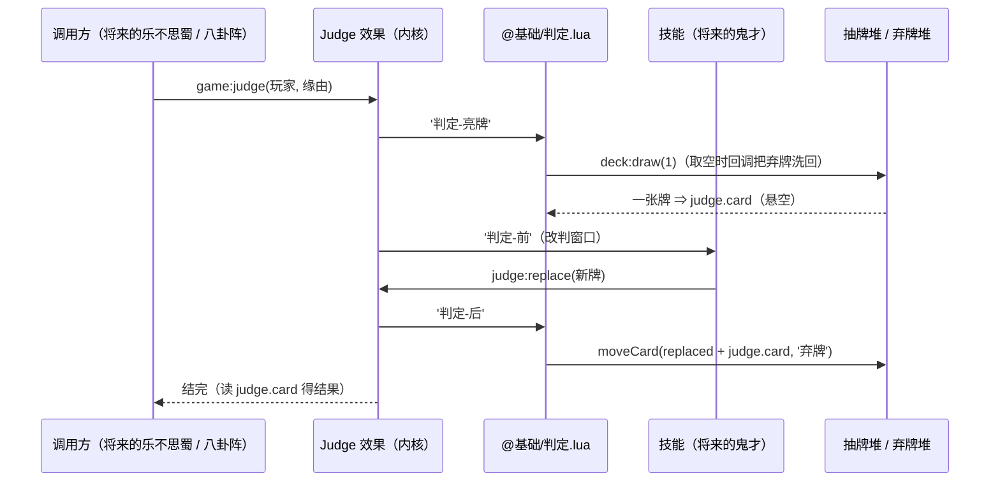

# Design

## Context

- **内核现在能做什么**：效果族（`Effect` 基类 + `damage` / `heal` / `draw` / `dying` / `useCard` / `askCard` / `ask` / `moveCard`）与局上的入口（`game:damage` / `heal` / `draw` …）都是**同一个形状**：内核给效果 + 一个便利入口，语义（区名、洗回、阈值）写在 `package/@基础/` 的**同名文件**里（约定见 `sanguosha-rules` §9.5 与 `moe-kill-dev/references/architecture.md` §12）。
- **内核不预设**：区名（`抽牌` / `弃牌` / `处理` 由 `@基础/牌堆.lua` 建）、属性名（`体力` 由内容定义）、牌面（`Card` 只有 `id` + `label`，用例钉死了「内核不预设名称 / 花色 / 点数 / 效果」）。
- **牌区模型的既有事实**：牌可以**不属于任何区**（`Zone:take` 之后悬空），`game:moveCard` 对这类牌也照挪（"没有归属的牌也能挪"）—— 判定牌「亮出」正好是这种状态。
- **摸牌那套洗回逻辑**现在是 `@基础/抽牌.lua` 里的文件局部函数 `recycleDiscard()`（`弃牌` 全部挪回 `抽牌` + `deck:shuffle()`）；`OrderedZone` 已有 `takeTop()` / `shuffle()`，但**没有「取一批」的接口**，也没人管「取空了怎么办」。
- **回合流程**里 `判定` 阶段已存在（`@基础/回合.lua` 的 `PHASES`），但什么都不做。

## Goals / Non-Goals

**Goals:**

- 「判定」有一个**所有包都能调、签名带类型、可 await、失败可读**的入口：`game:judge(player, reason?)`。
- 判定的形状写死成三步：**亮牌 → 改判 → 结果已定**，且**次序由内核负责**（不靠注册顺序）。
- 判定牌的进出（从哪里翻、进哪个堆）写在 `@基础`；**「从区顶取牌」与「取空了怎么办」提炼成有序区的两个接口**，判定与摸牌共用。
- 内核仍然**不认识牌面**：判定「结果」就是那张判定牌。

**Non-Goals:**

- 花色 / 点数与逐张牌表（用户 2026-09-23 定：留给第一个真正消费判定的批次）。
- 判定区（把【乐不思蜀】这类延时锦囊放进玩家名下的区）与**判定阶段的结算**；本批只交付动作。
- 技能的改判实现（【鬼才】【天命】这类）、判定牌的可见性 / 前端表现、超时。
- 通用动作注册表（沿用 `add-draw` 的结论：不预造）。

## Decisions

### D1 内核只发时机、不搬牌

内核要真去翻牌就得知道「哪个区是抽牌堆、哪个是弃牌」⇒ 与「内核不预设区名」冲突（`add-draw` 已经踩过这条线）。所以内核只给**效果外壳 + 三个时机**，翻牌与收牌写在 `@基础/判定.lua`。

### D2 三个时机：亮牌 → 前 → 后

```lua
-- server/core/effect/judge.lua
function M:settle()
    self.game:fire('判定-亮牌', self)     -- 内容侧翻出判定牌：judge.card
    self:fireBefore()                    -- 改判窗口
    self.game:fire('判定-后', self)       -- 结果已定；内容侧在这里处理判定牌的去向
end
```

| 时机 | 谁用 | 契约 |
| --- | --- | --- |
| `'判定-亮牌'` | `@基础/判定.lua`（默认包，必然最先注册） | 把判定牌放进 `judge.card` |
| `'判定-前'` | 技能（将来的【鬼才】）、测试 | **改判窗口**：`judge:replace(新牌)` 换掉当前判定牌 |
| `'判定-后'` | `@基础/判定.lua`；将来的「获得判定牌」类技能 | 结果已定；处理去向（默认：进弃牌堆） |

- **为什么不是一个时机**（备选）：若只发一个 `'判定'`，就必须靠「`@基础` 先注册、技能后注册」保证「先翻再改」——次序隐式依赖装载顺序。拆成两个时机后，**次序是内核的事**，技能只需要认自己的那个窗口；同时「等待改判」在会话 / 前端也有一条明确的线（判定牌已亮出 → 可以改判）。
- **为什么不是「换一次就再发一轮改判」**：官方「改判可以反复」在这套事件模型里表现为**同一趟里依次换**（后注册的看到的是前一个换过的牌）。真做成循环发放需要一个终止条件、且有死循环风险，本批不做（要加的话加在 `settle()` 里）。
- **命名**（用户 2026-09-23 定）：`'判定-亮牌'` 是官方术语（亮出判定牌）；`'判定-前'` = **判定结果确定之前**的窗口，也就是官方说的**改判**时机（名字直接用「前 / 后」一对，与既有的 `'伤害-后'` / `'回复-后'` 同形）。

### D3 `judge:replace(新牌)`：只能在改判窗口里换牌 + 记账，不搬牌

```lua
-- server/core/effect/judge.lua
--- 换掉当前判定牌（**只能在 `'判定-前'` 里调**；被换下的那张记进 `replaced`）
---@param card Card
function M:replace(card)
    if not self.replacing then
        error('换牌只能在「判定-前」里做', 2)
    end
    if self.card then
        table.insert(self.replaced, self.card)
    end
    self.card = card
end

---@private
function M:fireBefore()
    self.replacing = true
    local guard <close> = moe.util.defer(function () self.replacing = false end)
    self.game:fire('判定-前', self)
end
```

- **窗口是真的被判的**（用户 2026-09-23 定）：`replace` 在窗口外调直接 `error` —— 那是内容写错，不是正常流程（`AGENTS.md`：`error` 只用于报错）；窗口用 `replacing` 标记 + `moe.util.defer` 的 `<close>` 圈住，忘了收也不会漏。
- 内核**只记账、不搬牌**（往哪个区去是内容的事，与 `Dying.damage` 只搬运同理）。
- 旧牌若交给改判方自己 `moveCard`，去向约定就散在每个技能里；记进 `replaced` 后 `@基础/判定.lua` 一处收尾（官方：被替换的判定牌进弃牌堆）。
- 顺手的好处：`replaced` 也让前端 / 日志能说清「这次判定换过几次、换下来的是什么」。

### D4 结果 = 判定牌本身，内核不认识牌面

`judge.card` 就是这次判定的结果 —— 调用方（将来的【乐不思蜀】【闪电】【八卦阵】）拿到牌之后**自己去解释**花色与点数。本批不引入任何牌面概念（用户 2026-09-23 定）。

**为什么不留接口占位**：牌面怎么存（给 `Card` 加附加数据袋？还是内容侧自带一张「牌面表」？）取决于第一个消费者的用法，现在拍板多半返工（`AGENTS.md`「开发节奏」）。

### D5 `@基础/判定.lua`：亮牌取顶、收牌入弃牌堆

```lua
-- package/@基础/判定.lua
game:on('判定-亮牌', function (judge)
    local deck = assert(game:getZone('抽牌'), '局上没有抽牌区')
    ---@cast deck OrderedZone
    local cards = deck:draw(1)          -- 不够时由牌区上挂的回调补（洗回弃牌）
    if #cards > 0 then
        judge.card = cards[1]           -- 亮出：从抽牌堆取出 ⇒ 不属于任何区
    end
end)

game:on('判定-后', function (judge)
    ---@type Card[]
    local cards = {}
    for _, card in ipairs(judge.replaced) do
        cards[#cards + 1] = card
    end
    if judge.card then
        cards[#cards + 1] = judge.card
    end
    if #cards > 0 then
        game:moveCard(cards, '弃牌')
    end
end)
```

- 判定牌在「亮出」到「收牌」之间**悬空**（不属于任何区）—— 既有模型支持，不需要新概念。
- 抽牌堆与弃牌都空时翻不出牌 ⇒ `judge.card` 为空、不算失败（与摸牌「能摸多少算多少」同口径；内核不为此加防御）。
- 收牌时**被换下的牌与最终判定牌一起**进弃牌堆。

### D6 「取区顶 n 张」与「取空了怎么办」提炼成有序区的两个接口（用户 2026-09-23 定）

```lua
-- server/core/ordered-zone.lua
--- 从区顶取 n 张（不够就少给，不报错）
---@param count integer
---@return Card[]
function M:draw(count)
    ---@type Card[]
    local cards = {}
    for _ = 1, count do
        if #self.cards == 0 and self.shortage then
            self.shortage(self)          -- 取空了：给回调一次机会补牌
        end
        if #self.cards == 0 then
            break
        end
        cards[#cards + 1] = self:takeTop()
    end
    return cards
end

--- 取空了怎么补（内容侧挂：把弃牌全部洗回抽牌）
---@param handler fun(zone: OrderedZone)
function M:setShortageHandler(handler)
    self.shortage = handler
end
```

```lua
-- package/@基础/牌堆.lua（开牌堆的那个时机里挂上）
local deck = assert(game:getZone('抽牌'), '局上没有抽牌区')
---@cast deck OrderedZone
deck:setShortageHandler(function (zone)     -- 抽牌堆空了：把弃牌全部洗回
    local discard = assert(game:getZone('弃牌'), '局上没有弃牌区')
    if discard:count() == 0 then
        return
    end
    game:moveCard(discard:list(), zone)
    zone:shuffle()
end)
```

- **为什么放内核的 `OrderedZone`**：「从区顶取 n 张」与「取空了怎么办」是**牌区的机制**，与区名叫什么无关（内核仍然不认识 `抽牌` / `弃牌`）；洗回到底补什么牌、补到哪，全部写在内容侧的回调里。
- **循环不会死**：每次迭代最多调一次回调，且迭代次数就是 `count`；回调补不到牌就 `break`（少给）。
- **回调可以是异步的**：`moveCard` 是效果（会 await），而整个游戏都在协程里跑，所以 `draw` 会自然挂起再回来（`draw` 因此是 `@async`）。
- `@基础/抽牌.lua` 的 `'摸牌'` 改成：`local cards = deck:draw(draw.count); if #cards > 0 then game:moveCard(cards, hand) end` —— **行为不变**，`rule.draw` / `rule.turn` 的既有用例就是它的回归；`recycleDiscard` 那套只剩这一处（回调里），不再需要两份。
- **内容侧不再需要共享全局函数**：取顶 / 洗回都落在牌区的两个接口上（备选：内容侧写一个全局 `takeFromDeck(count)` —— 现在不需要了，也不再引入“包之间共享函数”这个概念）。

### D7 入口 `game:judge(player, reason?)` 与 damage / draw 同形

```lua
---@async
---@param player Player # 这次判定属于谁
---@param reason? string # 为什么判（内容由发起方定，内核不解释，如 '八卦阵' / '乐不思蜀'）
---@return Judge # 这次判定（已经结完：结果读 `.card`，失败读 `.err`）
function M:judge(player, reason) ... end
```

- `player` = 「**谁的判定**」（八卦阵是使用者、乐不思蜀是持有者），不是提问对象；改判由技能自己决定问谁。
- `reason` 与 `AskCard.reason` 同口径：内核不解释，原样带给内容 / 前端。
- 不做 `game:judgeWithReport()` 这类便利封装（等真有第二个调用形状再说）。

### D8 本批不做判定阶段 / 判定区 / 牌面

判定阶段继续只触发时机；判定区（玩家名下的区）与延时锦囊另开变更。验收靠用例（本批的两组用例 + 摸牌回归），不写规格（探索期，`skip_specs: true`）。

## 时序


